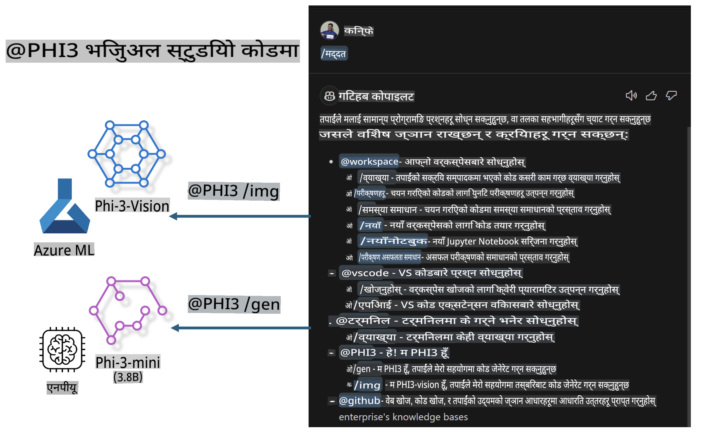

# **आफ्नै Visual Studio Code GitHub Copilot Chat Microsoft Phi-3 Family संग बनाउनुहोस्**

के तपाईंले GitHub Copilot Chat मा workspace एजेन्ट प्रयोग गर्नुभएको छ? के तपाईं आफ्नो टिमको कोड एजेन्ट निर्माण गर्न चाहनुहुन्छ? यो प्रयोगात्मक तालिमले खुला स्रोत मोडेलको संयोजन गरेर उद्यम स्तरको कोड व्यवसाय एजेन्ट निर्माण गर्ने लक्ष्य राख्छ।

## **आधार**

### **किन Microsoft Phi-3 छान्ने?**

Phi-3 एउटा परिवार श्रृंखला हो, जसमा फरक-फरक प्रशिक्षण प्यारामिटरहरूमा आधारित phi-3-mini, phi-3-small, र phi-3-medium समावेश छन्, जसले पाठ निर्माण, संवाद पूरा गर्ने, र कोड निर्माण गर्ने काम गर्दछ। Vision मा आधारित phi-3-vision पनि छ। यो उद्यम वा फरक टिमहरूको लागि अफलाइन जेनेरेटिभ AI समाधान बनाउन उपयुक्त छ।

यो लिंक पढ्न सिफारिस गरिन्छ [https://github.com/microsoft/PhiCookBook/blob/main/md/01.Introduction/01/01.PhiFamily.md](https://github.com/microsoft/PhiCookBook/blob/main/md/01.Introduction/01/01.PhiFamily.md)

### **Microsoft GitHub Copilot Chat**

GitHub Copilot Chat एक्स्टेन्सनले तपाईंलाई GitHub Copilot सँग अन्तरक्रिया गर्न र कोड सम्बन्धी प्रश्नहरूको उत्तर सिधै VS Code भित्रै पाउन च्याट इन्टरफेस प्रदान गर्दछ, जसले तपाईंलाई डकुमेन्टेसन खोज्न वा अनलाइन फोरममा जानु नपरोस्।

Copilot Chat ले उत्पन्न उत्तरलाई स्पष्ट बनाउनका लागि सिन्ट्याक्स हाइलाइटिङ, इन्टेन्डेसन, र अन्य फर्म्याटिङ सुविधाहरू प्रयोग गर्न सक्छ। प्रयोगकर्ताको प्रश्नको प्रकार अनुसार, परिणामले स्रोत कोड फाइलहरू वा डकुमेन्टेसनजस्ता सन्दर्भहरूलाई लिंकको रूपमा समावेश गर्न सक्छ, वा VS Code को कार्यक्षमतामा पहुँच गर्नका लागि बटनहरू प्रदान गर्न सक्छ।

- Copilot Chat तपाईंको विकासकर्ताको प्रवाहमा एकीकृत हुन्छ र तपाईंलाई आवश्यक परेको ठाउँमा सहयोग प्रदान गर्दछ:

  - एडिटर वा टर्मिनलबाट सिधै इनलाइन च्याट संवाद सुरू गरेर तपाईंलाई कोडिङको क्रममा मद्दत लिनुहोस्

  - Chat view प्रयोग गरेर तपाईंको छेउमा AI सहायक राख्न सक्नुहुन्छ, जुन तपाईंलाई कुनै पनि समयमा सहयोग गर्न तयार हुन्छ

  - Quick Chat सुरू गरेर छोटो प्रश्न सोध्न सक्नुहुन्छ र आफ्नो काममा फर्किन सक्नुहुन्छ

GitHub Copilot Chat विभिन्न परिदृश्यहरूमा प्रयोग गर्न सकिन्छ, जस्तै:

- समस्याको समाधानका लागि कोडिङ प्रश्नहरूको उत्तर दिन

- अरूको कोड व्याख्या गर्न र सुधारका लागि सुझाव दिन

- कोड फिक्सहरू प्रस्ताव गर्न

- युनिट टेस्ट केसहरू निर्माण गर्न

- कोड डकुमेन्टेसन निर्माण गर्न

यो लिंक पढ्न सिफारिस गरिन्छ [https://code.visualstudio.com/docs/copilot/copilot-chat](https://code.visualstudio.com/docs/copilot/copilot-chat?WT.mc_id=aiml-137032-kinfeylo)

### **Microsoft GitHub Copilot Chat @workspace**

Copilot Chat मा **@workspace** को सन्दर्भ दिनाले तपाईंलाई आफ्नो सम्पूर्ण कोडबेसबारे प्रश्न सोध्न अनुमति दिन्छ। प्रश्नको आधारमा, Copilot ले सान्दर्भिक फाइलहरू र प्रतीकहरू बुद्धिमानीपूर्वक पुन: प्राप्त गर्दछ, जसलाई यसले आफ्नो उत्तरमा लिंक र कोड उदाहरणको रूपमा समावेश गर्दछ।

तपाईंको प्रश्नको उत्तर दिन, **@workspace** ले VS Code मा कोडबेस नेभिगेट गर्दा विकासकर्ताले प्रयोग गर्ने उही स्रोतहरू खोज्छ:

- .gitignore फाइलले बेवास्ता गरेका फाइलहरू बाहेक workspace का सबै फाइलहरू

- नेस्टेड फोल्डर र फाइल नामहरू सहितको डाइरेक्टरी संरचना

- GitHub को कोड खोज अनुक्रमणिका, यदि workspace GitHub रिपोजिटरी हो र कोड खोजद्वारा अनुक्रमित छ भने

- workspace का प्रतीकहरू र परिभाषाहरू

- सक्रिय एडिटरमा हाल चयन गरिएको पाठ वा देखिने पाठ

नोट: यदि तपाईंले कुनै फाइल खोल्नुभएको छ वा बेवास्ता गरिएको फाइलभित्र पाठ चयन गर्नुभएको छ भने .gitignore बेवास्ता गरिन्छ।

यो लिंक पढ्न सिफारिस गरिन्छ [https://code.visualstudio.com/docs/copilot/copilot-chat](https://code.visualstudio.com/docs/copilot/workspace-context?WT.mc_id=aiml-137032-kinfeylo)

## **यो तालिमबारे थप जान्नुहोस्**

GitHub Copilot ले उद्यमहरूको प्रोग्रामिङ दक्षता धेरै सुधार गरेको छ, र प्रत्येक उद्यमले GitHub Copilot का सम्बन्धित कार्यहरू अनुकूलन गर्न चाहन्छ। धेरै उद्यमहरूले आफ्ना व्यवसाय परिदृश्यहरू र खुला स्रोत मोडेलहरूको आधारमा GitHub Copilot जस्तै Extensions अनुकूलन गरेका छन्। उद्यमहरूको लागि, अनुकूलित Extensions नियन्त्रण गर्न सजिलो हुन्छ, तर यसले प्रयोगकर्ता अनुभवलाई पनि असर गर्छ। आखिर, सामान्य परिदृश्य र व्यावसायिकतासँग सम्बन्धित समस्याहरू समाधान गर्न GitHub Copilot को कार्यक्षमता बलियो छ। यदि अनुभवलाई स्थिर राख्न सकिन्छ भने, उद्यमको आफ्नै Extension अनुकूलन गर्नु राम्रो हुनेछ। GitHub Copilot Chat ले उद्यमहरूको लागि Chat अनुभवमा विस्तार गर्न सम्बन्धित API हरू प्रदान गर्दछ। स्थिर अनुभव कायम राख्नु र अनुकूलित कार्यहरू हुनु राम्रो प्रयोगकर्ता अनुभव हो।

यो तालिम मुख्यतया Phi-3 मोडेललाई स्थानीय NPU र Azure हाइब्रिडसँग संयोजन गरेर GitHub Copilot Chat मा ***@PHI3*** कस्टम एजेन्ट निर्माण गर्न प्रयोग गर्दछ, जसले उद्यम विकासकर्ताहरूलाई कोड निर्माण ***(@PHI3 /gen)*** पूरा गर्न र छविका आधारमा कोड निर्माण गर्न ***(@PHI3 /img)*** सहयोग पुर्‍याउँछ।

### ***नोट:***

यो तालिम हाल Intel CPU र Apple Silicon को AIPC मा लागू गरिएको छ। हामी Qualcomm संस्करणको NPU अपडेट गर्न जारी राख्नेछौं।

## **तालिम**

| नाम | विवरण | AIPC | Apple |
| ------------ | ----------- | -------- |-------- |
| Lab0 - Installations(✅) | सम्बन्धित वातावरण र इन्स्टलेसन उपकरणहरू कन्फिगर गर्नुहोस् र इन्स्टल गर्नुहोस् | [Go](./HOL/AIPC/01.Installations.md) |[Go](./HOL/Apple/01.Installations.md) |
| Lab1 - Run Prompt flow with Phi-3-mini (✅) | AIPC / Apple Silicon सँग मिलेर, Phi-3-mini मार्फत स्थानीय NPU प्रयोग गरेर कोड निर्माण गर्नुहोस् | [Go](./HOL/AIPC/02.PromptflowWithNPU.md) |  [Go](./HOL/Apple/02.PromptflowWithMLX.md) |
| Lab2 - Deploy Phi-3-vision on Azure Machine Learning Service(✅) | Azure Machine Learning Service को Model Catalog - Phi-3-vision छवि तैनाथ गरेर कोड निर्माण गर्नुहोस् | [Go](./HOL/AIPC/03.DeployPhi3VisionOnAzure.md) |[Go](./HOL/Apple/03.DeployPhi3VisionOnAzure.md) |
| Lab3 - Create a @phi-3 agent in GitHub Copilot Chat(✅)  | GitHub Copilot Chat मा कस्टम Phi-3 एजेन्ट सिर्जना गर्नुहोस् जसले कोड निर्माण, ग्राफ निर्माण कोड, RAG आदि पूरा गर्दछ | [Go](./HOL/AIPC/04.CreatePhi3AgentInVSCode.md) | [Go](./HOL/Apple/04.CreatePhi3AgentInVSCode.md) |
| Sample Code (✅)  | नमूना कोड डाउनलोड गर्नुहोस् | [Go](../../../../../../../code/07.Lab/01/AIPC) | [Go](../../../../../../../code/07.Lab/01/Apple) |

## **स्रोतहरू**

1. Phi-3 Cookbook [https://github.com/microsoft/Phi-3CookBook](https://github.com/microsoft/Phi-3CookBook)

2. GitHub Copilot को बारेमा थप जान्नुहोस् [https://learn.microsoft.com/training/paths/copilot/](https://learn.microsoft.com/training/paths/copilot/?WT.mc_id=aiml-137032-kinfeylo)

3. GitHub Copilot Chat को बारेमा थप जान्नुहोस् [https://learn.microsoft.com/training/paths/accelerate-app-development-using-github-copilot/](https://learn.microsoft.com/training/paths/accelerate-app-development-using-github-copilot/?WT.mc_id=aiml-137032-kinfeylo)

4. GitHub Copilot Chat API को बारेमा थप जान्नुहोस् [https://code.visualstudio.com/api/extension-guides/chat](https://code.visualstudio.com/api/extension-guides/chat?WT.mc_id=aiml-137032-kinfeylo)

5. Azure AI Foundry को बारेमा थप जान्नुहोस् [https://learn.microsoft.com/training/paths/create-custom-copilots-ai-studio/](https://learn.microsoft.com/training/paths/create-custom-copilots-ai-studio/?WT.mc_id=aiml-137032-kinfeylo)

6. Azure AI Foundry को Model Catalog को बारेमा थप जान्नुहोस् [https://learn.microsoft.com/azure/ai-studio/how-to/model-catalog-overview](https://learn.microsoft.com/azure/ai-studio/how-to/model-catalog-overview)

**अस्वीकरण**:  
यो दस्तावेज़ मेसिन-आधारित एआई अनुवाद सेवाहरू प्रयोग गरेर अनुवाद गरिएको हो। यद्यपि हामी शुद्धताका लागि प्रयास गर्दछौं, कृपया जानकार हुनुहोस् कि स्वचालित अनुवादहरूमा त्रुटिहरू वा अशुद्धताहरू हुन सक्छ। यसको मूल भाषामा रहेको मूल दस्तावेजलाई प्रामाणिक स्रोत मानिनुपर्छ। महत्वपूर्ण जानकारीका लागि, व्यावसायिक मानव अनुवाद सिफारिस गरिन्छ। यस अनुवादको प्रयोगबाट उत्पन्न हुने कुनै पनि गलतफहमी वा गलत व्याख्याका लागि हामी उत्तरदायी हुनेछैनौं।