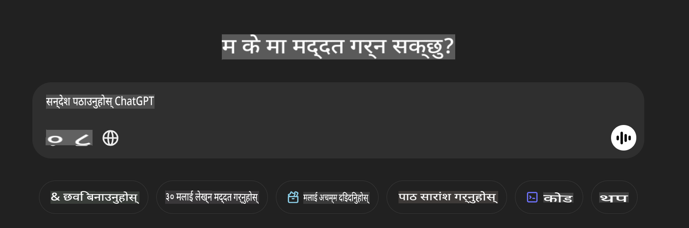

## **Phi-4-multimodal प्रयोग गरी छविहरू पढ्ने र कोड सिर्जना गर्ने**

Phi-4-multimodal मा छविहरू पढ्ने उत्कृष्ट क्षमता छ। आउनुहोस्, Python प्रयोग गरेर तलका कार्यहरू कार्यान्वयन गर्ने प्रयास गरौं। छवि एउटा ChatGPT पृष्ठ हो। 



### **नमूना कोड**

```python

import requests
import torch
from PIL import Image
import soundfile
from transformers import AutoModelForCausalLM, AutoProcessor, GenerationConfig,pipeline,AutoTokenizer

model_path = 'Your Phi-4-multimodal location'

kwargs = {}
kwargs['torch_dtype'] = torch.bfloat16

processor = AutoProcessor.from_pretrained(model_path, trust_remote_code=True)

model = AutoModelForCausalLM.from_pretrained(
    model_path,
    trust_remote_code=True,
    torch_dtype='auto',
    _attn_implementation='flash_attention_2',
).cuda()

generation_config = GenerationConfig.from_pretrained(model_path, 'generation_config.json')

user_prompt = '<|user|>'
assistant_prompt = '<|assistant|>'
prompt_suffix = '<|end|>'

prompt = f'{user_prompt}Can you generate HTML + JS code about this image <|image_1|> ? Please step by step {prompt_suffix}{assistant_prompt}'

image = Image.open("./demo.png")

inputs = processor(text=prompt, images=[image], return_tensors='pt').to('cuda:0')

generate_ids = model.generate(
    **inputs,
    max_new_tokens=4096,
    generation_config=generation_config,
)

generate_ids = generate_ids[:, inputs['input_ids'].shape[1] :]

response = processor.batch_decode(
    generate_ids, skip_special_tokens=True, clean_up_tokenization_spaces=False
)[0]

print(response)

```

**अस्वीकरण**:  
यो दस्तावेज़ मेशिन-आधारित AI अनुवाद सेवाहरू प्रयोग गरी अनुवाद गरिएको हो। यद्यपि हामी शुद्धताका लागि प्रयास गर्छौं, कृपया जानकार रहनुहोस् कि स्वचालित अनुवादहरूले त्रुटिहरू वा अशुद्धताहरू समावेश गर्न सक्ने सम्भावना हुन्छ। यसको मूल भाषामा रहेको मूल दस्तावेज़लाई आधिकारिक स्रोतको रूपमा मानिनुपर्छ। महत्वपूर्ण जानकारीको लागि, व्यावसायिक मानव अनुवाद सिफारिस गरिन्छ। यस अनुवादको प्रयोगबाट उत्पन्न हुने कुनै पनि गलतफहमी वा गलत व्याख्याको लागि हामी जिम्मेवार हुने छैनौं।