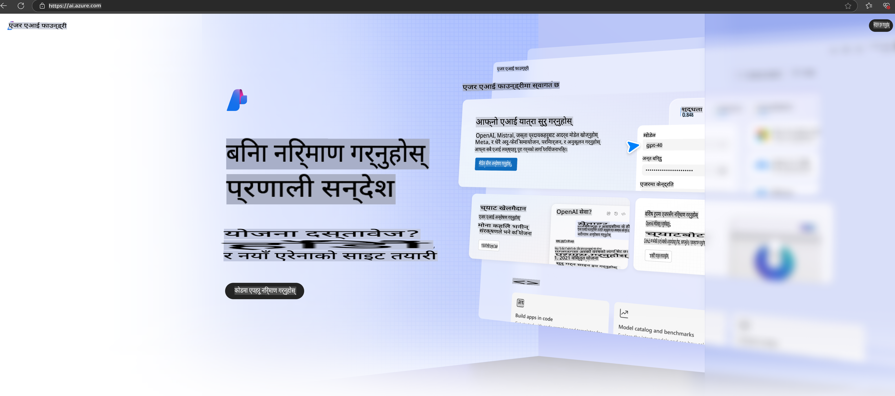

# **Azure AI Foundry मा Phi-3 प्रयोग गर्ने**

Generative AI को विकाससँगै, हामी विभिन्न LLM र SLM व्यवस्थापन गर्न, उद्यम डेटा एकीकृत गर्न, फाइन-ट्युनिङ/RAG अपरेसनहरू सञ्चालन गर्न, र LLM र SLM एकीकृत गरेपछि विभिन्न उद्यम व्यवसायहरूको मूल्याङ्कन गर्न एउटै प्लेटफर्म प्रयोग गर्ने आशा गर्छौं, ताकि Generative AI को स्मार्ट अनुप्रयोग अझ राम्रोसँग कार्यान्वयन गर्न सकियोस्। [Azure AI Foundry](https://ai.azure.com) एक उद्यम स्तरको Generative AI अनुप्रयोग प्लेटफर्म हो।

Azure AI Foundry को प्रयोगले तपाईंलाई ठूलो भाषा मोडेल (LLM) का प्रतिक्रिया मूल्याङ्कन गर्न र Prompt Flow को प्रयोग गरेर Prompt Application Components लाई समायोजन गर्न मद्दत गर्छ। यो प्लेटफर्म Proof of Concept लाई सहजै पूर्ण उत्पादनमा रूपान्तरण गर्न स्केलेबिलिटी प्रदान गर्दछ। निरन्तर निगरानी र परिमार्जनले दीर्घकालीन सफलता सुनिश्चित गर्दछ।

हामी सरल चरणहरूको माध्यमबाट Azure AI Foundry मा Phi-3 मोडेल छिट्टै तैनाथ गर्न सक्छौं, र त्यसपछि Azure AI Foundry को प्रयोग गरी Phi-3 सम्बन्धित Playground/Chat, Fine-tuning, मूल्याङ्कन र अन्य सम्बन्धित कार्यहरू पूरा गर्न सक्छौं।

## **1. तयारी**

यदि तपाईंको मेशिनमा [Azure Developer CLI](https://learn.microsoft.com/azure/developer/azure-developer-cli/overview?WT.mc_id=aiml-138114-kinfeylo) पहिले नै इन्स्टल गरिएको छ भने, यो टेम्प्लेट प्रयोग गर्नु नयाँ डाइरेक्टरीमा यो आदेश चलाउनु जत्तिकै सजिलो छ।

## म्यानुअल निर्माण

Microsoft Azure AI Foundry प्रोजेक्ट र हब निर्माण गर्नु तपाईंको AI कार्य व्यवस्थित गर्न र व्यवस्थापन गर्न उत्कृष्ट तरिका हो। यहाँ सुरु गर्नका लागि चरण-दर-चरण गाइड छ:

### Azure AI Foundry मा प्रोजेक्ट बनाउने

1. **Azure AI Foundry मा जानुहोस्**: Azure AI Foundry पोर्टलमा साइन इन गर्नुहोस्।
2. **प्रोजेक्ट बनाउनुहोस्**:
   - यदि तपाईं पहिले नै कुनै प्रोजेक्टमा हुनुहुन्छ भने, पृष्ठको माथिल्लो बायाँ कुनामा "Azure AI Foundry" चयन गरी होम पेजमा जानुहोस्।
   - "+ Create project" चयन गर्नुहोस्।
   - प्रोजेक्टको लागि नाम प्रविष्ट गर्नुहोस्।
   - यदि तपाईंको हब छ भने, यो डिफल्ट रूपमा चयन हुनेछ। यदि तपाईंले धेरै हबहरूमा पहुँच पाउनुभएको छ भने, ड्रपडाउनबाट अर्को हब चयन गर्न सक्नुहुन्छ। नयाँ हब बनाउने हो भने "Create new hub" चयन गरी नाम दिनुहोस्।
   - "Create" चयन गर्नुहोस्।

### Azure AI Foundry मा हब बनाउने

1. **Azure AI Foundry मा जानुहोस्**: तपाईंको Azure खाताको साथ साइन इन गर्नुहोस्।
2. **हब बनाउनुहोस्**:
   - बाँया मेनुबाट Management center चयन गर्नुहोस्।
   - "All resources" चयन गर्नुहोस्, त्यसपछि "+ New project" नजिकको तलको एरो चयन गरी "+ New hub" चयन गर्नुहोस्।
   - "Create a new hub" संवादमा, तपाईंको हबको लागि नाम प्रविष्ट गर्नुहोस् (उदाहरण: contoso-hub) र अन्य क्षेत्रहरू आवश्यकताअनुसार परिमार्जन गर्नुहोस्।
   - "Next" चयन गर्नुहोस्, जानकारी समीक्षा गर्नुहोस्, र त्यसपछि "Create" चयन गर्नुहोस्।

थप विस्तृत निर्देशनहरूको लागि, तपाईं आधिकारिक [Microsoft डकुमेन्टेसन](https://learn.microsoft.com/azure/ai-studio/how-to/create-projects) हेर्न सक्नुहुन्छ।

सफलतापूर्वक निर्माण गरेपछि, तपाईंले [ai.azure.com](https://ai.azure.com/) बाट तपाईंले बनाएको स्टुडियोमा पहुँच गर्न सक्नुहुन्छ।

AI Foundry मा धेरै प्रोजेक्टहरू हुन सक्छन्। AI Foundry मा प्रोजेक्ट बनाएर तयारी गर्नुहोस्।

Azure AI Foundry [QuickStarts](https://learn.microsoft.com/azure/ai-studio/quickstarts/get-started-code) बनाएर सुरु गर्नुहोस्।

## **2. Azure AI Foundry मा Phi मोडेल तैनाथ गर्नुहोस्**

प्रोजेक्टको Explore विकल्पमा क्लिक गरी Model Catalog मा प्रवेश गर्नुहोस् र Phi-3 चयन गर्नुहोस्।

Phi-3-mini-4k-instruct चयन गर्नुहोस्।

'Deploy' क्लिक गरी Phi-3-mini-4k-instruct मोडेल तैनाथ गर्नुहोस्।

> [!NOTE]
>
> तैनाथ गर्दा तपाईंले कम्प्युटिङ क्षमता चयन गर्न सक्नुहुन्छ।

## **3. Azure AI Foundry मा Playground Chat Phi प्रयोग गर्नुहोस्**

तैनाथ पृष्ठमा जानुहोस्, Playground चयन गर्नुहोस्, र Azure AI Foundry को Phi-3 सँग कुराकानी गर्नुहोस्।

## **4. Azure AI Foundry बाट मोडेल तैनाथ गर्नुहोस्**

Azure Model Catalog बाट मोडेल तैनाथ गर्न निम्न चरणहरू पालना गर्न सक्नुहुन्छ:

- Azure AI Foundry मा साइन इन गर्नुहोस्।
- Azure AI Foundry मोडेल क्याटलगबाट तैनाथ गर्न चाहनुभएको मोडेल चयन गर्नुहोस्।
- मोडेलको Details पृष्ठमा Deploy चयन गर्नुहोस् र त्यसपछि Serverless API with Azure AI Content Safety चयन गर्नुहोस्।
- तपाईंको मोडेलहरू तैनाथ गर्न चाहनुभएको प्रोजेक्ट चयन गर्नुहोस्। Serverless API सेवा प्रयोग गर्न, तपाईंको Workspace पूर्वनिर्धारित East US 2 वा Sweden Central क्षेत्रमा हुनुपर्छ। तपाईंले Deployment नाम अनुकूलन गर्न सक्नुहुन्छ।
- Deployment wizard मा Pricing र Terms चयन गरी मूल्य र प्रयोगका सर्तहरूबारे जान्नुहोस्।
- Deploy चयन गर्नुहोस्। तैनाथ तयारी भएपछि Deployments पृष्ठमा पुनःनिर्देशित गर्नुहोस्।
- Playground मा खोल्न चयन गरी मोडेलसँग अन्तरक्रिया सुरु गर्नुहोस्।
- Deployments पृष्ठमा फर्कनुहोस्, तैनाथ चयन गर्नुहोस्, र Endpoint को Target URL र Secret Key नोट गर्नुहोस्, जसको प्रयोग गरेर तपाईंले तैनाथलाई कल गर्न सक्नुहुन्छ र Completion प्राप्त गर्न सक्नुहुन्छ।
- Endpoint को विवरण, URL, र Access Keys सधैं Build ट्याबमा गई Components खण्डबाट Deployments चयन गरी फेला पार्न सक्नुहुन्छ।

> [!NOTE]
> कृपया ध्यान दिनुहोस् कि यी चरणहरू प्रदर्शन गर्न तपाईंको खातासँग Resource Group मा Azure AI Developer भूमिका अनुमतिहरू हुनुपर्छ।

## **5. Azure AI Foundry मा Phi API प्रयोग गर्नुहोस्**

तपाईं https://{Your project name}.region.inference.ml.azure.com/swagger.json लाई Postman GET मार्फत पहुँच गर्न सक्नुहुन्छ र Key को साथ संयोजन गरी उपलब्ध Interface हरूको बारेमा जान्न सक्नुहुन्छ।

तपाईंले अनुरोधका प्यारामिटरहरू सजिलै पाउन सक्नुहुन्छ, साथै प्रतिक्रिया प्यारामिटरहरू पनि।

**अस्वीकरण**:  
यो दस्तावेज मेसिन-आधारित एआई अनुवाद सेवाहरू प्रयोग गरेर अनुवाद गरिएको हो। हामी यथासम्भव सही अनुवाद प्रदान गर्न प्रयास गर्छौं, तर कृपया जानकारी रहनुहोस् कि स्वचालित अनुवादहरूमा त्रुटिहरू वा असत्यताहरू हुन सक्छ। यसको मौलिक भाषामा रहेको मूल दस्तावेजलाई प्रामाणिक स्रोतको रूपमा मान्नुपर्छ। महत्वपूर्ण जानकारीको लागि, पेशेवर मानव अनुवाद सिफारिस गरिन्छ। यस अनुवादको प्रयोगबाट उत्पन्न हुने कुनै पनि गलतफहमी वा गलत व्याख्याको लागि हामी जिम्मेवार हुनेछैनौं।