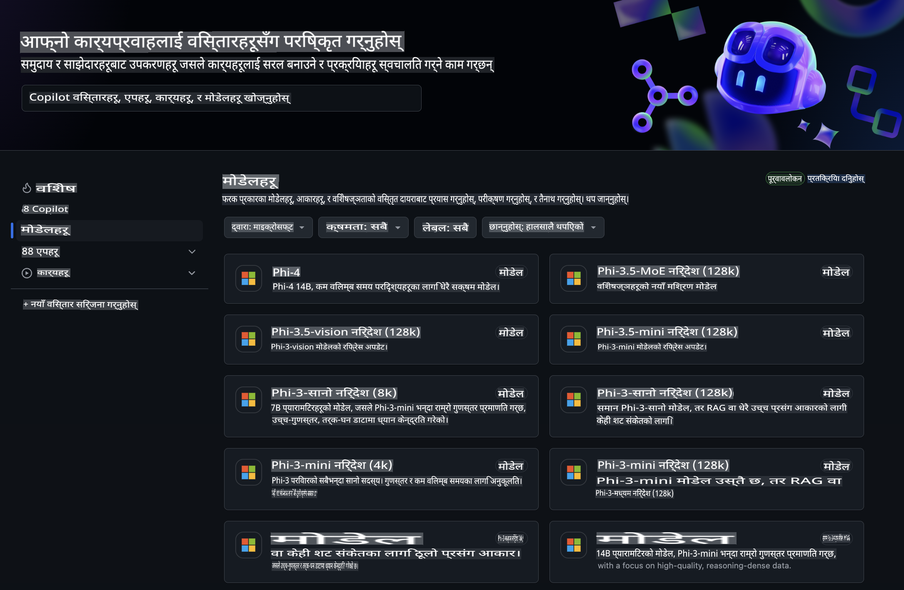
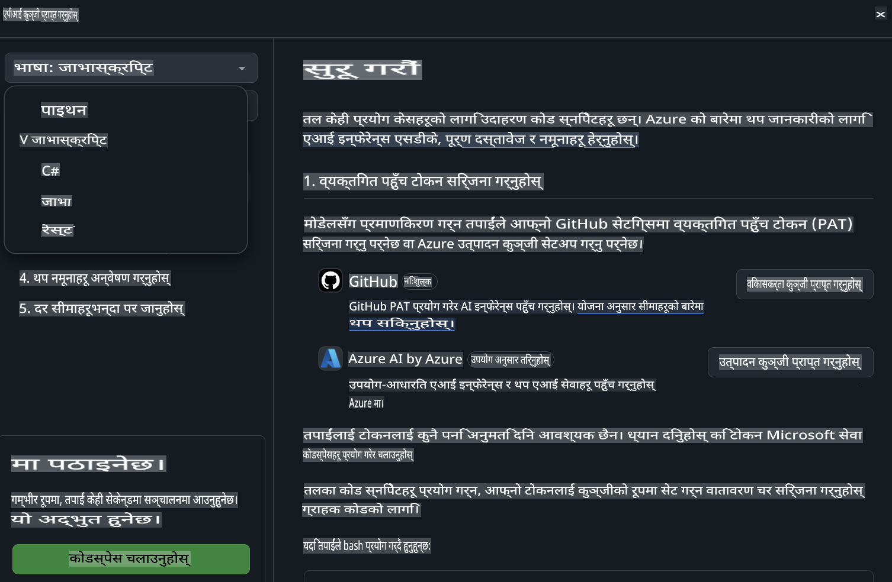
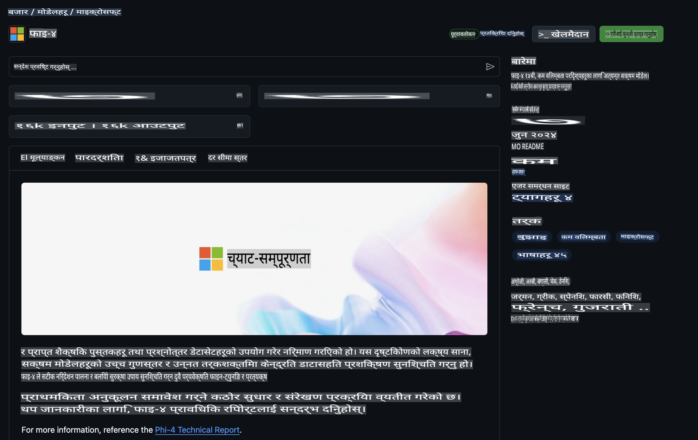

## GitHub मोडेल्स - सीमित सार्वजनिक बीटा

[GitHub Models](https://github.com/marketplace/models) मा स्वागत छ! हामीले Azure AI मा होस्ट गरिएका AI मोडेलहरू अन्वेषण गर्नका लागि सबै कुरा तयार गरेका छौं।



GitHub Models मा उपलब्ध मोडेलहरूबारे थप जानकारीका लागि [GitHub Model Marketplace](https://github.com/marketplace/models) हेर्नुहोस्।

## उपलब्ध मोडेलहरू

प्रत्येक मोडेलसँग एक समर्पित प्लेग्राउन्ड र नमूना कोड छ।  


### GitHub Model Catalog मा Phi-3 मोडेलहरू

[Phi-3-Medium-128k-Instruct](https://github.com/marketplace/models/azureml/Phi-3-medium-128k-instruct)

[Phi-3-medium-4k-instruct](https://github.com/marketplace/models/azureml/Phi-3-medium-4k-instruct)

[Phi-3-mini-128k-instruct](https://github.com/marketplace/models/azureml/Phi-3-mini-128k-instruct)

[Phi-3-mini-4k-instruct](https://github.com/marketplace/models/azureml/Phi-3-mini-4k-instruct)

[Phi-3-small-128k-instruct](https://github.com/marketplace/models/azureml/Phi-3-small-128k-instruct)

[Phi-3-small-8k-instruct](https://github.com/marketplace/models/azureml/Phi-3-small-8k-instruct)

## सुरु गर्नका लागि

केही आधारभूत उदाहरणहरू तयार छन् जुन तपाईं तुरुन्तै चलाउन सक्नुहुन्छ। यी उदाहरणहरू तपाईंले `samples` डाइरेक्टरीमा पाउनुहुनेछ। यदि तपाईं आफ्नो मनपर्ने भाषामा जान चाहनुहुन्छ भने, निम्न भाषाहरूमा उदाहरणहरू उपलब्ध छन्:

- Python  
- JavaScript  
- cURL  

नमूनाहरू र मोडेलहरू चलाउनका लागि एक समर्पित Codespaces Environment पनि उपलब्ध छ।  



## नमूना कोड

तल केही प्रयोगका केसहरूका लागि कोड स्निपेटहरू छन्। Azure AI Inference SDK को थप जानकारी र नमूनाहरूका लागि पूर्ण डकुमेन्टेशन हेर्नुहोस्।

## सेटअप

1. व्यक्तिगत एक्सेस टोकन बनाउनुहोस्।  
तपाईंले टोकनलाई कुनै अनुमति दिन आवश्यक छैन। ध्यान दिनुहोस् कि टोकन Microsoft सेवामा पठाइनेछ।  

तलका कोड स्निपेटहरू प्रयोग गर्नका लागि, वातावरणीय भेरिएबल बनाएर तपाईंको टोकनलाई क्लाइन्ट कोडको कुञ्जीको रूपमा सेट गर्नुहोस्।  

यदि तपाईं bash प्रयोग गर्दै हुनुहुन्छ भने:  
```
export GITHUB_TOKEN="<your-github-token-goes-here>"
```  

यदि तपाईं powershell मा हुनुहुन्छ भने:  
```
$Env:GITHUB_TOKEN="<your-github-token-goes-here>"
```  

यदि तपाईं Windows कमाण्ड प्रम्प्ट प्रयोग गर्दै हुनुहुन्छ भने:  
```
set GITHUB_TOKEN=<your-github-token-goes-here>
```  

## Python नमूना

### निर्भरता स्थापना गर्नुहोस्  
Azure AI Inference SDK लाई pip प्रयोग गरेर स्थापना गर्नुहोस् (आवश्यक: Python >=3.8):  

```
pip install azure-ai-inference
```  

### आधारभूत कोड नमूना चलाउनुहोस्  

यो नमूनाले chat completion API को आधारभूत कल प्रदर्शन गर्दछ। यसले GitHub AI मोडेल inference endpoint र तपाईंको GitHub टोकन प्रयोग गर्दछ। यो कल synchronous छ।  

```
import os
from azure.ai.inference import ChatCompletionsClient
from azure.ai.inference.models import SystemMessage, UserMessage
from azure.core.credentials import AzureKeyCredential

endpoint = "https://models.inference.ai.azure.com"
# Replace Model_Name 
model_name = "Phi-3-small-8k-instruct"
token = os.environ["GITHUB_TOKEN"]

client = ChatCompletionsClient(
    endpoint=endpoint,
    credential=AzureKeyCredential(token),
)

response = client.complete(
    messages=[
        SystemMessage(content="You are a helpful assistant."),
        UserMessage(content="What is the capital of France?"),
    ],
    model=model_name,
    temperature=1.,
    max_tokens=1000,
    top_p=1.
)

print(response.choices[0].message.content)
```  

### बहु-टर्न कुराकानी चलाउनुहोस्  

यो नमूनाले chat completion API सँग बहु-टर्न कुराकानी प्रदर्शन गर्दछ। च्याट एप्लिकेसनको लागि मोडेल प्रयोग गर्दा, तपाईंले सो कुराकानीको इतिहास व्यवस्थापन गर्नुपर्नेछ र पछिल्लो सन्देश मोडेलमा पठाउनुपर्नेछ।  

```
import os
from azure.ai.inference import ChatCompletionsClient
from azure.ai.inference.models import AssistantMessage, SystemMessage, UserMessage
from azure.core.credentials import AzureKeyCredential

token = os.environ["GITHUB_TOKEN"]
endpoint = "https://models.inference.ai.azure.com"
# Replace Model_Name
model_name = "Phi-3-small-8k-instruct"

client = ChatCompletionsClient(
    endpoint=endpoint,
    credential=AzureKeyCredential(token),
)

messages = [
    SystemMessage(content="You are a helpful assistant."),
    UserMessage(content="What is the capital of France?"),
    AssistantMessage(content="The capital of France is Paris."),
    UserMessage(content="What about Spain?"),
]

response = client.complete(messages=messages, model=model_name)

print(response.choices[0].message.content)
```  

### आउटपुट स्ट्रिम गर्नुहोस्  

उत्तम प्रयोगकर्ता अनुभवका लागि, तपाईंले मोडेलको प्रतिक्रिया स्ट्रिम गर्न चाहनुहुन्छ ताकि पहिलो टोकन छिटो देखियोस् र लामो प्रतिक्रियाको लागि कुर्नु नपरोस्।  

```
import os
from azure.ai.inference import ChatCompletionsClient
from azure.ai.inference.models import SystemMessage, UserMessage
from azure.core.credentials import AzureKeyCredential

token = os.environ["GITHUB_TOKEN"]
endpoint = "https://models.inference.ai.azure.com"
# Replace Model_Name
model_name = "Phi-3-small-8k-instruct"

client = ChatCompletionsClient(
    endpoint=endpoint,
    credential=AzureKeyCredential(token),
)

response = client.complete(
    stream=True,
    messages=[
        SystemMessage(content="You are a helpful assistant."),
        UserMessage(content="Give me 5 good reasons why I should exercise every day."),
    ],
    model=model_name,
)

for update in response:
    if update.choices:
        print(update.choices[0].delta.content or "", end="")

client.close()
```  

## JavaScript

### निर्भरता स्थापना गर्नुहोस्  

Node.js स्थापना गर्नुहोस्।  

तलका लाइनहरूलाई कपी गरेर `package.json` नामको फाइलका रूपमा तपाईंको फोल्डरभित्र सुरक्षित गर्नुहोस्।  

```
{
  "type": "module",
  "dependencies": {
    "@azure-rest/ai-inference": "latest",
    "@azure/core-auth": "latest",
    "@azure/core-sse": "latest"
  }
}
```  

नोट: @azure/core-sse केवल तब आवश्यक छ जब तपाईं chat completions प्रतिक्रिया स्ट्रिम गर्नुहुन्छ।  

यस फोल्डरमा टर्मिनल खोल्नुहोस् र `npm install` चलाउनुहोस्।  

तलका प्रत्येक कोड स्निपेटहरूका लागि, सामग्रीलाई `sample.js` फाइलमा कपी गर्नुहोस् र `node sample.js` चलाउनुहोस्।  

### आधारभूत कोड नमूना चलाउनुहोस्  

यो नमूनाले chat completion API को आधारभूत कल प्रदर्शन गर्दछ। यसले GitHub AI मोडेल inference endpoint र तपाईंको GitHub टोकन प्रयोग गर्दछ। यो कल synchronous छ।  

```
import ModelClient from "@azure-rest/ai-inference";
import { AzureKeyCredential } from "@azure/core-auth";

const token = process.env["GITHUB_TOKEN"];
const endpoint = "https://models.inference.ai.azure.com";
// Update your modelname
const modelName = "Phi-3-small-8k-instruct";

export async function main() {

  const client = new ModelClient(endpoint, new AzureKeyCredential(token));

  const response = await client.path("/chat/completions").post({
    body: {
      messages: [
        { role:"system", content: "You are a helpful assistant." },
        { role:"user", content: "What is the capital of France?" }
      ],
      model: modelName,
      temperature: 1.,
      max_tokens: 1000,
      top_p: 1.
    }
  });

  if (response.status !== "200") {
    throw response.body.error;
  }
  console.log(response.body.choices[0].message.content);
}

main().catch((err) => {
  console.error("The sample encountered an error:", err);
});
```  

### बहु-टर्न कुराकानी चलाउनुहोस्  

यो नमूनाले chat completion API सँग बहु-टर्न कुराकानी प्रदर्शन गर्दछ। च्याट एप्लिकेसनको लागि मोडेल प्रयोग गर्दा, तपाईंले सो कुराकानीको इतिहास व्यवस्थापन गर्नुपर्नेछ र पछिल्लो सन्देश मोडेलमा पठाउनुपर्नेछ।  

```
import ModelClient from "@azure-rest/ai-inference";
import { AzureKeyCredential } from "@azure/core-auth";

const token = process.env["GITHUB_TOKEN"];
const endpoint = "https://models.inference.ai.azure.com";
// Update your modelname
const modelName = "Phi-3-small-8k-instruct";

export async function main() {

  const client = new ModelClient(endpoint, new AzureKeyCredential(token));

  const response = await client.path("/chat/completions").post({
    body: {
      messages: [
        { role: "system", content: "You are a helpful assistant." },
        { role: "user", content: "What is the capital of France?" },
        { role: "assistant", content: "The capital of France is Paris." },
        { role: "user", content: "What about Spain?" },
      ],
      model: modelName,
    }
  });

  if (response.status !== "200") {
    throw response.body.error;
  }

  for (const choice of response.body.choices) {
    console.log(choice.message.content);
  }
}

main().catch((err) => {
  console.error("The sample encountered an error:", err);
});
```  

### आउटपुट स्ट्रिम गर्नुहोस्  
उत्तम प्रयोगकर्ता अनुभवका लागि, तपाईंले मोडेलको प्रतिक्रिया स्ट्रिम गर्न चाहनुहुन्छ ताकि पहिलो टोकन छिटो देखियोस् र लामो प्रतिक्रियाको लागि कुर्नु नपरोस्।  

```
import ModelClient from "@azure-rest/ai-inference";
import { AzureKeyCredential } from "@azure/core-auth";
import { createSseStream } from "@azure/core-sse";

const token = process.env["GITHUB_TOKEN"];
const endpoint = "https://models.inference.ai.azure.com";
// Update your modelname
const modelName = "Phi-3-small-8k-instruct";

export async function main() {

  const client = new ModelClient(endpoint, new AzureKeyCredential(token));

  const response = await client.path("/chat/completions").post({
    body: {
      messages: [
        { role: "system", content: "You are a helpful assistant." },
        { role: "user", content: "Give me 5 good reasons why I should exercise every day." },
      ],
      model: modelName,
      stream: true
    }
  }).asNodeStream();

  const stream = response.body;
  if (!stream) {
    throw new Error("The response stream is undefined");
  }

  if (response.status !== "200") {
    stream.destroy();
    throw new Error(`Failed to get chat completions, http operation failed with ${response.status} code`);
  }

  const sseStream = createSseStream(stream);

  for await (const event of sseStream) {
    if (event.data === "[DONE]") {
      return;
    }
    for (const choice of (JSON.parse(event.data)).choices) {
        process.stdout.write(choice.delta?.content ?? ``);
    }
  }
}

main().catch((err) => {
  console.error("The sample encountered an error:", err);
});
```  

## REST

### आधारभूत कोड नमूना चलाउनुहोस्  

तलको कोडलाई shell मा पेस्ट गर्नुहोस्:  

```
curl -X POST "https://models.inference.ai.azure.com/chat/completions" \
    -H "Content-Type: application/json" \
    -H "Authorization: Bearer $GITHUB_TOKEN" \
    -d '{
        "messages": [
            {
                "role": "system",
                "content": "You are a helpful assistant."
            },
            {
                "role": "user",
                "content": "What is the capital of France?"
            }
        ],
        "model": "Phi-3-small-8k-instruct"
    }'
```  

### बहु-टर्न कुराकानी चलाउनुहोस्  

chat completion API कल गर्नुहोस् र च्याट इतिहास पठाउनुहोस्:  

```
curl -X POST "https://models.inference.ai.azure.com/chat/completions" \
    -H "Content-Type: application/json" \
    -H "Authorization: Bearer $GITHUB_TOKEN" \
    -d '{
        "messages": [
            {
                "role": "system",
                "content": "You are a helpful assistant."
            },
            {
                "role": "user",
                "content": "What is the capital of France?"
            },
            {
                "role": "assistant",
                "content": "The capital of France is Paris."
            },
            {
                "role": "user",
                "content": "What about Spain?"
            }
        ],
        "model": "Phi-3-small-8k-instruct"
    }'
```  

### आउटपुट स्ट्रिम गर्नुहोस्  

यो उदाहरणले endpoint कल गर्ने र प्रतिक्रिया स्ट्रिम गर्ने प्रक्रिया देखाउँछ।  

```
curl -X POST "https://models.inference.ai.azure.com/chat/completions" \
    -H "Content-Type: application/json" \
    -H "Authorization: Bearer $GITHUB_TOKEN" \
    -d '{
        "messages": [
            {
                "role": "system",
                "content": "You are a helpful assistant."
            },
            {
                "role": "user",
                "content": "Give me 5 good reasons why I should exercise every day."
            }
        ],
        "stream": true,
        "model": "Phi-3-small-8k-instruct"
    }'
```  

## GitHub मोडेलहरूको निःशुल्क प्रयोग र दर सीमाहरू



[प्लेग्राउन्ड र निःशुल्क API प्रयोगका लागि दर सीमाहरू](https://docs.github.com/en/github-models/prototyping-with-ai-models#rate-limits) तपाईंलाई मोडेलहरूको परीक्षण गर्न र आफ्नो AI एप्लिकेसनको प्रोटोटाइप बनाउन मद्दत गर्नका लागि डिजाइन गरिएका छन्। यी सीमाहरूभन्दा बाहिरको प्रयोगका लागि, र आफ्नो एप्लिकेसनलाई स्केलमा लैजानका लागि, तपाईंले Azure खाता प्रयोग गरेर स्रोतहरू उपलब्ध गराउनुपर्नेछ र त्यहाँबाट प्रमाणिकरण गर्नुपर्नेछ। तपाईंले आफ्नो कोडमा अन्य केही परिवर्तन गर्न आवश्यक छैन। Azure AI मा निःशुल्क स्तर सीमाभन्दा पर जानको लागि यो लिङ्क प्रयोग गर्नुहोस्।  

### खुलासाहरू  

मोडेलसँग अन्तरक्रिया गर्दा, तपाईं AI सँग परीक्षण गर्दै हुनुहुन्छ भन्ने कुरा सम्झनुहोस्, त्यसैले सामग्रीमा त्रुटिहरू सम्भव छन्।  

यो सुविधा विभिन्न सीमाहरू (जस्तै: प्रति मिनेट अनुरोध, प्रति दिन अनुरोध, प्रति अनुरोध टोकनहरू, र एकसाथ अनुरोधहरू) को अधीनमा छ र उत्पादन प्रयोगका केसहरूको लागि डिजाइन गरिएको छैन।  

GitHub मोडेलहरूले Azure AI Content Safety प्रयोग गर्दछ। यी फिल्टरहरू GitHub मोडेल अनुभवको भागको रूपमा बन्द गर्न सकिँदैन। यदि तपाईंले तिर्ने सेवामार्फत मोडेलहरू प्रयोग गर्ने निर्णय गर्नुभयो भने, कृपया आफ्नो आवश्यकताहरू पूरा गर्न सामग्री फिल्टरहरू कन्फिगर गर्नुहोस्।  

यो सेवा GitHub को प्रि-रिलिज सर्तहरू अन्तर्गत छ।  

**अस्वीकरण**:  
यो दस्तावेज मेसिन-आधारित एआई अनुवाद सेवाहरू प्रयोग गरी अनुवाद गरिएको हो। हामी यथासम्भव सही अनुवादको प्रयास गर्छौं, तर कृपया सचेत रहनुहोस् कि स्वचालित अनुवादहरूमा त्रुटिहरू वा अशुद्धताहरू हुन सक्छ। मूल भाषामा रहेको दस्तावेजलाई आधिकारिक स्रोतको रूपमा मानिनुपर्छ। महत्वपूर्ण जानकारीको लागि, पेशेवर मानव अनुवादको सिफारिस गरिन्छ। यो अनुवाद प्रयोग गर्दा उत्पन्न हुने कुनै पनि गलतफहमी वा गलत व्याख्याको लागि हामी जिम्मेवार हुने छैनौं।