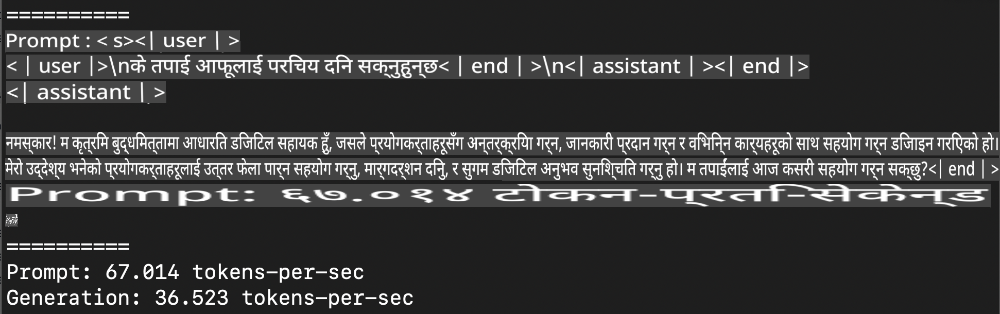
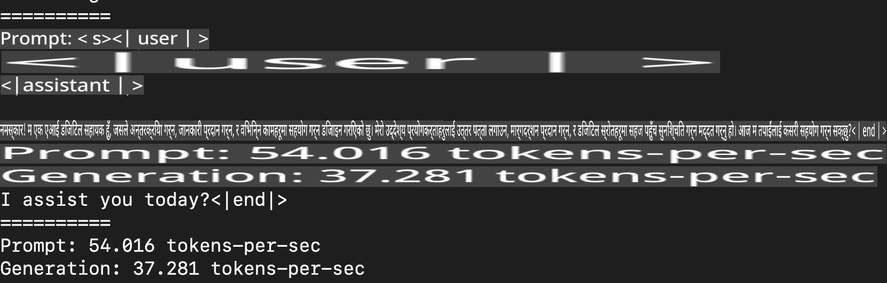
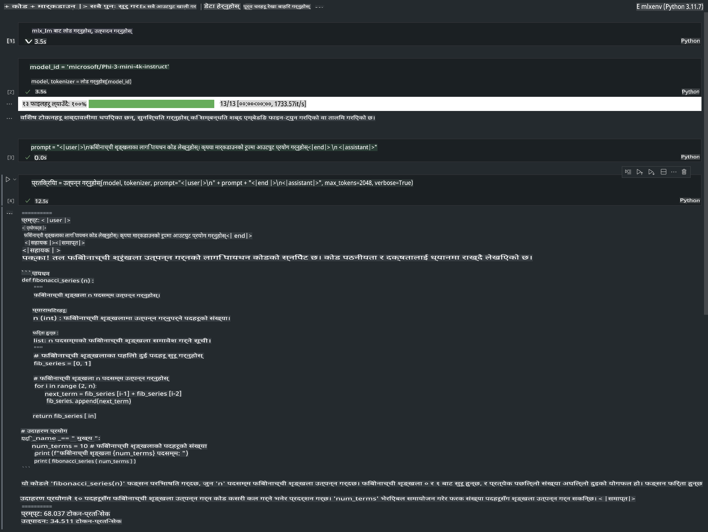

# **Apple MLX Framework मार्फत Phi-3 को Inference**

## **MLX Framework के हो**

MLX Apple सिलिकनमा मेसिन लर्निङ अनुसन्धानका लागि ल्याइएको एक फ्रेमवर्क हो, जुन Apple को मेसिन लर्निङ अनुसन्धान टोलीद्वारा विकसित गरिएको हो।

MLX मेसिन लर्निङ अनुसन्धानकर्ताहरूका लागि डिजाइन गरिएको हो। यो फ्रेमवर्क प्रयोग गर्न सजिलो छ तर मोडेलहरूलाई दक्षतापूर्वक ट्रेन र डिप्लोय गर्न सक्षम छ। यस फ्रेमवर्कको डिजाइन पनि अवधारणात्मक रूपमा सरल छ। हाम्रो उद्देश्य अनुसन्धानकर्ताहरूलाई MLX विस्तार र सुधार गर्न सजिलो बनाउनु हो, ताकि नयाँ विचारहरू छिट्टै अन्वेषण गर्न सकियोस्।

Apple Silicon उपकरणहरूमा LLMs लाई MLX मार्फत तीव्र बनाउन सकिन्छ, र मोडेलहरूलाई स्थानीय रूपमा सहजै चलाउन सकिन्छ।

## **MLX प्रयोग गरेर Phi-3-mini को Inference गर्ने**

### **1. आफ्नो MLX वातावरण सेटअप गर्नुहोस्**

1. Python 3.11.x
2. MLX Library इन्स्टल गर्नुहोस्

```bash

pip install mlx-lm

```

### **2. MLX मार्फत टर्मिनलमा Phi-3-mini चलाउनुहोस्**

```bash

python -m mlx_lm.generate --model microsoft/Phi-3-mini-4k-instruct --max-token 2048 --prompt  "<|user|>\nCan you introduce yourself<|end|>\n<|assistant|>"

```

नतिजा (मेरो वातावरण Apple M1 Max, 64GB हो) यस्तो देखिन्छ



### **3. टर्मिनलमा MLX प्रयोग गरेर Phi-3-mini लाई Quantize गर्नुहोस्**

```bash

python -m mlx_lm.convert --hf-path microsoft/Phi-3-mini-4k-instruct

```

***नोटः*** मोडेललाई `mlx_lm.convert` मार्फत Quantize गर्न सकिन्छ, र डिफल्ट Quantization INT4 हो। यो उदाहरणमा Phi-3-mini लाई INT4 मा Quantize गरिएको छ।

मोडेललाई `mlx_lm.convert` मार्फत Quantize गर्न सकिन्छ, र डिफल्ट Quantization INT4 हो। यो उदाहरणमा Phi-3-mini लाई INT4 मा Quantize गरिएको छ। Quantization पछि, यो डिफल्ट डाइरेक्टरी `./mlx_model` मा स्टोर हुनेछ।

हामी टर्मिनलबाट MLX प्रयोग गरेर Quantized मोडेललाई परीक्षण गर्न सक्छौं।

```bash

python -m mlx_lm.generate --model ./mlx_model/ --max-token 2048 --prompt  "<|user|>\nCan you introduce yourself<|end|>\n<|assistant|>"

```

नतिजा यस्तो देखिन्छ



### **4. Jupyter Notebook मा MLX प्रयोग गरेर Phi-3-mini चलाउनुहोस्**



***नोटः*** कृपया यो नमुना पढ्नुहोस् [यस लिंकमा क्लिक गर्नुहोस्](../../../../../code/03.Inference/MLX/MLX_DEMO.ipynb)

## **स्रोतहरू**

1. Apple MLX Framework बारे जान्नुहोस् [https://ml-explore.github.io](https://ml-explore.github.io/mlx/build/html/index.html)

2. Apple MLX GitHub Repo [https://github.com/ml-explore](https://github.com/ml-explore)

**अस्वीकरण**:  
यो दस्तावेज मेसिन-आधारित एआई अनुवाद सेवाहरू प्रयोग गरी अनुवाद गरिएको हो। हामी यथार्थताको लागि प्रयास गर्छौं, तर कृपया जानकारी हुनुहोस् कि स्वचालित अनुवादहरूमा त्रुटिहरू वा अशुद्धताहरू हुन सक्छ। यसको मूल भाषामा रहेको मूल दस्तावेजलाई आधिकारिक स्रोत मानिनुपर्छ। महत्वपूर्ण जानकारीका लागि, व्यावसायिक मानव अनुवाद सिफारिस गरिन्छ। यो अनुवाद प्रयोग गर्दा उत्पन्न हुने कुनै पनि गलतफहमी वा गलत व्याख्याको लागि हामी जिम्मेवार हुनेछैनौं।