# Azure AI Foundry सँग Phi-3 लाई Fine-tune गर्ने तरिका

Microsoft को Phi-3 Mini भाषा मोडेललाई Azure AI Foundry प्रयोग गरेर कसरी Fine-tune गर्ने भन्ने कुरा हेरौं। Fine-tuning ले Phi-3 Mini लाई विशिष्ट कार्यहरूमा अनुकूलन गर्न सक्षम बनाउँछ, जसले यसलाई अझ शक्तिशाली र सन्दर्भ-संवेदनशील बनाउँछ।

## विचारणीय बुँदाहरू

- **क्षमता:** कुन मोडेलहरू Fine-tune गर्न सकिन्छ? Base मोडेललाई के के कार्यमा अनुकूलन गर्न सकिन्छ?
- **खर्च:** Fine-tuning को लागि मूल्य निर्धारण मोडेल कस्तो छ?
- **अनुकूलनशीलता:** Base मोडेललाई कति हदसम्म परिमार्जन गर्न सकिन्छ – र कुन तरिकामा?
- **सुविधा:** Fine-tuning कसरी हुन्छ – के म आफैंले कोड लेख्नुपर्ने हुन्छ? के म आफ्नै कम्प्युट ल्याउनुपर्ने हुन्छ?
- **सुरक्षा:** Fine-tuned मोडेलहरूले सुरक्षा जोखिम ल्याउन सक्छन् – के यसबाट हुन सक्ने अनावश्यक क्षतिबाट जोगिन कुनै सुरक्षा उपाय छन्?

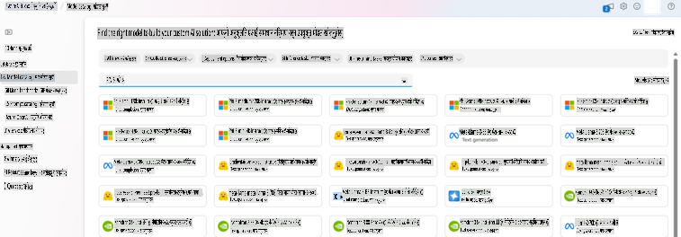

## Fine-tuning को तयारी

### आवश्यकताहरू

> [!NOTE]
> Phi-3 परिवारका मोडेलहरूको लागि, pay-as-you-go मोडेल Fine-tune गर्ने सुविधा केवल **East US 2** क्षेत्रहरूमा बनाइएका हबहरूमा उपलब्ध छ।

- Azure सदस्यता। यदि तपाईंसँग Azure सदस्यता छैन भने, [भुक्तान Azure खाता](https://azure.microsoft.com/pricing/purchase-options/pay-as-you-go) सिर्जना गरेर सुरु गर्नुहोस्।
- एक [AI Foundry प्रोजेक्ट](https://ai.azure.com?WT.mc_id=aiml-138114-kinfeylo)।
- Azure भूमिका-आधारित पहुँच नियन्त्रण (Azure RBAC) ले Azure AI Foundry मा अपरेसनहरू पहुँच दिन प्रयोग गरिन्छ। यो लेखका चरणहरू पूरा गर्नको लागि, तपाईंको प्रयोगकर्ता खातालाई **Azure AI Developer भूमिका** मा रिसोर्स समूहमा असाइन गरिएको हुनुपर्छ।

### सदस्यता प्रदायक दर्ता

सुनिश्चित गर्नुहोस् कि सदस्यता `Microsoft.Network` रिसोर्स प्रदायकमा दर्ता गरिएको छ।

1. [Azure पोर्टल](https://portal.azure.com) मा साइन इन गर्नुहोस्।
1. बाँया मेनुबाट **Subscriptions** चयन गर्नुहोस्।
1. तपाईंले प्रयोग गर्न चाहेको सदस्यता चयन गर्नुहोस्।
1. बाँया मेनुबाट **AI project settings** > **Resource providers** चयन गर्नुहोस्।
1. **Microsoft.Network** रिसोर्स प्रदायकहरूको सूचीमा रहेको सुनिश्चित गर्नुहोस्। यदि छैन भने, यसलाई थप्नुहोस्।

### डाटा तयारी

तपाईंको मोडेललाई Fine-tune गर्नको लागि प्रशिक्षण र प्रमाणीकरण डाटा तयार गर्नुहोस्। प्रशिक्षण र प्रमाणीकरण डाटा सेटहरूले इनपुट र आउटपुट उदाहरणहरू समावेश गर्छ, जसरी तपाईं मोडेललाई प्रदर्शन गराउन चाहनुहुन्छ।

सुनिश्चित गर्नुहोस् कि तपाईंका सबै प्रशिक्षण उदाहरणहरू अनुमानको लागि अपेक्षित ढाँचामा छन्। प्रभावकारी Fine-tuning का लागि, सन्तुलित र विविध डाटासेटको सुनिश्चितता गर्नुहोस्।

यसमा डाटाको सन्तुलन कायम गर्नु, विभिन्न परिस्थितिहरू समावेश गर्नु, र वास्तविक संसारका अपेक्षाहरूमा तालमेल गर्न समय समयमा प्रशिक्षण डाटा परिमार्जन गर्नु समावेश छ, जसले गर्दा थप सटीक र सन्तुलित मोडेल प्रतिक्रियाहरू प्राप्त गर्न मद्दत पुग्छ।

विभिन्न मोडेल प्रकारहरूले विभिन्न प्रकारको प्रशिक्षण डाटाको ढाँचा आवश्यक पर्छ।

### Chat Completion

तपाईंले प्रयोग गर्ने प्रशिक्षण र प्रमाणीकरण डाटालाई अनिवार्य रूपमा JSON Lines (JSONL) ढाँचामा तयार गर्नुपर्छ। `Phi-3-mini-128k-instruct` को लागि Fine-tuning डाटासेट Chat completions API ले प्रयोग गर्ने संवादात्मक ढाँचामा तयार हुनुपर्छ।

### उदाहरण फाइल ढाँचा

```json
    {"messages": [{"role": "system", "content": "You are an Xbox customer support agent whose primary goal is to help users with issues they are experiencing with their Xbox devices. You are friendly and concise. You only provide factual answers to queries, and do not provide answers that are not related to Xbox."}, {"role": "user", "content": "Is Xbox better than PlayStation?"}, {"role": "assistant", "content": "I apologize, but I cannot provide personal opinions. My primary job is to assist you with any issues related to your Xbox device. Do you have any Xbox-related issues that need addressing?"}]}
    {"messages": [{"role": "system", "content": "You are an Xbox customer support agent whose primary goal is to help users with issues they are experiencing with their Xbox devices. You are friendly and concise. You only provide factual answers to queries, and do not provide answers that are not related to Xbox."}, {"role": "user", "content": "Can I play PC games on my Xbox?"}, {"role": "assistant", "content": "While Xbox consoles don't natively support PC games, they can play an array of Xbox games, many of which are also available on PC. Can I assist you with finding games compatible with your Xbox device?"}]}
    {"messages": [{"role": "system", "content": "You are an Xbox customer support agent whose primary goal is to help users with issues they are experiencing with their Xbox devices. You are friendly and concise. You only provide factual answers to queries, and do not provide answers that are not related to Xbox."}, {"role": "user", "content": "I'm having trouble connecting my Xbox to the Wi-Fi."}, {"role": "assistant", "content": "No worries, let's go through the network settings on your Xbox. Can you please tell me what happens when you try to connect it to the Wi-Fi?"}]}
```

समर्थित फाइल प्रकार JSON Lines हो। फाइलहरू डिफल्ट डाटास्टोरमा अपलोड गरिन्छ र तपाईंको प्रोजेक्टमा उपलब्ध गराइन्छ।

## Azure AI Foundry सँग Phi-3 Fine-tuning

Azure AI Foundry ले ठूलो भाषा मोडेलहरूलाई Fine-tuning प्रक्रियाको माध्यमबाट तपाईंको व्यक्तिगत डाटासेटहरूसँग अनुकूलित गर्न अनुमति दिन्छ। Fine-tuning ले विशिष्ट कार्यहरू र अनुप्रयोगहरूको लागि अनुकूलन र अनुकूलन प्रदान गरेर महत्वपूर्ण मूल्य प्रदान गर्दछ। यसले प्रदर्शन सुधार, लागत दक्षता, कम विलम्बता, र अनुकूलित आउटपुट ल्याउँछ।

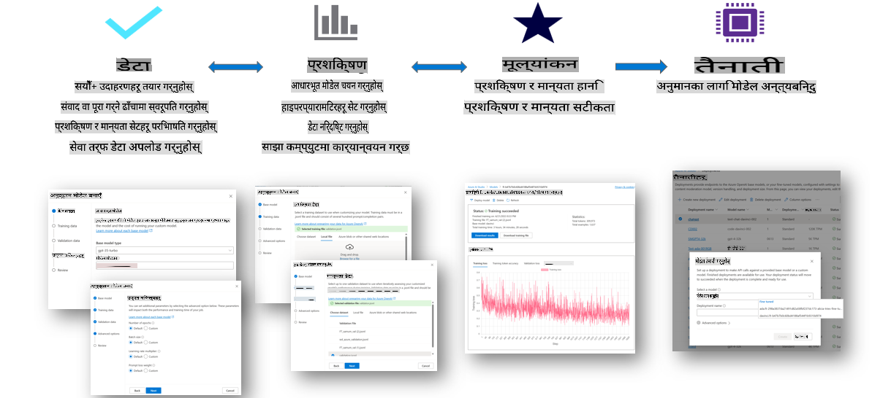

### नयाँ प्रोजेक्ट सिर्जना गर्नुहोस्

1. [Azure AI Foundry](https://ai.azure.com) मा साइन इन गर्नुहोस्।

1. **+New project** चयन गरेर Azure AI Foundry मा नयाँ प्रोजेक्ट सिर्जना गर्नुहोस्।

    

1. निम्न कार्यहरू गर्नुहोस्:

    - प्रोजेक्ट **Hub name**। यो अद्वितीय मान हुनुपर्छ।
    - प्रयोग गर्न **Hub** चयन गर्नुहोस् (आवश्यक परेमा नयाँ सिर्जना गर्नुहोस्)।

    

1. नयाँ हब सिर्जना गर्न निम्न कार्यहरू गर्नुहोस्:

    - **Hub name** प्रविष्ट गर्नुहोस्। यो अद्वितीय मान हुनुपर्छ।
    - तपाईंको Azure **Subscription** चयन गर्नुहोस्।
    - प्रयोग गर्न **Resource group** चयन गर्नुहोस् (आवश्यक परेमा नयाँ सिर्जना गर्नुहोस्)।
    - प्रयोग गर्न चाहनुभएको **Location** चयन गर्नुहोस्।
    - प्रयोग गर्न चाहनुभएको **Connect Azure AI Services** चयन गर्नुहोस् (आवश्यक परेमा नयाँ सिर्जना गर्नुहोस्)।
    - **Connect Azure AI Search** लाई **Skip connecting** चयन गर्नुहोस्।

    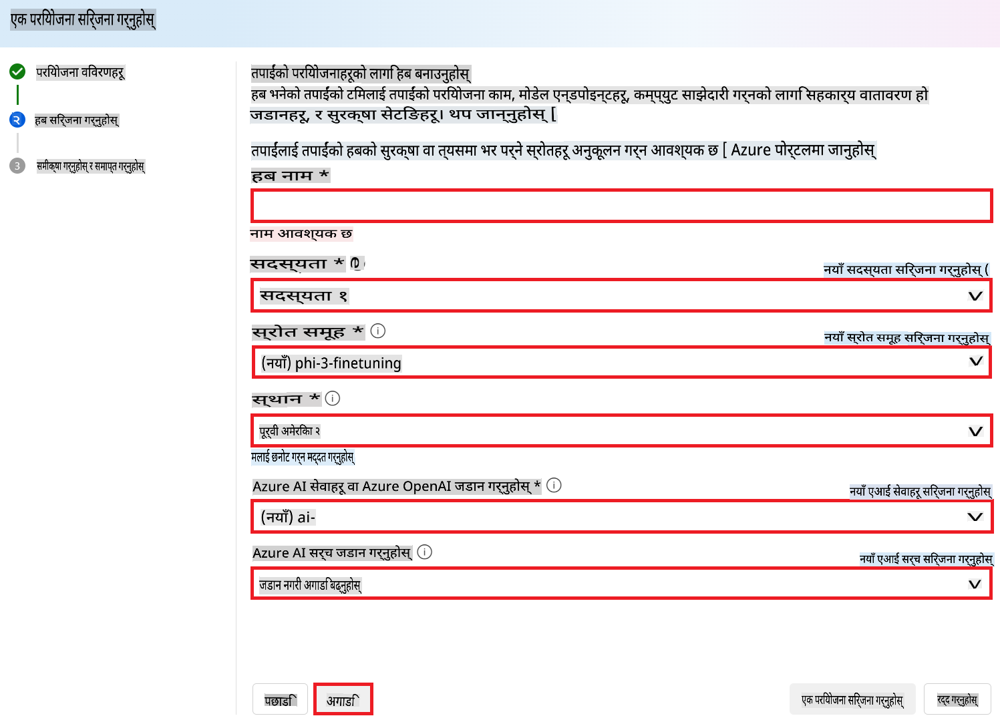

1. **Next** चयन गर्नुहोस्।
1. **Create a project** चयन गर्नुहोस्।

### डाटा तयारी

Fine-tuning अघि, तपाईंको कार्यसँग सम्बन्धित डाटासेट सङ्कलन वा सिर्जना गर्नुहोस्, जस्तै संवाद निर्देशनहरू, प्रश्न-उत्तर जोडीहरू, वा अन्य कुनै पनि सान्दर्भिक पाठ डाटा। शोर हटाउने, हराएका मानहरू व्यवस्थापन गर्ने, र पाठलाई टोकनाइज गर्ने काम गरेर यस डाटालाई सफा र पूर्व-प्रक्रिया गर्नुहोस्।

### Azure AI Foundry मा Phi-3 मोडेलहरू Fine-tune गर्नुहोस्

> [!NOTE]
> Phi-3 मोडेलहरूको Fine-tuning हाल East US 2 मा रहेका प्रोजेक्टहरूमा मात्र समर्थित छ।

1. बाँया साइड ट्याबबाट **Model catalog** चयन गर्नुहोस्।

1. **search bar** मा *phi-3* टाइप गर्नुहोस् र तपाईंले प्रयोग गर्न चाहनुभएको phi-3 मोडेल चयन गर्नुहोस्।

    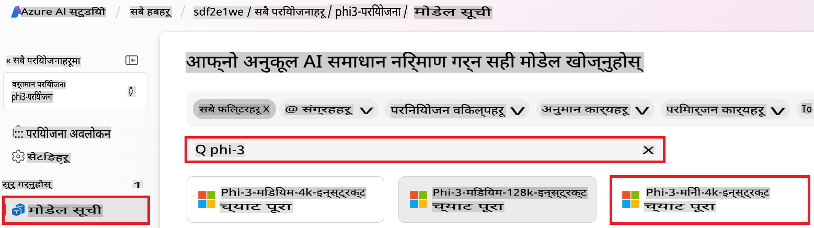

1. **Fine-tune** चयन गर्नुहोस्।

    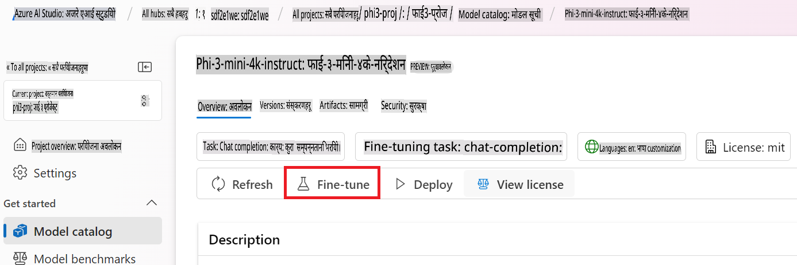

1. **Fine-tuned model name** प्रविष्ट गर्नुहोस्।

    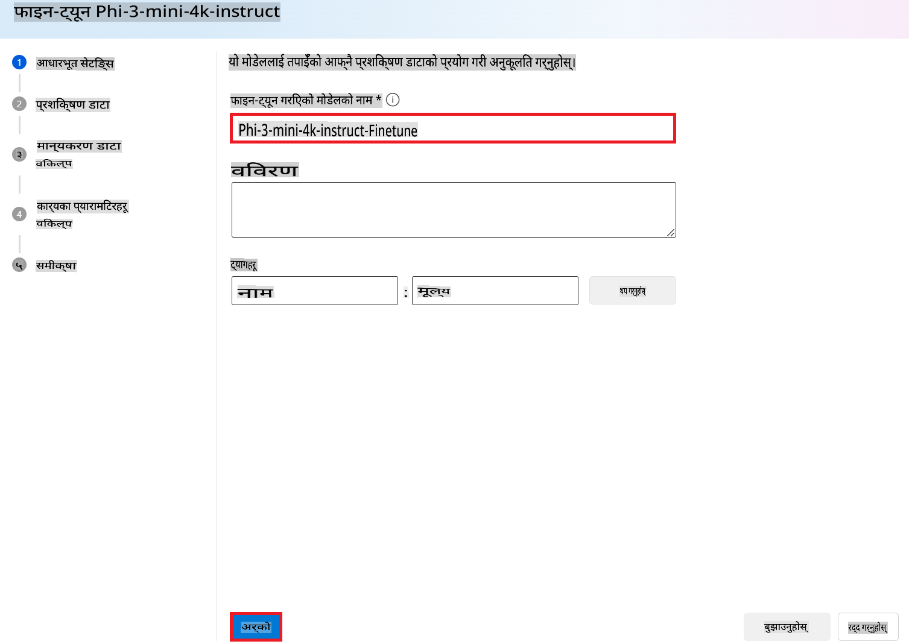

1. **Next** चयन गर्नुहोस्।

1. निम्न कार्यहरू गर्नुहोस्:

    - **task type** लाई **Chat completion** चयन गर्नुहोस्।
    - प्रयोग गर्न चाहनुभएको **Training data** चयन गर्नुहोस्। तपाईं यसलाई Azure AI Foundry को डाटाबाट वा तपाईंको स्थानीय वातावरणबाट अपलोड गर्न सक्नुहुन्छ।

    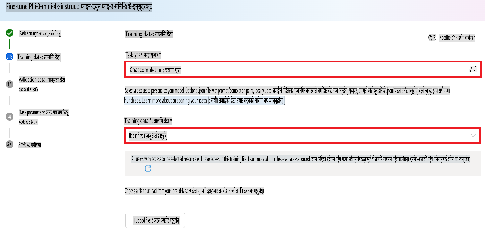

1. **Next** चयन गर्नुहोस्।

1. प्रयोग गर्न चाहनुभएको **Validation data** अपलोड गर्नुहोस्। वा तपाईं **Automatic split of training data** चयन गर्न सक्नुहुन्छ।

    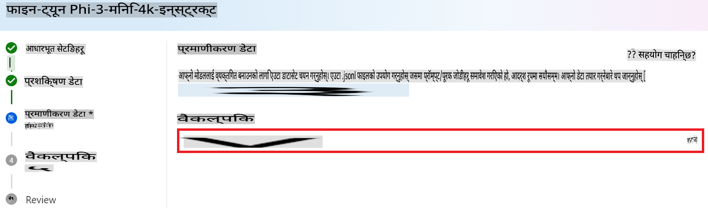

1. **Next** चयन गर्नुहोस्।

1. निम्न कार्यहरू गर्नुहोस्:

    - प्रयोग गर्न चाहनुभएको **Batch size multiplier** चयन गर्नुहोस्।
    - प्रयोग गर्न चाहनुभएको **Learning rate** चयन गर्नुहोस्।
    - प्रयोग गर्न चाहनुभएको **Epochs** चयन गर्नुहोस्।

    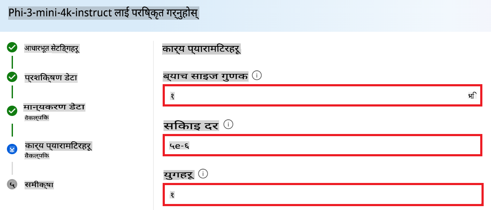

1. Fine-tuning प्रक्रिया सुरु गर्न **Submit** चयन गर्नुहोस्।

    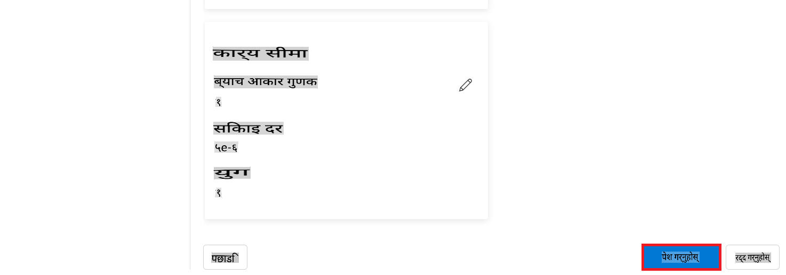

1. तपाईंको मोडेल Fine-tune भएपछि, स्थिति **Completed** रूपमा देखाइनेछ, जस्तै तलको चित्रमा देखाइएको छ। अब तपाईं मोडेललाई तैनाथ गर्न सक्नुहुन्छ र यसलाई तपाईंको आफ्नै अनुप्रयोगमा, playground मा, वा prompt flow मा प्रयोग गर्न सक्नुहुन्छ। थप जानकारीको लागि, [Azure AI Foundry सँग Phi-3 परिवारका साना भाषा मोडेलहरू कसरी तैनाथ गर्ने](https://learn.microsoft.com/azure/ai-studio/how-to/deploy-models-phi-3?tabs=phi-3-5&pivots=programming-language-python) हेर्नुहोस्।

    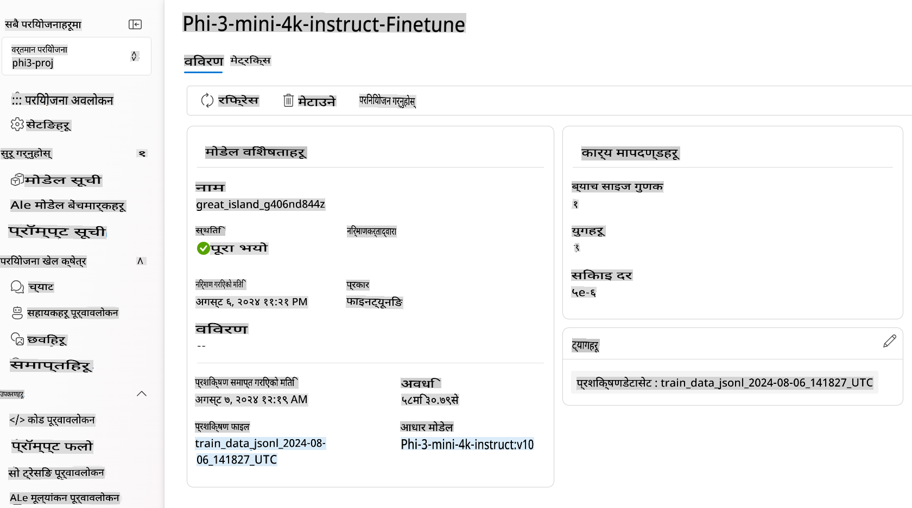

> [!NOTE]
> Phi-3 लाई Fine-tune गर्ने बारे थप जानकारीको लागि कृपया [Azure AI Foundry मा Phi-3 मोडेलहरू Fine-tune गर्ने](https://learn.microsoft.com/azure/ai-studio/how-to/fine-tune-phi-3?tabs=phi-3-mini) हेर्नुहोस्।

## Fine-tuned मोडेलहरू सफा गर्नुहोस्

Fine-tuning मोडेल सूचीबाट [Azure AI Foundry](https://ai.azure.com) वा मोडेल विवरण पृष्ठबाट Fine-tuned मोडेल मेटाउन सक्नुहुन्छ। Fine-tuning पृष्ठबाट मेटाउन Fine-tuned मोडेल चयन गर्नुहोस्, र त्यसपछि मेटाउनको लागि Delete बटन चयन गर्नुहोस्।

> [!NOTE]
> यदि कुनै कस्टम मोडेलको तैनाथी छ भने तपाईं यसलाई मेटाउन सक्नुहुन्न। तपाईंले आफ्नो मोडेल तैनाथी पहिले मेटाउनुपर्छ।

## खर्च र कोटा

### Phi-3 मोडेलहरूको Fine-tuning सम्बन्धित खर्च र कोटा

Phi मोडेलहरू Microsoft द्वारा सेवा रूपमा Fine-tuned गरिन्छ र Azure AI Foundry मा एकीकृत गरिन्छ। मूल्य निर्धारण [तैनाथ गर्दा](https://learn.microsoft.com/azure/ai-studio/how-to/deploy-models-phi-3?tabs=phi-3-5&pivots=programming-language-python) वा Fine-tuning गर्दा, तैनाथी विजार्डको Pricing and terms ट्याबमा पाउन सकिन्छ।

## सामग्री फिल्टरिङ

Pay-as-you-go मोडेलहरू Azure AI Content Safety द्वारा सुरक्षित छन्। वास्तविक-समयका अन्त्य बिन्दुहरूमा तैनाथ गर्दा, तपाईं यस क्षमताबाट बाहिर निस्कन सक्नुहुन्छ। Azure AI content safety सक्षम हुँदा, दुवै प्रॉम्प्ट र completion ले हानिकारक सामग्रीको उत्पादन पत्ता लगाउन र रोक्नका लागि वर्गीकरण मोडेलहरूको समूहको माध्यमबाट जान्छ। सामग्री फिल्टरिङ प्रणालीले इनपुट प्रॉम्प्ट र आउटपुट completion मा सम्भावित हानिकारक सामग्रीको विशिष्ट कोटीहरूको पत्ता लगाउँछ र कार्य गर्दछ। थप जानकारीको लागि [Azure AI Content Safety](https://learn.microsoft.com/azure/ai-studio/concepts/content-filtering) हेर्नुहोस्।

**Fine-Tuning Configuration**

Hyperparameters: Learning rate, batch size, र training epochs जस्ता hyperparameters परिभाषित गर्नुहोस्।

**Loss Function**

तपाईंको कार्यको लागि उपयुक्त loss function चयन गर्नुहोस् (जस्तै, cross-entropy)।

**Optimizer**

Gradient updates का लागि Optimizer (जस्तै, Adam) चयन गर्नुहोस्।

**Fine-Tuning Process**

- Pre-Trained Model लोड गर्नुहोस्: Phi-3 Mini checkpoint लोड गर्नुहोस्।
- Custom Layers थप्नुहोस्: कार्य-विशिष्ट तहहरू थप्नुहोस् (जस्तै, chat instructions को लागि classification head)।

**Train the Model**
तपाईंको तयार डाटासेट प्रयोग गरेर मोडेल Fine-tune गर्नुहोस्। प्रशिक्षण प्रगति अनुगमन गर्नुहोस् र आवश्यक अनुसार hyperparameters समायोजन गर्नुहोस्।

**Evaluation and Validation**

Validation Set: तपाईंको डाटालाई प्रशिक्षण र प्रमाणीकरण सेटहरूमा विभाजन गर्नुहोस्।

**Evaluate Performance**

Accuracy, F1-score, वा perplexity जस्ता मेट्रिक्स प्रयोग गरेर मोडेल प्रदर्शन मूल्याङ्कन गर्नुहोस्।

## Fine-Tuned मोडेल सुरक्षित गर्नुहोस्

**Checkpoint**
भविष्यमा प्रयोगका लागि Fine-tuned मोडेल checkpoint सुरक्षित गर्नुहोस्।

## तैनाथी

- Web Service रूपमा तैनाथ गर्नुहोस्: Fine-tuned मोडेललाई Azure AI Foundry मा Web Service रूपमा तैनाथ गर्नुहोस्।
- Endpoint परीक्षण गर्नुहोस्: तैनाथी गरिएको endpoint मा परीक्षण प्रश्नहरू पठाएर यसको कार्यक्षमता सुनिश्चित गर्नुहोस्।

## पुनरावृत्ति र सुधार

पुनरावृत्ति: यदि प्रदर्शन सन्तोषजनक छैन भने, hyperparameters समायोजन गरेर, थप डाटा थपेर, वा थप epochs को लागि Fine-tune गरेर पुनरावृत्ति गर्नुहोस्।

## अनुगमन र परिमार्जन

निरन्तर मोडेलको व्यवहार अनुगमन गर्नुहोस् र आवश्यक अनुसार परिमार्जन गर्नुहोस्।

## अनुकूलन र विस्तार

Custom Tasks: Phi-3 Mini लाई chat instructions भन्दा परका विभिन्न कार्यहरूको लागि Fine-tune गर्न सकिन्छ। अन्य प्रयोगका केसहरू अन्वेषण गर्नुहोस्!
Experiment: प्रदर्शन सुधार गर्न विभिन्न आर्किटेक्चर, तह संयोजन, र प्रविधिहरू प्रयास गर्नुहोस्।

> [!NOTE]
> Fine-tuning एक पुनरावृत्त प्रक्रिया हो। प्रयोग गर्नुहोस्, सिक्नुहोस्, र तपाईंको विशिष्ट कार्यका लागि उत्तम परिणाम प्राप्त गर्न मोडेललाई अनुकूलन गर्नुहोस्!

**अस्वीकरण**:  
यो दस्तावेज मेशिन-आधारित एआई अनुवाद सेवाहरू प्रयोग गरी अनुवाद गरिएको हो। हामी यथासम्भव सही अनुवाद प्रदान गर्न प्रयास गर्छौं, तर कृपया जानकार हुनुहोस् कि स्वचालित अनुवादमा त्रुटिहरू वा असत्यताहरू हुन सक्छ। यसको मौलिक भाषा रहेको मूल दस्तावेजलाई नै आधिकारिक स्रोत मान्नुपर्छ। महत्वपूर्ण जानकारीका लागि, पेशेवर मानव अनुवादको सिफारिस गरिन्छ। यस अनुवादको प्रयोगबाट उत्पन्न हुने कुनै पनि गलतफहमी वा गलत व्याख्याको लागि हामी जिम्मेवार हुने छैनौं।