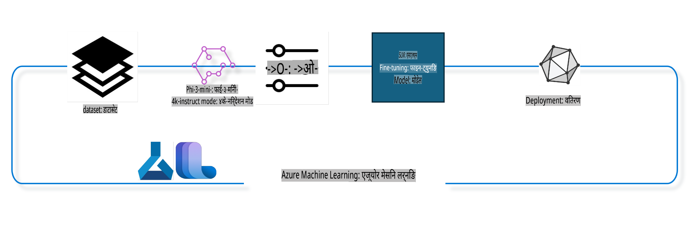

## Azure ML प्रणाली रेजिस्ट्रीबाट च्याट-कम्प्लिसन कम्पोनेन्टहरू प्रयोग गरेर मोडेललाई फाइन-ट्यून कसरी गर्ने

यस उदाहरणमा हामी दुई व्यक्तिहरूबीचको कुराकानी पूरा गर्न Phi-3-mini-4k-instruct मोडेललाई ultrachat_200k डेटासेट प्रयोग गरी फाइन-ट्यून गर्नेछौं।



यो उदाहरणले Azure ML SDK र Python प्रयोग गरेर फाइन-ट्यून कसरी गर्ने र त्यसपछि फाइन-ट्यून गरिएको मोडेललाई वास्तविक समयमा भविष्यवाणीका लागि अनलाइन अन्त्यबिन्दुमा कसरी डिप्लोय गर्ने भन्ने देखाउँछ।

### प्रशिक्षण डेटा

हामी ultrachat_200k डेटासेट प्रयोग गर्नेछौं। यो UltraChat डेटासेटको धेरै फिल्टर गरिएको संस्करण हो र यसलाई Zephyr-7B-β, एक अत्याधुनिक 7b च्याट मोडेल, तालिम दिन प्रयोग गरिएको थियो।

### मोडेल

हामी Phi-3-mini-4k-instruct मोडेल प्रयोग गर्नेछौं ताकि प्रयोगकर्ताले च्याट-कम्प्लिसन कार्यको लागि मोडेललाई कसरी फाइन-ट्यून गर्न सकिन्छ भन्ने देखाउन। यदि तपाईंले यो नोटबुकलाई कुनै विशेष मोडेल कार्डबाट खोल्नुभएको छ भने, कृपया विशेष मोडेल नाम परिवर्तन गर्न नबिर्सनुहोस्।

### कार्यहरू

- फाइन-ट्यून गर्न एउटा मोडेल चयन गर्नुहोस्।
- प्रशिक्षण डेटा चयन र अन्वेषण गर्नुहोस्।
- फाइन-ट्यूनिङ कार्य कन्फिगर गर्नुहोस्।
- फाइन-ट्यूनिङ कार्य चलाउनुहोस्।
- प्रशिक्षण र मूल्याङ्कन मेट्रिक्स समीक्षा गर्नुहोस्।
- फाइन-ट्यून गरिएको मोडेल दर्ता गर्नुहोस्।
- फाइन-ट्यून गरिएको मोडेललाई वास्तविक समयमा भविष्यवाणीका लागि डिप्लोय गर्नुहोस्।
- स्रोतहरू सफा गर्नुहोस्।

## १. पूर्वआवश्यकता सेटअप गर्नुहोस्

- निर्भरता स्थापना गर्नुहोस्।
- AzureML कार्यक्षेत्रमा जडान गर्नुहोस्। SDK प्रमाणीकरण सेट अप गर्न सिक्नुहोस्। तल <WORKSPACE_NAME>, <RESOURCE_GROUP>, र <SUBSCRIPTION_ID> प्रतिस्थापन गर्नुहोस्।
- AzureML प्रणाली रेजिस्ट्रीमा जडान गर्नुहोस्।
- वैकल्पिक प्रयोगको लागि एउटा नाम सेट गर्नुहोस्।
- कम्प्युट जाँच गर्नुहोस् वा सिर्जना गर्नुहोस्।

> [!NOTE]
> आवश्यकताहरू: एउटा GPU नोडमा धेरै GPU कार्डहरू हुन सक्छ। उदाहरणका लागि, Standard_NC24rs_v3 को एक नोडमा ४ NVIDIA V100 GPUs छन् भने Standard_NC12s_v3 मा २ NVIDIA V100 GPUs छन्। यस जानकारीका लागि डक्युमेन्टेसन हेर्नुहोस्। तलको gpus_per_node प्यारामिटरमा प्रति नोड GPU कार्डहरूको संख्या सेट गरिएको छ। यस मानलाई सही सेट गर्दा नोडमा सबै GPUs को उपयोग सुनिश्चित हुनेछ। सिफारिस गरिएको GPU कम्प्युट SKUs यहाँ र यहाँ फेला पार्न सकिन्छ।

### Python पुस्तकालयहरू

तलको सेल चलाएर निर्भरता स्थापना गर्नुहोस्। यदि नयाँ वातावरणमा चलाउँदै हुनुहुन्छ भने यो वैकल्पिक कदम होइन।

```bash
pip install azure-ai-ml
pip install azure-identity
pip install datasets==2.9.0
pip install mlflow
pip install azureml-mlflow
```

### Azure ML सँग अन्तर्क्रिया

१. यो Python स्क्रिप्ट Azure Machine Learning (Azure ML) सेवासँग अन्तर्क्रिया गर्न प्रयोग गरिएको छ। यसले के गर्छ भन्ने विवरण:

    - यसले azure.ai.ml, azure.identity, र azure.ai.ml.entities प्याकेजहरूबाट आवश्यक मोड्युलहरू आयात गर्दछ। यसले time मोड्युल पनि आयात गर्दछ।

    - यसले DefaultAzureCredential() प्रयोग गरेर प्रमाणीकरण गर्न प्रयास गर्दछ, जसले Azure क्लाउडमा चल्ने अनुप्रयोगहरू छिट्टै विकास गर्नका लागि सरलीकृत प्रमाणीकरण अनुभव प्रदान गर्दछ। यदि यो असफल हुन्छ भने, यो InteractiveBrowserCredential() मा फिर्ता जान्छ, जसले इन्टरएक्टिभ लगइन प्रम्प्ट प्रदान गर्दछ।

    - त्यसपछि यसले from_config विधि प्रयोग गरेर MLClient उदाहरण सिर्जना गर्न प्रयास गर्दछ, जसले डिफल्ट कन्फिग फाइल (config.json) बाट कन्फिगरेसन पढ्छ। यदि यो असफल हुन्छ भने, यो subscription_id, resource_group_name, र workspace_name म्यानुअल रूपमा प्रदान गरेर MLClient उदाहरण सिर्जना गर्दछ।

    - यसले "azureml" नामको Azure ML रेजिस्ट्रीका लागि अर्को MLClient उदाहरण सिर्जना गर्दछ। यो रेजिस्ट्री मोडेलहरू, फाइन-ट्यूनिङ पाइपलाइनहरू, र वातावरणहरू भण्डारण गर्ने ठाउँ हो।

    - यसले प्रयोगको नामलाई "chat_completion_Phi-3-mini-4k-instruct" मा सेट गर्दछ।

    - यसले युनिक टाइमस्ट्याम्प उत्पन्न गर्दछ, जसलाई सेकेन्डमा हालको समयलाई पूर्णांकमा रूपान्तरण गरेर र त्यसपछि स्ट्रिङमा बदलेर बनाइन्छ। यस टाइमस्ट्याम्पलाई युनिक नाम र संस्करणहरू सिर्जना गर्न प्रयोग गर्न सकिन्छ।

    ```python
    # Import necessary modules from Azure ML and Azure Identity
    from azure.ai.ml import MLClient
    from azure.identity import (
        DefaultAzureCredential,
        InteractiveBrowserCredential,
    )
    from azure.ai.ml.entities import AmlCompute
    import time  # Import time module
    
    # Try to authenticate using DefaultAzureCredential
    try:
        credential = DefaultAzureCredential()
        credential.get_token("https://management.azure.com/.default")
    except Exception as ex:  # If DefaultAzureCredential fails, use InteractiveBrowserCredential
        credential = InteractiveBrowserCredential()
    
    # Try to create an MLClient instance using the default config file
    try:
        workspace_ml_client = MLClient.from_config(credential=credential)
    except:  # If that fails, create an MLClient instance by manually providing the details
        workspace_ml_client = MLClient(
            credential,
            subscription_id="<SUBSCRIPTION_ID>",
            resource_group_name="<RESOURCE_GROUP>",
            workspace_name="<WORKSPACE_NAME>",
        )
    
    # Create another MLClient instance for the Azure ML registry named "azureml"
    # This registry is where models, fine-tuning pipelines, and environments are stored
    registry_ml_client = MLClient(credential, registry_name="azureml")
    
    # Set the experiment name
    experiment_name = "chat_completion_Phi-3-mini-4k-instruct"
    
    # Generate a unique timestamp that can be used for names and versions that need to be unique
    timestamp = str(int(time.time()))
    ```

## २. फाइन-ट्यून गर्न एउटा आधारभूत मोडेल चयन गर्नुहोस्

१. Phi-3-mini-4k-instruct एउटा ३.८ बिलियन प्यारामिटर, हल्का, अत्याधुनिक खुला मोडेल हो, जसलाई Phi-2 मा प्रयोग गरिएका डेटासेटहरूमा आधारित बनाइएको छ। मोडेल Phi-3 मोडेल परिवारको हो, र Mini संस्करण ४K र १२८K नामका दुई भेरियन्टहरूमा उपलब्ध छ, जुन यसले समर्थन गर्न सक्ने कन्टेक्स्ट लम्बाइ (टोकनहरूमा) हो। हाम्रो विशिष्ट उद्देश्यका लागि मोडेललाई फाइन-ट्यून गर्न आवश्यक छ। तपाईं यी मोडेलहरूलाई AzureML स्टुडियोको मोडेल क्याटलगमा च्याट-कम्प्लिसन कार्यद्वारा फिल्टर गरेर ब्राउज गर्न सक्नुहुन्छ। यस उदाहरणमा, हामी Phi-3-mini-4k-instruct मोडेल प्रयोग गर्छौं। यदि तपाईंले यो नोटबुक अन्य मोडेलका लागि खोल्नुभएको छ भने, कृपया मोडेल नाम र संस्करण परिवर्तन गर्नुहोस्।

    > [!NOTE]
    > मोडेलको id प्रोपर्टी। यो फाइन-ट्यूनिङ कार्यमा इनपुटको रूपमा पास गरिनेछ। यो AzureML स्टुडियो मोडेल क्याटलगमा मोडेल विवरण पृष्ठको Asset ID फील्डमा पनि उपलब्ध छ।

२. यो Python स्क्रिप्ट Azure Machine Learning (Azure ML) सेवासँग अन्तर्क्रिया गरिरहेको छ। यसले के गर्छ भन्ने विवरण:

    - यसले model_name लाई "Phi-3-mini-4k-instruct" मा सेट गर्दछ।

    - यसले registry_ml_client वस्तुको models प्रोपर्टीको get विधि प्रयोग गरेर Azure ML रेजिस्ट्रीबाट निर्दिष्ट नाम भएको मोडेलको पछिल्लो संस्करण पुनःप्राप्त गर्दछ। get विधिलाई दुई तर्कहरू दिइएको छ: मोडेलको नाम र लेबल जसले मोडेलको पछिल्लो संस्करण पुनःप्राप्त गर्नुपर्ने संकेत गर्दछ।

    - यसले कन्सोलमा एउटा सन्देश प्रिन्ट गर्दछ, जसले फाइन-ट्यूनिङका लागि प्रयोग गरिने मोडेलको नाम, संस्करण, र id संकेत गर्दछ। स्ट्रिङको format विधि प्रयोग गरेर मोडेलको नाम, संस्करण, र id सन्देशमा सम्मिलित गरिन्छ। मोडेलको नाम, संस्करण, र id लाई foundation_model वस्तुको प्रोपर्टीहरूका रूपमा पहुँच गरिएको छ।

    ```python
    # Set the model name
    model_name = "Phi-3-mini-4k-instruct"
    
    # Get the latest version of the model from the Azure ML registry
    foundation_model = registry_ml_client.models.get(model_name, label="latest")
    
    # Print the model name, version, and id
    # This information is useful for tracking and debugging
    print(
        "\n\nUsing model name: {0}, version: {1}, id: {2} for fine tuning".format(
            foundation_model.name, foundation_model.version, foundation_model.id
        )
    )
    ```

## ३. कार्यका लागि प्रयोग हुने कम्प्युट सिर्जना गर्नुहोस्

फाइन-ट्यूनिङ कार्य GPU कम्प्युटसँग मात्र काम गर्छ। कम्प्युटको आकार मोडेलको आकारमा निर्भर गर्दछ र धेरैजसो अवस्थामा कार्यका लागि सही कम्प्युट पहिचान गर्न गाह्रो हुन्छ। यस सेलमा, प्रयोगकर्तालाई कार्यका लागि सही कम्प्युट चयन गर्न मार्गदर्शन गरिन्छ।

> [!NOTE]
> तल सूचीबद्ध कम्प्युटहरू सबैभन्दा अनुकूलित कन्फिगरेसनसँग काम गर्छन्। कन्फिगरेसनमा कुनै परिवर्तनले Cuda Out Of Memory त्रुटि निम्त्याउन सक्छ। यस्तो अवस्थामा, कम्प्युटलाई ठूलो कम्प्युट आकारमा अपग्रेड गर्न प्रयास गर्नुहोस्।

> [!NOTE]
> तल compute_cluster_size चयन गर्दा, निश्चित गर्नुहोस् कि कम्प्युट तपाईंको स्रोत समूहमा उपलब्ध छ। यदि कुनै विशेष कम्प्युट उपलब्ध छैन भने, कम्प्युट स्रोतहरूको पहुँच प्राप्त गर्न अनुरोध गर्न सक्नुहुन्छ।

### फाइन-ट्यूनिङ समर्थनका लागि मोडेल जाँच

१. यो Python स्क्रिप्ट Azure Machine Learning (Azure ML) मोडेलसँग अन्तर्क्रिया गरिरहेको छ। यसले के गर्छ भन्ने विवरण:

    - यसले ast मोड्युल आयात गर्दछ, जसले Pythonको abstract syntax grammar को रूखहरू प्रशोधन गर्नका लागि कार्यहरू प्रदान गर्दछ।

    - यसले foundation_model वस्तु (Azure ML मा मोडेललाई प्रतिनिधित्व गर्ने) मा finetune_compute_allow_list नामको ट्याग छ कि छैन भनेर जाँच गर्दछ। Azure ML मा ट्यागहरू कुञ्जी-मूल्य जोडीहरू हुन्, जुन मोडेलहरू फिल्टर र क्रमबद्ध गर्न सिर्जना र प्रयोग गर्न सकिन्छ।

    - यदि finetune_compute_allow_list ट्याग उपस्थित छ भने, यसले ast.literal_eval कार्य प्रयोग गरेर ट्यागको मानलाई सुरक्षित रूपमा Python सूचीमा पार्स गर्दछ। यो सूचीलाई computes_allow_list भेरिएबलमा असाइन गरिएको छ। त्यसपछि यसले सूचीबाट कम्प्युट सिर्जना गर्नुपर्ने सन्देश देखाउँछ।

    - यदि finetune_compute_allow_list ट्याग उपस्थित छैन भने, यसले computes_allow_list लाई None मा सेट गर्दछ र मोडेलका ट्यागहरूको भाग होइन भनेर संकेत गर्ने सन्देश देखाउँछ।

    - संक्षेपमा, यो स्क्रिप्टले मोडेलको मेटाडेटामा विशेष ट्याग जाँच गर्दै, ट्यागको मानलाई सूचीमा रूपान्तरण गर्दै, र प्रयोगकर्तालाई त्यसअनुसार प्रतिक्रिया प्रदान गर्दैछ।

    ```python
    # Import the ast module, which provides functions to process trees of the Python abstract syntax grammar
    import ast
    
    # Check if the 'finetune_compute_allow_list' tag is present in the model's tags
    if "finetune_compute_allow_list" in foundation_model.tags:
        # If the tag is present, use ast.literal_eval to safely parse the tag's value (a string) into a Python list
        computes_allow_list = ast.literal_eval(
            foundation_model.tags["finetune_compute_allow_list"]
        )  # convert string to python list
        # Print a message indicating that a compute should be created from the list
        print(f"Please create a compute from the above list - {computes_allow_list}")
    else:
        # If the tag is not present, set computes_allow_list to None
        computes_allow_list = None
        # Print a message indicating that the 'finetune_compute_allow_list' tag is not part of the model's tags
        print("`finetune_compute_allow_list` is not part of model tags")
    ```
### पाइपलाइन कन्फिगर गर्ने

यो Python स्क्रिप्टले Azure Machine Learning SDK प्रयोग गरेर एउटा मेसिन लर्निङ पाइपलाइन परिभाषा र कन्फिगर गर्दैछ। यसको कामको विवरण यस्तो छ:

1. Azure AI ML SDK बाट आवश्यक मोड्युलहरू इम्पोर्ट गर्छ।
2. "chat_completion_pipeline" नामक पाइपलाइन कम्पोनेन्टलाई रजिस्ट्रीबाट फेच गर्छ।
3. `@pipeline` decorator and the function `create_pipeline`. The name of the pipeline is set to `pipeline_display_name`.

1. Inside the `create_pipeline` function, it initializes the fetched pipeline component with various parameters, including the model path, compute clusters for different stages, dataset splits for training and testing, the number of GPUs to use for fine-tuning, and other fine-tuning parameters.

1. It maps the output of the fine-tuning job to the output of the pipeline job. This is done so that the fine-tuned model can be easily registered, which is required to deploy the model to an online or batch endpoint.

1. It creates an instance of the pipeline by calling the `create_pipeline` function.

1. It sets the `force_rerun` setting of the pipeline to `True`, meaning that cached results from previous jobs will not be used.

1. It sets the `continue_on_step_failure` setting of the pipeline to `False` प्रयोग गरेर पाइपलाइन जॉब परिभाषित गर्छ। यसको अर्थ, कुनै पनि स्टेप असफल भए पाइपलाइन रोकिन्छ।
4. संक्षेपमा, यो स्क्रिप्टले Azure Machine Learning SDK प्रयोग गरेर च्याट कम्प्लिसन टास्कका लागि मेसिन लर्निङ पाइपलाइन परिभाषा र कन्फिगर गर्दैछ।

```python
    # Import necessary modules from the Azure AI ML SDK
    from azure.ai.ml.dsl import pipeline
    from azure.ai.ml import Input
    
    # Fetch the pipeline component named "chat_completion_pipeline" from the registry
    pipeline_component_func = registry_ml_client.components.get(
        name="chat_completion_pipeline", label="latest"
    )
    
    # Define the pipeline job using the @pipeline decorator and the function create_pipeline
    # The name of the pipeline is set to pipeline_display_name
    @pipeline(name=pipeline_display_name)
    def create_pipeline():
        # Initialize the fetched pipeline component with various parameters
        # These include the model path, compute clusters for different stages, dataset splits for training and testing, the number of GPUs to use for fine-tuning, and other fine-tuning parameters
        chat_completion_pipeline = pipeline_component_func(
            mlflow_model_path=foundation_model.id,
            compute_model_import=compute_cluster,
            compute_preprocess=compute_cluster,
            compute_finetune=compute_cluster,
            compute_model_evaluation=compute_cluster,
            # Map the dataset splits to parameters
            train_file_path=Input(
                type="uri_file", path="./ultrachat_200k_dataset/train_sft.jsonl"
            ),
            test_file_path=Input(
                type="uri_file", path="./ultrachat_200k_dataset/test_sft.jsonl"
            ),
            # Training settings
            number_of_gpu_to_use_finetuning=gpus_per_node,  # Set to the number of GPUs available in the compute
            **finetune_parameters
        )
        return {
            # Map the output of the fine tuning job to the output of pipeline job
            # This is done so that we can easily register the fine tuned model
            # Registering the model is required to deploy the model to an online or batch endpoint
            "trained_model": chat_completion_pipeline.outputs.mlflow_model_folder
        }
    
    # Create an instance of the pipeline by calling the create_pipeline function
    pipeline_object = create_pipeline()
    
    # Don't use cached results from previous jobs
    pipeline_object.settings.force_rerun = True
    
    # Set continue on step failure to False
    # This means that the pipeline will stop if any step fails
    pipeline_object.settings.continue_on_step_failure = False
    ```

### जॉब सबमिट गर्नुहोस्

1. यो Python स्क्रिप्टले Azure Machine Learning वर्कस्पेसमा पाइपलाइन जॉब सबमिट गर्छ र जॉब पूरा हुनेसम्म पर्खन्छ। यसको विवरण यस्तो छ:

   - `workspace_ml_client` को `jobs` वस्तुको `create_or_update` मेथड कल गरेर पाइपलाइन जॉब सबमिट गर्छ। चलाउनुपर्ने पाइपलाइन `pipeline_object` बाट निर्दिष्ट हुन्छ, र जॉब चल्ने एक्सपेरिमेन्ट `experiment_name` बाट।
   - त्यसपछि `jobs` वस्तुको `stream` मेथड कल गरेर पाइपलाइन जॉब पूरा हुनेसम्म पर्खन्छ। पर्खनुपर्ने जॉब `pipeline_job` वस्तुको `name` एट्रिब्युटबाट निर्दिष्ट हुन्छ।
   - संक्षेपमा, यो स्क्रिप्टले Azure Machine Learning वर्कस्पेसमा पाइपलाइन जॉब सबमिट गर्छ र जॉब पूरा हुनेसम्म पर्खन्छ।

```python
    # Submit the pipeline job to the Azure Machine Learning workspace
    # The pipeline to be run is specified by pipeline_object
    # The experiment under which the job is run is specified by experiment_name
    pipeline_job = workspace_ml_client.jobs.create_or_update(
        pipeline_object, experiment_name=experiment_name
    )
    
    # Wait for the pipeline job to complete
    # The job to wait for is specified by the name attribute of the pipeline_job object
    workspace_ml_client.jobs.stream(pipeline_job.name)
    ```

## 6. फाइन-ट्युन गरिएको मोडेल वर्कस्पेसमा रजिष्टर गर्नुहोस्

हामी फाइन-ट्युनिङ जॉबको आउटपुटबाट मोडेल रजिष्टर गर्नेछौं। यसले फाइन-ट्युन गरिएको मोडेल र फाइन-ट्युनिङ जॉब बीचको सम्बन्धलाई ट्र्याक गर्दछ। फाइन-ट्युनिङ जॉबले फाउन्डेसन मोडेल, डाटा र ट्रेनिङ कोडसँगको सम्बन्ध पनि ट्र्याक गर्दछ।

### ML मोडेल रजिष्टर गर्ने

1. यो Python स्क्रिप्टले Azure Machine Learning पाइपलाइनमा प्रशिक्षित मेसिन लर्निङ मोडेललाई रजिष्टर गर्दैछ। यसको विवरण यस्तो छ:

   - Azure AI ML SDK बाट आवश्यक मोड्युलहरू इम्पोर्ट गर्छ।
   - `workspace_ml_client` को `jobs` वस्तुको `get` मेथड र `outputs` एट्रिब्युट प्रयोग गरेर पाइपलाइन जॉबबाट `trained_model` आउटपुट उपलब्ध छ कि छैन भनेर जाँच्छ।
   - पाइपलाइन जॉबको नाम र "trained_model" आउटपुटको नाम प्रयोग गरेर मोडेलको पथ निर्माण गर्छ।
   - फाइन-ट्युन गरिएको मोडेलको नाम परिभाषित गर्छ, जहाँ मूल मोडेलको नाममा "-ultrachat-200k" थपिन्छ र कुनै स्ल्यासलाई हाइफनमा बदलिन्छ।
   - मोडेललाई रजिष्टर गर्न `Model` वस्तु बनाउँछ, जसमा मोडेलको पथ, प्रकार (MLflow मोडेल), नाम र भर्सन, र मोडेलको विवरण समावेश छ।
   - `workspace_ml_client` को `models` वस्तुको `create_or_update` मेथड कल गरेर मोडेल रजिष्टर गर्छ।
   - रजिष्टर गरिएको मोडेल प्रिन्ट गर्छ।
   
   - संक्षेपमा, यो स्क्रिप्टले Azure Machine Learning पाइपलाइनमा प्रशिक्षित मेसिन लर्निङ मोडेललाई रजिष्टर गर्दैछ।

```python
    # Import necessary modules from the Azure AI ML SDK
    from azure.ai.ml.entities import Model
    from azure.ai.ml.constants import AssetTypes
    
    # Check if the `trained_model` output is available from the pipeline job
    print("pipeline job outputs: ", workspace_ml_client.jobs.get(pipeline_job.name).outputs)
    
    # Construct a path to the trained model by formatting a string with the name of the pipeline job and the name of the output ("trained_model")
    model_path_from_job = "azureml://jobs/{0}/outputs/{1}".format(
        pipeline_job.name, "trained_model"
    )
    
    # Define a name for the fine-tuned model by appending "-ultrachat-200k" to the original model name and replacing any slashes with hyphens
    finetuned_model_name = model_name + "-ultrachat-200k"
    finetuned_model_name = finetuned_model_name.replace("/", "-")
    
    print("path to register model: ", model_path_from_job)
    
    # Prepare to register the model by creating a Model object with various parameters
    # These include the path to the model, the type of the model (MLflow model), the name and version of the model, and a description of the model
    prepare_to_register_model = Model(
        path=model_path_from_job,
        type=AssetTypes.MLFLOW_MODEL,
        name=finetuned_model_name,
        version=timestamp,  # Use timestamp as version to avoid version conflict
        description=model_name + " fine tuned model for ultrachat 200k chat-completion",
    )
    
    print("prepare to register model: \n", prepare_to_register_model)
    
    # Register the model by calling the create_or_update method of the models object in the workspace_ml_client with the Model object as the argument
    registered_model = workspace_ml_client.models.create_or_update(
        prepare_to_register_model
    )
    
    # Print the registered model
    print("registered model: \n", registered_model)
    ```

## 7. फाइन-ट्युन गरिएको मोडेललाई अनलाइन एन्डप्वाइन्टमा डिप्लोय गर्नुहोस्

अनलाइन एन्डप्वाइन्टहरूले एक स्थायी REST API उपलब्ध गराउँछ, जसलाई मोडेल प्रयोग गर्नुपर्ने एप्लिकेसनहरूसँग इन्टिग्रेट गर्न सकिन्छ।

### एन्डप्वाइन्ट व्यवस्थापन

1. यो Python स्क्रिप्टले Azure Machine Learning मा रजिष्टर गरिएको मोडेलको लागि एक म्यानेज्ड अनलाइन एन्डप्वाइन्ट सिर्जना गर्दैछ। यसको विवरण यस्तो छ:

   - Azure AI ML SDK बाट आवश्यक मोड्युलहरू इम्पोर्ट गर्छ।
   - "ultrachat-completion-" स्ट्रिङमा टाइमस्ट्याम्प थपेर अनलाइन एन्डप्वाइन्टको अद्वितीय नाम परिभाषित गर्छ।
   - `ManagedOnlineEndpoint` वस्तु बनाएर अनलाइन एन्डप्वाइन्ट सिर्जना गर्न तयारी गर्छ। यसमा एन्डप्वाइन्टको नाम, विवरण, र "key" नामक अथेण्टिकेसन मोड समावेश छ।
   - `workspace_ml_client` को `begin_create_or_update` मेथड कल गरेर अनलाइन एन्डप्वाइन्ट सिर्जना गर्छ। त्यसपछि `wait` मेथड कल गरेर क्रियसन प्रक्रिया पूरा हुनेसम्म पर्खन्छ।
   
   - संक्षेपमा, यो स्क्रिप्टले Azure Machine Learning मा रजिष्टर गरिएको मोडेलको लागि म्यानेज्ड अनलाइन एन्डप्वाइन्ट सिर्जना गर्दैछ।

```python
    # Import necessary modules from the Azure AI ML SDK
    from azure.ai.ml.entities import (
        ManagedOnlineEndpoint,
        ManagedOnlineDeployment,
        ProbeSettings,
        OnlineRequestSettings,
    )
    
    # Define a unique name for the online endpoint by appending a timestamp to the string "ultrachat-completion-"
    online_endpoint_name = "ultrachat-completion-" + timestamp
    
    # Prepare to create the online endpoint by creating a ManagedOnlineEndpoint object with various parameters
    # These include the name of the endpoint, a description of the endpoint, and the authentication mode ("key")
    endpoint = ManagedOnlineEndpoint(
        name=online_endpoint_name,
        description="Online endpoint for "
        + registered_model.name
        + ", fine tuned model for ultrachat-200k-chat-completion",
        auth_mode="key",
    )
    
    # Create the online endpoint by calling the begin_create_or_update method of the workspace_ml_client with the ManagedOnlineEndpoint object as the argument
    # Then wait for the creation operation to complete by calling the wait method
    workspace_ml_client.begin_create_or_update(endpoint).wait()
    ```

> [!NOTE]  
> तपाईं यहाँ डिप्लोयमेन्टका लागि समर्थित SKU को सूची फेला पार्न सक्नुहुन्छ - [Managed online endpoints SKU list](https://learn.microsoft.com/azure/machine-learning/reference-managed-online-endpoints-vm-sku-list)

### ML मोडेल डिप्लोय गर्नुहोस्

1. यो Python स्क्रिप्टले Azure Machine Learning मा रजिष्टर गरिएको मेसिन लर्निङ मोडेललाई म्यानेज्ड अनलाइन एन्डप्वाइन्टमा डिप्लोय गर्दैछ। यसको विवरण यस्तो छ:

   - `ast` मोड्युल इम्पोर्ट गर्छ, जसले Python को एब्स्ट्र्याक्ट सिन्ट्याक्स ग्र्यामरका ट्रीहरू प्रोसेस गर्न मद्दत गर्छ।
   - डिप्लोयमेन्टको लागि इन्स्टेन्स प्रकार "Standard_NC6s_v3" सेट गर्छ।
   - फाउन्डेसन मोडेलमा `inference_compute_allow_list` ट्याग छ कि छैन जाँच्छ। भएमा, यसको मानलाई स्ट्रिङबाट Python सूचीमा रूपान्तरण गर्छ र `inference_computes_allow_list` मा राख्छ। नभए, `None` सेट गर्छ।
   - निर्दिष्ट इन्स्टेन्स प्रकार अनुमति सूचीमा छ कि छैन जाँच्छ। नभए, अनुमति सूचीबाट इन्स्टेन्स प्रकार चयन गर्न सन्देश प्रिन्ट गर्छ।
   - `ManagedOnlineDeployment` वस्तु बनाएर डिप्लोयमेन्ट सिर्जना गर्न तयारी गर्छ। यसमा डिप्लोयमेन्टको नाम, एन्डप्वाइन्टको नाम, मोडेलको ID, इन्स्टेन्स प्रकार र संख्या, लिभनेस प्रोब सेटिङ्स, र रिक्वेस्ट सेटिङ्स समावेश छ।
   - `workspace_ml_client` को `begin_create_or_update` मेथड कल गरेर डिप्लोयमेन्ट सिर्जना गर्छ। त्यसपछि `wait` मेथड कल गरेर प्रक्रिया पूरा हुनेसम्म पर्खन्छ।
   - एन्डप्वाइन्टको ट्राफिकलाई "demo" डिप्लोयमेन्टतर्फ 100% डाइरेक्ट गर्न सेट गर्छ।
   - `workspace_ml_client` को `begin_create_or_update` मेथड कल गरेर एन्डप्वाइन्ट अपडेट गर्छ। त्यसपछि `result` मेथड कल गरेर प्रक्रिया पूरा हुनेसम्म पर्खन्छ।
   
   - संक्षेपमा, यो स्क्रिप्टले Azure Machine Learning मा रजिष्टर गरिएको मेसिन लर्निङ मोडेललाई म्यानेज्ड अनलाइन एन्डप्वाइन्टमा डिप्लोय गर्दैछ।

```python
    # Import the ast module, which provides functions to process trees of the Python abstract syntax grammar
    import ast
    
    # Set the instance type for the deployment
    instance_type = "Standard_NC6s_v3"
    
    # Check if the `inference_compute_allow_list` tag is present in the foundation model
    if "inference_compute_allow_list" in foundation_model.tags:
        # If it is, convert the tag value from a string to a Python list and assign it to `inference_computes_allow_list`
        inference_computes_allow_list = ast.literal_eval(
            foundation_model.tags["inference_compute_allow_list"]
        )
        print(f"Please create a compute from the above list - {computes_allow_list}")
    else:
        # If it's not, set `inference_computes_allow_list` to `None`
        inference_computes_allow_list = None
        print("`inference_compute_allow_list` is not part of model tags")
    
    # Check if the specified instance type is in the allow list
    if (
        inference_computes_allow_list is not None
        and instance_type not in inference_computes_allow_list
    ):
        print(
            f"`instance_type` is not in the allow listed compute. Please select a value from {inference_computes_allow_list}"
        )
    
    # Prepare to create the deployment by creating a `ManagedOnlineDeployment` object with various parameters
    demo_deployment = ManagedOnlineDeployment(
        name="demo",
        endpoint_name=online_endpoint_name,
        model=registered_model.id,
        instance_type=instance_type,
        instance_count=1,
        liveness_probe=ProbeSettings(initial_delay=600),
        request_settings=OnlineRequestSettings(request_timeout_ms=90000),
    )
    
    # Create the deployment by calling the `begin_create_or_update` method of the `workspace_ml_client` with the `ManagedOnlineDeployment` object as the argument
    # Then wait for the creation operation to complete by calling the `wait` method
    workspace_ml_client.online_deployments.begin_create_or_update(demo_deployment).wait()
    
    # Set the traffic of the endpoint to direct 100% of the traffic to the "demo" deployment
    endpoint.traffic = {"demo": 100}
    
    # Update the endpoint by calling the `begin_create_or_update` method of the `workspace_ml_client` with the `endpoint` object as the argument
    # Then wait for the update operation to complete by calling the `result` method
    workspace_ml_client.begin_create_or_update(endpoint).result()
    ```

## 8. एन्डप्वाइन्टलाई नमूना डाटासँग परीक्षण गर्नुहोस्

हामी परीक्षण डेटासेटबाट केही नमूना डाटा ल्याउनेछौं र इनफरेन्सका लागि अनलाइन एन्डप्वाइन्टमा सबमिट गर्नेछौं। त्यसपछि स्कोर गरिएको लेबललाई ग्राउन्ड ट्रुथ लेबलसँग देखाउनेछौं।

### परिणाम पढ्ने

1. यो Python स्क्रिप्टले JSON Lines फाइललाई pandas DataFrame मा पढ्छ, एउटा र्यान्डम नमूना लिन्छ, र इन्डेक्स रिसेट गर्छ। यसको विवरण यस्तो छ:

   - `./ultrachat_200k_dataset/test_gen.jsonl` फाइललाई pandas DataFrame मा पढ्छ। `read_json` फङ्सन `lines=True` आर्गुमेन्टसँग प्रयोग गरिएको छ किनभने फाइल JSON Lines फर्म्याटमा छ, जहाँ प्रत्येक लाइन छुट्टै JSON वस्तु हो।
   - DataFrame बाट 1 पङ्क्तिको र्यान्डम नमूना लिन्छ। `sample` फङ्सन `n=1` आर्गुमेन्टसँग प्रयोग गरिएको छ।
   - DataFrame को इन्डेक्स रिसेट गर्छ। `reset_index` फङ्सन `drop=True` आर्गुमेन्टसँग प्रयोग गरिएको छ।
   - `head` फङ्सन `2` आर्गुमेन्टसँग प्रयोग गरेर DataFrame का पहिलो 2 पङ्क्ति देखाउँछ। तर, नमूना लिएको DataFrame मा केवल 1 पङ्क्ति भएकोले, त्यो 1 पङ्क्ति मात्र देखाउँछ।
   
   - संक्षेपमा, यो स्क्रिप्टले JSON Lines फाइललाई pandas DataFrame मा पढ्छ, 1 पङ्क्तिको र्यान्डम नमूना लिन्छ, इन्डेक्स रिसेट गर्छ, र पहिलो पङ्क्ति देखाउँछ।

```python
    # Import pandas library
    import pandas as pd
    
    # Read the JSON Lines file './ultrachat_200k_dataset/test_gen.jsonl' into a pandas DataFrame
    # The 'lines=True' argument indicates that the file is in JSON Lines format, where each line is a separate JSON object
    test_df = pd.read_json("./ultrachat_200k_dataset/test_gen.jsonl", lines=True)
    
    # Take a random sample of 1 row from the DataFrame
    # The 'n=1' argument specifies the number of random rows to select
    test_df = test_df.sample(n=1)
    
    # Reset the index of the DataFrame
    # The 'drop=True' argument indicates that the original index should be dropped and replaced with a new index of default integer values
    # The 'inplace=True' argument indicates that the DataFrame should be modified in place (without creating a new object)
    test_df.reset_index(drop=True, inplace=True)
    
    # Display the first 2 rows of the DataFrame
    # However, since the DataFrame only contains one row after the sampling, this will only display that one row
    test_df.head(2)
    ```

### JSON वस्तु सिर्जना गर्नुहोस्

1. यो Python स्क्रिप्टले विशेष प्यारामिटरहरूसहित JSON वस्तु सिर्जना गर्दै फाइलमा सुरक्षित गर्छ। यसको विवरण यस्तो छ:

   - `json` मोड्युल इम्पोर्ट गर्छ, जसले JSON डाटामा काम गर्न फङ्सनहरू उपलब्ध गराउँछ।
   - `parameters` नामक डिक्सनरी सिर्जना गर्छ, जसमा "temperature", "top_p", "do_sample", र "max_new_tokens" नामक कुञ्जीहरू छन्। तिनका मानहरू क्रमशः 0.6, 0.9, True, र 200 छन्।
   - अर्को डिक्सनरी `test_json` सिर्जना गर्छ, जसमा "input_data" र "params" नामक कुञ्जीहरू छन्। "input_data" को मान अर्को डिक्सनरी हो, जसमा "input_string" र "parameters" कुञ्जीहरू छन्। "input_string" को मान `test_df` DataFrame बाट पहिलो सन्देशको सूची हो। "parameters" को मान `parameters` डिक्सनरी हो। "params" को मान खाली डिक्सनरी हो।
   - `sample_score.json` नामक फाइल खोल्छ।
   
```python
    # Import the json module, which provides functions to work with JSON data
    import json
    
    # Create a dictionary `parameters` with keys and values that represent parameters for a machine learning model
    # The keys are "temperature", "top_p", "do_sample", and "max_new_tokens", and their corresponding values are 0.6, 0.9, True, and 200 respectively
    parameters = {
        "temperature": 0.6,
        "top_p": 0.9,
        "do_sample": True,
        "max_new_tokens": 200,
    }
    
    # Create another dictionary `test_json` with two keys: "input_data" and "params"
    # The value of "input_data" is another dictionary with keys "input_string" and "parameters"
    # The value of "input_string" is a list containing the first message from the `test_df` DataFrame
    # The value of "parameters" is the `parameters` dictionary created earlier
    # The value of "params" is an empty dictionary
    test_json = {
        "input_data": {
            "input_string": [test_df["messages"][0]],
            "parameters": parameters,
        },
        "params": {},
    }
    
    # Open a file named `sample_score.json` in the `./ultrachat_200k_dataset` directory in write mode
    with open("./ultrachat_200k_dataset/sample_score.json", "w") as f:
        # Write the `test_json` dictionary to the file in JSON format using the `json.dump` function
        json.dump(test_json, f)
    ```

### एन्डप्वाइन्टलाई कल गर्नुहोस्

1. यो Python स्क्रिप्टले Azure Machine Learning मा अनलाइन एन्डप्वाइन्टलाई JSON फाइल स्कोर गर्न कल गर्दैछ। यसको विवरण यस्तो छ:

   - `workspace_ml_client` वस्तुको `online_endpoints` प्रोपर्टीको `invoke` मेथड कल गर्छ। यसले अनलाइन एन्डप्वाइन्टमा रिक्वेस्ट पठाएर प्रतिक्रिया प्राप्त गर्छ।
   - `endpoint_name` र `deployment_name` आर्गुमेन्ट प्रयोग गरेर एन्डप्वाइन्ट र डिप्लोयमेन्टको नाम निर्दिष्ट गर्छ। एन्डप्वाइन्टको नाम `online_endpoint_name` भेरिएबलमा छ, र डिप्लोयमेन्टको नाम "demo" हो।
   - स्कोर गर्नुपर्ने JSON फाइलको पथ `request_file` आर्गुमेन्ट प्रयोग गरेर निर्दिष्ट गर्छ। फाइल `./ultrachat_200k_dataset/sample_score.json` हो।
   - एन्डप्वाइन्टबाट प्रतिक्रिया `response` भेरिएबलमा सुरक्षित गर्छ।
   - कच्चा प्रतिक्रिया प्रिन्ट गर्छ।
   
   - संक्षेपमा, यो स्क्रिप्टले Azure Machine Learning मा अनलाइन एन्डप्वाइन्टलाई JSON फाइल स्कोर गर्न कल गर्दै प्रतिक्रिया प्रिन्ट गर्छ।

```python
    # Invoke the online endpoint in Azure Machine Learning to score the `sample_score.json` file
    # The `invoke` method of the `online_endpoints` property of the `workspace_ml_client` object is used to send a request to an online endpoint and get a response
    # The `endpoint_name` argument specifies the name of the endpoint, which is stored in the `online_endpoint_name` variable
    # The `deployment_name` argument specifies the name of the deployment, which is "demo"
    # The `request_file` argument specifies the path to the JSON file to be scored, which is `./ultrachat_200k_dataset/sample_score.json`
    response = workspace_ml_client.online_endpoints.invoke(
        endpoint_name=online_endpoint_name,
        deployment_name="demo",
        request_file="./ultrachat_200k_dataset/sample_score.json",
    )
    
    # Print the raw response from the endpoint
    print("raw response: \n", response, "\n")
    ```

## 9. अनलाइन एन्डप्वाइन्ट मेटाउनुहोस्

1. अनलाइन एन्डप्वाइन्ट मेटाउन नबिर्सनुहोस्, नत्र एन्डप्वाइन्टले प्रयोग गर्ने कम्प्युटको बिलिङ मिटर चलिरहन्छ। यो Python कोडले Azure Machine Learning मा अनलाइन एन्डप्वाइन्ट मेटाउँदैछ। यसको विवरण यस्तो छ:

   - `workspace_ml_client` वस्तुको `online_endpoints` प्रोपर्टीको `begin_delete` मेथड कल गर्छ। यसले अनलाइन एन्डप्वाइन्ट मेटाउन सुरु गर्छ।
   - `name` आर्गुमेन्ट प्रयोग गरेर मेटाउनुपर्ने एन्डप्वाइन्टको नाम निर्दिष्ट गर्छ। एन्डप्वाइन्टको नाम `online_endpoint_name` भेरिएबलमा छ।
   - `wait` मेथड कल गरेर मेटाउने प्रक्रिया पूरा हुनेसम्म पर्खन्छ। यो ब्लकिङ अपरेशन हो, जसले प्रक्रिया पूरा नभएसम्म स्क्रिप्टलाई अगाडि बढ्न दिँदैन।
   
   - संक्षेपमा, यो कोडले Azure Machine Learning मा अनलाइन एन्डप्वाइन्ट मेटाउन सुरु गर्छ र प्रक्रिया पूरा हुनेसम्म पर्खन्छ।

```python
    # Delete the online endpoint in Azure Machine Learning
    # The `begin_delete` method of the `online_endpoints` property of the `workspace_ml_client` object is used to start the deletion of an online endpoint
    # The `name` argument specifies the name of the endpoint to be deleted, which is stored in the `online_endpoint_name` variable
    # The `wait` method is called to wait for the deletion operation to complete. This is a blocking operation, meaning that it will prevent the script from continuing until the deletion is finished
    workspace_ml_client.online_endpoints.begin_delete(name=online_endpoint_name).wait()
    ```

**अस्वीकरण**:  
यो दस्तावेज मेशिन-आधारित एआई अनुवाद सेवाहरू प्रयोग गरेर अनुवाद गरिएको हो। हामी यथासम्भव शुद्धता सुनिश्चित गर्न प्रयास गर्छौं, तर कृपया ध्यान दिनुहोस् कि स्वचालित अनुवादमा त्रुटि वा अशुद्धि हुन सक्ने सम्भावना छ। यसको मूल भाषामा रहेको मूल दस्तावेजलाई आधिकारिक स्रोत मानिनुपर्छ। महत्त्वपूर्ण जानकारीको लागि, व्यावसायिक मानव अनुवाद सिफारिस गरिन्छ। यो अनुवादको प्रयोगबाट उत्पन्न कुनै पनि गलतफहमी वा गलत व्याख्याको लागि हामी जिम्मेवार हुने छैनौं।