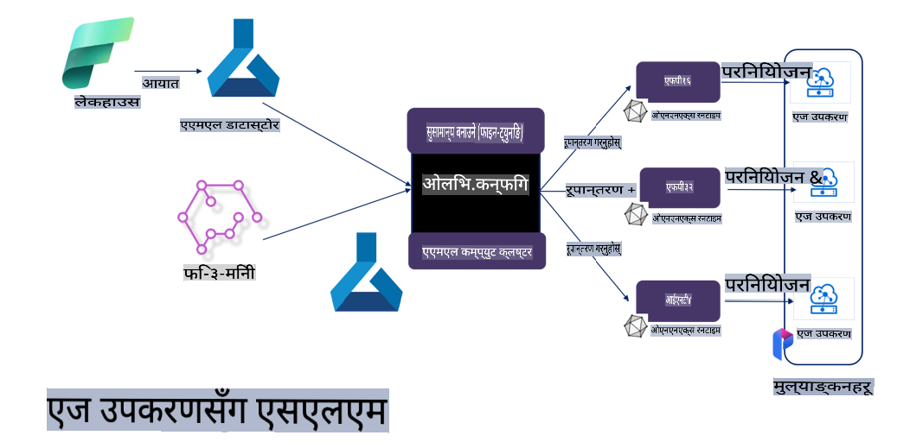

# **Microsoft Olive प्रयोग गरेर Phi-3 फाइन-ट्युनिङ**

[Olive](https://github.com/microsoft/OLive?WT.mc_id=aiml-138114-kinfeylo) हार्डवेयर-प्रभावकारी मोडेल अनुकूलनको लागि प्रयोग गर्न सजिलो उपकरण हो जसले मोडेल कम्प्रेसन, अनुकूलन, र कम्पाइलेशनमा आधारित उत्कृष्ट प्रविधिहरूलाई एकसाथ ल्याउँछ।

यो उपकरणले मेसिन लर्निङ मोडेलहरूलाई अनुकूलन गर्नको प्रक्रिया सजिलो बनाउँछ, ताकि तिनीहरूले विशेष हार्डवेयर आर्किटेक्चरको अधिकतम प्रयोग गर्न सकून्।

तपाईं क्लाउड-आधारित एप्लिकेसनहरूमा काम गर्दै हुनुहुन्छ वा एज डिभाइसहरूमा, Olive ले तपाईँका मोडेलहरूलाई सजिलै र प्रभावकारी रूपमा अनुकूलन गर्न सक्षम बनाउँछ।

## मुख्य विशेषताहरू:
- Olive ले इच्छित हार्डवेयर लक्ष्यहरूको लागि अनुकूलन प्रविधिहरूलाई एकीकृत र स्वचालित गर्दछ।
- कुनै पनि एकल अनुकूलन प्रविधि सबै परिदृश्यहरूको लागि उपयुक्त हुँदैन, त्यसैले Olive ले उद्योग विशेषज्ञहरूलाई आफ्ना नवीन अनुकूलन प्रविधिहरूलाई प्लग इन गर्न अनुमति दिन्छ।

## इन्जिनियरिङ प्रयास कम गर्नुहोस्:
- विकासकर्ताहरूले तालिम प्राप्त मोडेलहरूलाई परिनियोजनका लागि तयार पार्न र अनुकूलन गर्न प्रायः धेरै हार्डवेयर भेन्डर-विशिष्ट टूलचेनहरू सिक्न र प्रयोग गर्नुपर्ने हुन्छ।
- Olive ले इच्छित हार्डवेयरको लागि अनुकूलन प्रविधिहरू स्वचालित गरेर यो अनुभवलाई सरल बनाउँछ।

## तयार-प्रयोगको लागि E2E अनुकूलन समाधान:

समग्र प्रविधिहरूलाई समायोजन गरेर, Olive ले अन्त्य-देखि-अन्त्य अनुकूलनको लागि एकीकृत समाधान प्रदान गर्दछ। 
यो मोडेलहरूलाई अनुकूलन गर्दा शुद्धता र विलम्बजस्ता बाधाहरूलाई ध्यानमा राख्छ।

## Microsoft Olive प्रयोग गरेर फाइन-ट्युनिङ

Microsoft Olive प्रयोग गर्न धेरै सजिलो खुला स्रोत मोडेल अनुकूलन उपकरण हो जसले जेनेरेटिभ आर्टिफिसियल इन्टेलिजेन्सको क्षेत्रमा फाइन-ट्युनिङ र सन्दर्भ दुवैलाई समेट्न सक्छ। यसले केवल सरल कन्फिगरेसन आवश्यक छ, खुला स्रोतका साना भाषा मोडेलहरू र सम्बन्धित रनटाइम वातावरणहरू (AzureML / स्थानीय GPU, CPU, DirectML) को संयोजनले, तपाईं स्वचालित अनुकूलनमार्फत मोडेलको फाइन-ट्युनिङ वा सन्दर्भ पूरा गर्न सक्नुहुन्छ, र क्लाउडमा वा एज डिभाइसहरूमा परिनियोजन गर्नका लागि उत्तम मोडेल फेला पार्न सक्नुहुन्छ। यसले व्यवसायहरूलाई आफ्नै उद्योग-विशिष्ट मोडेलहरू स्थानीय र क्लाउडमा निर्माण गर्न अनुमति दिन्छ।


## Microsoft Olive प्रयोग गरेर Phi-3 फाइन-ट्युनिङ 



## Phi-3 Olive नमूना कोड र उदाहरण
यस उदाहरणमा तपाईं Olive प्रयोग गरेर:

- LoRA एडाप्टरलाई Sad, Joy, Fear, Surprise मा वाक्यांश वर्गीकृत गर्न फाइन-ट्युन गर्नुहुन्छ।
- एडाप्टर वेटहरूलाई आधारभूत मोडेलमा मर्ज गर्नुहुन्छ।
- मोडेललाई int4 मा अनुकूलन र क्वान्टाइज गर्नुहुन्छ।

[नमूना कोड](../../code/03.Finetuning/olive-ort-example/README.md)

### Microsoft Olive सेटअप गर्नुहोस्

Microsoft Olive स्थापना गर्न धेरै सरल छ, र यसलाई CPU, GPU, DirectML, र Azure ML को लागि पनि स्थापना गर्न सकिन्छ।

```bash
pip install olive-ai
```

यदि तपाईं CPU मा ONNX मोडेल चलाउन चाहनुहुन्छ भने, तपाईं यसलाई प्रयोग गर्न सक्नुहुन्छ:

```bash
pip install olive-ai[cpu]
```

यदि तपाईं GPU मा ONNX मोडेल चलाउन चाहनुहुन्छ भने, तपाईं यसलाई प्रयोग गर्न सक्नुहुन्छ:

```python
pip install olive-ai[gpu]
```

यदि तपाईं Azure ML प्रयोग गर्न चाहनुहुन्छ भने, यसलाई प्रयोग गर्नुहोस्:

```python
pip install git+https://github.com/microsoft/Olive#egg=olive-ai[azureml]
```

**ध्यान दिनुहोस्**  
OS आवश्यकताः Ubuntu 20.04 / 22.04 

### **Microsoft Olive को Config.json**

स्थापना पछि, तपाईं Config फाइल मार्फत मोडेल-विशिष्ट सेटिङहरू (डाटा, कम्प्युटिङ, तालिम, परिनियोजन, र मोडेल उत्पादन) कन्फिगर गर्न सक्नुहुन्छ।

**1. डाटा**

Microsoft Olive मा, स्थानीय डाटा र क्लाउड डाटामा तालिम दिन सकिन्छ, र यसलाई सेटिङहरूमा कन्फिगर गर्न सकिन्छ।

*स्थानीय डाटा सेटिङ*

तपाईंले फाइन-ट्युनिङका लागि तालिम दिनुपर्ने डाटासेटलाई सरल रूपमा सेट गर्न सक्नुहुन्छ, सामान्यतया json फर्म्याटमा, र यसलाई डाटा टेम्प्लेटसँग मिलाउन सक्नुहुन्छ। यो मोडेलको आवश्यकताहरूको आधारमा समायोजित गर्न आवश्यक छ (उदाहरणका लागि, यसलाई Microsoft Phi-3-mini को आवश्यक फाइन-ट्युनिङ फर्म्याटसँग अनुकूलन गर्नुहोस्। यदि तपाईंसँग अन्य मोडेलहरू छन् भने, कृपया अन्य मोडेलहरूको आवश्यक फाइन-ट्युनिङ फर्म्याटलाई सन्दर्भ गर्नुहोस्।)

```json

    "data_configs": [
        {
            "name": "dataset_default_train",
            "type": "HuggingfaceContainer",
            "load_dataset_config": {
                "params": {
                    "data_name": "json", 
                    "data_files":"dataset/dataset-classification.json",
                    "split": "train"
                }
            },
            "pre_process_data_config": {
                "params": {
                    "dataset_type": "corpus",
                    "text_cols": [
                            "phrase",
                            "tone"
                    ],
                    "text_template": "### Text: {phrase}\n### The tone is:\n{tone}",
                    "corpus_strategy": "join",
                    "source_max_len": 2048,
                    "pad_to_max_len": false,
                    "use_attention_mask": false
                }
            }
        }
    ],
```

**क्लाउड डाटा स्रोत सेटिङ**

Azure AI Studio/Azure Machine Learning Service को डाटास्टोरलाई लिंक गरेर क्लाउडमा रहेको डाटालाई लिंक गर्न सकिन्छ। Microsoft Fabric र Azure Data मार्फत विभिन्न डाटा स्रोतहरूलाई Azure AI Studio/Azure Machine Learning Service मा ल्याएर फाइन-ट्युनिङका लागि डाटाको समर्थनको रूपमा प्रयोग गर्न सकिन्छ।

```json

    "data_configs": [
        {
            "name": "dataset_default_train",
            "type": "HuggingfaceContainer",
            "load_dataset_config": {
                "params": {
                    "data_name": "json", 
                    "data_files": {
                        "type": "azureml_datastore",
                        "config": {
                            "azureml_client": {
                                "subscription_id": "Your Azure Subscrition ID",
                                "resource_group": "Your Azure Resource Group",
                                "workspace_name": "Your Azure ML Workspaces name"
                            },
                            "datastore_name": "workspaceblobstore",
                            "relative_path": "Your train_data.json Azure ML Location"
                        }
                    },
                    "split": "train"
                }
            },
            "pre_process_data_config": {
                "params": {
                    "dataset_type": "corpus",
                    "text_cols": [
                            "Question",
                            "Best Answer"
                    ],
                    "text_template": "<|user|>\n{Question}<|end|>\n<|assistant|>\n{Best Answer}\n<|end|>",
                    "corpus_strategy": "join",
                    "source_max_len": 2048,
                    "pad_to_max_len": false,
                    "use_attention_mask": false
                }
            }
        }
    ],
    
```

**2. कम्प्युटिङ कन्फिगरेसन**

यदि तपाईंलाई स्थानीय चाहिन्छ भने, तपाईंले सिधै स्थानीय डाटा स्रोतहरू प्रयोग गर्न सक्नुहुन्छ। यदि तपाईंलाई Azure AI Studio / Azure Machine Learning Service को स्रोतहरू प्रयोग गर्नुपर्छ भने, सम्बन्धित Azure प्यारामिटरहरू, कम्प्युटिङ पावरको नाम आदि कन्फिगर गर्नुपर्छ।

```json

    "systems": {
        "aml": {
            "type": "AzureML",
            "config": {
                "accelerators": ["gpu"],
                "hf_token": true,
                "aml_compute": "Your Azure AI Studio / Azure Machine Learning Service Compute Name",
                "aml_docker_config": {
                    "base_image": "Your Azure AI Studio / Azure Machine Learning Service docker",
                    "conda_file_path": "conda.yaml"
                }
            }
        },
        "azure_arc": {
            "type": "AzureML",
            "config": {
                "accelerators": ["gpu"],
                "aml_compute": "Your Azure AI Studio / Azure Machine Learning Service Compute Name",
                "aml_docker_config": {
                    "base_image": "Your Azure AI Studio / Azure Machine Learning Service docker",
                    "conda_file_path": "conda.yaml"
                }
            }
        }
    },
```

***ध्यान दिनुहोस्***  
Azure AI Studio/Azure Machine Learning Service मा कन्टेनर मार्फत चलाइने भएकाले आवश्यक वातावरण कन्फिगर गर्नुपर्छ। यो conda.yaml वातावरणमा कन्फिगर गरिएको छ।

```yaml

name: project_environment
channels:
  - defaults
dependencies:
  - python=3.8.13
  - pip=22.3.1
  - pip:
      - einops
      - accelerate
      - azure-keyvault-secrets
      - azure-identity
      - bitsandbytes
      - datasets
      - huggingface_hub
      - peft
      - scipy
      - sentencepiece
      - torch>=2.2.0
      - transformers
      - git+https://github.com/microsoft/Olive@jiapli/mlflow_loading_fix#egg=olive-ai[gpu]
      - --extra-index-url https://aiinfra.pkgs.visualstudio.com/PublicPackages/_packaging/ORT-Nightly/pypi/simple/ 
      - ort-nightly-gpu==1.18.0.dev20240307004
      - --extra-index-url https://aiinfra.pkgs.visualstudio.com/PublicPackages/_packaging/onnxruntime-genai/pypi/simple/
      - onnxruntime-genai-cuda

    

```

**3. तपाईंको SLM छान्नुहोस्**

तपाईं Hugging face बाट मोडेल सिधै प्रयोग गर्न सक्नुहुन्छ, वा Azure AI Studio / Azure Machine Learning को Model Catalog सँग सिधै संयोजन गरेर प्रयोग गर्न सक्नुहुन्छ। तलको कोड उदाहरणमा हामी Microsoft Phi-3-mini को उदाहरण लिन्छौं।

यदि तपाईंसँग मोडेल स्थानीय रूपमा छ भने, तपाईं यो विधि प्रयोग गर्न सक्नुहुन्छ:

```json

    "input_model":{
        "type": "PyTorchModel",
        "config": {
            "hf_config": {
                "model_name": "model-cache/microsoft/phi-3-mini",
                "task": "text-generation",
                "model_loading_args": {
                    "trust_remote_code": true
                }
            }
        }
    },
```

यदि तपाईं Azure AI Studio / Azure Machine Learning Service बाट मोडेल प्रयोग गर्न चाहनुहुन्छ भने, तपाईं यो विधि प्रयोग गर्न सक्नुहुन्छ:

```json

    "input_model":{
        "type": "PyTorchModel",
        "config": {
            "model_path": {
                "type": "azureml_registry_model",
                "config": {
                    "name": "microsoft/Phi-3-mini-4k-instruct",
                    "registry_name": "azureml-msr",
                    "version": "11"
                }
            },
             "model_file_format": "PyTorch.MLflow",
             "hf_config": {
                "model_name": "microsoft/Phi-3-mini-4k-instruct",
                "task": "text-generation",
                "from_pretrained_args": {
                    "trust_remote_code": true
                }
            }
        }
    },
```

**ध्यान दिनुहोस्:**  
हामीलाई Azure AI Studio / Azure Machine Learning Service सँग एकीकृत गर्न आवश्यक छ, त्यसैले मोडेल सेट गर्दा, कृपया संस्करण नम्बर र सम्बन्धित नामकरणलाई सन्दर्भ गर्नुहोस्।

Azure मा रहेका सबै मोडेलहरूलाई PyTorch.MLflow मा सेट गर्न आवश्यक छ।

तपाईंले Hugging face खाता हुनु पर्छ र यसलाई Azure AI Studio / Azure Machine Learning को Key मानसँग बाँध्नुपर्छ।

**4. एल्गोरिदम**

Microsoft Olive ले Lora र QLora फाइन-ट्युनिङ एल्गोरिदमलाई धेरै राम्रोसँग समेटेको छ। तपाईंले केवल केही सम्बन्धित प्यारामिटरहरू कन्फिगर गर्नुपर्छ। यहाँ मैले QLora लाई उदाहरणका रूपमा लिएको छु।

```json
        "lora": {
            "type": "LoRA",
            "config": {
                "target_modules": [
                    "o_proj",
                    "qkv_proj"
                ],
                "double_quant": true,
                "lora_r": 64,
                "lora_alpha": 64,
                "lora_dropout": 0.1,
                "train_data_config": "dataset_default_train",
                "eval_dataset_size": 0.3,
                "training_args": {
                    "seed": 0,
                    "data_seed": 42,
                    "per_device_train_batch_size": 1,
                    "per_device_eval_batch_size": 1,
                    "gradient_accumulation_steps": 4,
                    "gradient_checkpointing": false,
                    "learning_rate": 0.0001,
                    "num_train_epochs": 3,
                    "max_steps": 10,
                    "logging_steps": 10,
                    "evaluation_strategy": "steps",
                    "eval_steps": 187,
                    "group_by_length": true,
                    "adam_beta2": 0.999,
                    "max_grad_norm": 0.3
                }
            }
        },
```

यदि तपाईं क्वान्टाइजेशन रूपान्तरण चाहनुहुन्छ भने, Microsoft Olive मुख्य शाखाले पहिले नै onnxruntime-genai विधिलाई समर्थन गरेको छ। तपाईंले यसलाई आफ्नो आवश्यकताअनुसार सेट गर्न सक्नुहुन्छ:

1. एडाप्टर वेटहरूलाई आधारभूत मोडेलमा मर्ज गर्नुहोस्।
2. ModelBuilder द्वारा आवश्यक परिशुद्धतासँग मोडेललाई onnx मोडेलमा रूपान्तरण गर्नुहोस्।

जस्तै INT4 मा क्वान्टाइज गरिएको रूपान्तरण:

```json

        "merge_adapter_weights": {
            "type": "MergeAdapterWeights"
        },
        "builder": {
            "type": "ModelBuilder",
            "config": {
                "precision": "int4"
            }
        }
```

**ध्यान दिनुहोस्**  
- यदि तपाईं QLoRA प्रयोग गर्नुहुन्छ भने, हाललाई ONNXRuntime-genai को क्वान्टाइजेशन रूपान्तरण समर्थन गरिएको छैन।  

- यहाँ उल्लेख गर्नुपर्छ कि तपाईंले माथिका चरणहरूलाई आफ्नै आवश्यकताअनुसार सेट गर्न सक्नुहुन्छ। माथिका सबै चरणहरू पूर्ण रूपमा कन्फिगर गर्न आवश्यक छैन। तपाईंको आवश्यकताअनुसार, तपाईंले एल्गोरिदमका चरणहरू सिधै प्रयोग गर्न सक्नुहुन्छ। अन्तमा, तपाईंले सम्बन्धित इन्जिनहरू कन्फिगर गर्नुपर्छ।

```json

    "engine": {
        "log_severity_level": 0,
        "host": "aml",
        "target": "aml",
        "search_strategy": false,
        "execution_providers": ["CUDAExecutionProvider"],
        "cache_dir": "../model-cache/models/phi3-finetuned/cache",
        "output_dir" : "../model-cache/models/phi3-finetuned"
    }
```

**5. फाइन-ट्युनिङ समाप्त भयो**

कमाण्ड लाइनमा, olive-config.json को डाइरेक्टरीमा कार्यान्वयन गर्नुहोस्।

```bash
olive run --config olive-config.json  
```

**अस्वीकरण**:  
यो दस्तावेज मेसिन-आधारित एआई अनुवाद सेवाहरू प्रयोग गरी अनुवाद गरिएको हो। हामी यथार्थताको लागि प्रयास गर्छौं, तर कृपया जानकार रहनुहोस् कि स्वचालित अनुवादहरूमा त्रुटिहरू वा अशुद्धताहरू हुन सक्छ। यसको मूल भाषामा रहेको मूल दस्तावेजलाई प्रामाणिक स्रोतको रूपमा मानिनुपर्छ। महत्त्वपूर्ण जानकारीको लागि, पेशेवर मानव अनुवाद सिफारिस गरिन्छ। यो अनुवाद प्रयोग गर्दा उत्पन्न हुने कुनै पनि गलतफहमी वा गलत व्याख्याको लागि हामी उत्तरदायी हुनेछैनौं।