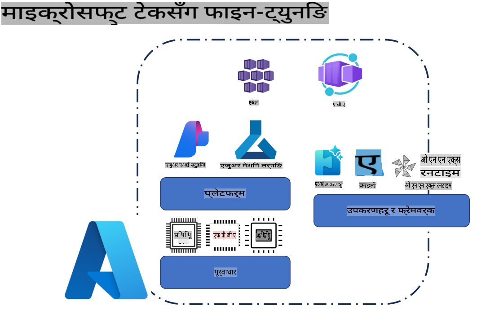
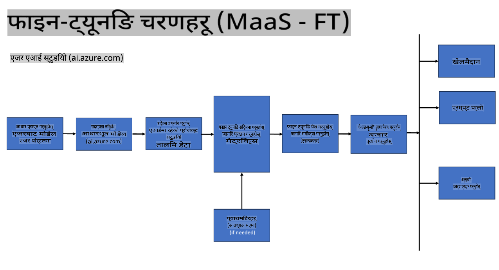
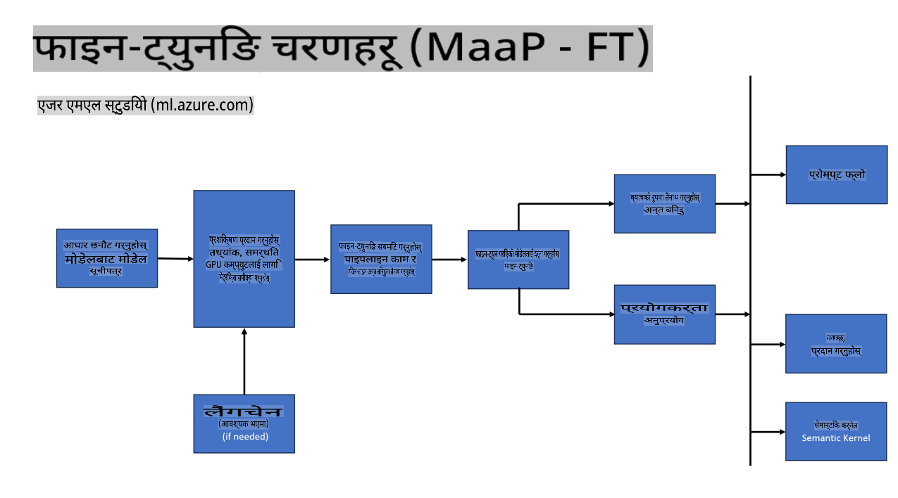
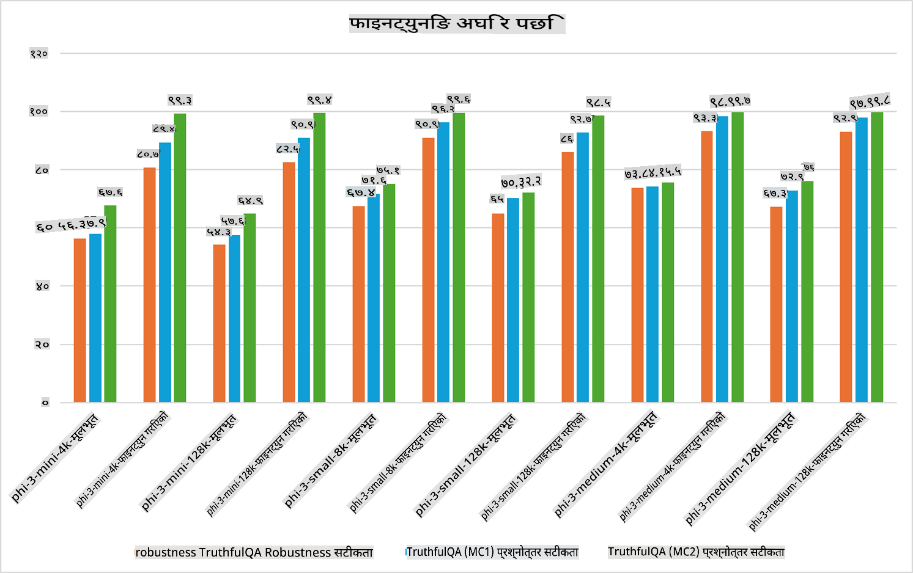

## फाइन ट्युनिङ परिदृश्यहरू

**प्ल्याटफर्म** यसमा Azure AI Foundry, Azure Machine Learning, AI Tools, Kaito, र ONNX Runtime जस्ता विभिन्न प्रविधिहरू समावेश छन्। 

**पूर्वाधार** यसमा CPU र FPGA समावेश छन्, जसले फाइन-ट्युनिङ प्रक्रियामा महत्त्वपूर्ण भूमिका खेल्छ। म यी प्रविधिहरूको प्रतीकहरू पनि देखाउँछु।

**टूल्स र फ्रेमवर्क** यसमा ONNX Runtime समावेश छ। म यी प्रविधिहरूको प्रतीकहरू पनि देखाउँछु।  
[Insert icons for ONNX Runtime and ONNX Runtime]

Microsoft प्रविधिहरूसँग फाइन-ट्युनिङ प्रक्रियामा विभिन्न कम्पोनेन्टहरू र टूल्सहरू समावेश छन्। यी प्रविधिहरूलाई बुझेर र उपयोग गरेर हामी आफ्ना एप्लिकेसनहरूलाई प्रभावकारी रूपमा फाइन-ट्युन गर्न र अझ राम्रो समाधानहरू बनाउन सक्छौं। 

## मोडेल एज़ ए सर्भिस

होस्ट गरिएको फाइन-ट्युनिङ प्रयोग गरेर मोडेल फाइन-ट्युन गर्नुहोस्, कम्प्युट व्यवस्थित गर्न आवश्यक पर्दैन।

Phi-3-mini र Phi-3-medium मोडेलहरूको लागि सर्भरलेस फाइन-ट्युनिङ उपलब्ध छ, जसले डेभलपरहरूलाई क्लाउड र एज परिदृश्यहरूको लागि छिटो र सजिलै मोडेलहरू अनुकूलन गर्न सक्षम बनाउँछ। हामीले घोषणा गरेका छौं कि Phi-3-small अब Models-as-a-Service मार्फत उपलब्ध छ, जसले डेभलपरहरूलाई आधारभूत पूर्वाधार व्यवस्थापन नगरी AI विकास सुरु गर्न सजिलो बनाउँछ। 

## मोडेल एज़ ए प्लेटफर्म 

आफ्नै कम्प्युट व्यवस्थापन गरेर प्रयोगकर्ताहरूले आफ्ना मोडेलहरू फाइन-ट्युन गर्छन्।

[Fine Tuning Sample](https://github.com/Azure/azureml-examples/blob/main/sdk/python/foundation-models/system/finetune/chat-completion/chat-completion.ipynb)

## फाइन ट्युनिङ परिदृश्यहरू 

| | | | | | | |
|-|-|-|-|-|-|-|
|परिदृश्य|LoRA|QLoRA|PEFT|DeepSpeed|ZeRO|DORA|
|पूर्व-प्रशिक्षित LLMs लाई विशेष कार्य वा डोमेनहरूमा अनुकूलन गर्नु|हो|हो|हो|हो|हो|हो|
|पाठ वर्गीकरण, नामित इकाई मान्यता, र मेशिन अनुवाद जस्ता NLP कार्यहरूको लागि फाइन-ट्युनिङ|हो|हो|हो|हो|हो|हो|
|QA कार्यहरूको लागि फाइन-ट्युनिङ|हो|हो|हो|हो|हो|हो|
|च्याटबटहरूमा मानव-जस्तो प्रतिक्रिया उत्पन्न गर्न फाइन-ट्युनिङ|हो|हो|हो|हो|हो|हो|
|संगीत, कला, वा अन्य सिर्जनात्मक रूपहरू उत्पन्न गर्न फाइन-ट्युनिङ|हो|हो|हो|हो|हो|हो|
|गणनात्मक र आर्थिक लागत घटाउने|हो|हो|होइन|हो|हो|होइन|
|मेमोरी उपयोग घटाउने|होइन|हो|होइन|हो|हो|हो|
|कुशल फाइन-ट्युनिङका लागि थोरै प्यारामिटर प्रयोग गर्ने|होइन|हो|हो|होइन|होइन|हो|
|GPU उपकरणहरूको समग्र GPU मेमोरीमा पहुँच दिने मेमोरी-कुशल डेटा समानान्तरता|होइन|होइन|होइन|हो|हो|हो|

## फाइन ट्युनिङ प्रदर्शनका उदाहरणहरू

**अस्वीकरण**:  
यो दस्तावेज मेशिन-आधारित एआई अनुवाद सेवाहरू प्रयोग गरेर अनुवाद गरिएको हो। यद्यपि हामी शुद्धताका लागि प्रयास गर्दछौं, कृपया ध्यान दिनुहोस् कि स्वचालित अनुवादमा त्रुटिहरू वा असत्यताहरू हुन सक्छन्। यसको मूल भाषामा रहेको मूल दस्तावेजलाई प्राधिकृत स्रोत मानिनुपर्छ। महत्वपूर्ण जानकारीका लागि, व्यावसायिक मानव अनुवाद सिफारिस गरिन्छ। यस अनुवादको प्रयोगबाट उत्पन्न हुने कुनै पनि गलतफहमी वा गलत व्याख्याका लागि हामी जिम्मेवार हुनेछैनौं।