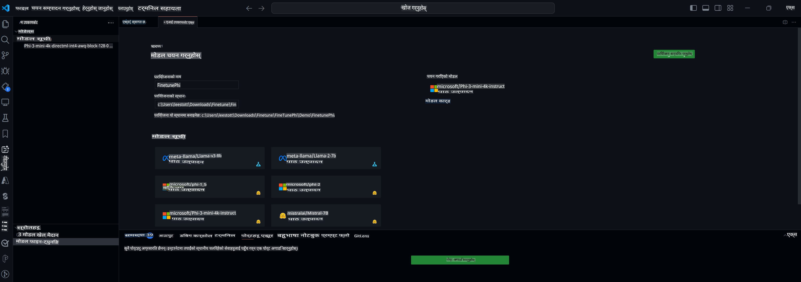

## VS Code का लागि AI Toolkit मा स्वागत छ

[AI Toolkit for VS Code](https://github.com/microsoft/vscode-ai-toolkit/tree/main) ले Azure AI Studio Catalog र Hugging Face जस्ता अन्य क्याटलगहरूबाट विभिन्न मोडेलहरूलाई एकसाथ ल्याउँछ। यो टूलकिटले जनरेटिव AI उपकरणहरू र मोडेलहरूको प्रयोग गरी AI एपहरू विकास गर्नका लागि सामान्य कार्यहरूलाई सहज बनाउँछ:
- मोडेल पत्ता लगाउने र प्लेग्राउन्डबाट सुरु गर्नुहोस्।
- स्थानीय कम्प्युटिङ स्रोतहरूको प्रयोग गरेर मोडेल फाइन-ट्युनिङ र इनफरेन्स गर्नुहोस्।
- Azure स्रोतहरूको प्रयोग गरेर रिमोट फाइन-ट्युनिङ र इनफरेन्स गर्नुहोस्।

[AI Toolkit for VSCode स्थापना गर्नुहोस्](https://marketplace.visualstudio.com/items?itemName=ms-windows-ai-studio.windows-ai-studio)



**[Private Preview]** Azure Container Apps को लागि एक-क्लिक प्रोभिजनिङ, जसले क्लाउडमा मोडेल फाइन-ट्युनिङ र इनफरेन्स चलाउन सक्षम बनाउँछ।

अब तपाईंको AI एप विकासमा अघि बढौं:

- [VS Code का लागि AI Toolkit मा स्वागत छ](../../../../md/03.FineTuning)
- [स्थानीय विकास](../../../../md/03.FineTuning)
  - [तयारीहरू](../../../../md/03.FineTuning)
  - [Conda सक्रिय गर्नुहोस्](../../../../md/03.FineTuning)
  - [केवल आधारभूत मोडेल फाइन-ट्युनिङ](../../../../md/03.FineTuning)
  - [मोडेल फाइन-ट्युनिङ र इनफरेन्सिंग](../../../../md/03.FineTuning)
  - [मोडेल फाइन-ट्युनिङ](../../../../md/03.FineTuning)
  - [Microsoft Olive](../../../../md/03.FineTuning)
  - [फाइन-ट्युनिङका नमूनाहरू र स्रोतहरू](../../../../md/03.FineTuning)
- [**\[Private Preview\]** रिमोट विकास](../../../../md/03.FineTuning)
  - [पूर्वशर्तहरू](../../../../md/03.FineTuning)
  - [रिमोट विकास परियोजना सेटअप गर्नुहोस्](../../../../md/03.FineTuning)
  - [Azure स्रोतहरू प्रोभिजन गर्नुहोस्](../../../../md/03.FineTuning)
  - [\[वैकल्पिक\] Huggingface टोकन Azure Container App Secret मा थप्नुहोस्](../../../../md/03.FineTuning)
  - [फाइन-ट्युनिङ चलाउनुहोस्](../../../../md/03.FineTuning)
  - [इनफरेन्स एन्डप्वाइन्ट प्रोभिजन गर्नुहोस्](../../../../md/03.FineTuning)
  - [इनफरेन्स एन्डप्वाइन्ट डिप्लोय गर्नुहोस्](../../../../md/03.FineTuning)
  - [उन्नत प्रयोग](../../../../md/03.FineTuning)

## स्थानीय विकास
### तयारीहरू

1. होस्टमा NVIDIA ड्राइभर स्थापना भएको सुनिश्चित गर्नुहोस्।
2. यदि तपाईं डेटासेट उपयोगका लागि HF प्रयोग गर्दै हुनुहुन्छ भने `huggingface-cli login` चलाउनुहोस्।
3. मेमोरी उपयोग परिमार्जन गर्ने कुनै पनि सेटिङको लागि `Olive` कुञ्जी सेटिङ व्याख्या गर्नुहोस्।

### Conda सक्रिय गर्नुहोस्
हामी WSL वातावरण प्रयोग गरिरहेका छौं र यो साझा छ, त्यसैले तपाईंले म्यानुअल रूपमा Conda वातावरण सक्रिय गर्नुपर्नेछ। यस चरणपछि, तपाईं फाइन-ट्युनिङ वा इनफरेन्स चलाउन सक्नुहुन्छ।

```bash
conda activate [conda-env-name] 
```

### केवल आधारभूत मोडेल फाइन-ट्युनिङ
यदि तपाईं केवल आधारभूत मोडेल बिना फाइन-ट्युनिङ प्रयास गर्न चाहनुहुन्छ भने, Conda सक्रिय गरेपछि यो कमाण्ड चलाउन सक्नुहुन्छ।

```bash
cd inference

# Web browser interface allows to adjust a few parameters like max new token length, temperature and so on.
# User has to manually open the link (e.g. http://0.0.0.0:7860) in a browser after gradio initiates the connections.
python gradio_chat.py --baseonly
```

### मोडेल फाइन-ट्युनिङ र इनफरेन्सिंग

जब कार्यक्षेत्र एक डेभ कन्टेनरमा खोलिन्छ, टर्मिनल खोल्नुहोस् (पूर्वनिर्धारित पथ परियोजना जड हो), र चयन गरिएको डेटासेटमा LLM फाइन-ट्युन गर्न तलको कमाण्ड चलाउनुहोस्।

```bash
python finetuning/invoke_olive.py 
```

चेकप्वाइन्टहरू र अन्तिम मोडेल `models` folder.

Next run inferencing with the fune-tuned model through chats in a `console`, `web browser` or `prompt flow` मा सुरक्षित हुनेछ।

```bash
cd inference

# Console interface.
python console_chat.py

# Web browser interface allows to adjust a few parameters like max new token length, temperature and so on.
# User has to manually open the link (e.g. http://127.0.0.1:7860) in a browser after gradio initiates the connections.
python gradio_chat.py
```

`prompt flow` in VS Code, please refer to this [Quick Start](https://microsoft.github.io/promptflow/how-to-guides/quick-start.html).

### Model Fine-tuning

Next, download the following model depending on the availability of a GPU on your device.

To initiate the local fine-tuning session using QLoRA, select a model you want to fine-tune from our catalog.
| Platform(s) | GPU available | Model name | Size (GB) |
|---------|---------|--------|--------|
| Windows | Yes | Phi-3-mini-4k-**directml**-int4-awq-block-128-onnx | 2.13GB |
| Linux | Yes | Phi-3-mini-4k-**cuda**-int4-onnx | 2.30GB |
| Windows<br>Linux | No | Phi-3-mini-4k-**cpu**-int4-rtn-block-32-acc-level-4-onnx | 2.72GB |

**_Note_** You do not need an Azure Account to download the models

The Phi3-mini (int4) model is approximately 2GB-3GB in size. Depending on your network speed, it could take a few minutes to download.

Start by selecting a project name and location.
Next, select a model from the model catalog. You will be prompted to download the project template. You can then click "Configure Project" to adjust various settings.

### Microsoft Olive 

We use [Olive](https://microsoft.github.io/Olive/why-olive.html) to run QLoRA fine-tuning on a PyTorch model from our catalog. All of the settings are preset with the default values to optimize to run the fine-tuning process locally with optimized use of memory, but it can be adjusted for your scenario.

### Fine Tuning Samples and Resoures

- [Fine tuning Getting Started Guide](https://learn.microsoft.com/windows/ai/toolkit/toolkit-fine-tune)
- [Fine tuning with a HuggingFace Dataset](https://github.com/microsoft/vscode-ai-toolkit/blob/main/archive/walkthrough-hf-dataset.md)
- [Fine tuning with Simple DataSet](https://github.com/microsoft/vscode-ai-toolkit/blob/main/archive/walkthrough-simple-dataset.md)

## **[Private Preview]** Remote Development

### Prerequisites

1. To run the model fine-tuning in your remote Azure Container App Environment, make sure your subscription has enough GPU capacity. Submit a [support ticket](https://azure.microsoft.com/support/create-ticket/) to request the required capacity for your application. [Get More Info about GPU capacity](https://learn.microsoft.com/azure/container-apps/workload-profiles-overview)
2. If you are using private dataset on HuggingFace, make sure you have a [HuggingFace account](https://huggingface.co/?WT.mc_id=aiml-137032-kinfeylo) and [generate an access token](https://huggingface.co/docs/hub/security-tokens?WT.mc_id=aiml-137032-kinfeylo)
3. Enable Remote Fine-tuning and Inference feature flag in the AI Toolkit for VS Code
   1. Open the VS Code Settings by selecting *File -> Preferences -> Settings*.
   2. Navigate to *Extensions* and select *AI Toolkit*.
   3. Select the *"Enable Remote Fine-tuning And Inference"* option.
   4. Reload VS Code to take effect.

- [Remote Fine tuning](https://github.com/microsoft/vscode-ai-toolkit/blob/main/archive/remote-finetuning.md)

### Setting Up a Remote Development Project
1. Execute the command palette `AI Toolkit: Focus on Resource View`.
2. Navigate to *Model Fine-tuning* to access the model catalog. Assign a name to your project and select its location on your machine. Then, hit the *"Configure Project"* button.
3. Project Configuration
    1. Avoid enabling the *"Fine-tune locally"* option.
    2. The Olive configuration settings will appear with pre-set default values. Please adjust and fill in these configurations as required.
    3. Move on to *Generate Project*. This stage leverages WSL and involves setting up a new Conda environment, preparing for future updates that include Dev Containers.
4. Click on *"Relaunch Window In Workspace"* to open your remote development project.

> **Note:** The project currently works either locally or remotely within the AI Toolkit for VS Code. If you choose *"Fine-tune locally"* during project creation, it will operate exclusively in WSL without remote development capabilities. On the other hand, if you forego enabling *"Fine-tune locally"*, the project will be restricted to the remote Azure Container App environment.

### Provision Azure Resources
To get started, you need to provision the Azure Resource for remote fine-tuning. Do this by running the `AI Toolkit: Provision Azure Container Apps job for fine-tuning` from the command palette.

Monitor the progress of the provision through the link displayed in the output channel.

### [Optional] Add Huggingface Token to the Azure Container App Secret
If you're using private HuggingFace dataset, set your HuggingFace token as an environment variable to avoid the need for manual login on the Hugging Face Hub.
You can do this using the `AI Toolkit: Add Azure Container Apps Job secret for fine-tuning command`. With this command, you can set the secret name as [`HF_TOKEN`](https://huggingface.co/docs/huggingface_hub/package_reference/environment_variables#hftoken) and use your Hugging Face token as the secret value.

### Run Fine-tuning
To start the remote fine-tuning job, execute the `AI Toolkit: Run fine-tuning` command.

To view the system and console logs, you can visit the Azure portal using the link in the output panel (more steps at [View and Query Logs on Azure](https://aka.ms/ai-toolkit/remote-provision#view-and-query-logs-on-azure)). Or, you can view the console logs directly in the VSCode output panel by running the command `AI Toolkit: Show the running fine-tuning job streaming logs`. 
> **Note:** The job might be queued due to insufficient resources. If the log is not displayed, execute the `AI Toolkit: Show the running fine-tuning job streaming logs` command, wait for a while and then execute the command again to re-connect to the streaming log.

During this process, QLoRA will be used for fine-tuning, and will create LoRA adapters for the model to use during inference.
The results of the fine-tuning will be stored in the Azure Files.

### Provision Inference Endpoint
After the adapters are trained in the remote environment, use a simple Gradio application to interact with the model.
Similar to the fine-tuning process, you need to set up the Azure Resources for remote inference by executing the `AI Toolkit: Provision Azure Container Apps for inference` from the command palette.

By default, the subscription and the resource group for inference should match those used for fine-tuning. The inference will use the same Azure Container App Environment and access the model and model adapter stored in Azure Files, which were generated during the fine-tuning step. 


### Deploy the Inference Endpoint
If you wish to revise the inference code or reload the inference model, please execute the `AI Toolkit: Deploy for inference` command. This will synchronize your latest code with Azure Container App and restart the replica.  

Once deployment is successfully completed, you can access the inference API by clicking on the "*Go to Inference Endpoint*" button displayed in the VSCode notification. Or, the web API endpoint can be found under `ACA_APP_ENDPOINT` in `./infra/inference.config.json` प्रयोग गर्न र आउटपुट प्यानलमा हेर्न तयार हुनुहोस्। तपाईं अब यो एन्डप्वाइन्ट प्रयोग गरेर मोडेल मूल्यांकन गर्न तयार हुनुहुन्छ।

### उन्नत प्रयोग
AI Toolkit प्रयोग गरेर रिमोट विकासका लागि थप जानकारीको लागि, [मोडेलहरू रिमोट रूपमा फाइन-ट्युनिङ गर्नुहोस्](https://aka.ms/ai-toolkit/remote-provision) र [फाइन-ट्युन गरिएको मोडेलसँग इनफरेन्स गर्नुहोस्](https://aka.ms/ai-toolkit/remote-inference) डक्युमेन्टेसन हेर्नुहोस्।

**अस्वीकरण**:  
यो दस्तावेज मेसिन-आधारित एआई अनुवाद सेवाहरू प्रयोग गरी अनुवाद गरिएको छ। यद्यपि हामी शुद्धताका लागि प्रयास गर्दछौं, कृपया जानकार रहनुहोस् कि स्वचालित अनुवादहरूमा त्रुटिहरू वा अशुद्धताहरू हुन सक्छ। यसको मौलिक भाषा भएको मूल दस्तावेजलाई प्रामाणिक स्रोत मानिनुपर्छ। महत्वपूर्ण जानकारीका लागि, पेशेवर मानव अनुवाद सिफारिस गरिन्छ। यो अनुवाद प्रयोगबाट उत्पन्न हुने कुनै पनि गलतफहमी वा गलत व्याख्याका लागि हामी उत्तरदायी हुनेछैनौं।