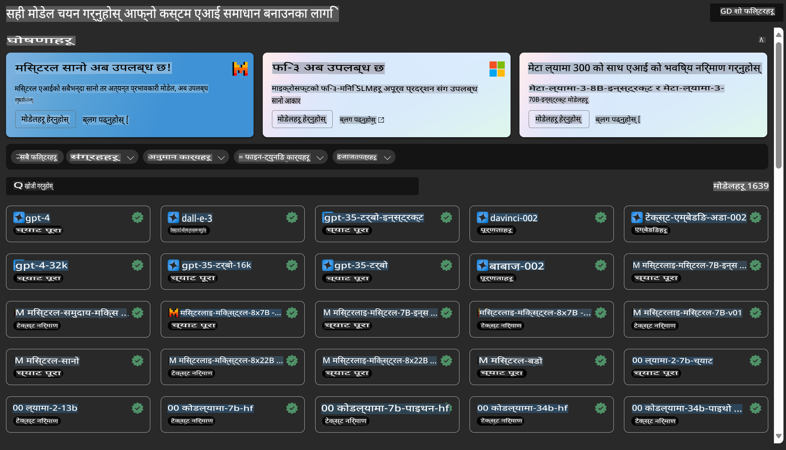

# **Azure Machine Learning सेवा परिचय**

[Azure Machine Learning](https://ml.azure.com?WT.mc_id=aiml-138114-kinfeylo) एउटा क्लाउड सेवा हो जसले मेसिन लर्निङ (ML) परियोजनाको जीवनचक्रलाई तीव्र बनाउन र व्यवस्थापन गर्न मद्दत गर्दछ।

ML विशेषज्ञ, डेटा वैज्ञानिक, र इन्जिनियरहरूले आफ्नो दैनिक कार्यप्रवाहमा यसलाई प्रयोग गर्न सक्छन्:

- मोडेलहरू तालिम दिन र परिनियोजन गर्न।
- मेसिन लर्निङ अपरेसन (MLOps) व्यवस्थापन गर्न।
- तपाईं Azure Machine Learning मा मोडेल बनाउन सक्नुहुन्छ वा PyTorch, TensorFlow, वा scikit-learn जस्ता ओपन-सोर्स प्लेटफर्मबाट बनेको मोडेल प्रयोग गर्न सक्नुहुन्छ।
- MLOps उपकरणहरूले तपाईंलाई मोडेलहरू अनुगमन गर्न, पुनः तालिम दिन, र पुनः परिनियोजन गर्न सहयोग गर्दछ।

## Azure Machine Learning कसको लागि हो?

**डेटा वैज्ञानिक र ML इन्जिनियरहरू**

उनीहरूले आफ्नो दैनिक कार्यप्रवाहलाई तीव्र बनाउन र स्वचालित गर्न उपकरणहरू प्रयोग गर्न सक्छन्।  
Azure ML ले निष्पक्षता, व्याख्यात्मकता, ट्र्याकिङ, र अडिट क्षमताका लागि विशेषताहरू प्रदान गर्दछ।  
**एप्लिकेसन डेभलपरहरू**:  
उनीहरूले मोडेलहरू एप्लिकेसन वा सेवामा सहज रूपमा एकीकृत गर्न सक्छन्।

**प्लेटफर्म डेभलपरहरू**

उनीहरूले Azure Resource Manager API हरूबाट समर्थित बलियो उपकरणहरूको पहुँच पाउँछन्।  
यी उपकरणहरूले उन्नत ML उपकरणहरू निर्माण गर्न अनुमति दिन्छ।  

**उद्यमहरू**

Microsoft Azure क्लाउडमा काम गर्दा, उद्यमहरूले परिचित सुरक्षा र भूमिकामा आधारित पहुँच नियन्त्रणको फाइदा उठाउँछन्।  
संरक्षित डेटा र विशिष्ट अपरेसनहरूको पहुँच नियन्त्रण गर्न परियोजनाहरू सेटअप गर्नुहोस्।  

## सबै टोलीका सदस्यहरूको लागि उत्पादकता

ML परियोजनाहरू प्रायः फरक सीप सेट भएका टोलीले निर्माण र मर्मत गर्न आवश्यक पर्छ।  

Azure ML ले तपाईंलाई निम्न कार्य गर्न सक्षम बनाउने उपकरणहरू प्रदान गर्दछ:  
- साझा नोटबुक, कम्प्युट स्रोतहरू, सर्भरलेस कम्प्युट, डेटा, र वातावरण मार्फत आफ्नो टोलीसँग सहकार्य गर्नुहोस्।  
- मोडेलहरू विकास गर्नुहोस् जसले निष्पक्षता, व्याख्यात्मकता, ट्र्याकिङ, र अडिट क्षमताहरूलाई समर्थन गर्छ, रेखाचित्र र अडिट अनुपालन आवश्यकताहरू पूरा गर्न।  
- ML मोडेलहरू छिटो र सजिलैसँग ठूलो मात्रामा परिनियोजन गर्नुहोस्, र तिनीहरूलाई MLOps को साथ कुशलतापूर्वक व्यवस्थापन र शासन गर्नुहोस्।  
- निर्माण-मा रहेको शासन, सुरक्षा, र अनुपालनको साथ जहाँसुकै मेसिन लर्निङ वर्कलोडहरू चलाउनुहोस्।  

## क्रस-कम्प्याटिबल प्लेटफर्म उपकरणहरू

ML टोलीमा रहेका जोसुकै व्यक्तिले आफ्नो रुचि अनुसारका उपकरणहरू प्रयोग गरेर काम गर्न सक्छन्।  
चाहे तपाईं छिटो प्रयोगहरू चलाउँदै हुनुहुन्छ, हाइपरप्यारामिटर ट्युनिङ गर्दै हुनुहुन्छ, पाइपलाइनहरू निर्माण गर्दै हुनुहुन्छ, वा अनुमानहरू व्यवस्थापन गर्दै हुनुहुन्छ, तपाईंले निम्न परिचित इन्टरफेसहरू प्रयोग गर्न सक्नुहुन्छ:  
- Azure Machine Learning Studio  
- Python SDK (v2)  
- Azure CLI (v2)  
- Azure Resource Manager REST APIs  

मोडेलहरू परिष्कृत गर्दै र विकास चक्रभर सहकार्य गर्दा, तपाईंले Azure Machine Learning स्टुडियो UI भित्र सम्पत्ति, स्रोतहरू, र मेट्रिक्स साझा गर्न र फेला पार्न सक्नुहुन्छ।  

## **Azure ML मा LLM/SLM**

Azure ML ले धेरै LLM/SLM सम्बन्धित कार्यक्षमताहरू थपेको छ, LLMOps र SLMOps लाई संयोजन गर्दै उद्यम-व्यापी जेनेरेटिभ आर्टिफिसियल इन्टेलिजेन्स टेक्नोलोजी प्लेटफर्म सिर्जना गरेको छ।  

### **मोडेल क्याटलग**

उद्यम प्रयोगकर्ताहरूले विभिन्न व्यवसाय परिदृश्यहरू अनुसार विभिन्न मोडेलहरू परिनियोजन गर्न सक्दछन्, र मोडेललाई सेवा (Model as Service) को रूपमा उपलब्ध गराएर उद्यम विकासकर्ता वा प्रयोगकर्ताहरूले पहुँच गर्न सक्छन्।  

Azure Machine Learning स्टुडियोमा रहेको मोडेल क्याटलग जेनेरेटिभ AI एप्लिकेसन निर्माण गर्न सक्षम बनाउने विभिन्न मोडेलहरू पत्ता लगाउन र प्रयोग गर्न केन्द्र हो। मोडेल क्याटलगमा Azure OpenAI सेवा, Mistral, Meta, Cohere, Nvidia, Hugging Face जस्ता मोडेल प्रदायकहरूबाट सयौं मोडेलहरू छन्, जसमा Microsoft द्वारा तालिम दिइएका मोडेलहरू पनि समावेश छन्। Microsoft बाहेकका प्रदायकहरूबाट आएका मोडेलहरू Microsoft को उत्पादन सर्तहरूमा परिभाषित गरिएका Non-Microsoft Products हुन्, र ती मोडेलसँग प्रदान गरिएका सर्तहरूमा आधारित छन्।  

### **जब पाइपलाइन**

मेसिन लर्निङ पाइपलाइनको मुख्य भाग भनेको सम्पूर्ण मेसिन लर्निङ कार्यलाई बहु-चरण कार्यप्रवाहमा विभाजन गर्नु हो। प्रत्येक चरण एउटा व्यवस्थापन गर्न सकिने कम्पोनेन्ट हो जसलाई अलग-अलग विकास, अनुकूलन, कन्फिगर, र स्वचालित गर्न सकिन्छ। चरणहरू राम्रोसँग परिभाषित इन्टरफेसहरू मार्फत जडान गरिएका हुन्छन्। Azure Machine Learning पाइपलाइन सेवाले पाइपलाइन चरणहरू बीचका सबै निर्भरताहरू स्वचालित रूपमा समायोजन गर्दछ।  

SLM / LLM को फाइन-ट्युनिङ गर्दा, हामी पाइपलाइन मार्फत हाम्रो डेटा, तालिम, र जेनेरेसन प्रक्रियाहरू व्यवस्थापन गर्न सक्छौं।  

### **प्रम्प्ट फ्लो**

Azure Machine Learning प्रम्प्ट फ्लो प्रयोग गर्दा हुने फाइदाहरू  
Azure Machine Learning प्रम्प्ट फ्लोले प्रयोगकर्ताहरूलाई आइडिया विकासदेखि प्रयोगसम्म, र अन्ततः उत्पादन-तयार LLM-आधारित एप्लिकेसनहरूको निर्माणमा मद्दत गर्ने विभिन्न फाइदाहरू प्रदान गर्दछ।  

**प्रम्प्ट इन्जिनियरिङको चपलता**

- अन्तरक्रियात्मक लेखन अनुभव: Azure Machine Learning प्रम्प्ट फ्लोले फ्लोको संरचनाको भिजुअल प्रतिनिधित्व प्रदान गर्दछ, जसले प्रयोगकर्ताहरूलाई आफ्नो परियोजनाहरू सजिलै बुझ्न र नेभिगेट गर्न अनुमति दिन्छ। यसले कुशल फ्लो विकास र डिबगिङको लागि नोटबुक-जस्तो कोडिङ अनुभव पनि प्रदान गर्दछ।  
- प्रम्प्ट ट्युनिङका लागि भेरियन्टहरू: प्रयोगकर्ताहरूले धेरै प्रम्प्ट भेरियन्टहरू सिर्जना र तुलना गर्न सक्छन्, जसले पुनरावृत्त सुधार प्रक्रियालाई सहज बनाउँछ।  
- मूल्यांकन: निर्मित मूल्यांकन फ्लोहरूले प्रयोगकर्ताहरूलाई आफ्ना प्रम्प्ट र फ्लोहरूको गुणस्तर र प्रभावकारिताको मूल्यांकन गर्न सक्षम बनाउँछ।  
- व्यापक स्रोतहरू: Azure Machine Learning प्रम्प्ट फ्लोमा निर्मित उपकरणहरूको पुस्तकालय, नमूनाहरू, र टेम्पलेटहरू समावेश छन्, जसले विकासको लागि सुरुवात बिन्दु प्रदान गर्दछ, रचनात्मकता प्रेरित गर्दछ, र प्रक्रियालाई तीव्र बनाउँछ।  

**LLM-आधारित एप्लिकेसनहरूको लागि उद्यम तत्परता**

- सहकार्य: Azure Machine Learning प्रम्प्ट फ्लोले टोली सहकार्यलाई समर्थन गर्दछ, जसले धेरै प्रयोगकर्ताहरूलाई प्रम्प्ट इन्जिनियरिङ परियोजनाहरूमा सँगै काम गर्न, ज्ञान साझा गर्न, र संस्करण नियन्त्रण कायम गर्न अनुमति दिन्छ।  
- सबै-इन-वन प्लेटफर्म: Azure Machine Learning प्रम्प्ट फ्लोले सम्पूर्ण प्रम्प्ट इन्जिनियरिङ प्रक्रियालाई सरलीकृत गर्छ, विकास र मूल्यांकनदेखि परिनियोजन र अनुगमनसम्म। प्रयोगकर्ताहरूले सजिलैसँग आफ्ना फ्लोहरू Azure Machine Learning अन्त बिन्दुहरूका रूपमा परिनियोजन गर्न सक्छन् र वास्तविक समयमा तिनीहरूको प्रदर्शन अनुगमन गर्न सक्छन्, इष्टतम सञ्चालन र निरन्तर सुधार सुनिश्चित गर्दै।  
- Azure Machine Learning उद्यम तत्परता समाधानहरू: प्रम्प्ट फ्लोले Azure Machine Learning का बलियो उद्यम तत्परता समाधानहरूको फाइदा उठाउँछ, सुरक्षित, स्केलेबल, र भरपर्दो आधार प्रदान गर्दै फ्लोहरूको विकास, प्रयोग, र परिनियोजनको लागि।  

Azure Machine Learning प्रम्प्ट फ्लोको साथ, प्रयोगकर्ताहरूले आफ्नो प्रम्प्ट इन्जिनियरिङ चपलता अनलॉक गर्न, प्रभावकारी रूपमा सहकार्य गर्न, र LLM-आधारित एप्लिकेसन विकास र परिनियोजनको लागि उद्यम-ग्रेड समाधानहरूको लाभ उठाउन सक्छन्।  

Azure ML को कम्प्युटिङ पावर, डेटा, र विभिन्न कम्पोनेन्टहरूलाई संयोजन गर्दै, उद्यम विकासकर्ताहरूले सजिलैसँग आफ्ना आफ्नै कृत्रिम बुद्धिमत्ता एप्लिकेसनहरू निर्माण गर्न सक्छन्।  

**अस्वीकरण**:  
यो दस्तावेज मेसिन-आधारित एआई अनुवाद सेवाहरू प्रयोग गरेर अनुवाद गरिएको हो। हामी शुद्धताका लागि प्रयास गर्ने भए तापनि, कृपया ध्यान दिनुहोस् कि स्वचालित अनुवादहरूमा त्रुटिहरू वा अशुद्धताहरू हुन सक्छ। मूल भाषामा रहेको मूल दस्तावेजलाई आधिकारिक स्रोत मानिनुपर्छ। महत्त्वपूर्ण जानकारीका लागि, व्यावसायिक मानव अनुवाद सिफारिस गरिन्छ। यस अनुवादको प्रयोगबाट उत्पन्न हुने कुनै पनि गलतफहमी वा गलत व्याख्याका लागि हामी जिम्मेवार हुनेछैनौं।