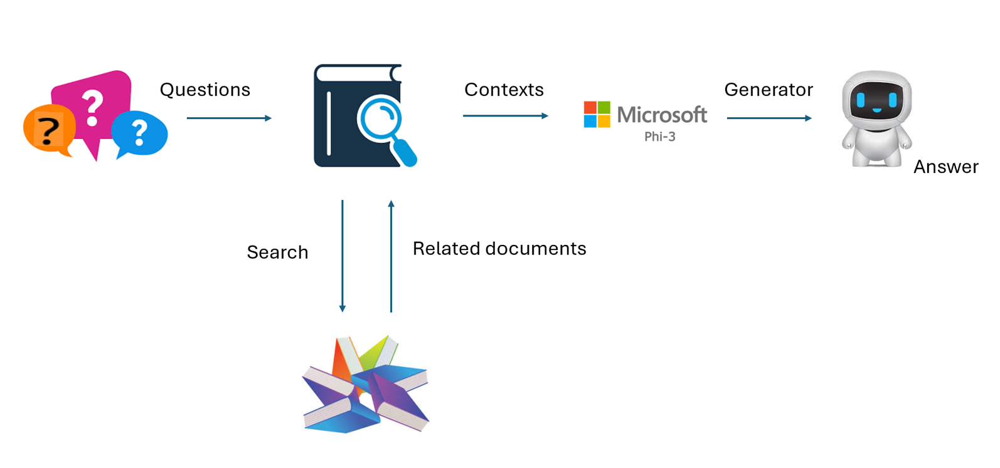
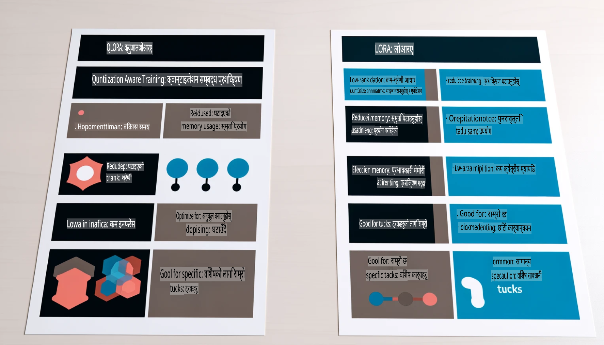

# **Phi-3 लाई उद्योग विशेषज्ञ बनाऔं**

Phi-3 मोडेललाई कुनै उद्योगमा प्रयोग गर्न, त्यसमा उद्योग सम्बन्धी व्यवसायिक डेटा थप्न आवश्यक छ। हामीसँग दुई विकल्पहरू छन्, पहिलो हो RAG (Retrieval Augmented Generation) र दोस्रो हो Fine Tuning।

## **RAG बनाम Fine-Tuning**

### **Retrieval Augmented Generation**

RAG भनेको डेटा पुनःप्राप्ति + पाठ उत्पादन हो। उद्यमको संरचित र असंरचित डेटा भेक्टर डेटाबेसमा भण्डारण गरिन्छ। जब सम्बन्धित सामग्री खोजिन्छ, त्यसबाट सम्बन्धित सारांश र सामग्री निकालेर सन्दर्भ बनाइन्छ, र LLM/SLM को पाठ पूर्ति क्षमतासँग मिलाएर सामग्री उत्पादन गरिन्छ।

### **Fine-tuning**

Fine-tuning भनेको कुनै मोडेलको सुधारको आधारमा काम गर्ने प्रक्रिया हो। यसमा मोडेल एल्गोरिदमबाट सुरु गर्न आवश्यक पर्दैन, तर डेटा निरन्तर संकलन गर्नुपर्छ। यदि तपाईँलाई उद्योग अनुप्रयोगहरूमा थप सटीक शब्दावली र भाषाको अभिव्यक्ति चाहिन्छ भने, Fine-tuning राम्रो विकल्प हुनेछ। तर यदि तपाईँको डेटा बारम्बार परिवर्तन हुन्छ भने, Fine-tuning जटिल बन्न सक्छ।

### **कसरी छनोट गर्ने**

1. यदि हाम्रो उत्तरलाई बाह्य डेटा परिचय गराउन आवश्यक छ भने, RAG सबैभन्दा राम्रो विकल्प हो।

2. यदि तपाईँलाई स्थिर र सटीक उद्योग ज्ञान उत्पादन गर्न आवश्यक छ भने, Fine-tuning राम्रो विकल्प हुनेछ। RAG ले सम्बन्धित सामग्री प्राथमिकता दिन्छ, तर यो सधैं विशेष सूक्ष्मताहरू सहीसँग समेट्न सक्दैन।

3. Fine-tuning लाई उच्च-गुणस्तरको डेटा सेट चाहिन्छ। यदि यो सानो क्षेत्रको डेटा मात्र हो भने, यसले धेरै फरक पार्दैन। RAG बढी लचिलो छ।

4. Fine-tuning एक ब्ल्याक बक्स हो, जसलाई बुझ्न गाह्रो हुन्छ। तर RAG ले डेटा स्रोत पत्ता लगाउन सजिलो बनाउँछ, जसले भ्रमहरू वा सामग्री त्रुटिहरू समायोजन गर्न र बढी पारदर्शिता प्रदान गर्न सहयोग पुर्‍याउँछ।

### **उपयोगका परिदृश्यहरू**

1. ठाडो उद्योगहरूले विशिष्ट व्यवसायिक शब्दावली र अभिव्यक्तिहरू आवश्यक पर्ने हुँदा, ***Fine-tuning*** सबैभन्दा राम्रो विकल्प हुनेछ।

2. प्रश्न-उत्तर प्रणाली, जसले विभिन्न ज्ञान बिन्दुहरूको संश्लेषण समावेश गर्छ, ***RAG*** सबैभन्दा राम्रो विकल्प हुनेछ।

3. स्वचालित व्यवसायिक प्रवाहको संयोजनका लागि ***RAG + Fine-tuning*** सबैभन्दा राम्रो विकल्प हुनेछ।

## **RAG कसरी प्रयोग गर्ने**

भेक्टर डेटाबेस भनेको गणितीय रूपले भण्डारण गरिएको डेटा संग्रह हो। भेक्टर डेटाबेसहरूले मेसिन लर्निङ मोडेललाई अघिल्लो इनपुटहरू सम्झन सजिलो बनाउँछन्, जसले खोज, सिफारिसहरू, र पाठ उत्पादन जस्ता प्रयोगका केसहरूलाई समर्थन गर्न मेसिन लर्निङ प्रयोग गर्न सक्षम बनाउँछ। डेटा समानता मेट्रिक्सको आधारमा पहिचान गर्न सकिन्छ, सटीक मिलानको आवश्यकता बिना, जसले कम्प्युटर मोडेलहरूलाई डेटा सन्दर्भ बुझ्न सक्षम बनाउँछ।

भेक्टर डेटाबेस RAG कार्यान्वयनको मुख्य चाबी हो। हामी डेटा भेक्टर भण्डारणमा रूपान्तरण गर्न text-embedding-3, jina-ai-embedding जस्ता भेक्टर मोडेलहरूको प्रयोग गर्न सक्छौं।

RAG एप्लिकेसन बनाउन सिक्न यहाँ जानुहोस् [https://github.com/microsoft/Phi-3CookBook](https://github.com/microsoft/Phi-3CookBook?WT.mc_id=aiml-138114-kinfeylo)

## **Fine-tuning कसरी प्रयोग गर्ने**

Fine-tuning मा सामान्यतया प्रयोग गरिने एल्गोरिदमहरू Lora र QLora हुन्। कसरी छनोट गर्ने?  
- [यस नमुना नोटबुकबाट थप जान्नुहोस्](../../../../code/04.Finetuning/Phi_3_Inference_Finetuning.ipynb)  
- [Python FineTuning को नमुना उदाहरण](../../../../code/04.Finetuning/FineTrainingScript.py)

### **Lora र QLora**

LoRA (Low-Rank Adaptation) र QLoRA (Quantized Low-Rank Adaptation) दुवै ठूलो भाषा मोडेलहरू (LLMs) लाई Fine-tune गर्न Parameter Efficient Fine Tuning (PEFT) प्रयोग गर्ने प्रविधिहरू हुन्। PEFT प्रविधिहरूले परम्परागत विधिहरूभन्दा मोडेलहरूलाई बढी प्रभावकारी रूपमा तालिम दिन डिजाइन गरिएको हो।  
LoRA एक स्वतन्त्र Fine-tuning प्रविधि हो जसले तौल अद्यावधिक म्याट्रिक्समा कम-र्यांकको अनुमान लागू गरेर मेमोरी खपत घटाउँछ। यसले छिटो तालिम समय प्रदान गर्छ र परम्परागत Fine-tuning विधिहरूसँग नजिकको प्रदर्शन कायम राख्छ।  

QLoRA भने LoRA को विस्तारित संस्करण हो, जसले मेमोरी खपत अझै कम गर्न क्वान्टाइजेशन प्रविधिहरू समावेश गर्दछ। QLoRA ले पूर्व-प्रशिक्षित LLM का तौल प्यारामिटरहरूलाई 4-बिट सटीकतामा क्वान्टाइज गर्छ, जसले LoRA भन्दा बढी मेमोरी कुशल बनाउँछ। तर, QLoRA को तालिम LoRA भन्दा लगभग 30% ढिलो हुन्छ किनभने यसमा थप क्वान्टाइजेशन र डीक्वान्टाइजेशन चरणहरू हुन्छन्।  

QLoRA ले क्वान्टाइजेशनका कारण भएका त्रुटिहरू सच्याउन LoRA लाई सहायकको रूपमा प्रयोग गर्छ। QLoRA ले साना र सजिलै उपलब्ध GPU हरूमा अरबौं प्यारामिटर भएका ठूलो मोडेलहरू Fine-tune गर्न सक्षम बनाउँछ। उदाहरणका लागि, QLoRA ले 70B प्यारामिटर मोडेललाई Fine-tune गर्न सक्छ, जसलाई 36 GPUs चाहिन्छ, तर यो केवल 2 GPUs मा पनि चलाउन सक्छ।

**अस्वीकरण**:  
यो दस्तावेज मेशिन-आधारित एआई अनुवाद सेवाहरू प्रयोग गरी अनुवाद गरिएको हो। हामी यथासम्भव सही अनुवाद प्रदान गर्न प्रयास गर्दछौं, तर कृपया ध्यान दिनुहोस् कि स्वचालित अनुवादहरूमा त्रुटिहरू वा असत्यताहरू हुन सक्छन्। मूल भाषामा रहेको मूल दस्तावेजलाई आधिकारिक स्रोत मानिनुपर्छ। महत्वपूर्ण जानकारीको लागि, व्यावसायिक मानव अनुवाद सिफारिस गरिन्छ। यो अनुवादको प्रयोगबाट उत्पन्न हुने कुनै पनि गलतफहमी वा गलत व्याख्याका लागि हामी जिम्मेवार हुनेछैनौं।