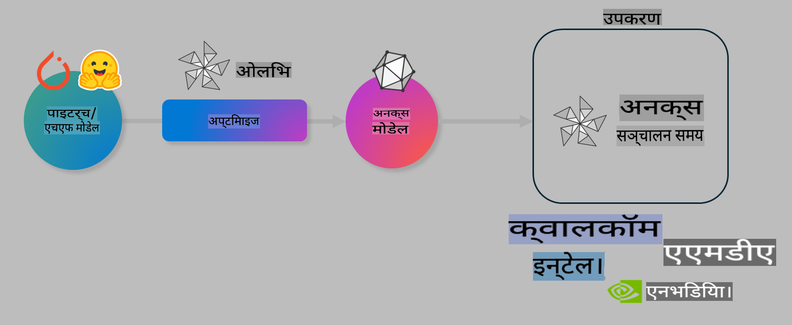

# ल्याब। अन-डिभाइस इन्फरेन्सका लागि एआई मोडेलहरू अनुकूलित गर्नुहोस्

## परिचय

> [!IMPORTANT]
> यो ल्याबको लागि **Nvidia A10 वा A100 GPU** र सम्बद्ध ड्राइभरहरू र CUDA टूलकिट (संस्करण १२+) आवश्यक छ।

> [!NOTE]
> यो **३५-मिनेट** को ल्याब हो जसले तपाईंलाई OLIVE प्रयोग गरेर अन-डिभाइस इन्फरेन्सका लागि मोडेलहरू अनुकूलित गर्ने मुख्य अवधारणाहरूमा व्यावहारिक परिचय दिनेछ।

## सिकाइका उद्देश्यहरू

यस ल्याबको अन्त्यसम्ममा, तपाईं OLIVE प्रयोग गरेर निम्न गर्न सक्षम हुनुहुनेछ:

- AWQ क्वान्टाइजेसन विधि प्रयोग गरी एआई मोडेल क्वान्टाइज गर्नुहोस्।
- विशिष्ट कार्यका लागि एआई मोडेल फाइन-ट्युन गर्नुहोस्।
- ONNX Runtime मा कुशल अन-डिभाइस इन्फरेन्सका लागि LoRA एडेप्टरहरू (फाइन-ट्युन गरिएको मोडेल) उत्पन्न गर्नुहोस्।

### OLIVE के हो?

Olive (*O*NNX *live*) एउटा मोडेल अनुकूलन टूलकिट हो जसमा CLI पनि छ, जसले तपाईंलाई ONNX runtime +++https://onnxruntime.ai+++ का लागि मोडेलहरू तयार गर्न सक्षम बनाउँछ।



Olive को इनपुट सामान्यतया PyTorch वा Hugging Face मोडेल हुन्छ, र आउटपुट एउटा अनुकूलित ONNX मोडेल हुन्छ जुन ONNX runtime चलिरहेको उपकरण (डिप्लोयमेन्ट टार्गेट) मा कार्यान्वयन हुन्छ। Olive ले डिप्लोयमेन्ट टार्गेटको एआई एक्सेलेरेटर (NPU, GPU, CPU) लाई अनुकूलित गर्छ, जुन Qualcomm, AMD, Nvidia वा Intel जस्ता हार्डवेयर विक्रेताहरूले प्रदान गरेका हुन्छन्।

Olive ले *workflow* कार्यान्वयन गर्छ, जुन *passes* भनिने व्यक्तिगत मोडेल अनुकूलन कार्यहरूको क्रमबद्ध श्रृंखला हो। उदाहरणका लागि: मोडेल कम्प्रेसन, ग्राफ क्याप्चर, क्वान्टाइजेसन, ग्राफ अनुकूलन। प्रत्येक पासमा केहि प्यारामिटरहरू हुन्छन् जसलाई accuracy र latency जस्ता उत्कृष्ट मेट्रिक्स हासिल गर्न ट्युन गर्न सकिन्छ। Olive ले खोज एल्गोरिदम प्रयोग गरी प्रत्येक पास वा पासहरूको सेटलाई स्वत: ट्युन गर्छ।

#### OLIVE का फाइदाहरू

- **त्रुटि र समय घटाउनुहोस्**: ग्राफ अनुकूलन, कम्प्रेसन र क्वान्टाइजेसनका विभिन्न प्रविधिहरूमा म्यानुअल परीक्षण-त्रुटिको झन्झट हटाउनुहोस्। तपाईंको गुणस्तर र प्रदर्शन मापदण्ड परिभाषित गर्नुहोस् र Olive लाई तपाईंका लागि उत्तम मोडेल स्वत: फेला पार्न दिनुहोस्।
- **४०+ इनबिल्ट मोडेल अनुकूलन कम्पोनेन्टहरू**: क्वान्टाइजेसन, कम्प्रेसन, ग्राफ अनुकूलन र फाइन-ट्युनिङका अत्याधुनिक प्रविधिहरू समेट्छ।
- **सजिलो CLI**: सामान्य मोडेल अनुकूलन कार्यहरूको लागि। उदाहरण: `olive quantize`, `olive auto-opt`, `olive finetune`।
- मोडेल प्याकेजिङ र डिप्लोयमेन्ट इनबिल्ट।
- **मल्टि LoRA सर्भिङ** का लागि मोडेलहरू उत्पन्न गर्न समर्थन।
- YAML/JSON प्रयोग गरी वर्कफ्लो निर्माण गर्न सकिन्छ जसले मोडेल अनुकूलन र डिप्लोयमेन्ट कार्यहरूलाई व्यवस्थित गर्छ।
- **Hugging Face** र **Azure AI** इंटेग्रेशन।
- **क्यासिङ मेकानिज्म** बिल्ट-इन जसले **लागत बचत** गर्छ।

## ल्याब निर्देशनहरू

> [!NOTE]
> कृपया सुनिश्चित गर्नुहोस् कि तपाईंले Azure AI Hub र प्रोजेक्टलाई प्रोभिजन गर्नुभएको छ र ल्याब १ अनुसार A100 कम्प्युट सेटअप गर्नुभएको छ।

### चरण ०: आफ्नो Azure AI कम्प्युटसँग जडान गर्नुहोस्

तपाईं **VS Code** को रिमोट फिचर प्रयोग गरेर Azure AI कम्प्युटसँग जडान गर्नुहुनेछ।

1. आफ्नो **VS Code** डेस्कटप एप्लिकेसन खोल्नुहोस्:
1. **Shift+Ctrl+P** प्रयोग गरी **कमाण्ड प्यालेट** खोल्नुहोस्।
1. कमाण्ड प्यालेटमा **AzureML - remote: Connect to compute instance in New Window** खोज्नुहोस्।
1. अन-स्क्रिन निर्देशनहरू पालना गर्नुहोस् र ल्याब १ मा सेटअप गरिएको आफ्नो Azure सब्स्क्रिप्सन, रिसोर्स ग्रुप, प्रोजेक्ट र कम्प्युट नाम चयन गर्नुहोस्।
1. जब तपाईं Azure ML Compute नोडसँग जडान हुनुहुन्छ, यो **VS Code को तल बायाँ** मा देखिनेछ `><Azure ML: Compute Name`

### चरण १: यो रिपोजिटरी क्लोन गर्नुहोस्

VS Code मा, **Ctrl+J** प्रयोग गरी नयाँ टर्मिनल खोल्नुहोस् र यो रिपोजिटरी क्लोन गर्नुहोस्:

टर्मिनलमा तपाईंले यो प्रम्प्ट देख्नुहुनेछ:

```
azureuser@computername:~/cloudfiles/code$ 
```
रिपोजिटरी क्लोन गर्नुहोस्:

```bash
cd ~/localfiles
git clone https://github.com/microsoft/phi-3cookbook.git
```

### चरण २: VS Code मा फोल्डर खोल्नुहोस्

साम्बन्धित फोल्डरमा VS Code खोल्न टर्मिनलमा निम्न कमाण्ड कार्यान्वयन गर्नुहोस्, जसले नयाँ विन्डो खोल्नेछ:

```bash
code phi-3cookbook/code/04.Finetuning/Olive-lab
```

वैकल्पिक रूपमा, **File** > **Open Folder** चयन गरेर फोल्डर खोल्न सक्नुहुन्छ।

### चरण ३: निर्भरता स्थापना गर्नुहोस्

Azure AI Compute Instance मा VS Code को टर्मिनल विन्डो खोल्नुहोस् (टिप: **Ctrl+J**) र निर्भरता स्थापना गर्न निम्न कमाण्डहरू कार्यान्वयन गर्नुहोस्:

```bash
conda create -n olive-ai python=3.11 -y
conda activate olive-ai
pip install -r requirements.txt
az extension remove -n azure-cli-ml
az extension add -n ml
```

> [!NOTE]
> सबै निर्भरता स्थापना गर्न ~५ मिनेट लाग्नेछ।

यस ल्याबमा तपाईं मोडेलहरू Azure AI Model catalog मा डाउनलोड र अपलोड गर्नुहुनेछ। त्यसैले, तपाईंलाई मोडेल क्याटलगमा पहुँच गर्न Azure मा लगइन गर्नुपर्नेछ:

```bash
az login
```

> [!NOTE]
> लगइनको समयमा तपाईंलाई आफ्नो सब्स्क्रिप्सन चयन गर्न भनिनेछ। सुनिश्चित गर्नुहोस् कि तपाईंलाई यो ल्याबका लागि प्रदान गरिएको सब्स्क्रिप्सन सेट गर्नुभएको छ।

### चरण ४: Olive कमाण्डहरू कार्यान्वयन गर्नुहोस्

Azure AI Compute Instance मा VS Code को टर्मिनल विन्डो खोल्नुहोस् (टिप: **Ctrl+J**) र सुनिश्चित गर्नुहोस् कि `olive-ai` कन्डा वातावरण सक्रिय छ:

```bash
conda activate olive-ai
```

अब, निम्न Olive कमाण्डहरू कमाण्ड लाइनमा कार्यान्वयन गर्नुहोस्।

1. **डेटा जाँच गर्नुहोस्:** यस उदाहरणमा, तपाईं Phi-3.5-Mini मोडेललाई यात्रा सम्बन्धी प्रश्नहरूको उत्तर दिन विशेषज्ञ बनाउन फाइन-ट्युन गर्न जाँदै हुनुहुन्छ। तलको कोडले डेटासेटका पहिलो केहि रेकर्डहरू देखाउँछ, जुन JSON लाइन फारम्याटमा छन्:
   
    ```bash
    head data/data_sample_travel.jsonl
    ```
1. **मोडेल क्वान्टाइज गर्नुहोस्:** मोडेललाई प्रशिक्षण गर्नु अघि, तपाईं निम्न कमाण्ड प्रयोग गरी Active Aware Quantization (AWQ) +++https://arxiv.org/abs/2306.00978+++ प्रविधि प्रयोग गरेर क्वान्टाइज गर्नुहोस्। AWQ ले इनफरेन्सको समयमा उत्पादित एक्टिभेसनलाई ध्यानमा राखेर मोडेलका वेटहरू क्वान्टाइज गर्छ। यसले परम्परागत वेट क्वान्टाइजेसन विधिहरूको तुलनामा मोडेलको सटीकता राम्रोसँग संरक्षण गर्न मद्दत गर्छ।
    
    ```bash
    olive quantize \
       --model_name_or_path microsoft/Phi-3.5-mini-instruct \
       --trust_remote_code \
       --algorithm awq \
       --output_path models/phi/awq \
       --log_level 1
    ```
    
    यो **~८ मिनेट** लाग्छ AWQ क्वान्टाइजेसन पूरा गर्न, जसले **मोडेलको आकार ~७.५GB बाट ~२.५GB मा घटाउँछ**।
   
   यस ल्याबमा, हामी तपाईंलाई Hugging Face बाट मोडेल इनपुट गर्ने तरिका देखाउँदैछौं (उदाहरणका लागि: `microsoft/Phi-3.5-mini-instruct`). However, Olive also allows you to input models from the Azure AI catalog by updating the `model_name_or_path` argument to an Azure AI asset ID (for example:  `azureml://registries/azureml/models/Phi-3.5-mini-instruct/versions/4`). 

1. **Train the model:** Next, the `olive finetune` कमाण्ड क्वान्टाइज गरिएको मोडेललाई फाइन-ट्युन गर्छ। मोडेललाई फाइन-ट्युन गर्ने *अगाडि* क्वान्टाइज गर्नु सटीकता राम्रो बनाउँछ किनकि फाइन-ट्युनिङ प्रक्रियाले क्वान्टाइजेसनबाट हुने ह्रासलाई पुन: प्राप्त गर्छ।
    
    ```bash
    olive finetune \
        --method lora \
        --model_name_or_path models/phi/awq \
        --data_files "data/data_sample_travel.jsonl" \
        --data_name "json" \
        --text_template "<|user|>\n{prompt}<|end|>\n<|assistant|>\n{response}<|end|>" \
        --max_steps 100 \
        --output_path ./models/phi/ft \
        --log_level 1
    ```
    
    यो **~६ मिनेट** लाग्छ फाइन-ट्युनिङ पूरा गर्न (१०० स्टेपहरूसँग)।

1. **अनुकूलन गर्नुहोस्:** मोडेल प्रशिक्षण पछि, अब Olive को `auto-opt` command, which will capture the ONNX graph and automatically perform a number of optimizations to improve the model performance for CPU by compressing the model and doing fusions. It should be noted, that you can also optimize for other devices such as NPU or GPU by just updating the `--device` and `--provider` तर्क प्रयोग गरी मोडेल अनुकूलन गर्नुहोस् - तर यस ल्याबका लागि हामी CPU प्रयोग गर्नेछौं।

    ```bash
    olive auto-opt \
       --model_name_or_path models/phi/ft/model \
       --adapter_path models/phi/ft/adapter \
       --device cpu \
       --provider CPUExecutionProvider \
       --use_ort_genai \
       --output_path models/phi/onnx-ao \
       --log_level 1
    ```
    
    यो **~५ मिनेट** लाग्छ अनुकूलन पूरा गर्न।

### चरण ५: मोडेल इन्फरेन्स छिटो परीक्षण

मोडेलको इन्फरेन्स परीक्षण गर्न, आफ्नो फोल्डरमा **app.py** नामक एउटा Python फाइल सिर्जना गर्नुहोस् र निम्न कोड कपी-पेस्ट गर्नुहोस्:

```python
import onnxruntime_genai as og
import numpy as np

print("loading model and adapters...", end="", flush=True)
model = og.Model("models/phi/onnx-ao/model")
adapters = og.Adapters(model)
adapters.load("models/phi/onnx-ao/model/adapter_weights.onnx_adapter", "travel")
print("DONE!")

tokenizer = og.Tokenizer(model)
tokenizer_stream = tokenizer.create_stream()

params = og.GeneratorParams(model)
params.set_search_options(max_length=100, past_present_share_buffer=False)
user_input = "what is the best thing to see in chicago"
params.input_ids = tokenizer.encode(f"<|user|>\n{user_input}<|end|>\n<|assistant|>\n")

generator = og.Generator(model, params)

generator.set_active_adapter(adapters, "travel")

print(f"{user_input}")

while not generator.is_done():
    generator.compute_logits()
    generator.generate_next_token()

    new_token = generator.get_next_tokens()[0]
    print(tokenizer_stream.decode(new_token), end='', flush=True)

print("\n")
```

कोड कार्यान्वयन गर्नुहोस्:

```bash
python app.py
```

### चरण ६: मोडेललाई Azure AI मा अपलोड गर्नुहोस्

मोडेललाई Azure AI मोडेल रिपोजिटरीमा अपलोड गर्दा, यो तपाईंको विकास टोलीका अन्य सदस्यहरूसँग साझा गर्न सकिन्छ र मोडेलको संस्करण नियन्त्रण पनि सम्भाल्छ। मोडेल अपलोड गर्न निम्न कमाण्ड चलाउनुहोस्:

> [!NOTE]
> `{}`` placeholders with the name of your resource group and Azure AI Project Name. 

To find your resource group `"resourceGroup" र Azure AI Project नाम अद्यावधिक गर्नुहोस्, र निम्न कमाण्ड चलाउनुहोस्:

```
az ml workspace show
```

वा +++ai.azure.com+++ मा गएर **management center**, **project**, **overview** चयन गरेर हेर्न सक्नुहुन्छ।

`{}` स्थानमा आफ्नो रिसोर्स ग्रुप र Azure AI Project नाम अद्यावधिक गर्नुहोस्।

```bash
az ml model create \
    --name ft-for-travel \
    --version 1 \
    --path ./models/phi/onnx-ao \
    --resource-group {RESOURCE_GROUP_NAME} \
    --workspace-name {PROJECT_NAME}
```
त्यसपछि तपाईं आफ्नो अपलोड गरिएको मोडेल देख्न सक्नुहुन्छ र आफ्नो मोडेललाई https://ml.azure.com/model/list मा डिप्लोय गर्न सक्नुहुन्छ।

**अस्वीकरण**:  
यो दस्तावेज मेसिन-आधारित एआई अनुवाद सेवाहरू प्रयोग गरेर अनुवाद गरिएको छ। हामी शुद्धताका लागि प्रयास गर्दछौं, तर कृपया सचेत रहनुहोस् कि स्वचालित अनुवादहरूमा त्रुटिहरू वा असङ्गतिहरू हुन सक्छ। मूल भाषामा रहेको मूल दस्तावेजलाई प्रामाणिक स्रोत मानिनुपर्छ। महत्वपूर्ण जानकारीका लागि, व्यावसायिक मानव अनुवाद सिफारिस गरिन्छ। यस अनुवादको प्रयोगबाट उत्पन्न हुने कुनै पनि गलतफहमी वा गलत व्याख्याका लागि हामी जिम्मेवार हुने छैनौं।