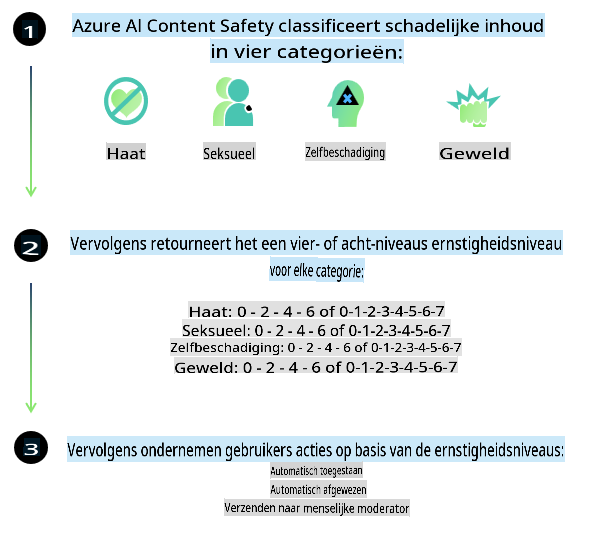
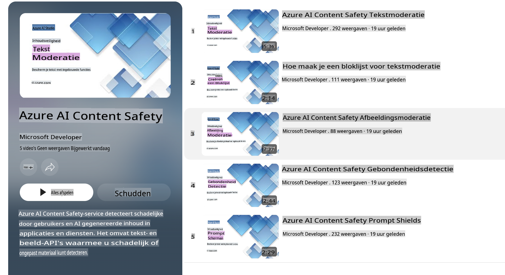

# AI-veiligheid voor Phi-modellen

De Phi-familie van modellen is ontwikkeld in overeenstemming met de [Microsoft Responsible AI Standard](https://query.prod.cms.rt.microsoft.com/cms/api/am/binary/RE5cmFl), een bedrijfsbrede set van vereisten gebaseerd op de volgende zes principes: verantwoordelijkheid, transparantie, eerlijkheid, betrouwbaarheid en veiligheid, privacy en beveiliging, en inclusiviteit, die samen de [Microsoft Responsible AI-principes](https://www.microsoft.com/ai/responsible-ai) vormen.

Net als de eerdere Phi-modellen is een veelzijdige veiligheidsbeoordeling en een post-training veiligheidsaanpak toegepast, met extra maatregelen om rekening te houden met de meertalige mogelijkheden van deze release. Onze aanpak voor veiligheidstraining en evaluaties, inclusief testen in meerdere talen en risicocategorieën, wordt beschreven in het [Phi Safety Post-Training Paper](https://arxiv.org/abs/2407.13833). Hoewel de Phi-modellen profiteren van deze aanpak, dienen ontwikkelaars best practices voor verantwoorde AI toe te passen, waaronder het in kaart brengen, meten en mitigeren van risico's die verband houden met hun specifieke gebruiksscenario en culturele en taalkundige context.

## Best Practices

Net als andere modellen kunnen de Phi-modellen zich op manieren gedragen die oneerlijk, onbetrouwbaar of beledigend zijn.

Enkele van de beperkende gedragingen van SLM en LLM waar je op moet letten, zijn onder andere:

- **Kwaliteit van dienstverlening:** De Phi-modellen zijn voornamelijk getraind op Engelstalige teksten. Voor talen anders dan Engels zal de prestatie slechter zijn. Engels met minder vertegenwoordiging in de trainingsdata kan slechter presteren dan standaard Amerikaans Engels.
- **Representatie van schade en versterking van stereotypen:** Deze modellen kunnen groepen mensen over- of ondervertegenwoordigen, de representatie van bepaalde groepen uitwissen of denigrerende of negatieve stereotypen versterken. Ondanks post-training veiligheidsmaatregelen kunnen deze beperkingen nog steeds aanwezig zijn vanwege verschillende niveaus van representatie van verschillende groepen of de prevalentie van voorbeelden van negatieve stereotypen in de trainingsdata die echte patronen en maatschappelijke vooroordelen weerspiegelen.
- **Ongepaste of beledigende inhoud:** Deze modellen kunnen andere soorten ongepaste of beledigende inhoud genereren, wat het ongeschikt kan maken voor gevoelige contexten zonder aanvullende maatregelen die specifiek zijn voor het gebruiksscenario.  
  **Betrouwbaarheid van informatie:** Taalmodellen kunnen onzinnige inhoud genereren of inhoud fabriceren die redelijk klinkt maar onjuist of verouderd is.
- **Beperkte scope voor code:** Het merendeel van de Phi-3 trainingsdata is gebaseerd op Python en maakt gebruik van gangbare pakketten zoals "typing, math, random, collections, datetime, itertools". Als het model Python-scripts genereert die andere pakketten gebruiken of scripts in andere talen, raden we gebruikers sterk aan om handmatig alle API-gebruik te verifiëren.

Ontwikkelaars dienen best practices voor verantwoorde AI toe te passen en zijn verantwoordelijk voor het waarborgen dat een specifiek gebruiksscenario voldoet aan relevante wetten en regelgeving (bijv. privacy, handel, enz.).

## Overwegingen voor Verantwoorde AI

Net als andere taalmodellen kunnen de Phi-modellen zich op manieren gedragen die oneerlijk, onbetrouwbaar of beledigend zijn. Enkele beperkende gedragingen om rekening mee te houden, zijn:

**Kwaliteit van dienstverlening:** De Phi-modellen zijn voornamelijk getraind op Engelstalige teksten. Voor talen anders dan Engels zal de prestatie slechter zijn. Engels met minder vertegenwoordiging in de trainingsdata kan slechter presteren dan standaard Amerikaans Engels.

**Representatie van schade en versterking van stereotypen:** Deze modellen kunnen groepen mensen over- of ondervertegenwoordigen, de representatie van bepaalde groepen uitwissen of denigrerende of negatieve stereotypen versterken. Ondanks post-training veiligheidsmaatregelen kunnen deze beperkingen nog steeds aanwezig zijn vanwege verschillende niveaus van representatie van verschillende groepen of de prevalentie van voorbeelden van negatieve stereotypen in de trainingsdata die echte patronen en maatschappelijke vooroordelen weerspiegelen.

**Ongepaste of beledigende inhoud:** Deze modellen kunnen andere soorten ongepaste of beledigende inhoud genereren, wat het ongeschikt kan maken voor gevoelige contexten zonder aanvullende maatregelen die specifiek zijn voor het gebruiksscenario.  
**Betrouwbaarheid van informatie:** Taalmodellen kunnen onzinnige inhoud genereren of inhoud fabriceren die redelijk klinkt maar onjuist of verouderd is.

**Beperkte scope voor code:** Het merendeel van de Phi-3 trainingsdata is gebaseerd op Python en maakt gebruik van gangbare pakketten zoals "typing, math, random, collections, datetime, itertools". Als het model Python-scripts genereert die andere pakketten gebruiken of scripts in andere talen, raden we gebruikers sterk aan om handmatig alle API-gebruik te verifiëren.

Ontwikkelaars dienen best practices voor verantwoorde AI toe te passen en zijn verantwoordelijk voor het waarborgen dat een specifiek gebruiksscenario voldoet aan relevante wetten en regelgeving (bijv. privacy, handel, enz.). Belangrijke aandachtspunten zijn onder andere:

**Toewijzing:** Modellen zijn mogelijk niet geschikt voor scenario's die een aanzienlijke impact kunnen hebben op de juridische status of de toewijzing van middelen of levensmogelijkheden (bijv. huisvesting, werkgelegenheid, krediet, enz.) zonder verdere beoordelingen en aanvullende technieken om vooroordelen te verminderen.

**Hoogrisicoscenario's:** Ontwikkelaars dienen de geschiktheid van het gebruik van modellen in hoogrisicoscenario's te beoordelen waarin oneerlijke, onbetrouwbare of beledigende outputs zeer kostbaar kunnen zijn of schade kunnen veroorzaken. Dit omvat het geven van advies in gevoelige of gespecialiseerde domeinen waar nauwkeurigheid en betrouwbaarheid cruciaal zijn (bijv. juridisch of medisch advies). Aanvullende waarborgen dienen op toepassingsniveau te worden geïmplementeerd volgens de implementatiecontext.

**Misleidende informatie:** Modellen kunnen onnauwkeurige informatie genereren. Ontwikkelaars dienen transparantie best practices te volgen en eindgebruikers te informeren dat ze met een AI-systeem interageren. Op toepassingsniveau kunnen ontwikkelaars feedbackmechanismen en pipelines bouwen om antwoorden te baseren op gebruiksspecifieke, contextuele informatie, een techniek die bekend staat als Retrieval Augmented Generation (RAG).

**Generatie van schadelijke inhoud:** Ontwikkelaars dienen outputs te beoordelen in hun context en beschikbare veiligheidsclassificatoren of aangepaste oplossingen te gebruiken die geschikt zijn voor hun gebruiksscenario.

**Misbruik:** Andere vormen van misbruik, zoals fraude, spam of malwareproductie, kunnen mogelijk zijn, en ontwikkelaars dienen ervoor te zorgen dat hun toepassingen niet in strijd zijn met toepasselijke wetten en regelgeving.

### Fijn-tuning en AI-inhoudsveiligheid

Na het fijn-tunen van een model raden we sterk aan om gebruik te maken van [Azure AI Content Safety](https://learn.microsoft.com/azure/ai-services/content-safety/overview)-maatregelen om de door de modellen gegenereerde inhoud te monitoren, potentiële risico's, bedreigingen en kwaliteitsproblemen te identificeren en te blokkeren.

[Azure AI Content Safety](https://learn.microsoft.com/azure/ai-services/content-safety/overview) ondersteunt zowel tekst- als beeldinhoud. Het kan worden ingezet in de cloud, in geïsoleerde containers en op edge-/embedded-apparaten.

## Overzicht van Azure AI Content Safety

Azure AI Content Safety is geen one-size-fits-all-oplossing; het kan worden aangepast om aan te sluiten bij de specifieke beleidsregels van bedrijven. Bovendien maken de meertalige modellen het mogelijk om meerdere talen tegelijkertijd te begrijpen.

- **Azure AI Content Safety**
- **Microsoft Developer**
- **5 video's**

De Azure AI Content Safety-service detecteert schadelijke door gebruikers gegenereerde en door AI gegenereerde inhoud in toepassingen en diensten. Het omvat tekst- en beeld-API's waarmee schadelijk of ongepast materiaal kan worden gedetecteerd.

[AI Content Safety Playlist](https://www.youtube.com/playlist?list=PLlrxD0HtieHjaQ9bJjyp1T7FeCbmVcPkQ)

**Disclaimer**:  
Dit document is vertaald met behulp van machine-gebaseerde AI-vertalingsdiensten. Hoewel we ons inspannen voor nauwkeurigheid, dient u zich ervan bewust te zijn dat geautomatiseerde vertalingen fouten of onnauwkeurigheden kunnen bevatten. Het originele document in zijn oorspronkelijke taal moet worden beschouwd als de gezaghebbende bron. Voor cruciale informatie wordt professionele menselijke vertaling aanbevolen. Wij zijn niet aansprakelijk voor misverstanden of verkeerde interpretaties die voortvloeien uit het gebruik van deze vertaling.