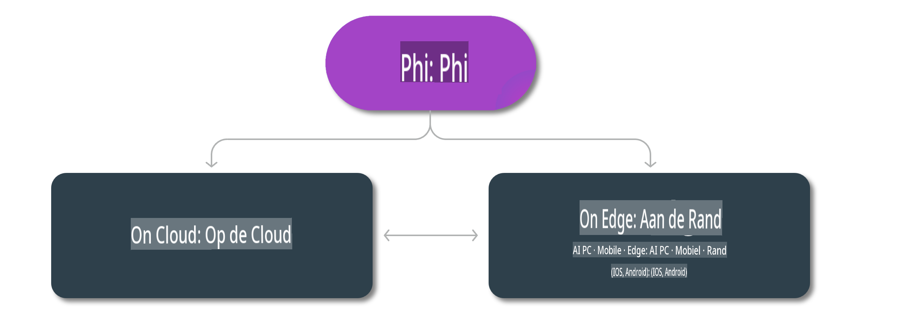

# Phi-modellen & Beschikbaarheid op verschillende platforms

## Edge- & Cloudscenario's

## Modelbeschikbaarheid en bronnen

| | | | | | | | | |
|-|-|-|-|-|-|-|-|-|
|Model|Input|Inhoudslimiet|Azure AI (MaaS)|Azure ML (MaaP)|ONNX|Hugging Face|Ollama|Nvidia NIM|
|Phi-3-vision-128k-instruct|Tekst+Afbeelding|128k|[Playground & Implementatie](https://ai.azure.com/explore/models/Phi-3-vision-128k-instruct/version/2/registry/azureml)|[Playground, Implementatie & Fijnregeling](https://ml.azure.com/registries/azureml/models/Phi-3-vision-128k-instruct/version/2)|[CUDA](https://huggingface.co/microsoft/Phi-3-vision-128k-instruct-onnx-cuda/tree/main),[CPU](https://huggingface.co/microsoft/Phi-3-vision-128k-instruct-onnx-cpu/tree/main), [DirectML](https://huggingface.co/microsoft/Phi-3-vision-128k-instruct-onnx-directml/tree/main)|[Downloaden](https://huggingface.co/microsoft/Phi-3-vision-128k-instruct)|-NA-|[NIM API's](https://build.nvidia.com/microsoft/phi-3-vision-128k-instruct)|
|Phi-3-mini-4k-instruct|Tekst|4k|[Playground & Implementatie](https://aka.ms/phi3-mini-4k-azure-ml)|[Playground, Implementatie](https://aka.ms/phi3-mini-4k-azure-ml) & Fijnregeling|[CUDA](https://huggingface.co/microsoft/Phi-3-mini-4k-instruct-onnx), [Web](https://huggingface.co/microsoft/Phi-3-mini-4k-instruct-onnx)|[Playground & Downloaden](https://huggingface.co/chat/models/microsoft/Phi-3-mini-4k-instruct)|[GGUF](https://huggingface.co/microsoft/Phi-3-mini-4k-instruct-gguf)|[NIM API's](https://build.nvidia.com/microsoft/phi-3-mini-4k)|
|Phi-3-mini-128k-instruct|Tekst|128k|[Playground & Implementatie](https://ai.azure.com/explore/models/Phi-3-mini-128k-instruct/version/9/registry/azureml)|[Playground, Implementatie](https://ai.azure.com/explore/models/Phi-3-mini-128k-instruct/version/9/registry/azureml) & Fijnregeling|[CUDA](https://huggingface.co/microsoft/Phi-3-mini-128k-instruct-onnx)|[Downloaden](https://huggingface.co/microsoft/Phi-3-mini-128k-instruct-onnx)|-NA-|[NIM API's](https://build.nvidia.com/microsoft/phi-3-mini)|
|Phi-3-small-8k-instruct|Tekst|8k|[Playground & Implementatie](https://ml.azure.com/registries/azureml/models/Phi-3-small-8k-instruct/version/2)|[Playground, Implementatie](https://ai.azure.com/explore/models/Phi-3-small-8k-instruct/version/2/registry/azureml) & Fijnregeling|[CUDA](https://huggingface.co/microsoft/Phi-3-small-8k-instruct-onnx-cuda)|[Downloaden](https://huggingface.co/microsoft/Phi-3-small-8k-instruct-onnx-cuda)|-NA-|[NIM API's](https://build.nvidia.com/microsoft/phi-3-small-8k-instruct?docker=false)|
|Phi-3-small-128k-instruct|Tekst|128k|[Playground & Implementatie](https://ai.azure.com/explore/models/Phi-3-small-128k-instruct/version/2/registry/azureml)|[Playground, Implementatie](https://ml.azure.com/registries/azureml/models/Phi-3-small-128k-instruct/version/2) & Fijnregeling|[CUDA](https://huggingface.co/microsoft/Phi-3-medium-128k-instruct-onnx-cuda)|[Downloaden](https://huggingface.co/microsoft/Phi-3-small-128k-instruct)|-NA-|[NIM API's](https://build.nvidia.com/microsoft/phi-3-small-128k-instruct?docker=false)|
|Phi-3-medium-4k-instruct|Tekst|4k|[Playground & Implementatie](https://huggingface.co/microsoft/Phi-3-medium-4k-instruct)|[Playground, Implementatie](https://ml.azure.com/registries/azureml/models/Phi-3-medium-4k-instruct/version/2) & Fijn-afstemming|[CUDA](https://huggingface.co/microsoft/Phi-3-medium-4k-instruct-onnx-cuda/tree/main), [CPU](https://huggingface.co/microsoft/Phi-3-medium-4k-instruct-onnx-cpu/tree/main), [DirectML](https://huggingface.co/microsoft/Phi-3-medium-4k-instruct-onnx-directml/tree/main)|[Download](https://huggingface.co/microsoft/Phi-3-medium-4k-instruct)|-NIET BESCHIKBAAR-|[NIM API's](https://build.nvidia.com/microsoft/phi-3-medium-4k-instruct?docker=false)|
|Phi-3-medium-128k-instruct|Tekst|128k|[Playground & Implementatie](https://ai.azure.com/explore/models/Phi-3-medium-128k-instruct/version/2)|[Playground, Implementatie](https://ml.azure.com/registries/azureml/models/Phi-3-medium-128k-instruct/version/2) & Fijn-afstemming|[CUDA](https://huggingface.co/microsoft/Phi-3-medium-128k-instruct-onnx-cuda/tree/main), [CPU](https://huggingface.co/microsoft/Phi-3-medium-128k-instruct-onnx-cpu/tree/main), [DirectML](https://huggingface.co/microsoft/Phi-3-medium-128k-instruct-onnx-directml/tree/main)|[Download](https://huggingface.co/microsoft/Phi-3-medium-128k-instruct)|-NIET BESCHIKBAAR|-NIET BESCHIKBAAR-|

**Disclaimer**:  
Dit document is vertaald met behulp van machinegebaseerde AI-vertalingsdiensten. Hoewel we ons best doen voor nauwkeurigheid, moet u zich ervan bewust zijn dat geautomatiseerde vertalingen fouten of onnauwkeurigheden kunnen bevatten. Het originele document in zijn oorspronkelijke taal moet worden beschouwd als de gezaghebbende bron. Voor kritieke informatie wordt professionele menselijke vertaling aanbevolen. Wij zijn niet verantwoordelijk voor misverstanden of verkeerde interpretaties die voortvloeien uit het gebruik van deze vertaling.