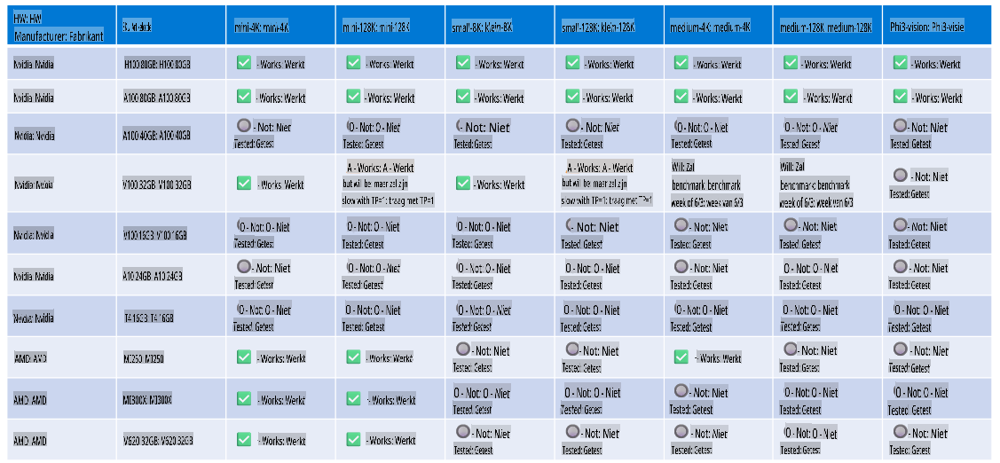

# Phi Hardware Ondersteuning

Microsoft Phi is geoptimaliseerd voor ONNX Runtime en ondersteunt Windows DirectML. Het werkt goed op verschillende hardwaretypes, waaronder GPU's, CPU's en zelfs mobiele apparaten.

## Apparatuurhardware
Specifiek omvat de ondersteunde hardware:

- GPU SKU: RTX 4090 (DirectML)
- GPU SKU: 1 A100 80GB (CUDA)
- CPU SKU: Standard F64s v2 (64 vCPUs, 128 GiB geheugen)

## Mobiele SKU

- Android - Samsung Galaxy S21
- Apple iPhone 14 of hoger met A16/A17-processor

## Phi Hardware Specificaties

- Minimale vereiste configuratie.
- Windows: DirectX 12-compatibele GPU en minimaal 4GB gecombineerd RAM

CUDA: NVIDIA GPU met Compute Capability >= 7.02



## Onnxruntime draaien op meerdere GPU's

De momenteel beschikbare Phi ONNX-modellen zijn alleen geschikt voor 1 GPU. Het is mogelijk om multi-gpu-ondersteuning voor Phi-modellen in te schakelen, maar ORT met 2 GPU's garandeert niet dat dit meer throughput oplevert in vergelijking met 2 instanties van ORT. Bekijk [ONNX Runtime](https://onnxruntime.ai/) voor de laatste updates.

Tijdens [Build 2024 heeft het GenAI ONNX-team](https://youtu.be/WLW4SE8M9i8?si=EtG04UwDvcjunyfC) aangekondigd dat ze multi-instance in plaats van multi-gpu hebben ingeschakeld voor Phi-modellen.

Op dit moment kun je één onnxruntime- of onnxruntime-genai-instantie draaien met de CUDA_VISIBLE_DEVICES-omgevingsvariabele zoals hieronder weergegeven.

```Python
CUDA_VISIBLE_DEVICES=0 python infer.py
CUDA_VISIBLE_DEVICES=1 python infer.py
```

Ontdek Phi verder op [Azure AI Foundry](https://ai.azure.com)

**Disclaimer**:  
Dit document is vertaald met behulp van machine-gebaseerde AI-vertalingsdiensten. Hoewel we streven naar nauwkeurigheid, dient u zich ervan bewust te zijn dat geautomatiseerde vertalingen fouten of onnauwkeurigheden kunnen bevatten. Het originele document in de oorspronkelijke taal moet worden beschouwd als de gezaghebbende bron. Voor kritieke informatie wordt professionele menselijke vertaling aanbevolen. Wij zijn niet aansprakelijk voor misverstanden of verkeerde interpretaties die voortvloeien uit het gebruik van deze vertaling.