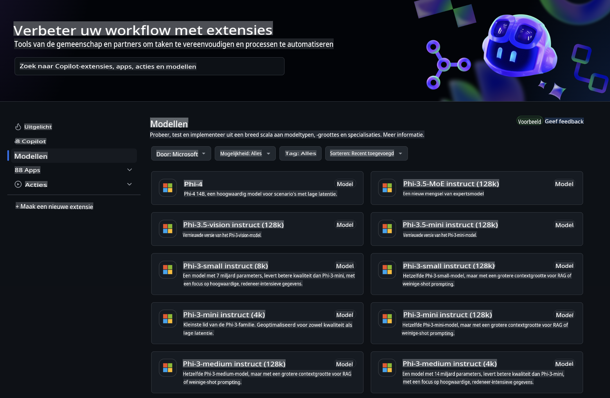
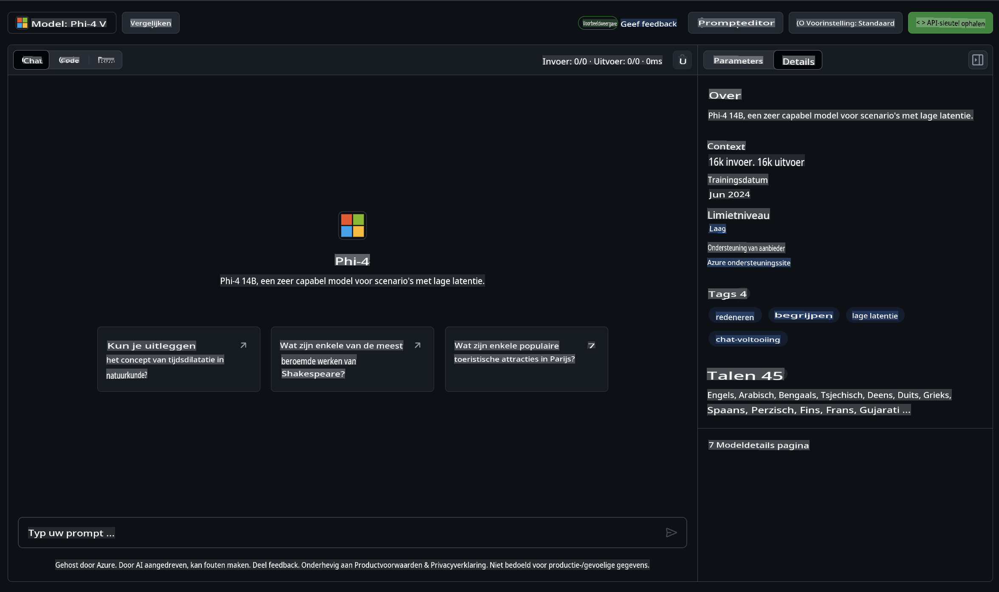
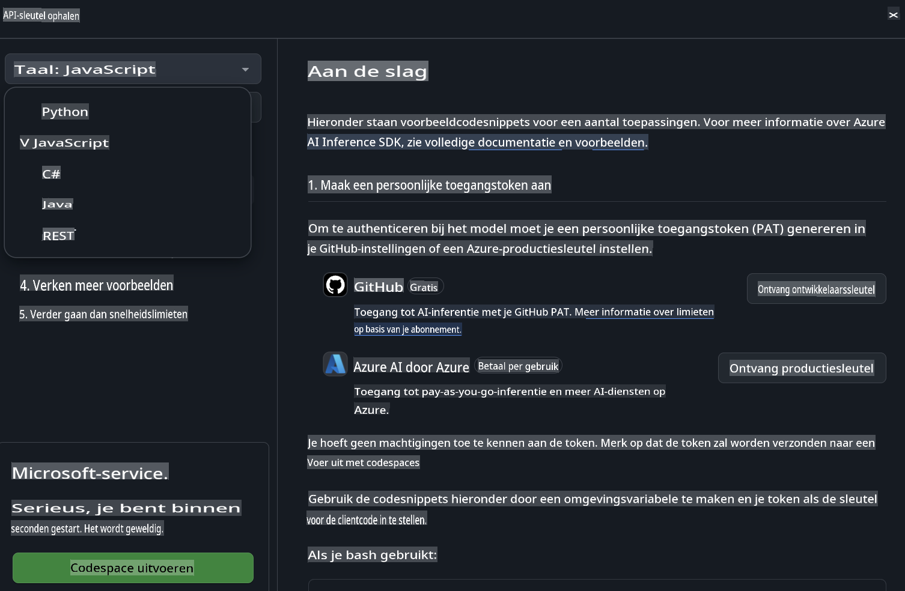
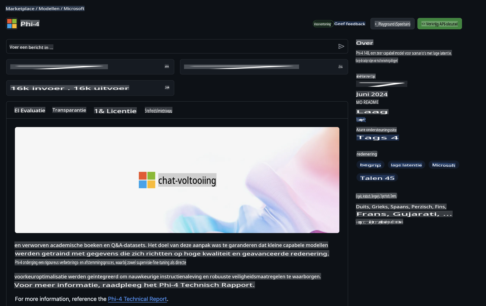

## Phi-familie in GitHub-modellen

Welkom bij [GitHub Models](https://github.com/marketplace/models)! Alles staat klaar voor jou om AI-modellen gehost op Azure AI te verkennen.



Voor meer informatie over de beschikbare modellen op GitHub Models, bekijk de [GitHub Model Marketplace](https://github.com/marketplace/models).

## Beschikbare modellen

Elk model heeft een eigen playground en voorbeeldcode.



### Phi-familie in de GitHub Model Catalogus

- [Phi-4](https://github.com/marketplace/models/azureml/Phi-4)

- [Phi-3.5-MoE instruct (128k)](https://github.com/marketplace/models/azureml/Phi-3-5-MoE-instruct)

- [Phi-3.5-vision instruct (128k)](https://github.com/marketplace/models/azureml/Phi-3-5-vision-instruct)

- [Phi-3.5-mini instruct (128k)](https://github.com/marketplace/models/azureml/Phi-3-5-mini-instruct)

- [Phi-3-Medium-128k-Instruct](https://github.com/marketplace/models/azureml/Phi-3-medium-128k-instruct)

- [Phi-3-medium-4k-instruct](https://github.com/marketplace/models/azureml/Phi-3-medium-4k-instruct)

- [Phi-3-mini-128k-instruct](https://github.com/marketplace/models/azureml/Phi-3-mini-128k-instruct)

- [Phi-3-mini-4k-instruct](https://github.com/marketplace/models/azureml/Phi-3-mini-4k-instruct)

- [Phi-3-small-128k-instruct](https://github.com/marketplace/models/azureml/Phi-3-small-128k-instruct)

- [Phi-3-small-8k-instruct](https://github.com/marketplace/models/azureml/Phi-3-small-8k-instruct)

## Aan de slag

Er zijn een paar eenvoudige voorbeelden die je direct kunt uitvoeren. Je kunt ze vinden in de samples-map. Als je direct wilt beginnen in je favoriete programmeertaal, kun je de voorbeelden vinden in de volgende talen:

- Python
- JavaScript
- C#
- Java
- cURL

Er is ook een speciale Codespaces-omgeving beschikbaar om de voorbeelden en modellen uit te voeren.



## Voorbeeldcode

Hieronder staan voorbeeldcodefragmenten voor een paar use cases. Voor meer informatie over de Azure AI Inference SDK, zie de volledige documentatie en voorbeelden.

## Installatie

1. Maak een persoonlijke toegangstoken aan  
Je hoeft geen specifieke machtigingen aan het token toe te kennen. Houd er rekening mee dat het token wordt verzonden naar een Microsoft-service.

Om de onderstaande codefragmenten te gebruiken, maak je een omgevingsvariabele aan om je token in te stellen als de sleutel voor de clientcode.

Als je bash gebruikt:  
```
export GITHUB_TOKEN="<your-github-token-goes-here>"
```  
Als je PowerShell gebruikt:  

```
$Env:GITHUB_TOKEN="<your-github-token-goes-here>"
```  

Als je de Windows-opdrachtprompt gebruikt:  

```
set GITHUB_TOKEN=<your-github-token-goes-here>
```  

## Python-voorbeeld

### Installeer afhankelijkheden  
Installeer de Azure AI Inference SDK met pip (vereist: Python >=3.8):  

```
pip install azure-ai-inference
```  

### Voer een basisvoorbeeld uit  

Dit voorbeeld demonstreert een eenvoudige oproep naar de chat completion API. Het maakt gebruik van het GitHub AI-model inference endpoint en je GitHub-token. De oproep is synchroon.  

```python
import os
from azure.ai.inference import ChatCompletionsClient
from azure.ai.inference.models import SystemMessage, UserMessage
from azure.core.credentials import AzureKeyCredential

endpoint = "https://models.inference.ai.azure.com"
model_name = "Phi-4"
token = os.environ["GITHUB_TOKEN"]

client = ChatCompletionsClient(
    endpoint=endpoint,
    credential=AzureKeyCredential(token),
)

response = client.complete(
    messages=[
        UserMessage(content="I have $20,000 in my savings account, where I receive a 4% profit per year and payments twice a year. Can you please tell me how long it will take for me to become a millionaire? Also, can you please explain the math step by step as if you were explaining it to an uneducated person?"),
    ],
    temperature=0.4,
    top_p=1.0,
    max_tokens=2048,
    model=model_name
)

print(response.choices[0].message.content)
```  

### Voer een gesprek met meerdere beurten uit  

Dit voorbeeld demonstreert een gesprek met meerdere beurten met de chat completion API. Bij het gebruik van het model voor een chatapplicatie moet je de gespreksgeschiedenis beheren en de nieuwste berichten naar het model sturen.  

```
import os
from azure.ai.inference import ChatCompletionsClient
from azure.ai.inference.models import AssistantMessage, SystemMessage, UserMessage
from azure.core.credentials import AzureKeyCredential

token = os.environ["GITHUB_TOKEN"]
endpoint = "https://models.inference.ai.azure.com"
# Replace Model_Name
model_name = "Phi-4"

client = ChatCompletionsClient(
    endpoint=endpoint,
    credential=AzureKeyCredential(token),
)

messages = [
    SystemMessage(content="You are a helpful assistant."),
    UserMessage(content="What is the capital of France?"),
    AssistantMessage(content="The capital of France is Paris."),
    UserMessage(content="What about Spain?"),
]

response = client.complete(messages=messages, model=model_name)

print(response.choices[0].message.content)
```  

### Stream de output  

Voor een betere gebruikerservaring wil je de respons van het model streamen, zodat de eerste token snel verschijnt en je niet hoeft te wachten op lange antwoorden.  

```
import os
from azure.ai.inference import ChatCompletionsClient
from azure.ai.inference.models import SystemMessage, UserMessage
from azure.core.credentials import AzureKeyCredential

token = os.environ["GITHUB_TOKEN"]
endpoint = "https://models.inference.ai.azure.com"
# Replace Model_Name
model_name = "Phi-4"

client = ChatCompletionsClient(
    endpoint=endpoint,
    credential=AzureKeyCredential(token),
)

response = client.complete(
    stream=True,
    messages=[
        SystemMessage(content="You are a helpful assistant."),
        UserMessage(content="Give me 5 good reasons why I should exercise every day."),
    ],
    model=model_name,
)

for update in response:
    if update.choices:
        print(update.choices[0].delta.content or "", end="")

client.close()
```  

## GRATIS gebruik en limieten voor GitHub-modellen



De [limieten voor het gebruik van de playground en gratis API](https://docs.github.com/en/github-models/prototyping-with-ai-models#rate-limits) zijn bedoeld om je te helpen experimenteren met modellen en je AI-applicatie te prototypen. Voor gebruik buiten deze limieten, en om je applicatie op te schalen, moet je resources in een Azure-account voorzien en vanaf daar authenticeren in plaats van je persoonlijke GitHub-toegangstoken. Je hoeft verder niets in je code te wijzigen. Gebruik deze link om te ontdekken hoe je de limieten van de gratis laag in Azure AI kunt overstijgen.

### Openbaarmakingen  

Onthoud dat je experimenteert met AI wanneer je met een model werkt, dus fouten in de inhoud zijn mogelijk.

De functie is onderhevig aan verschillende limieten (inclusief verzoeken per minuut, verzoeken per dag, tokens per verzoek en gelijktijdige verzoeken) en is niet ontworpen voor productiegebruik.

GitHub Models maakt gebruik van Azure AI Content Safety. Deze filters kunnen niet worden uitgeschakeld als onderdeel van de GitHub Models-ervaring. Als je besluit modellen via een betaalde service te gebruiken, configureer dan je contentfilters om aan je vereisten te voldoen.

Deze service valt onder de Pre-releasevoorwaarden van GitHub.

**Disclaimer**:  
Dit document is vertaald met behulp van machinegebaseerde AI-vertalingsdiensten. Hoewel we streven naar nauwkeurigheid, dient u zich ervan bewust te zijn dat geautomatiseerde vertalingen fouten of onnauwkeurigheden kunnen bevatten. Het oorspronkelijke document in de oorspronkelijke taal moet worden beschouwd als de gezaghebbende bron. Voor cruciale informatie wordt professionele menselijke vertaling aanbevolen. Wij zijn niet aansprakelijk voor misverstanden of verkeerde interpretaties die voortvloeien uit het gebruik van deze vertaling.