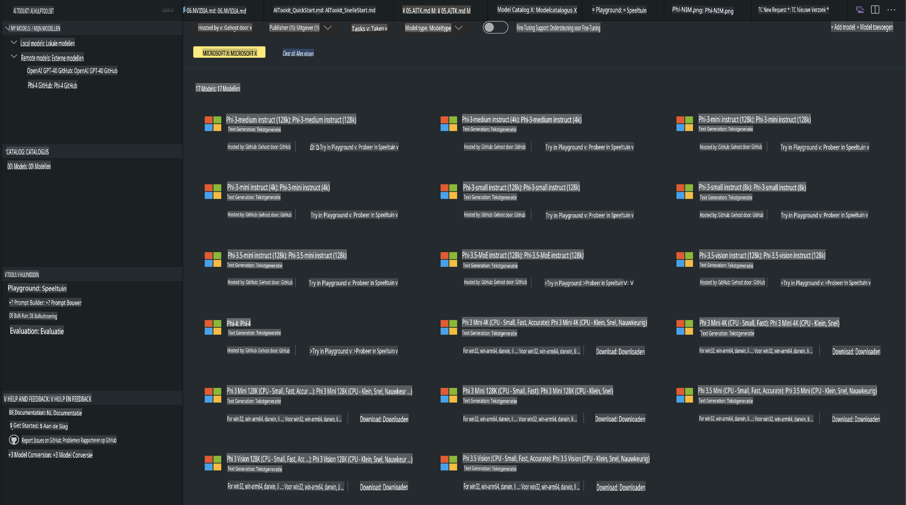
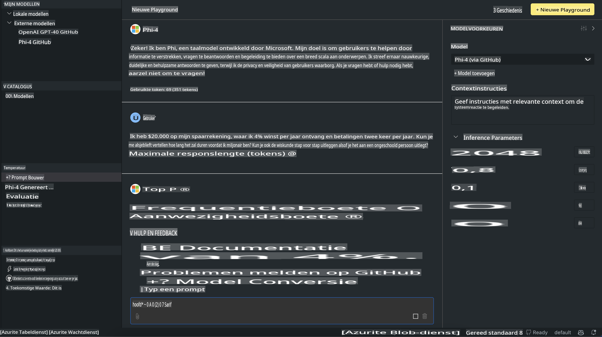

# Phi-familie in AITK

[AI Toolkit voor VS Code](https://marketplace.visualstudio.com/items?itemName=ms-windows-ai-studio.windows-ai-studio) vereenvoudigt de ontwikkeling van generatieve AI-apps door geavanceerde AI-ontwikkeltools en modellen uit de Azure AI Foundry Catalog en andere catalogi zoals Hugging Face samen te brengen. Je kunt de AI-modelcatalogus, aangedreven door GitHub Models en Azure AI Foundry Model Catalogs, doorzoeken, modellen lokaal of op afstand downloaden, finetunen, testen en gebruiken in je applicatie.

AI Toolkit Preview draait lokaal. Voor lokale inferentie of finetuning, afhankelijk van het model dat je hebt gekozen, heb je mogelijk een GPU nodig, zoals een NVIDIA CUDA GPU. Je kunt ook GitHub Models rechtstreeks met AITK uitvoeren.

## Aan de slag

[Lees meer over hoe je het Windows-subsysteem voor Linux installeert](https://learn.microsoft.com/windows/wsl/install?WT.mc_id=aiml-137032-kinfeylo)

en [hoe je de standaarddistributie wijzigt](https://learn.microsoft.com/windows/wsl/install#change-the-default-linux-distribution-installed).

[AI Toolkit GitHub Repo](https://github.com/microsoft/vscode-ai-toolkit/)

- Windows, Linux, macOS

- Voor finetuning op zowel Windows als Linux heb je een Nvidia GPU nodig. Daarnaast vereist **Windows** het subsysteem voor Linux met een Ubuntu-distributie van versie 18.4 of hoger. [Lees meer over hoe je het Windows-subsysteem voor Linux installeert](https://learn.microsoft.com/windows/wsl/install) en [hoe je de standaarddistributie wijzigt](https://learn.microsoft.com/windows/wsl/install#change-the-default-linux-distribution-installed).

### AI Toolkit installeren

AI Toolkit wordt geleverd als een [Visual Studio Code-extensie](https://code.visualstudio.com/docs/setup/additional-components#_vs-code-extensions), dus je moet eerst [VS Code](https://code.visualstudio.com/docs/setup/windows?WT.mc_id=aiml-137032-kinfeylo) installeren en AI Toolkit downloaden uit de [VS Marketplace](https://marketplace.visualstudio.com/items?itemName=ms-windows-ai-studio.windows-ai-studio).  
De [AI Toolkit is beschikbaar in de Visual Studio Marketplace](https://marketplace.visualstudio.com/items?itemName=ms-windows-ai-studio.windows-ai-studio) en kan worden geïnstalleerd zoals elke andere VS Code-extensie.

Als je niet bekend bent met het installeren van VS Code-extensies, volg dan deze stappen:

### Aanmelden

1. Selecteer in de Activiteitenbalk in VS Code **Extensies**.  
2. Typ in de zoekbalk voor extensies "AI Toolkit".  
3. Selecteer "AI Toolkit for Visual Studio Code".  
4. Klik op **Installeren**.

Je bent nu klaar om de extensie te gebruiken!

Je wordt gevraagd om je aan te melden bij GitHub, dus klik op "Toestaan" om verder te gaan. Je wordt doorgestuurd naar de aanmeldpagina van GitHub.

Meld je aan en volg de processtappen. Na succesvolle voltooiing word je teruggeleid naar VS Code.

Zodra de extensie is geïnstalleerd, verschijnt het AI Toolkit-pictogram in je Activiteitenbalk.

Laten we de beschikbare acties verkennen!

### Beschikbare acties

De primaire zijbalk van de AI Toolkit is georganiseerd in  

- **Modellen**
- **Resources**
- **Playground**  
- **Fine-tuning**
- **Evaluatie**

Deze zijn beschikbaar in de sectie Resources. Om te beginnen, selecteer **Model Catalog**.

### Een model downloaden uit de catalogus

Bij het starten van AI Toolkit vanuit de zijbalk van VS Code kun je kiezen uit de volgende opties:



- Zoek een ondersteund model in de **Model Catalog** en download het lokaal.  
- Test model-inferentie in de **Model Playground**.  
- Finetune het model lokaal of op afstand in **Model Fine-tuning**.  
- Implementeer gefinetunede modellen naar de cloud via de opdrachtpalet van AI Toolkit.  
- Evalueer modellen.

> [!NOTE]
>
> **GPU versus CPU**
>
> Je zult merken dat de modelkaarten de modelgrootte, het platform en het type accelerator (CPU, GPU) tonen. Voor geoptimaliseerde prestaties op **Windows-apparaten met ten minste één GPU**, selecteer modelversies die alleen Windows ondersteunen.
>
> Dit zorgt ervoor dat je een model hebt dat geoptimaliseerd is voor de DirectML-accelerator.
>
> De modelnamen hebben het formaat:
>
> - `{model_name}-{accelerator}-{quantization}-{format}`.
>
> Om te controleren of je een GPU hebt op je Windows-apparaat, open je **Taakbeheer** en selecteer je het tabblad **Prestaties**. Als je GPU's hebt, worden deze weergegeven onder namen zoals "GPU 0" of "GPU 1".

### Het model uitvoeren in de playground

Nadat alle parameters zijn ingesteld, klik je op **Generate Project**.

Zodra je model is gedownload, selecteer je **Load in Playground** op de modelkaart in de catalogus:

- Start de modeldownload.  
- Installeer alle vereisten en afhankelijkheden.  
- Maak een VS Code-werkruimte aan.  



### Gebruik de REST API in je applicatie 

De AI Toolkit wordt geleverd met een lokale REST API-webserver **op poort 5272** die het [OpenAI chat completions-formaat](https://platform.openai.com/docs/api-reference/chat/create) gebruikt.

Dit stelt je in staat om je applicatie lokaal te testen zonder afhankelijk te zijn van een cloud-AI-modelservice. Bijvoorbeeld, het volgende JSON-bestand laat zien hoe je het body-gedeelte van het verzoek kunt configureren:

```json
{
    "model": "Phi-4",
    "messages": [
        {
            "role": "user",
            "content": "what is the golden ratio?"
        }
    ],
    "temperature": 0.7,
    "top_p": 1,
    "top_k": 10,
    "max_tokens": 100,
    "stream": true
}
```

Je kunt de REST API testen met bijvoorbeeld [Postman](https://www.postman.com/) of de CURL (Client URL)-tool:

```bash
curl -vX POST http://127.0.0.1:5272/v1/chat/completions -H 'Content-Type: application/json' -d @body.json
```

### De OpenAI-clientbibliotheek voor Python gebruiken

```python
from openai import OpenAI

client = OpenAI(
    base_url="http://127.0.0.1:5272/v1/", 
    api_key="x" # required for the API but not used
)

chat_completion = client.chat.completions.create(
    messages=[
        {
            "role": "user",
            "content": "what is the golden ratio?",
        }
    ],
    model="Phi-4",
)

print(chat_completion.choices[0].message.content)
```

### De Azure OpenAI-clientbibliotheek voor .NET gebruiken

Voeg de [Azure OpenAI-clientbibliotheek voor .NET](https://www.nuget.org/packages/Azure.AI.OpenAI/) toe aan je project via NuGet:

```bash
dotnet add {project_name} package Azure.AI.OpenAI --version 1.0.0-beta.17
```

Voeg een C#-bestand genaamd **OverridePolicy.cs** toe aan je project en plak de volgende code:

```csharp
// OverridePolicy.cs
using Azure.Core.Pipeline;
using Azure.Core;

internal partial class OverrideRequestUriPolicy(Uri overrideUri)
    : HttpPipelineSynchronousPolicy
{
    private readonly Uri _overrideUri = overrideUri;

    public override void OnSendingRequest(HttpMessage message)
    {
        message.Request.Uri.Reset(_overrideUri);
    }
}
```

Plak vervolgens de volgende code in je **Program.cs**-bestand:

```csharp
// Program.cs
using Azure.AI.OpenAI;

Uri localhostUri = new("http://localhost:5272/v1/chat/completions");

OpenAIClientOptions clientOptions = new();
clientOptions.AddPolicy(
    new OverrideRequestUriPolicy(localhostUri),
    Azure.Core.HttpPipelinePosition.BeforeTransport);
OpenAIClient client = new(openAIApiKey: "unused", clientOptions);

ChatCompletionsOptions options = new()
{
    DeploymentName = "Phi-4",
    Messages =
    {
        new ChatRequestSystemMessage("You are a helpful assistant. Be brief and succinct."),
        new ChatRequestUserMessage("What is the golden ratio?"),
    }
};

StreamingResponse<StreamingChatCompletionsUpdate> streamingChatResponse
    = await client.GetChatCompletionsStreamingAsync(options);

await foreach (StreamingChatCompletionsUpdate chatChunk in streamingChatResponse)
{
    Console.Write(chatChunk.ContentUpdate);
}
```

## Fine-tuning met AI Toolkit

- Begin met het ontdekken van modellen en de playground.  
- Model finetuning en inferentie met behulp van lokale computerbronnen.  
- Externe finetuning en inferentie met behulp van Azure-resources.

[Fine-tuning met AI Toolkit](../../03.FineTuning/Finetuning_VSCodeaitoolkit.md)

## AI Toolkit Q&A Resources

Raadpleeg onze [Q&A-pagina](https://github.com/microsoft/vscode-ai-toolkit/blob/main/archive/QA.md) voor de meest voorkomende problemen en oplossingen.

**Disclaimer**:  
Dit document is vertaald met behulp van machine-gebaseerde AI-vertalingsdiensten. Hoewel we streven naar nauwkeurigheid, dient u zich ervan bewust te zijn dat geautomatiseerde vertalingen fouten of onnauwkeurigheden kunnen bevatten. Het originele document in zijn oorspronkelijke taal moet worden beschouwd als de gezaghebbende bron. Voor kritieke informatie wordt professionele menselijke vertaling aanbevolen. Wij zijn niet aansprakelijk voor misverstanden of verkeerde interpretaties die voortvloeien uit het gebruik van deze vertaling.