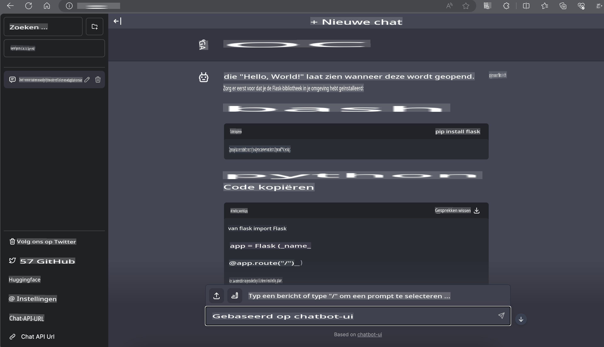

# **Inference Phi-3 in Nvidia Jetson**

Nvidia Jetson is een reeks embedded computing boards van Nvidia. De Jetson TK1, TX1 en TX2 modellen bevatten allemaal een Tegra-processor (of SoC) van Nvidia die een ARM-architectuur centrale verwerkingseenheid (CPU) integreert. Jetson is een energiezuinig systeem en is ontworpen om machine learning-toepassingen te versnellen. Nvidia Jetson wordt gebruikt door professionele ontwikkelaars om baanbrekende AI-producten te creëren in alle industrieën, en door studenten en enthousiastelingen voor praktische AI-ervaring en het maken van geweldige projecten. SLM wordt ingezet in edge-apparaten zoals Jetson, wat een betere implementatie van industriële generatieve AI-toepassingsscenario's mogelijk maakt.

## Implementatie op NVIDIA Jetson:
Ontwikkelaars die werken aan autonome robotica en embedded apparaten kunnen gebruik maken van Phi-3 Mini. De relatief kleine omvang van Phi-3 maakt het ideaal voor edge-implementatie. Parameters zijn zorgvuldig afgestemd tijdens de training, wat zorgt voor hoge nauwkeurigheid in reacties.

### TensorRT-LLM Optimalisatie:
NVIDIA's [TensorRT-LLM-bibliotheek](https://github.com/NVIDIA/TensorRT-LLM?WT.mc_id=aiml-138114-kinfeylo) optimaliseert de inferentie van grote taalmodellen. Het ondersteunt de lange contextvensters van Phi-3 Mini, wat zowel de doorvoer als de latentie verbetert. Optimalisaties omvatten technieken zoals LongRoPE, FP8 en inflight batching.

### Beschikbaarheid en Implementatie:
Ontwikkelaars kunnen Phi-3 Mini met het 128K contextvenster verkennen via [NVIDIA's AI](https://www.nvidia.com/en-us/ai-data-science/generative-ai/). Het wordt geleverd als een NVIDIA NIM, een microservice met een standaard API die overal kan worden ingezet. Daarnaast zijn er de [TensorRT-LLM-implementaties op GitHub](https://github.com/NVIDIA/TensorRT-LLM).

## **1. Voorbereiding**

a. Jetson Orin NX / Jetson NX

b. JetPack 5.1.2+
   
c. Cuda 11.8
   
d. Python 3.8+

## **2. Phi-3 uitvoeren op Jetson**

We kunnen kiezen voor [Ollama](https://ollama.com) of [LlamaEdge](https://llamaedge.com).

Als je gguf zowel in de cloud als op edge-apparaten wilt gebruiken, kan LlamaEdge worden gezien als WasmEdge (WasmEdge is een lichtgewicht, high-performance, schaalbare WebAssembly-runtime die geschikt is voor cloud-native, edge en gedecentraliseerde toepassingen. Het ondersteunt serverloze applicaties, embedded functies, microservices, smart contracts en IoT-apparaten. Je kunt het kwantitatieve model van gguf inzetten op edge-apparaten en in de cloud via LlamaEdge.


Hier zijn de stappen om het te gebruiken:

1. Installeer en download de benodigde bibliotheken en bestanden.

```bash

curl -sSf https://raw.githubusercontent.com/WasmEdge/WasmEdge/master/utils/install.sh | bash -s -- --plugin wasi_nn-ggml

curl -LO https://github.com/LlamaEdge/LlamaEdge/releases/latest/download/llama-api-server.wasm

curl -LO https://github.com/LlamaEdge/chatbot-ui/releases/latest/download/chatbot-ui.tar.gz

tar xzf chatbot-ui.tar.gz

```

**Opmerking**: llama-api-server.wasm en chatbot-ui moeten in dezelfde map staan.

2. Voer scripts uit in de terminal.

```bash

wasmedge --dir .:. --nn-preload default:GGML:AUTO:{Your gguf path} llama-api-server.wasm -p phi-3-chat

```

Hier is het resultaat van de uitvoering:



***Voorbeeldcode*** [Phi-3 mini WASM Notebook Voorbeeld](https://github.com/Azure-Samples/Phi-3MiniSamples/tree/main/wasm)

Samenvattend vertegenwoordigt Phi-3 Mini een sprong voorwaarts in taalmodellering, waarbij efficiëntie, contextbewustzijn en NVIDIA's optimalisatievermogen worden gecombineerd. Of je nu robots bouwt of edge-applicaties ontwikkelt, Phi-3 Mini is een krachtig hulpmiddel om in gedachten te houden.

**Disclaimer**:  
Dit document is vertaald met behulp van AI-gebaseerde vertaaldiensten. Hoewel we streven naar nauwkeurigheid, dient u zich ervan bewust te zijn dat geautomatiseerde vertalingen fouten of onnauwkeurigheden kunnen bevatten. Het originele document in de oorspronkelijke taal moet worden beschouwd als de gezaghebbende bron. Voor cruciale informatie wordt professionele menselijke vertaling aanbevolen. Wij zijn niet aansprakelijk voor misverstanden of verkeerde interpretaties die voortvloeien uit het gebruik van deze vertaling.