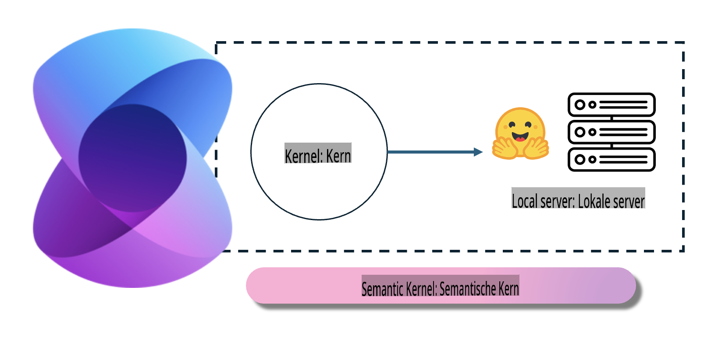
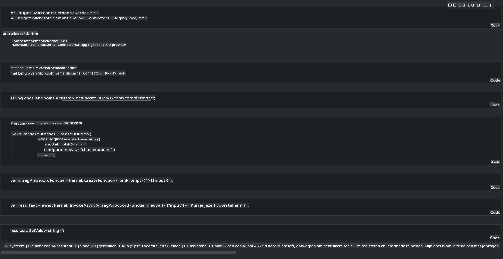

# **Inference Phi-3 op een lokale server**

We kunnen Phi-3 op een lokale server implementeren. Gebruikers kunnen kiezen voor [Ollama](https://ollama.com) of [LM Studio](https://llamaedge.com), of ze kunnen hun eigen code schrijven. Je kunt verbinding maken met de lokale diensten van Phi-3 via [Semantic Kernel](https://github.com/microsoft/semantic-kernel?WT.mc_id=aiml-138114-kinfeylo) of [Langchain](https://www.langchain.com/) om Copilot-toepassingen te bouwen.

## **Gebruik Semantic Kernel om toegang te krijgen tot Phi-3-mini**

In de Copilot-toepassing maken we applicaties via Semantic Kernel / LangChain. Dit type applicatiekader is over het algemeen compatibel met Azure OpenAI Service / OpenAI-modellen en kan ook open source-modellen op Hugging Face en lokale modellen ondersteunen. Wat moeten we doen als we Semantic Kernel willen gebruiken om toegang te krijgen tot Phi-3-mini? Als we .NET als voorbeeld nemen, kunnen we het combineren met de Hugging Face Connector in Semantic Kernel. Standaard kan het overeenkomen met de model-id op Hugging Face (bij het eerste gebruik wordt het model gedownload van Hugging Face, wat veel tijd kost). Je kunt ook verbinding maken met de zelfgebouwde lokale service. Van de twee raden we aan om de laatste te gebruiken, omdat deze een hogere mate van autonomie biedt, vooral in zakelijke toepassingen.

Uit de afbeelding blijkt dat toegang tot lokale diensten via Semantic Kernel eenvoudig verbinding kan maken met de zelfgebouwde Phi-3-mini modelserver. Hier is het resultaat van de uitvoering:

***Voorbeeldcode*** https://github.com/kinfey/Phi3MiniSamples/tree/main/semantickernel

**Disclaimer**:  
Dit document is vertaald met behulp van machine-gebaseerde AI-vertalingsdiensten. Hoewel we ons best doen voor nauwkeurigheid, dient u zich ervan bewust te zijn dat geautomatiseerde vertalingen fouten of onnauwkeurigheden kunnen bevatten. Het originele document in zijn oorspronkelijke taal moet worden beschouwd als de gezaghebbende bron. Voor kritieke informatie wordt professionele menselijke vertaling aanbevolen. Wij zijn niet aansprakelijk voor misverstanden of verkeerde interpretaties die voortvloeien uit het gebruik van deze vertaling.