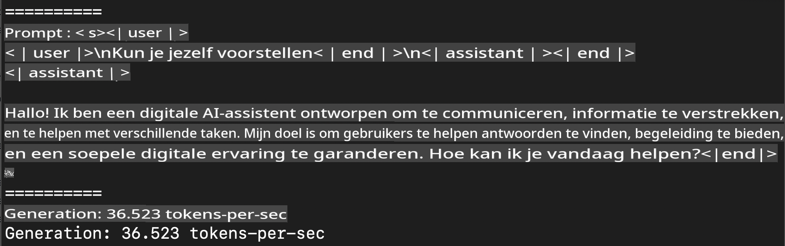
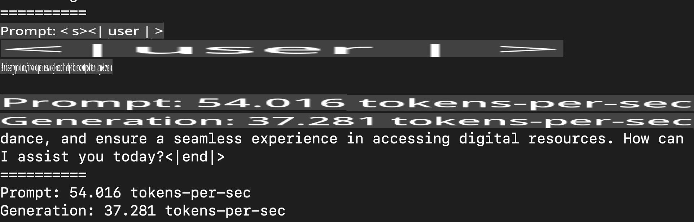
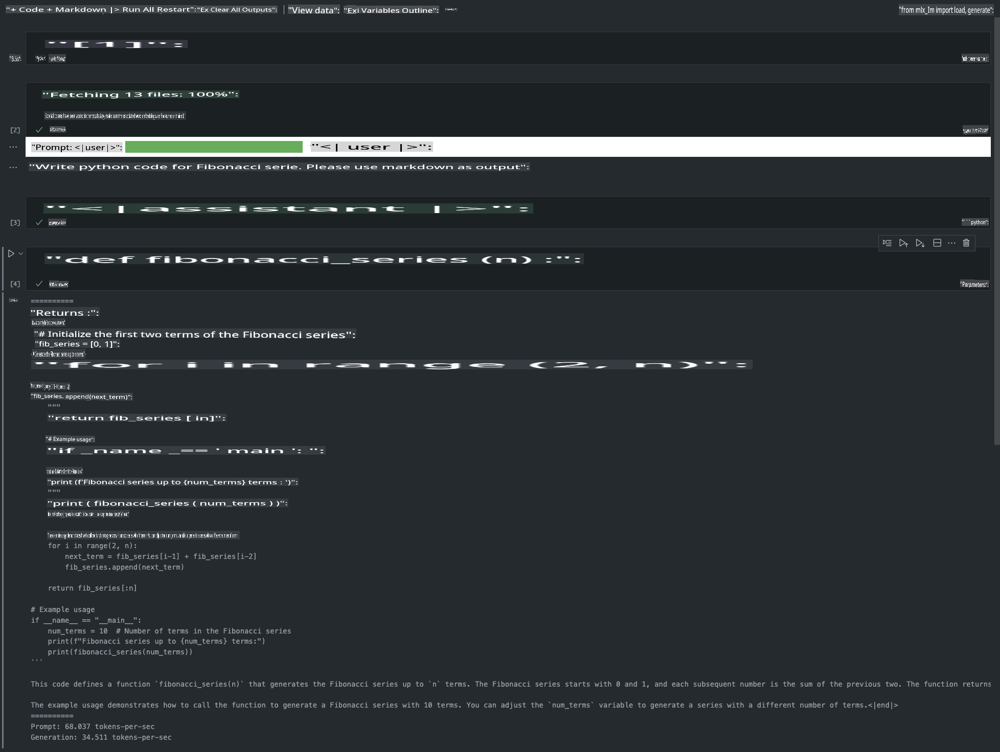

# **Inferentie Phi-3 met Apple MLX Framework**

## **Wat is het MLX Framework**

MLX is een array-framework voor machine learning-onderzoek op Apple silicon, ontwikkeld door Apple machine learning research.

MLX is ontworpen door machine learning-onderzoekers voor machine learning-onderzoekers. Het framework is bedoeld om gebruiksvriendelijk te zijn, maar tegelijkertijd efficiënt in het trainen en implementeren van modellen. Het ontwerp van het framework is ook conceptueel eenvoudig. Ons doel is het voor onderzoekers gemakkelijk te maken om MLX uit te breiden en te verbeteren, zodat nieuwe ideeën snel kunnen worden verkend.

LLM's kunnen worden versneld op Apple Silicon-apparaten via MLX, en modellen kunnen lokaal zeer eenvoudig worden uitgevoerd.

## **MLX gebruiken om Phi-3-mini te infereren**

### **1. Stel je MLX-omgeving in**

1. Python 3.11.x  
2. Installeer de MLX-bibliotheek  

```bash

pip install mlx-lm

```

### **2. Phi-3-mini uitvoeren in Terminal met MLX**

```bash

python -m mlx_lm.generate --model microsoft/Phi-3-mini-4k-instruct --max-token 2048 --prompt  "<|user|>\nCan you introduce yourself<|end|>\n<|assistant|>"

```

Het resultaat (mijn omgeving is Apple M1 Max, 64GB) is:



### **3. Phi-3-mini kwantiseren met MLX in Terminal**

```bash

python -m mlx_lm.convert --hf-path microsoft/Phi-3-mini-4k-instruct

```

***Opmerking:*** Het model kan worden gekwantiseerd met mlx_lm.convert, en de standaard kwantisering is INT4. Dit voorbeeld kwantiseert Phi-3-mini naar INT4.

Het model kan worden gekwantiseerd met mlx_lm.convert, en de standaard kwantisering is INT4. In dit voorbeeld wordt Phi-3-mini naar INT4 gekwantiseerd. Na kwantisering wordt het opgeslagen in de standaardmap ./mlx_model.

We kunnen het gekwantiseerde model testen met MLX vanuit de terminal:

```bash

python -m mlx_lm.generate --model ./mlx_model/ --max-token 2048 --prompt  "<|user|>\nCan you introduce yourself<|end|>\n<|assistant|>"

```

Het resultaat is:



### **4. Phi-3-mini uitvoeren met MLX in Jupyter Notebook**



***Opmerking:*** Lees dit voorbeeld [klik op deze link](../../../../../code/03.Inference/MLX/MLX_DEMO.ipynb)

## **Bronnen**

1. Meer informatie over Apple MLX Framework [https://ml-explore.github.io](https://ml-explore.github.io/mlx/build/html/index.html)

2. Apple MLX GitHub Repo [https://github.com/ml-explore](https://github.com/ml-explore)

**Disclaimer**:  
Dit document is vertaald met behulp van AI-gestuurde automatische vertaaldiensten. Hoewel we streven naar nauwkeurigheid, dient u zich ervan bewust te zijn dat geautomatiseerde vertalingen fouten of onnauwkeurigheden kunnen bevatten. Het originele document in de oorspronkelijke taal moet worden beschouwd als de gezaghebbende bron. Voor cruciale informatie wordt professionele menselijke vertaling aanbevolen. Wij zijn niet aansprakelijk voor misverstanden of verkeerde interpretaties die voortvloeien uit het gebruik van deze vertaling.