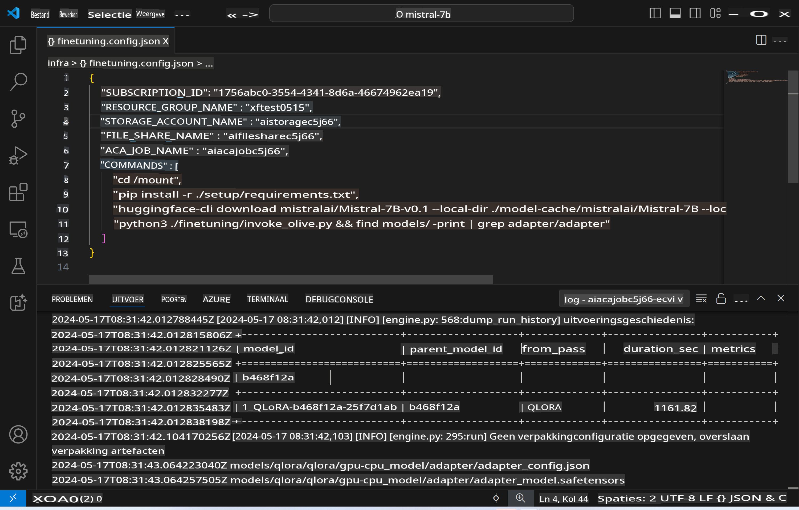
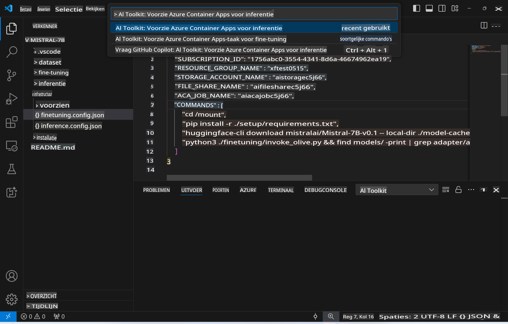
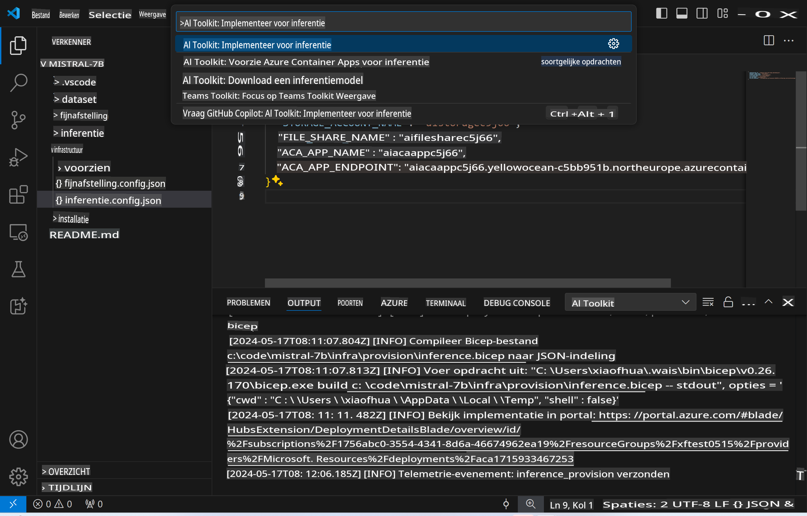
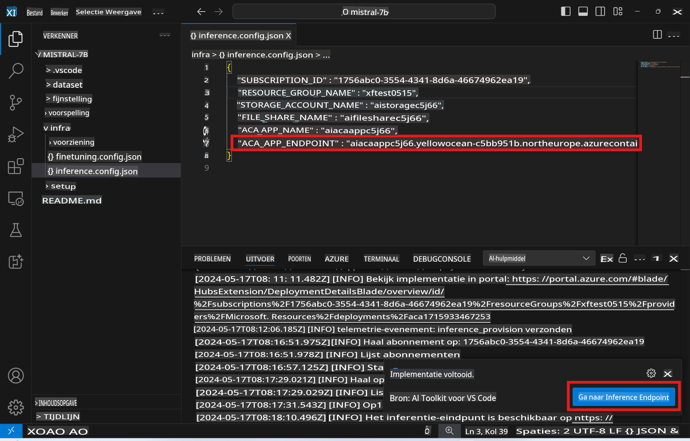

# Remote Inferentie met het fijn-afgestelde model

Nadat de adapters zijn getraind in de externe omgeving, kun je een eenvoudige Gradio-applicatie gebruiken om met het model te communiceren.



### Azure Resources Voorzien
Je moet de Azure Resources voor externe inferentie instellen door `AI Toolkit: Provision Azure Container Apps for inference` uit te voeren vanuit de opdrachtpalet. Tijdens deze setup wordt gevraagd om je Azure-abonnement en resourcegroep te selecteren.  

   
Standaard zouden het abonnement en de resourcegroep voor inferentie overeen moeten komen met die gebruikt voor fijn-afstemming. De inferentie maakt gebruik van dezelfde Azure Container App Environment en heeft toegang tot het model en de modeladapter die zijn opgeslagen in Azure Files, welke zijn gegenereerd tijdens de fijn-afstemming.

## Gebruik van AI Toolkit 

### Implementatie voor Inferentie  
Als je de inferentiecode wilt aanpassen of het inferentiemodel opnieuw wilt laden, voer dan de `AI Toolkit: Deploy for inference` opdracht uit. Dit synchroniseert je nieuwste code met ACA en herstart de replica.  



Na succesvolle implementatie is het model klaar voor evaluatie via dit eindpunt.

### Toegang tot de Inferentie-API

Je kunt toegang krijgen tot de inferentie-API door te klikken op de knop "*Ga naar Inferentie Eindpunt*" die wordt weergegeven in de VSCode-melding. Alternatief kun je het web-API eindpunt vinden onder `ACA_APP_ENDPOINT` in `./infra/inference.config.json` en in het uitvoerpaneel.



> **Opmerking:** Het inferentie-eindpunt kan enkele minuten nodig hebben om volledig operationeel te worden.

## Inferentiecomponenten Inbegrepen in de Template
 
| Map | Inhoud |
| ------ |--------- |
| `infra` | Bevat alle benodigde configuraties voor externe operaties. |
| `infra/provision/inference.parameters.json` | Bevat parameters voor de bicep-templates, gebruikt voor het voorzien van Azure-resources voor inferentie. |
| `infra/provision/inference.bicep` | Bevat templates voor het voorzien van Azure-resources voor inferentie. |
| `infra/inference.config.json` | Het configuratiebestand, gegenereerd door de `AI Toolkit: Provision Azure Container Apps for inference` opdracht. Het wordt gebruikt als invoer voor andere externe opdrachtpaletten. |

### Gebruik van AI Toolkit voor het configureren van Azure Resource Voorziening
Configureer de [AI Toolkit](https://marketplace.visualstudio.com/items?itemName=ms-windows-ai-studio.windows-ai-studio)

Voorzie Azure Container Apps voor inferentie` command.

You can find configuration parameters in `./infra/provision/inference.parameters.json` file. Here are the details:
| Parameter | Description |
| --------- |------------ |
| `defaultCommands` | This is the commands to initiate a web API. |
| `maximumInstanceCount` | This parameter sets the maximum capacity of GPU instances. |
| `location` | This is the location where Azure resources are provisioned. The default value is the same as the chosen resource group's location. |
| `storageAccountName`, `fileShareName` `acaEnvironmentName`, `acaEnvironmentStorageName`, `acaAppName`,  `acaLogAnalyticsName` | These parameters are used to name the Azure resources for provision. By default, they will be same to the fine-tuning resource name. You can input a new, unused resource name to create your own custom-named resources, or you can input the name of an already existing Azure resource if you'd prefer to use that. For details, refer to the section [Using existing Azure Resources](../../../../../md/01.Introduction/03). |

### Using Existing Azure Resources

By default, the inference provision use the same Azure Container App Environment, Storage Account, Azure File Share, and Azure Log Analytics that were used for fine-tuning. A separate Azure Container App is created solely for the inference API. 

If you have customized the Azure resources during the fine-tuning step or want to use your own existing Azure resources for inference, specify their names in the `./infra/inference.parameters.json` bestand. Voer vervolgens de `AI Toolkit: Provision Azure Container Apps for inference` opdracht uit vanuit de opdrachtpalet. Dit werkt gespecificeerde resources bij en creëert ontbrekende resources.

Bijvoorbeeld, als je een bestaande Azure-containeromgeving hebt, zou je `./infra/finetuning.parameters.json` er als volgt uit moeten zien:

```json
{
    "$schema": "https://schema.management.azure.com/schemas/2019-04-01/deploymentParameters.json#",
    "contentVersion": "1.0.0.0",
    "parameters": {
      ...
      "acaEnvironmentName": {
        "value": "<your-aca-env-name>"
      },
      "acaEnvironmentStorageName": {
        "value": null
      },
      ...
    }
  }
```

### Handmatige Voorziening  
Als je liever handmatig de Azure-resources configureert, kun je de meegeleverde bicep-bestanden gebruiken in het `./infra/provision` folders. If you have already set up and configured all the Azure resources without using the AI Toolkit command palette, you can simply enter the resource names in the `inference.config.json` bestand.

Bijvoorbeeld:

```json
{
  "SUBSCRIPTION_ID": "<your-subscription-id>",
  "RESOURCE_GROUP_NAME": "<your-resource-group-name>",
  "STORAGE_ACCOUNT_NAME": "<your-storage-account-name>",
  "FILE_SHARE_NAME": "<your-file-share-name>",
  "ACA_APP_NAME": "<your-aca-name>",
  "ACA_APP_ENDPOINT": "<your-aca-endpoint>"
}
```

**Disclaimer**:  
Dit document is vertaald met behulp van AI-gestuurde machinevertalingsdiensten. Hoewel we ons best doen om nauwkeurigheid te waarborgen, dient u zich ervan bewust te zijn dat geautomatiseerde vertalingen fouten of onnauwkeurigheden kunnen bevatten. Het originele document in de oorspronkelijke taal moet worden beschouwd als de gezaghebbende bron. Voor cruciale informatie wordt professionele menselijke vertaling aanbevolen. Wij zijn niet aansprakelijk voor misverstanden of verkeerde interpretaties die voortvloeien uit het gebruik van deze vertaling.