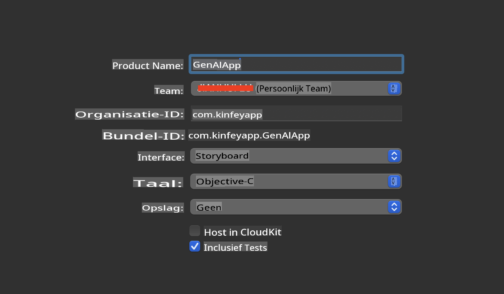
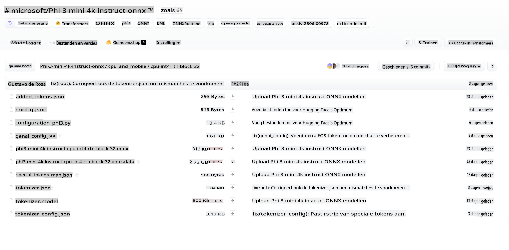
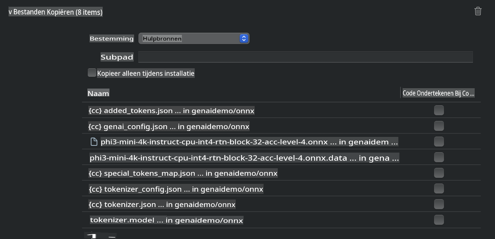
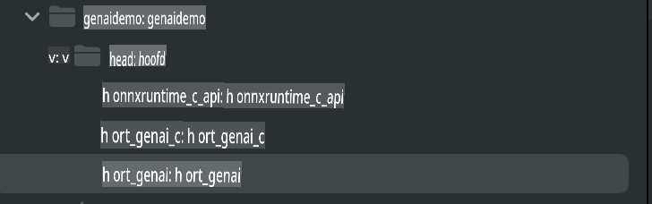
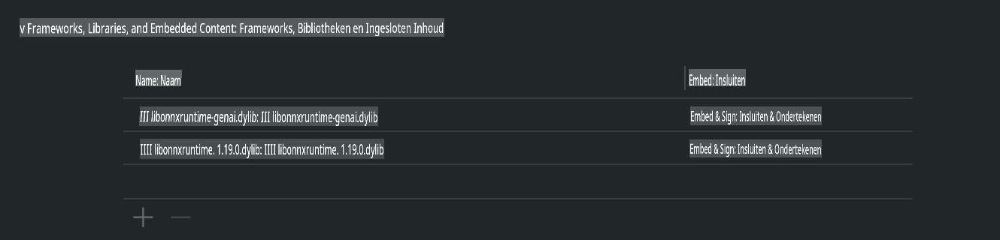
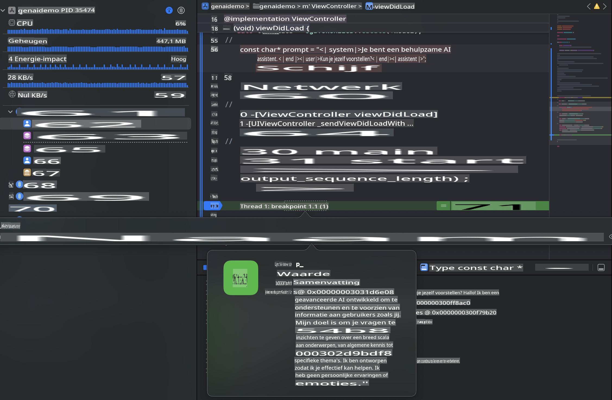

# **Inference Phi-3 in iOS**

Phi-3-mini is een nieuwe reeks modellen van Microsoft die de implementatie van Large Language Models (LLMs) op edge-apparaten en IoT-apparaten mogelijk maakt. Phi-3-mini is beschikbaar voor iOS, Android en edge-apparaten, waardoor generatieve AI kan worden ingezet in BYOD-omgevingen. Het volgende voorbeeld laat zien hoe je Phi-3-mini op iOS kunt implementeren.

## **1. Voorbereiding**

- **a.** macOS 14+
- **b.** Xcode 15+
- **c.** iOS SDK 17.x (iPhone 14 A16 of hoger)
- **d.** Installeer Python 3.10+ (Conda wordt aanbevolen)
- **e.** Installeer de Python-bibliotheek: `python-flatbuffers`
- **f.** Installeer CMake

### Semantic Kernel en Inference

Semantic Kernel is een applicatiekader waarmee je toepassingen kunt maken die compatibel zijn met Azure OpenAI Service, OpenAI-modellen en zelfs lokale modellen. Door toegang te krijgen tot lokale services via Semantic Kernel kun je eenvoudig integreren met je zelf-gehoste Phi-3-mini modelserver.

### Het aanroepen van gequantiseerde modellen met Ollama of LlamaEdge

Veel gebruikers geven de voorkeur aan het gebruik van gequantiseerde modellen om modellen lokaal uit te voeren. [Ollama](https://ollama.com) en [LlamaEdge](https://llamaedge.com) maken het mogelijk om verschillende gequantiseerde modellen aan te roepen:

#### **Ollama**

Je kunt `ollama run phi3` direct uitvoeren of offline configureren. Maak een Modelfile met het pad naar je `gguf` bestand. Voorbeeldcode om het gequantiseerde Phi-3-mini model uit te voeren:

```gguf
FROM {Add your gguf file path}
TEMPLATE \"\"\"<|user|> .Prompt<|end|> <|assistant|>\"\"\"
PARAMETER stop <|end|>
PARAMETER num_ctx 4096
```

#### **LlamaEdge**

Als je `gguf` tegelijkertijd in de cloud en op edge-apparaten wilt gebruiken, is LlamaEdge een uitstekende optie.

## **2. Het compileren van ONNX Runtime voor iOS**

```bash

git clone https://github.com/microsoft/onnxruntime.git

cd onnxruntime

./build.sh --build_shared_lib --ios --skip_tests --parallel --build_dir ./build_ios --ios --apple_sysroot iphoneos --osx_arch arm64 --apple_deploy_target 17.5 --cmake_generator Xcode --config Release

cd ../

```

### **Opmerking**

- **a.** Zorg ervoor dat Xcode correct is geconfigureerd en stel het in als de actieve ontwikkelaarsdirectory in de terminal voordat je gaat compileren:

    ```bash
    sudo xcode-select -switch /Applications/Xcode.app/Contents/Developer
    ```

- **b.** ONNX Runtime moet worden gecompileerd voor verschillende platforms. Voor iOS kun je compileren voor `arm64` or `x86_64`.

- **c.** Het wordt aanbevolen om de nieuwste iOS SDK te gebruiken voor het compileren. Je kunt echter ook een oudere versie gebruiken als je compatibiliteit met eerdere SDK's nodig hebt.

## **3. Generatieve AI compileren met ONNX Runtime voor iOS**

> **Opmerking:** Omdat Generatieve AI met ONNX Runtime nog in preview is, houd rekening met mogelijke wijzigingen.

```bash

git clone https://github.com/microsoft/onnxruntime-genai
 
cd onnxruntime-genai
 
mkdir ort
 
cd ort
 
mkdir include
 
mkdir lib
 
cd ../
 
cp ../onnxruntime/include/onnxruntime/core/session/onnxruntime_c_api.h ort/include
 
cp ../onnxruntime/build_ios/Release/Release-iphoneos/libonnxruntime*.dylib* ort/lib
 
export OPENCV_SKIP_XCODEBUILD_FORCE_TRYCOMPILE_DEBUG=1
 
python3 build.py --parallel --build_dir ./build_ios --ios --ios_sysroot iphoneos --ios_arch arm64 --ios_deployment_target 17.5 --cmake_generator Xcode --cmake_extra_defines CMAKE_XCODE_ATTRIBUTE_CODE_SIGNING_ALLOWED=NO

```

## **4. Maak een App-toepassing in Xcode**

Ik heb gekozen voor Objective-C als ontwikkelmethode voor de app, omdat Objective-C beter compatibel is bij gebruik van Generatieve AI met de ONNX Runtime C++ API. Uiteraard kun je ook gerelateerde aanroepen uitvoeren via Swift bridging.



## **5. Kopieer het ONNX gequantiseerde INT4-model naar het App-project**

We moeten het INT4-quantisatiemodel in ONNX-formaat importeren, dat eerst moet worden gedownload.



Na het downloaden moet je het toevoegen aan de Resources-directory van het project in Xcode.



## **6. Voeg de C++ API toe in ViewControllers**

> **Opmerking:**

- **a.** Voeg de bijbehorende C++ headerbestanden toe aan het project.

  

- **b.** Neem `onnxruntime-genai` dynamic library in Xcode.

  

- **c.** Use the C Samples code for testing. You can also add additional features like ChatUI for more functionality.

- **d.** Since you need to use C++ in your project, rename `ViewController.m` to `ViewController.mm` op om Objective-C++-ondersteuning in te schakelen.

```objc

    NSString *llmPath = [[NSBundle mainBundle] resourcePath];
    char const *modelPath = llmPath.cString;

    auto model =  OgaModel::Create(modelPath);

    auto tokenizer = OgaTokenizer::Create(*model);

    const char* prompt = "<|system|>You are a helpful AI assistant.<|end|><|user|>Can you introduce yourself?<|end|><|assistant|>";

    auto sequences = OgaSequences::Create();
    tokenizer->Encode(prompt, *sequences);

    auto params = OgaGeneratorParams::Create(*model);
    params->SetSearchOption("max_length", 100);
    params->SetInputSequences(*sequences);

    auto output_sequences = model->Generate(*params);
    const auto output_sequence_length = output_sequences->SequenceCount(0);
    const auto* output_sequence_data = output_sequences->SequenceData(0);
    auto out_string = tokenizer->Decode(output_sequence_data, output_sequence_length);
    
    auto tmp = out_string;

```

## **7. De applicatie uitvoeren**

Zodra de installatie is voltooid, kun je de applicatie uitvoeren om de resultaten van de Phi-3-mini modelinference te bekijken.



Voor meer voorbeeldcode en gedetailleerde instructies, bezoek de [Phi-3 Mini Samples repository](https://github.com/Azure-Samples/Phi-3MiniSamples/tree/main/ios).

**Disclaimer (Vrijwaring)**:  
Dit document is vertaald met behulp van machine-gebaseerde AI-vertalingsdiensten. Hoewel we ons best doen voor nauwkeurigheid, dient u zich ervan bewust te zijn dat geautomatiseerde vertalingen fouten of onnauwkeurigheden kunnen bevatten. Het originele document in de oorspronkelijke taal moet worden beschouwd als de gezaghebbende bron. Voor kritieke informatie wordt professionele menselijke vertaling aanbevolen. Wij zijn niet aansprakelijk voor misverstanden of verkeerde interpretaties die voortvloeien uit het gebruik van deze vertaling.