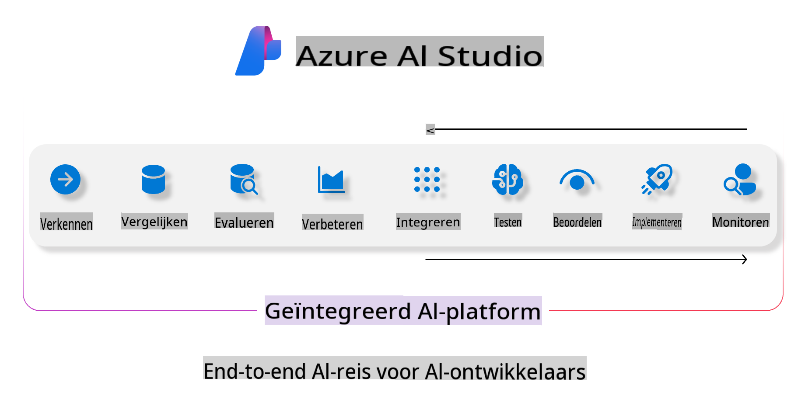
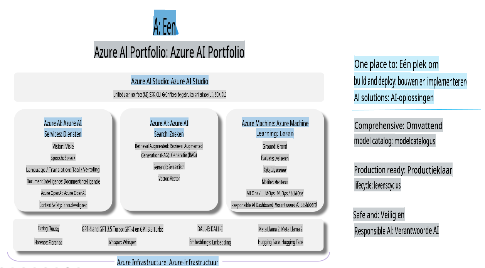

# **Azure AI Foundry gebruiken voor evaluatie**

Hoe je jouw generatieve AI-toepassing kunt evalueren met [Azure AI Foundry](https://ai.azure.com?WT.mc_id=aiml-138114-kinfeylo). Of je nu enkelvoudige of meerlagige gesprekken beoordeelt, Azure AI Foundry biedt tools voor het evalueren van modelprestaties en veiligheid.

## Hoe generatieve AI-apps evalueren met Azure AI Foundry
Voor meer gedetailleerde instructies, zie de [Azure AI Foundry-documentatie](https://learn.microsoft.com/azure/ai-studio/how-to/evaluate-generative-ai-app?WT.mc_id=aiml-138114-kinfeylo).

Hier zijn de stappen om te beginnen:

## Generatieve AI-modellen evalueren in Azure AI Foundry

**Vereisten**

- Een testdataset in CSV- of JSON-formaat.
- Een gedeployed generatief AI-model (zoals Phi-3, GPT 3.5, GPT 4 of Davinci-modellen).
- Een runtime met een compute-instance om de evaluatie uit te voeren.

## Ingebouwde evaluatiemetrics

Azure AI Foundry stelt je in staat om zowel enkelvoudige als complexe, meerlagige gesprekken te evalueren.  
Voor Retrieval Augmented Generation (RAG)-scenario's, waarbij het model gebaseerd is op specifieke data, kun je prestaties beoordelen met ingebouwde evaluatiemetrics.  
Daarnaast kun je algemene enkelvoudige vraag-en-antwoordscenario's (niet-RAG) evalueren.

## Een evaluatierun maken

Ga in de Azure AI Foundry-interface naar de Evaluate-pagina of de Prompt Flow-pagina.  
Volg de evaluatie-wizard om een evaluatierun in te stellen. Geef een optionele naam voor je evaluatie.  
Selecteer het scenario dat aansluit bij de doelstellingen van je toepassing.  
Kies een of meer evaluatiemetrics om de output van het model te beoordelen.

## Aangepaste evaluatiestroom (optioneel)

Voor meer flexibiliteit kun je een aangepaste evaluatiestroom opzetten. Pas het evaluatieproces aan op basis van jouw specifieke vereisten.

## Resultaten bekijken

Na het uitvoeren van de evaluatie kun je gedetailleerde evaluatiemetrics loggen, bekijken en analyseren in Azure AI Foundry. Verkrijg inzichten in de mogelijkheden en beperkingen van je toepassing.

**Opmerking** Azure AI Foundry bevindt zich momenteel in openbare preview, dus gebruik het voor experimentele en ontwikkelingsdoeleinden. Voor productieworkloads kun je andere opties overwegen. Bekijk de officiële [AI Foundry-documentatie](https://learn.microsoft.com/azure/ai-studio/?WT.mc_id=aiml-138114-kinfeylo) voor meer details en stapsgewijze instructies.

**Disclaimer**:  
Dit document is vertaald met behulp van AI-gestuurde machinale vertaaldiensten. Hoewel we ons best doen voor nauwkeurigheid, moet u zich ervan bewust zijn dat geautomatiseerde vertalingen fouten of onnauwkeurigheden kunnen bevatten. Het oorspronkelijke document in zijn oorspronkelijke taal moet worden beschouwd als de gezaghebbende bron. Voor cruciale informatie wordt professionele menselijke vertaling aanbevolen. Wij zijn niet aansprakelijk voor misverstanden of verkeerde interpretaties die voortvloeien uit het gebruik van deze vertaling.