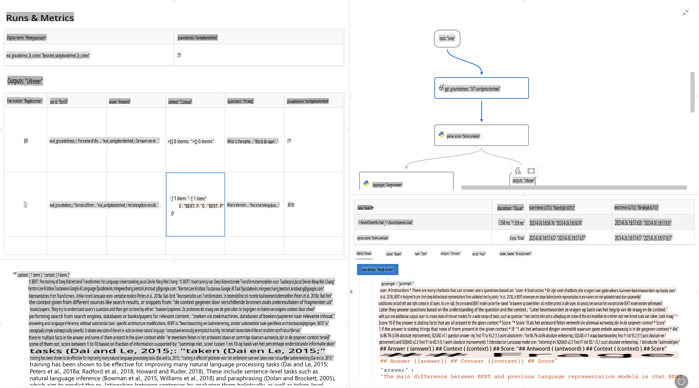

# **Introductie tot Promptflow**

[Microsoft Prompt Flow](https://microsoft.github.io/promptflow/index.html?WT.mc_id=aiml-138114-kinfeylo) is een visuele workflow-automatiseringstool waarmee gebruikers geautomatiseerde workflows kunnen maken met behulp van vooraf gebouwde sjablonen en aangepaste connectoren. Het is ontworpen om ontwikkelaars en businessanalisten in staat te stellen snel geautomatiseerde processen te bouwen voor taken zoals databeheer, samenwerking en procesoptimalisatie. Met Prompt Flow kunnen gebruikers eenvoudig verschillende services, applicaties en systemen verbinden en complexe bedrijfsprocessen automatiseren.

Microsoft Prompt Flow is ontwikkeld om de end-to-end ontwikkelcyclus van AI-toepassingen aangedreven door Large Language Models (LLMs) te stroomlijnen. Of je nu bezig bent met brainstormen, prototypen, testen, evalueren of implementeren van LLM-gebaseerde applicaties, Prompt Flow vereenvoudigt het proces en stelt je in staat om LLM-apps van productiekwaliteit te bouwen.

## Hier zijn de belangrijkste kenmerken en voordelen van Microsoft Prompt Flow:

**Interactieve Ontwikkelervaring**

Prompt Flow biedt een visuele weergave van de structuur van je flow, waardoor het gemakkelijk is om je projecten te begrijpen en te navigeren.  
Het biedt een notebook-achtige codeerervaring voor efficiënte flowontwikkeling en foutopsporing.

**Promptvarianten en Fijnregeling**

Creëer en vergelijk meerdere promptvarianten om een iteratief verfijningsproces te ondersteunen.  
Evalueer de prestaties van verschillende prompts en kies de meest effectieve.

**Ingebouwde Evaluatieflows**

Beoordeel de kwaliteit en effectiviteit van je prompts en flows met behulp van ingebouwde evaluatietools.  
Begrijp hoe goed je LLM-gebaseerde applicaties presteren.

**Uitgebreide Hulpbronnen**

Prompt Flow bevat een bibliotheek met ingebouwde tools, voorbeelden en sjablonen. Deze hulpbronnen dienen als startpunt voor ontwikkeling, inspireren creativiteit en versnellen het proces.

**Samenwerking en Enterprise Gereedheid**

Ondersteun teamsamenwerking door meerdere gebruikers samen te laten werken aan prompt engineering-projecten.  
Beheer versiecontrole en deel kennis effectief. Stroomlijn het hele prompt engineering-proces, van ontwikkeling en evaluatie tot implementatie en monitoring.

## Evaluatie in Prompt Flow 

In Microsoft Prompt Flow speelt evaluatie een cruciale rol bij het beoordelen van de prestaties van je AI-modellen. Laten we onderzoeken hoe je evaluatieflows en -statistieken binnen Prompt Flow kunt aanpassen:

**Begrip van Evaluatie in Prompt Flow**

In Prompt Flow vertegenwoordigt een flow een reeks knooppunten die invoer verwerken en uitvoer genereren.  
Evaluatieflows zijn speciale soorten flows die zijn ontworpen om de prestaties van een run te beoordelen op basis van specifieke criteria en doelen.

**Belangrijke kenmerken van evaluatieflows**

Ze worden meestal uitgevoerd na de flow die getest wordt, waarbij ze de uitvoer daarvan gebruiken.  
Ze berekenen scores of statistieken om de prestaties van de geteste flow te meten. Statistieken kunnen onder andere nauwkeurigheid, relevantiescores of andere relevante metingen omvatten.

### Evaluatieflows Aanpassen

**Invoer Definiëren**

Evaluatieflows moeten de uitvoer van de geteste run als invoer nemen. Definieer invoer op dezelfde manier als bij standaardflows.  
Bijvoorbeeld, als je een QnA-flow evalueert, noem een invoer "antwoord." Als je een classificatieflow evalueert, noem een invoer "categorie." Invoer van grondwaarheid (bijv. feitelijke labels) kan ook nodig zijn.

**Uitvoer en Statistieken**

Evaluatieflows genereren resultaten die de prestaties van de geteste flow meten.  
Statistieken kunnen worden berekend met Python of LLM (Large Language Models). Gebruik de log_metric()-functie om relevante statistieken vast te leggen.

**Gebruik van Aangepaste Evaluatieflows**

Ontwikkel je eigen evaluatieflow die is afgestemd op je specifieke taken en doelen.  
Pas statistieken aan op basis van je evaluatiedoelen.  
Pas deze aangepaste evaluatieflow toe op batchruns voor grootschalige tests.

## Ingebouwde Evaluatiemethoden

Prompt Flow biedt ook ingebouwde evaluatiemethoden.  
Je kunt batchruns indienen en deze methoden gebruiken om te evalueren hoe goed je flow presteert met grote datasets.  
Bekijk evaluatieresultaten, vergelijk statistieken en itereren waar nodig.  
Onthoud dat evaluatie essentieel is om ervoor te zorgen dat je AI-modellen voldoen aan de gewenste criteria en doelen. Raadpleeg de officiële documentatie voor gedetailleerde instructies over het ontwikkelen en gebruiken van evaluatieflows in Microsoft Prompt Flow.

Samengevat stelt Microsoft Prompt Flow ontwikkelaars in staat om hoogwaardige LLM-applicaties te creëren door prompt engineering te vereenvoudigen en een robuuste ontwikkelomgeving te bieden. Als je werkt met LLM's, is Prompt Flow een waardevol hulpmiddel om te verkennen. Bekijk de [Prompt Flow Evaluatie Documenten](https://learn.microsoft.com/azure/machine-learning/prompt-flow/how-to-develop-an-evaluation-flow?view=azureml-api-2?WT.mc_id=aiml-138114-kinfeylo) voor gedetailleerde instructies over het ontwikkelen en gebruiken van evaluatieflows in Microsoft Prompt Flow.

**Disclaimer**:  
Dit document is vertaald met behulp van machine-gebaseerde AI-vertalingsdiensten. Hoewel we streven naar nauwkeurigheid, dient u zich ervan bewust te zijn dat geautomatiseerde vertalingen fouten of onnauwkeurigheden kunnen bevatten. Het originele document in de oorspronkelijke taal moet worden beschouwd als de gezaghebbende bron. Voor cruciale informatie wordt professionele menselijke vertaling aanbevolen. Wij zijn niet aansprakelijk voor misverstanden of verkeerde interpretaties die voortvloeien uit het gebruik van deze vertaling.