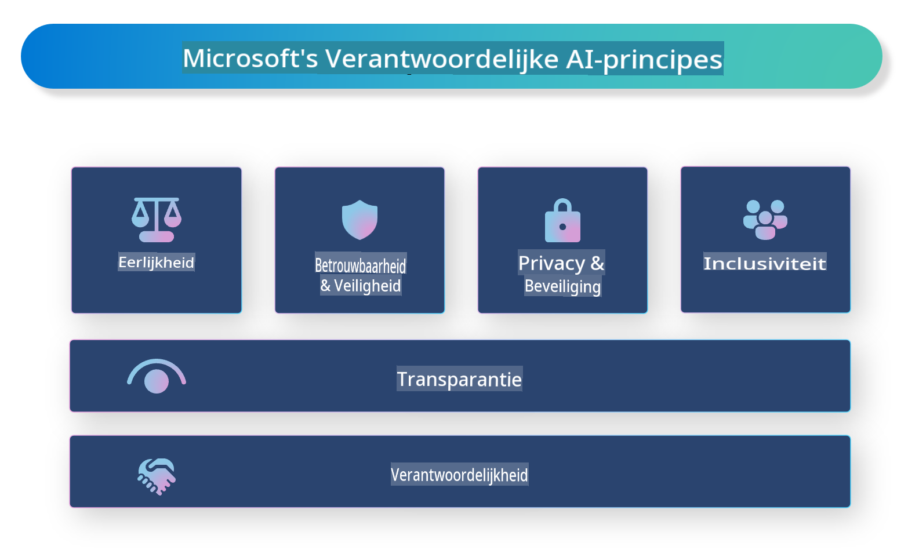

# **Introduceer Verantwoordelijke AI**

[Microsoft Responsible AI](https://www.microsoft.com/ai/responsible-ai?WT.mc_id=aiml-138114-kinfeylo) is een initiatief dat ontwikkelaars en organisaties helpt bij het bouwen van AI-systemen die transparant, betrouwbaar en verantwoordelijk zijn. Het initiatief biedt richtlijnen en middelen voor het ontwikkelen van verantwoorde AI-oplossingen die in lijn zijn met ethische principes, zoals privacy, eerlijkheid en transparantie. We bespreken ook enkele uitdagingen en beste praktijken die komen kijken bij het bouwen van verantwoorde AI-systemen.

## Overzicht van Microsoft Responsible AI

**Ethische principes**

Microsoft Responsible AI wordt geleid door een reeks ethische principes, zoals privacy, eerlijkheid, transparantie, verantwoordelijkheid en veiligheid. Deze principes zijn ontworpen om ervoor te zorgen dat AI-systemen op een ethische en verantwoorde manier worden ontwikkeld.

**Transparante AI**

Microsoft Responsible AI benadrukt het belang van transparantie in AI-systemen. Dit omvat het geven van duidelijke uitleg over hoe AI-modellen werken en het publiekelijk beschikbaar maken van gegevensbronnen en algoritmen.

**Verantwoorde AI**

[Microsoft Responsible AI](https://www.microsoft.com/ai/responsible-ai?WT.mc_id=aiml-138114-kinfeylo) stimuleert de ontwikkeling van verantwoordelijke AI-systemen die inzicht kunnen bieden in hoe AI-modellen beslissingen nemen. Dit helpt gebruikers om de outputs van AI-systemen te begrijpen en erop te vertrouwen.

**Inclusiviteit**

AI-systemen moeten ontworpen zijn om iedereen te bevoordelen. Microsoft streeft ernaar inclusieve AI te creëren die rekening houdt met diverse perspectieven en vooroordelen of discriminatie vermijdt.

**Betrouwbaarheid en veiligheid**

Het is cruciaal dat AI-systemen betrouwbaar en veilig zijn. Microsoft richt zich op het bouwen van robuuste modellen die consistent presteren en schadelijke uitkomsten vermijden.

**Eerlijkheid in AI**

Microsoft Responsible AI erkent dat AI-systemen vooroordelen kunnen versterken als ze worden getraind op bevooroordeelde gegevens of algoritmen. Het initiatief biedt richtlijnen voor het ontwikkelen van eerlijke AI-systemen die niet discrimineren op basis van factoren zoals ras, geslacht of leeftijd.

**Privacy en beveiliging**

Microsoft Responsible AI legt de nadruk op het beschermen van de privacy van gebruikers en de beveiliging van gegevens in AI-systemen. Dit omvat het implementeren van sterke gegevensversleuteling en toegangscontroles, evenals het regelmatig auditen van AI-systemen op kwetsbaarheden.

**Verantwoordelijkheid en aansprakelijkheid**

Microsoft Responsible AI bevordert verantwoordelijkheid en aansprakelijkheid bij de ontwikkeling en inzet van AI. Dit omvat ervoor zorgen dat ontwikkelaars en organisaties zich bewust zijn van de potentiële risico's van AI-systemen en stappen ondernemen om deze risico's te beperken.

## Beste praktijken voor het bouwen van verantwoorde AI-systemen

**Ontwikkel AI-modellen met diverse datasets**

Om vooroordelen in AI-systemen te vermijden, is het belangrijk om diverse datasets te gebruiken die een breed scala aan perspectieven en ervaringen vertegenwoordigen.

**Gebruik uitlegbare AI-technieken**

Uitlegbare AI-technieken kunnen gebruikers helpen te begrijpen hoe AI-modellen beslissingen nemen, wat het vertrouwen in het systeem kan vergroten.

**Voer regelmatig audits uit op AI-systemen**

Regelmatige audits van AI-systemen kunnen helpen om potentiële risico's en kwetsbaarheden te identificeren die moeten worden aangepakt.

**Implementeer sterke gegevensversleuteling en toegangscontroles**

Gegevensversleuteling en toegangscontroles kunnen helpen bij het beschermen van de privacy en beveiliging van gebruikers in AI-systemen.

**Volg ethische principes bij AI-ontwikkeling**

Het volgen van ethische principes, zoals eerlijkheid, transparantie en verantwoordelijkheid, kan helpen om vertrouwen in AI-systemen op te bouwen en ervoor te zorgen dat deze op een verantwoorde manier worden ontwikkeld.

## AI Foundry gebruiken voor Verantwoorde AI

[Azure AI Foundry](https://ai.azure.com?WT.mc_id=aiml-138114-kinfeylo) is een krachtig platform waarmee ontwikkelaars en organisaties snel intelligente, geavanceerde, marktklaar en verantwoorde toepassingen kunnen creëren. Hier zijn enkele belangrijke kenmerken en mogelijkheden van Azure AI Foundry:

**Kant-en-klare API's en modellen**

Azure AI Foundry biedt vooraf gebouwde en aanpasbare API's en modellen. Deze dekken een breed scala aan AI-taken, waaronder generatieve AI, natuurlijke taalverwerking voor gesprekken, zoeken, monitoring, vertaling, spraak, visie en besluitvorming.

**Prompt Flow**

Prompt Flow in Azure AI Foundry stelt je in staat om conversatie-AI-ervaringen te creëren. Het maakt het ontwerpen en beheren van conversatiestromen eenvoudiger, waardoor het bouwen van chatbots, virtuele assistenten en andere interactieve toepassingen wordt vergemakkelijkt.

**Retrieval Augmented Generation (RAG)**

RAG is een techniek die retrieval-gebaseerde en generatieve benaderingen combineert. Het verbetert de kwaliteit van gegenereerde antwoorden door gebruik te maken van zowel bestaande kennis (retrieval) als creatieve generatie (generation).

**Evaluatie- en monitoringsmetrics voor generatieve AI**

Azure AI Foundry biedt tools voor het evalueren en monitoren van generatieve AI-modellen. Je kunt hun prestaties, eerlijkheid en andere belangrijke metrics beoordelen om een verantwoorde implementatie te waarborgen. Bovendien kun je, als je een dashboard hebt gemaakt, met de no-code UI in Azure Machine Learning Studio een Responsible AI Dashboard en bijbehorende scorecard genereren en aanpassen op basis van de [Responsible AI Toolbox](https://responsibleaitoolbox.ai/?WT.mc_id=aiml-138114-kinfeylo) Python Libraries. Deze scorecard helpt je om belangrijke inzichten te delen over eerlijkheid, feature-importance en andere overwegingen voor verantwoorde implementatie met zowel technische als niet-technische stakeholders.

Om AI Foundry te gebruiken met verantwoorde AI, kun je de volgende beste praktijken volgen:

**Definieer het probleem en de doelen van je AI-systeem**

Voordat je aan het ontwikkelproces begint, is het belangrijk om duidelijk het probleem of doel te definiëren dat je AI-systeem wil oplossen. Dit helpt je om de benodigde gegevens, algoritmen en middelen te identificeren om een effectief model te bouwen.

**Verzamel en verwerk relevante gegevens**

De kwaliteit en kwantiteit van de gegevens die worden gebruikt bij het trainen van een AI-systeem kunnen een significante impact hebben op de prestaties. Het is daarom belangrijk om relevante gegevens te verzamelen, deze te schonen, voor te verwerken en ervoor te zorgen dat ze representatief zijn voor de populatie of het probleem dat je probeert op te lossen.

**Kies geschikte evaluaties**

Er zijn verschillende evaluatie-algoritmen beschikbaar. Het is belangrijk om het meest geschikte algoritme te kiezen op basis van je gegevens en probleem.

**Evalueer en interpreteer het model**

Zodra je een AI-model hebt gebouwd, is het belangrijk om de prestaties te evalueren met behulp van geschikte metrics en de resultaten op een transparante manier te interpreteren. Dit helpt je om eventuele vooroordelen of beperkingen in het model te identificeren en waar nodig verbeteringen aan te brengen.

**Zorg voor transparantie en uitlegbaarheid**

AI-systemen moeten transparant en uitlegbaar zijn, zodat gebruikers begrijpen hoe ze werken en hoe beslissingen worden genomen. Dit is vooral belangrijk voor toepassingen die een significante impact hebben op mensenlevens, zoals in de gezondheidszorg, financiën en juridische systemen.

**Monitor en update het model**

AI-systemen moeten continu worden gemonitord en bijgewerkt om ervoor te zorgen dat ze nauwkeurig en effectief blijven na verloop van tijd. Dit vereist doorlopende onderhoud, testen en hertraining van het model.

Samenvattend is Microsoft Responsible AI een initiatief dat ontwikkelaars en organisaties helpt bij het bouwen van AI-systemen die transparant, betrouwbaar en verantwoordelijk zijn. Onthoud dat de implementatie van verantwoorde AI cruciaal is, en Azure AI Foundry maakt het praktisch voor organisaties. Door ethische principes en beste praktijken te volgen, kunnen we ervoor zorgen dat AI-systemen op een verantwoorde manier worden ontwikkeld en ingezet, met voordelen voor de hele samenleving.

**Disclaimer**:  
Dit document is vertaald met behulp van machine-gebaseerde AI-vertalingsdiensten. Hoewel we ons best doen voor nauwkeurigheid, dient u zich ervan bewust te zijn dat geautomatiseerde vertalingen fouten of onnauwkeurigheden kunnen bevatten. Het originele document in zijn oorspronkelijke taal moet worden beschouwd als de gezaghebbende bron. Voor kritieke informatie wordt professionele menselijke vertaling aanbevolen. Wij zijn niet aansprakelijk voor misverstanden of verkeerde interpretaties die voortvloeien uit het gebruik van deze vertaling.