# Fine-tune en Integreer aangepaste Phi-3-modellen met Prompt Flow in Azure AI Foundry

Dit end-to-end (E2E) voorbeeld is gebaseerd op de gids "[Fine-Tune and Integrate Custom Phi-3 Models with Prompt Flow in Azure AI Foundry](https://techcommunity.microsoft.com/t5/educator-developer-blog/fine-tune-and-integrate-custom-phi-3-models-with-prompt-flow-in/ba-p/4191726?WT.mc_id=aiml-137032-kinfeylo)" van de Microsoft Tech Community. Het introduceert de processen van fine-tuning, implementatie en integratie van aangepaste Phi-3-modellen met Prompt Flow in Azure AI Foundry.  
In tegenstelling tot het E2E-voorbeeld, "[Fine-Tune and Integrate Custom Phi-3 Models with Prompt Flow](./E2E_Phi-3-FineTuning_PromptFlow_Integration.md)", dat lokaal werd uitgevoerd, richt deze tutorial zich volledig op het fine-tunen en integreren van je model binnen Azure AI / ML Studio.

## Overzicht

In dit E2E-voorbeeld leer je hoe je het Phi-3-model kunt fine-tunen en integreren met Prompt Flow in Azure AI Foundry. Door gebruik te maken van Azure AI / ML Studio, stel je een workflow op voor het implementeren en gebruiken van aangepaste AI-modellen. Dit E2E-voorbeeld is opgedeeld in drie scenario's:

**Scenario 1: Azure-resources instellen en voorbereiden op fine-tuning**

**Scenario 2: Fine-tune het Phi-3-model en implementeer het in Azure Machine Learning Studio**

**Scenario 3: Integreer met Prompt Flow en communiceer met je aangepaste model in Azure AI Foundry**

Hier is een overzicht van dit E2E-voorbeeld.

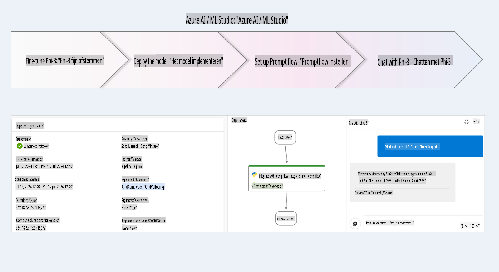

### Inhoudsopgave

1. **[Scenario 1: Azure-resources instellen en voorbereiden op fine-tuning](../../../../../../md/02.Application/01.TextAndChat/Phi3)**  
    - [Een Azure Machine Learning Workspace maken](../../../../../../md/02.Application/01.TextAndChat/Phi3)  
    - [GPU-quota's aanvragen in Azure-abonnement](../../../../../../md/02.Application/01.TextAndChat/Phi3)  
    - [Roltoewijzing toevoegen](../../../../../../md/02.Application/01.TextAndChat/Phi3)  
    - [Project instellen](../../../../../../md/02.Application/01.TextAndChat/Phi3)  
    - [Dataset voorbereiden voor fine-tuning](../../../../../../md/02.Application/01.TextAndChat/Phi3)  

1. **[Scenario 2: Fine-tune Phi-3-model en implementeer in Azure Machine Learning Studio](../../../../../../md/02.Application/01.TextAndChat/Phi3)**  
    - [Fine-tune het Phi-3-model](../../../../../../md/02.Application/01.TextAndChat/Phi3)  
    - [Implementeer het gefinetunede Phi-3-model](../../../../../../md/02.Application/01.TextAndChat/Phi3)  

1. **[Scenario 3: Integreer met Prompt Flow en communiceer met je aangepaste model in Azure AI Foundry](../../../../../../md/02.Application/01.TextAndChat/Phi3)**  
    - [Integreer het aangepaste Phi-3-model met Prompt Flow](../../../../../../md/02.Application/01.TextAndChat/Phi3)  
    - [Communiceer met je aangepaste Phi-3-model](../../../../../../md/02.Application/01.TextAndChat/Phi3)  

## Scenario 1: Azure-resources instellen en voorbereiden op fine-tuning

### Een Azure Machine Learning Workspace maken

1. Typ *azure machine learning* in de **zoekbalk** bovenaan de portalpagina en selecteer **Azure Machine Learning** uit de opties die verschijnen.

    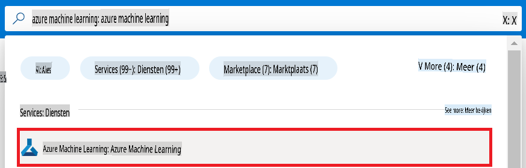

2. Selecteer **+ Maken** in het navigatiemenu.

3. Selecteer **Nieuwe werkruimte** in het navigatiemenu.

    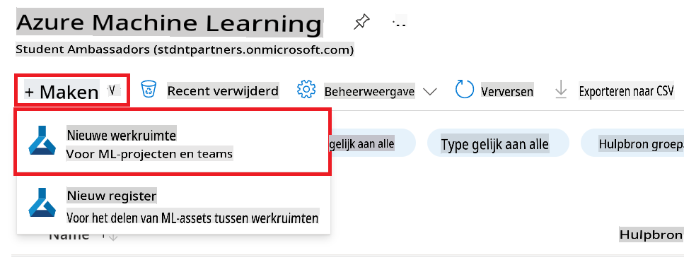

4. Voer de volgende taken uit:

    - Selecteer je Azure **Abonnement**.  
    - Selecteer de **Resourcegroep** die je wilt gebruiken (maak een nieuwe indien nodig).  
    - Voer een unieke **Werkruimtenaam** in.  
    - Selecteer de **Regio** die je wilt gebruiken.  
    - Selecteer het **Opslagaccount** dat je wilt gebruiken (maak een nieuwe indien nodig).  
    - Selecteer de **Key Vault** die je wilt gebruiken (maak een nieuwe indien nodig).  
    - Selecteer de **Application Insights** die je wilt gebruiken (maak een nieuwe indien nodig).  
    - Selecteer de **Container Registry** die je wilt gebruiken (maak een nieuwe indien nodig).  

    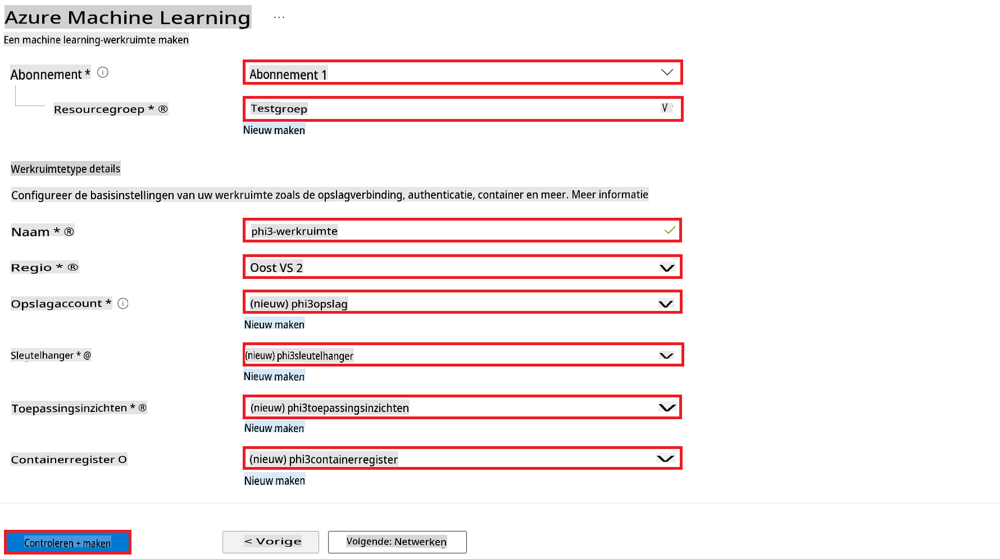

5. Selecteer **Controleren + Maken**.

6. Selecteer **Maken**.

### GPU-quota's aanvragen in Azure-abonnement

In deze tutorial leer je hoe je een Phi-3-model kunt fine-tunen en implementeren met behulp van GPU's. Voor fine-tuning gebruik je de *Standard_NC24ads_A100_v4* GPU, waarvoor een quotumaanvraag nodig is. Voor implementatie gebruik je de *Standard_NC6s_v3* GPU, waarvoor ook een quotumaanvraag nodig is.

> [!NOTE]
>
> Alleen Pay-As-You-Go-abonnementen (het standaardtype abonnement) komen in aanmerking voor GPU-toewijzing; voordeelabonnementen worden momenteel niet ondersteund.

1. Bezoek [Azure ML Studio](https://ml.azure.com/home?wt.mc_id=studentamb_279723).

1. Voer de volgende taken uit om een quotumaanvraag voor *Standard NCADSA100v4 Family* in te dienen:

    - Selecteer **Quota** in het linkermenu.  
    - Selecteer de **Virtuele machinefamilie** die je wilt gebruiken. Bijvoorbeeld, selecteer **Standard NCADSA100v4 Family Cluster Dedicated vCPUs**, die de *Standard_NC24ads_A100_v4* GPU omvat.  
    - Selecteer **Quotumaanvraag** in het navigatiemenu.  

        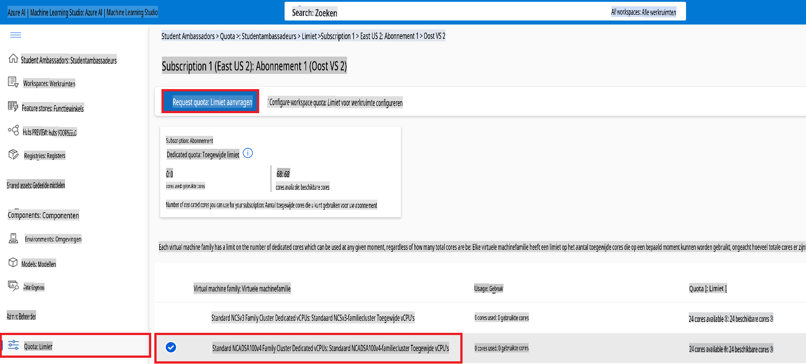

    - Voer in de pagina "Quotumaanvraag" de **Nieuwe kernlimiet** in die je wilt gebruiken. Bijvoorbeeld, 24.  
    - Selecteer **Indienen** om de GPU-quotumaanvraag in te dienen.

1. Voer de volgende taken uit om een quotumaanvraag voor *Standard NCSv3 Family* in te dienen:

    - Selecteer **Quota** in het linkermenu.  
    - Selecteer de **Virtuele machinefamilie** die je wilt gebruiken. Bijvoorbeeld, selecteer **Standard NCSv3 Family Cluster Dedicated vCPUs**, die de *Standard_NC6s_v3* GPU omvat.  
    - Selecteer **Quotumaanvraag** in het navigatiemenu.  
    - Voer in de pagina "Quotumaanvraag" de **Nieuwe kernlimiet** in die je wilt gebruiken. Bijvoorbeeld, 24.  
    - Selecteer **Indienen** om de GPU-quotumaanvraag in te dienen.

### Roltoewijzing toevoegen

Om je modellen te fine-tunen en te implementeren, moet je eerst een User Assigned Managed Identity (UAI) maken en deze de juiste machtigingen toewijzen. Deze UAI wordt gebruikt voor authenticatie tijdens de implementatie.

#### User Assigned Managed Identity (UAI) maken

1. Typ *beheerde identiteiten* in de **zoekbalk** bovenaan de portalpagina en selecteer **Beheerde identiteiten** uit de opties die verschijnen.

    

1. Selecteer **+ Maken**.

    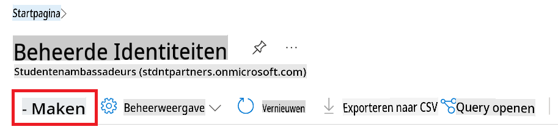

1. Voer de volgende taken uit:

    - Selecteer je Azure **Abonnement**.  
    - Selecteer de **Resourcegroep** die je wilt gebruiken (maak een nieuwe indien nodig).  
    - Selecteer de **Regio** die je wilt gebruiken.  
    - Voer een unieke **Naam** in.  

    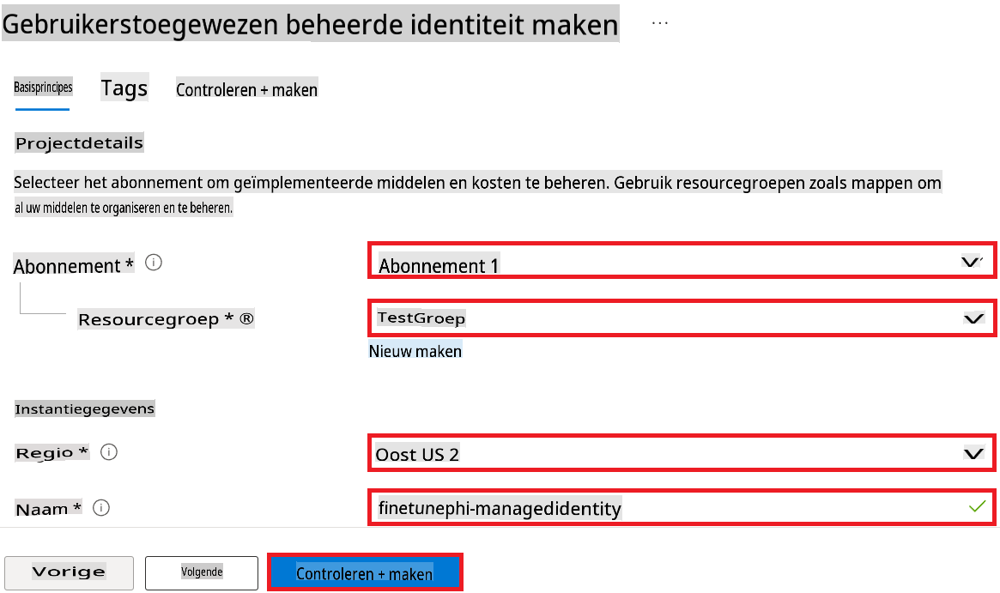

1. Selecteer **Controleren + Maken**.

1. Selecteer **+ Maken**.

#### Contributor-roltoewijzing toevoegen aan Managed Identity

1. Navigeer naar de Managed Identity-resource die je hebt gemaakt.

1. Selecteer **Azure-roltoewijzingen** in het linkermenu.

1. Selecteer **+Roltoewijzing toevoegen** in het navigatiemenu.

1. Voer in de pagina "Roltoewijzing toevoegen" de volgende taken uit:
    - Stel de **Bereik** in op **Resourcegroep**.  
    - Selecteer je Azure **Abonnement**.  
    - Selecteer de **Resourcegroep** die je wilt gebruiken.  
    - Stel de **Rol** in op **Contributor**.  

    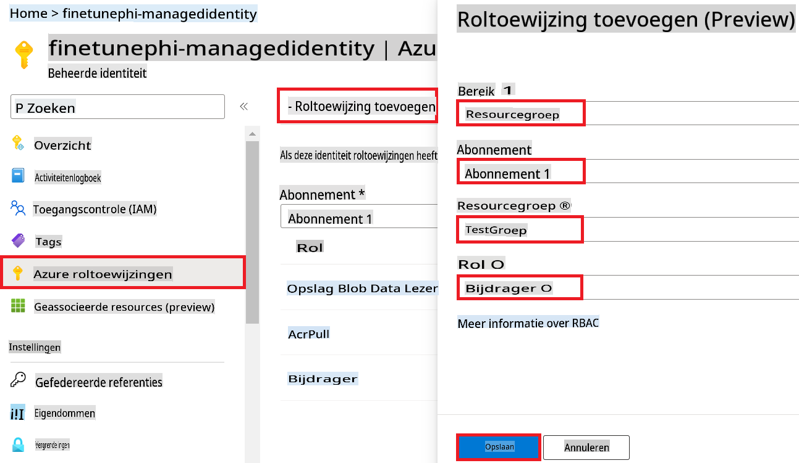

2. Selecteer **Opslaan**.

#### Rol "Storage Blob Data Reader" toevoegen aan Managed Identity

1. Typ *opslagaccounts* in de **zoekbalk** bovenaan de portalpagina en selecteer **Opslagaccounts** uit de opties die verschijnen.

    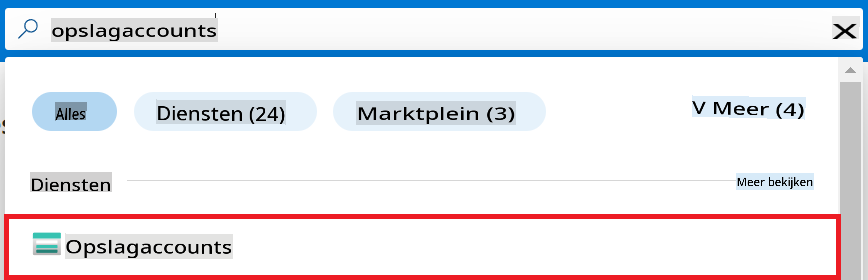

1. Selecteer het opslagaccount dat is gekoppeld aan de Azure Machine Learning-werkruimte die je hebt gemaakt. Bijvoorbeeld, *finetunephistorage*.  

1. Voer de volgende taken uit om naar de pagina "Roltoewijzing toevoegen" te navigeren:

    - Navigeer naar het Azure-opslagaccount dat je hebt gemaakt.  
    - Selecteer **Toegangsbeheer (IAM)** in het linkermenu.  
    - Selecteer **+ Toevoegen** in het navigatiemenu.  
    - Selecteer **Roltoewijzing toevoegen** in het navigatiemenu.  

    

1. Voer in de pagina "Roltoewijzing toevoegen" de volgende taken uit:

    - Typ in de Rolpagina *Storage Blob Data Reader* in de **zoekbalk** en selecteer **Storage Blob Data Reader** uit de opties die verschijnen.  
    - Selecteer **Volgende**.  
    - Stel op de pagina "Leden" **Toegang toewijzen aan** in op **Beheerde identiteit**.  
    - Selecteer **+ Leden selecteren**.  
    - Selecteer in de pagina "Beheerde identiteiten selecteren" je Azure **Abonnement**.  
    - Selecteer de **Beheerde identiteit**. Bijvoorbeeld, *finetunephi-managedidentity*.  
    - Selecteer **Selecteren**.  

    

1. Selecteer **Controleren + Toewijzen**.

#### Rol "AcrPull" toevoegen aan Managed Identity

1. Typ *containerregistraties* in de **zoekbalk** bovenaan de portalpagina en selecteer **Containerregistraties** uit de opties die verschijnen.

    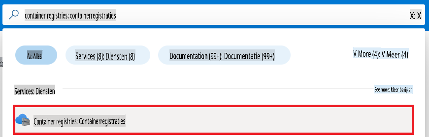

1. Selecteer de containerregistratie die is gekoppeld aan de Azure Machine Learning-werkruimte. Bijvoorbeeld, *finetunephicontainerregistry*.  

1. Voer de volgende taken uit om naar de pagina "Roltoewijzing toevoegen" te navigeren:

    - Selecteer **Toegangsbeheer (IAM)** in het linkermenu.  
    - Selecteer **+ Toevoegen** in het navigatiemenu.  
    - Selecteer **Roltoewijzing toevoegen** in het navigatiemenu.  

1. Voer in de pagina "Roltoewijzing toevoegen" de volgende taken uit:

    - Typ in de Rolpagina *AcrPull* in de **zoekbalk** en selecteer **AcrPull** uit de opties die verschijnen.  
    - Selecteer **Volgende**.  
    - Stel op de pagina "Leden" **Toegang toewijzen aan** in op **Beheerde identiteit**.  
    - Selecteer **+ Leden selecteren**.  
    - Selecteer in de pagina "Beheerde identiteiten selecteren" je Azure **Abonnement**.  
    - Selecteer de **Beheerde identiteit**. Bijvoorbeeld, *finetunephi-managedidentity*.  
    - Selecteer **Selecteren**.  
    - Selecteer **Controleren + Toewijzen**.

### Project instellen

Om de datasets te downloaden die nodig zijn voor fine-tuning, stel je een lokale omgeving in.

In deze oefening ga je:

- Een map maken om in te werken.  
- Een virtuele omgeving maken.  
- De benodigde pakketten installeren.  
- Een *download_dataset.py*-bestand maken om de dataset te downloaden.

#### Een map maken om in te werken

1. Open een terminalvenster en typ het volgende commando om een map genaamd *finetune-phi* te maken in het standaardpad.

    ```console
    mkdir finetune-phi
    ```

2. Typ het volgende commando in je terminal om naar de map *finetune-phi* te navigeren.

    ```console
    cd finetune-phi
    ```

#### Een virtuele omgeving maken

1. Typ het volgende commando in je terminal om een virtuele omgeving genaamd *.venv* te maken.

    ```console
    python -m venv .venv
    ```

2. Typ het volgende commando in je terminal om de virtuele omgeving te activeren.

    ```console
    .venv\Scripts\activate.bat
    ```

> [!NOTE]  
> Als het is gelukt, zou je *(.venv)* vóór de opdrachtprompt moeten zien.

#### De benodigde pakketten installeren

1. Typ de volgende commando's in je terminal om de benodigde pakketten te installeren.

    ```console
    pip install datasets==2.19.1
    ```

#### `download_dataset.py` maken

> [!NOTE]  
> Volledige mapstructuur:  
>
> ```text
> └── YourUserName
> .    └── finetune-phi
> .        └── download_dataset.py
> ```

1. Open **Visual Studio Code**.

1. Selecteer **Bestand** in de menubalk.

1. Selecteer **Map openen**.

1. Selecteer de map *finetune-phi* die je hebt gemaakt, te vinden op *C:\Users\jouwGebruikersnaam\finetune-phi*.

    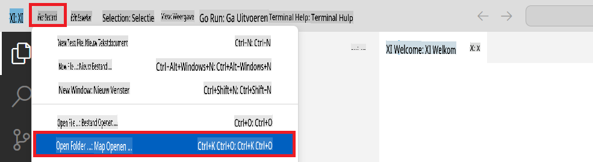

1. Klik in het linker paneel van Visual Studio Code met de rechtermuisknop en selecteer **Nieuw bestand** om een nieuw bestand genaamd *download_dataset.py* te maken.

    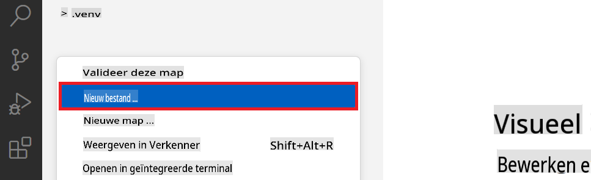

### Dataset voorbereiden voor fine-tuning

In deze oefening voer je het bestand *download_dataset.py* uit om de datasets *ultrachat_200k* naar je lokale omgeving te downloaden. Je gebruikt deze datasets vervolgens om het Phi-3-model in Azure Machine Learning te fine-tunen.

In deze oefening ga je:

- Code toevoegen aan het bestand *download_dataset.py* om de datasets te downloaden.  
- Het bestand *download_dataset.py* uitvoeren om de datasets naar je lokale omgeving te downloaden.

#### Download je dataset met *download_dataset.py*

1. Open het bestand *download_dataset.py* in Visual Studio Code.

1. Voeg de volgende code toe aan het bestand *download_dataset.py*.

    ```python
    import json
    import os
    from datasets import load_dataset

    def load_and_split_dataset(dataset_name, config_name, split_ratio):
        """
        Load and split a dataset.
        """
        # Load the dataset with the specified name, configuration, and split ratio
        dataset = load_dataset(dataset_name, config_name, split=split_ratio)
        print(f"Original dataset size: {len(dataset)}")
        
        # Split the dataset into train and test sets (80% train, 20% test)
        split_dataset = dataset.train_test_split(test_size=0.2)
        print(f"Train dataset size: {len(split_dataset['train'])}")
        print(f"Test dataset size: {len(split_dataset['test'])}")
        
        return split_dataset

    def save_dataset_to_jsonl(dataset, filepath):
        """
        Save a dataset to a JSONL file.
        """
        # Create the directory if it does not exist
        os.makedirs(os.path.dirname(filepath), exist_ok=True)
        
        # Open the file in write mode
        with open(filepath, 'w', encoding='utf-8') as f:
            # Iterate over each record in the dataset
            for record in dataset:
                # Dump the record as a JSON object and write it to the file
                json.dump(record, f)
                # Write a newline character to separate records
                f.write('\n')
        
        print(f"Dataset saved to {filepath}")

    def main():
        """
        Main function to load, split, and save the dataset.
        """
        # Load and split the ULTRACHAT_200k dataset with a specific configuration and split ratio
        dataset = load_and_split_dataset("HuggingFaceH4/ultrachat_200k", 'default', 'train_sft[:1%]')
        
        # Extract the train and test datasets from the split
        train_dataset = dataset['train']
        test_dataset = dataset['test']

        # Save the train dataset to a JSONL file
        save_dataset_to_jsonl(train_dataset, "data/train_data.jsonl")
        
        # Save the test dataset to a separate JSONL file
        save_dataset_to_jsonl(test_dataset, "data/test_data.jsonl")

    if __name__ == "__main__":
        main()

    ```

1. Typ het volgende commando in je terminal om het script uit te voeren en de dataset naar je lokale omgeving te downloaden.

    ```console
    python download_dataset.py
    ```

1. Controleer of de datasets succesvol zijn opgeslagen in je lokale map *finetune-phi/data*.

> [!NOTE]  
>
> #### Opmerking over datasetgrootte en fine-tuning tijd  
>
> In deze tutorial gebruik je slechts 1% van de dataset (`split='train[:1%]'`). Dit verkleint de hoeveelheid data aanzienlijk en versnelt zowel het upload- als het fine-tuningproces. Je kunt het percentage aanpassen om de juiste balans te vinden tussen trainingstijd en modelprestaties. Het gebruik van een kleinere subset van de dataset verkort de tijd die nodig is voor fine-tuning, waardoor het proces beter beheersbaar wordt voor een tutorial.

## Scenario 2: Fine-tune Phi-3-model en implementeer in Azure Machine Learning Studio

### Fine-tune het Phi-3-model

In deze oefening ga je het Phi-3-model fine-tunen in Azure Machine Learning Studio.

In deze oefening ga je:

- Een computercluster maken voor fine-tuning.  
- Het Phi-3-model fine-tunen in Azure Machine Learning Studio.

#### Een computercluster maken voor fine-tuning
1. Bezoek [Azure ML Studio](https://ml.azure.com/home?wt.mc_id=studentamb_279723).

1. Selecteer **Compute** in de linkerzijbalk.

1. Selecteer **Compute clusters** in het navigatiemenu.

1. Selecteer **+ New**.

    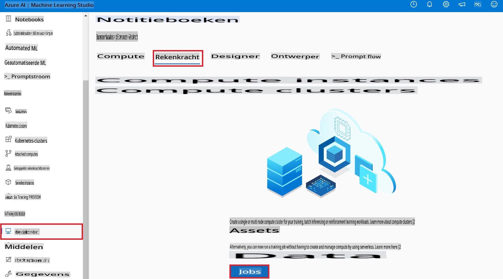

1. Voer de volgende taken uit:

    - Selecteer de **Regio** die je wilt gebruiken.
    - Stel de **Virtual machine tier** in op **Dedicated**.
    - Stel het **Virtual machine type** in op **GPU**.
    - Stel de **Virtual machine size** filter in op **Select from all options**.
    - Kies de **Virtual machine size**: **Standard_NC24ads_A100_v4**.

    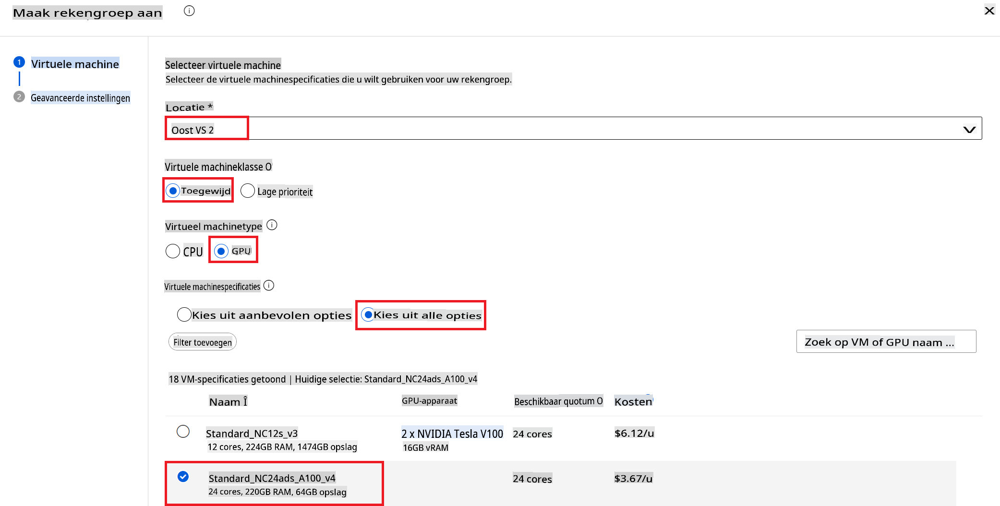

1. Selecteer **Next**.

1. Voer de volgende taken uit:

    - Voer een **Compute name** in. Dit moet een unieke waarde zijn.
    - Stel het **Minimum aantal nodes** in op **0**.
    - Stel het **Maximum aantal nodes** in op **1**.
    - Stel de **Idle seconds before scale down** in op **120**.

    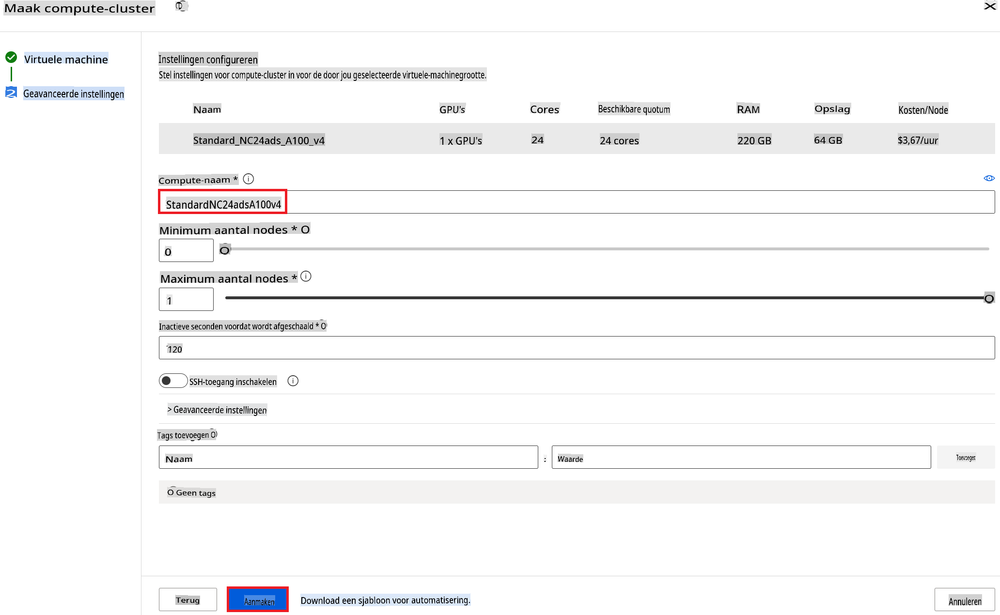

1. Selecteer **Create**.

#### Fine-tune het Phi-3 model

1. Bezoek [Azure ML Studio](https://ml.azure.com/home?wt.mc_id=studentamb_279723).

1. Selecteer de Azure Machine Learning workspace die je hebt aangemaakt.

    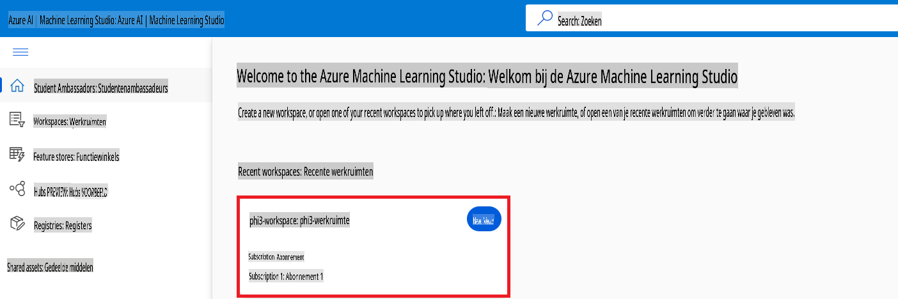

1. Voer de volgende taken uit:

    - Selecteer **Model catalog** in de linkerzijbalk.
    - Typ *phi-3-mini-4k* in de **zoekbalk** en selecteer **Phi-3-mini-4k-instruct** uit de weergegeven opties.

    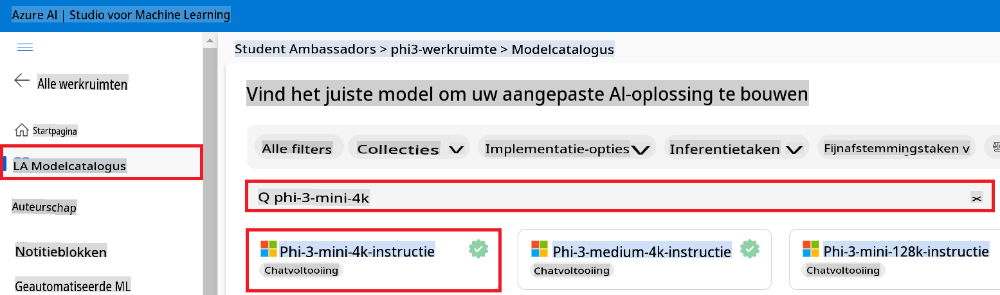

1. Selecteer **Fine-tune** in het navigatiemenu.

    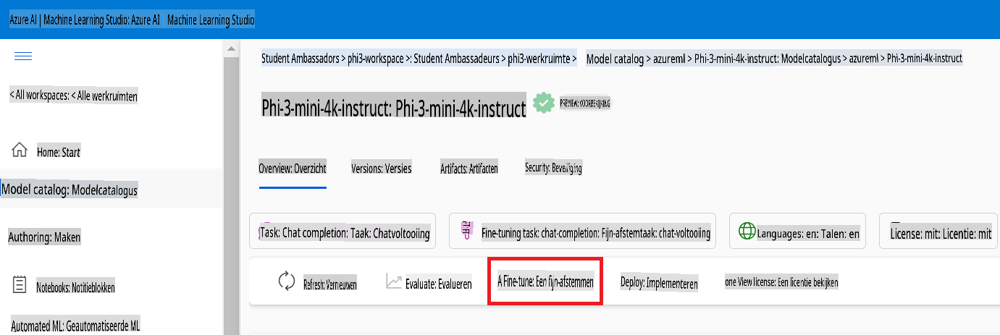

1. Voer de volgende taken uit:

    - Stel **Select task type** in op **Chat completion**.
    - Selecteer **+ Select data** om **Trainingsdata** te uploaden.
    - Stel het uploadtype voor validatiedata in op **Provide different validation data**.
    - Selecteer **+ Select data** om **Validatiedata** te uploaden.

    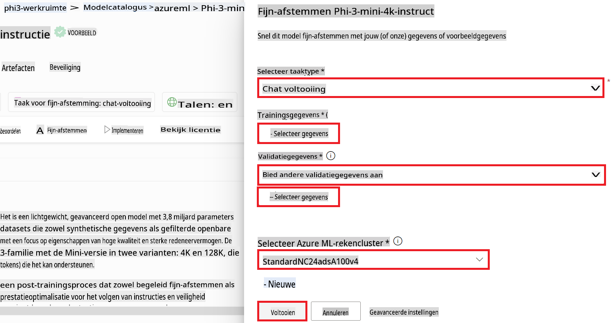

    > [!TIP]
    >
    > Je kunt **Advanced settings** selecteren om configuraties zoals **learning_rate** en **lr_scheduler_type** aan te passen om het fine-tuning proces te optimaliseren voor jouw specifieke behoeften.

1. Selecteer **Finish**.

1. In deze oefening heb je het Phi-3 model succesvol gefinetuned met Azure Machine Learning. Let op dat het fine-tuning proces aanzienlijk wat tijd kan kosten. Na het starten van de fine-tuning job moet je wachten tot deze voltooid is. Je kunt de status van de fine-tuning job monitoren door naar het tabblad Jobs in je Azure Machine Learning Workspace te navigeren. In de volgende reeks zul je het gefinetunede model implementeren en integreren met Prompt Flow.

    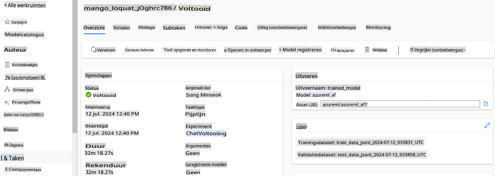

### Implementeer het gefinetunede Phi-3 model

Om het gefinetunede Phi-3 model te integreren met Prompt Flow, moet je het model implementeren zodat het beschikbaar is voor realtime inferentie. Dit proces omvat het registreren van het model, het aanmaken van een online endpoint, en het implementeren van het model.

In deze oefening zul je:

- Het gefinetunede model registreren in de Azure Machine Learning workspace.
- Een online endpoint aanmaken.
- Het geregistreerde gefinetunede Phi-3 model implementeren.

#### Registreer het gefinetunede model

1. Bezoek [Azure ML Studio](https://ml.azure.com/home?wt.mc_id=studentamb_279723).

1. Selecteer de Azure Machine Learning workspace die je hebt aangemaakt.

    

1. Selecteer **Models** in de linkerzijbalk.
1. Selecteer **+ Register**.
1. Selecteer **From a job output**.

    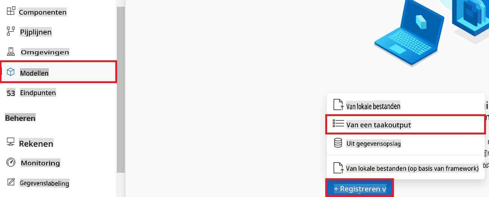

1. Selecteer de job die je hebt aangemaakt.

    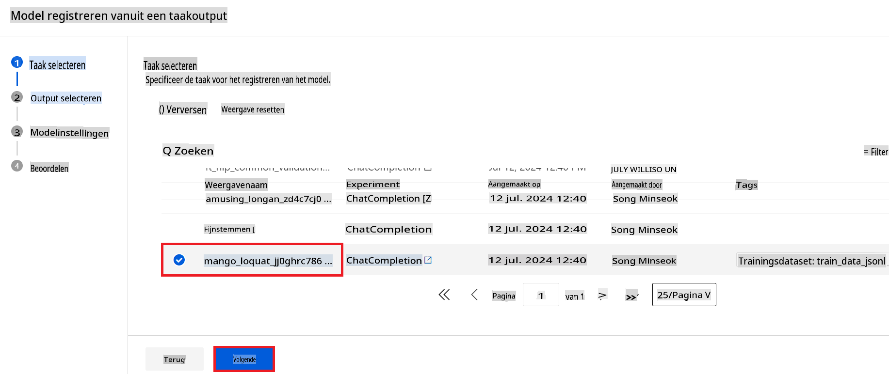

1. Selecteer **Next**.

1. Stel **Model type** in op **MLflow**.

1. Zorg ervoor dat **Job output** geselecteerd is; dit zou automatisch geselecteerd moeten zijn.

    

2. Selecteer **Next**.

3. Selecteer **Register**.

    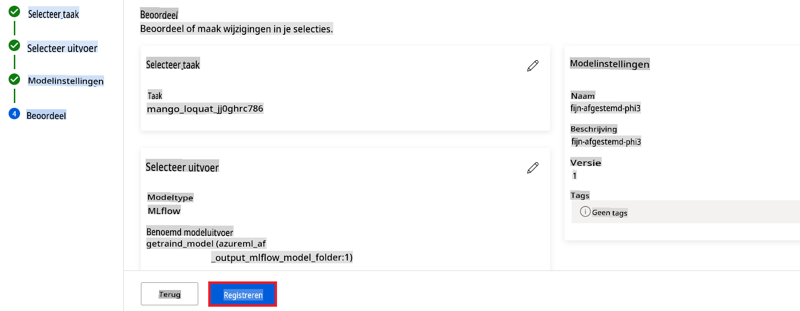

4. Je kunt je geregistreerde model bekijken door naar het **Models** menu in de linkerzijbalk te navigeren.

    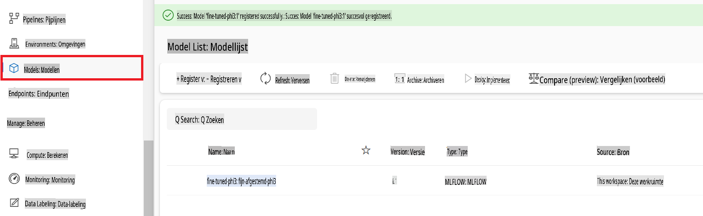

#### Implementeer het gefinetunede model

1. Ga naar de Azure Machine Learning workspace die je hebt aangemaakt.

1. Selecteer **Endpoints** in de linkerzijbalk.

1. Selecteer **Real-time endpoints** in het navigatiemenu.

    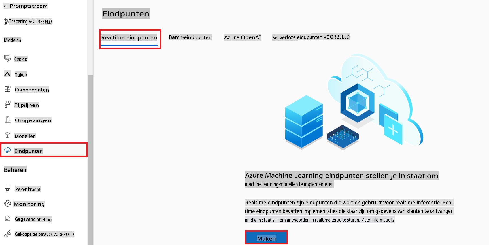

1. Selecteer **Create**.

1. Selecteer het geregistreerde model dat je hebt aangemaakt.

    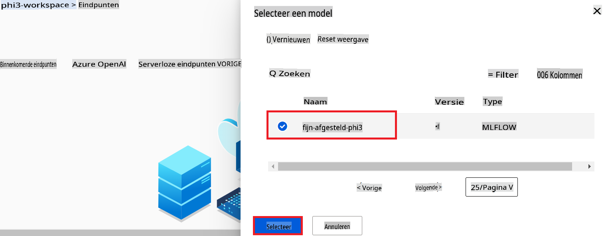

1. Selecteer **Select**.

1. Voer de volgende taken uit:

    - Stel **Virtual machine** in op *Standard_NC6s_v3*.
    - Selecteer het **Aantal instanties** dat je wilt gebruiken. Bijvoorbeeld *1*.
    - Stel de **Endpoint** in op **New** om een nieuw endpoint aan te maken.
    - Voer een **Endpoint name** in. Dit moet een unieke waarde zijn.
    - Voer een **Deployment name** in. Dit moet een unieke waarde zijn.

    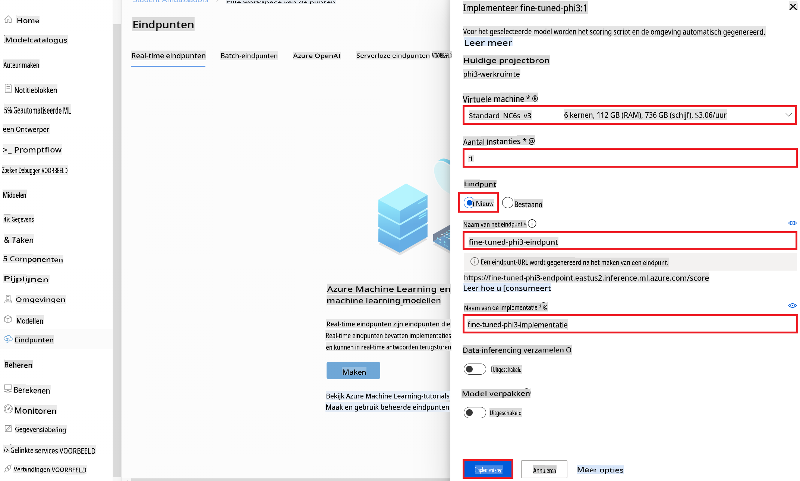

1. Selecteer **Deploy**.

> [!WARNING]
> Om extra kosten op je account te voorkomen, zorg ervoor dat je het aangemaakte endpoint verwijdert in de Azure Machine Learning workspace.
>

#### Controleer implementatiestatus in Azure Machine Learning Workspace

1. Ga naar de Azure Machine Learning workspace die je hebt aangemaakt.

1. Selecteer **Endpoints** in de linkerzijbalk.

1. Selecteer het endpoint dat je hebt aangemaakt.

    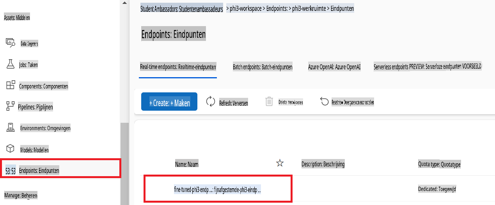

1. Op deze pagina kun je de endpoints beheren tijdens het implementatieproces.

> [!NOTE]
> Zodra de implementatie voltooid is, zorg ervoor dat **Live traffic** is ingesteld op **100%**. Als dit niet het geval is, selecteer **Update traffic** om de verkeersinstellingen aan te passen. Let op dat je het model niet kunt testen als het verkeer is ingesteld op 0%.
>
> 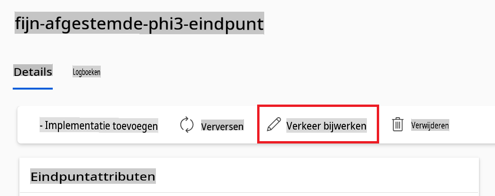
>

## Scenario 3: Integreren met Prompt Flow en chatten met je aangepaste model in Azure AI Foundry

### Integreer het aangepaste Phi-3 model met Prompt Flow

Na het succesvol implementeren van je gefinetunede model, kun je het nu integreren met Prompt Flow om je model te gebruiken in realtime applicaties, waardoor een verscheidenheid aan interactieve taken met je aangepaste Phi-3 model mogelijk wordt.

In deze oefening zul je:

- Een Azure AI Foundry Hub aanmaken.
- Een Azure AI Foundry Project aanmaken.
- Prompt Flow aanmaken.
- Een aangepaste verbinding toevoegen voor het gefinetunede Phi-3 model.
- Prompt Flow instellen om te chatten met je aangepaste Phi-3 model.

> [!NOTE]
> Je kunt ook integreren met Prompt Flow via Azure ML Studio. Hetzelfde integratieproces kan worden toegepast in Azure ML Studio.

#### Maak een Azure AI Foundry Hub aan

Je moet een Hub aanmaken voordat je een Project kunt maken. Een Hub fungeert als een Resource Group, waarmee je meerdere projecten binnen Azure AI Foundry kunt organiseren en beheren.

1. Bezoek [Azure AI Foundry](https://ai.azure.com/?WT.mc_id=aiml-137032-kinfeylo).

1. Selecteer **All hubs** in de linkerzijbalk.

1. Selecteer **+ New hub** in het navigatiemenu.

    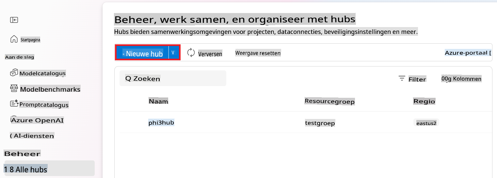

1. Voer de volgende taken uit:

    - Voer een **Hub name** in. Dit moet een unieke waarde zijn.
    - Selecteer je Azure **Subscription**.
    - Kies de **Resource group** die je wilt gebruiken (maak een nieuwe aan indien nodig).
    - Selecteer de **Locatie** die je wilt gebruiken.
    - Kies **Connect Azure AI Services** (maak een nieuwe aan indien nodig).
    - Selecteer **Connect Azure AI Search** en kies **Skip connecting**.

    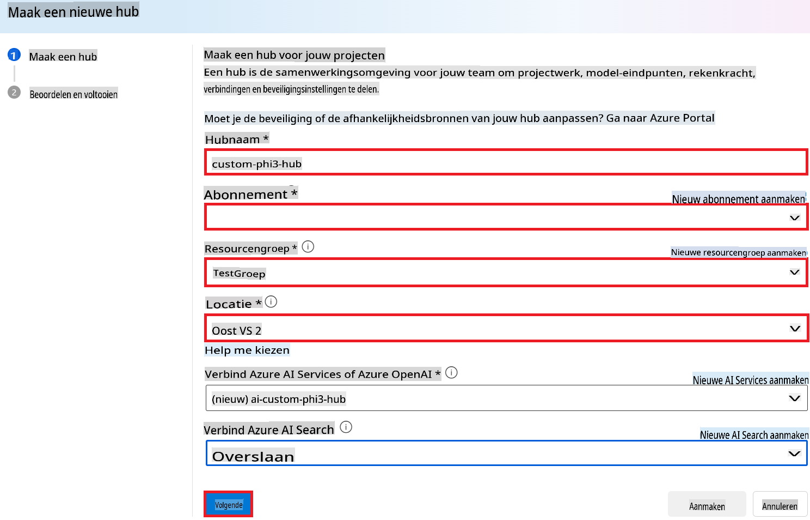

1. Selecteer **Next**.

#### Maak een Azure AI Foundry Project aan

1. In de Hub die je hebt aangemaakt, selecteer **All projects** in de linkerzijbalk.

1. Selecteer **+ New project** in het navigatiemenu.

    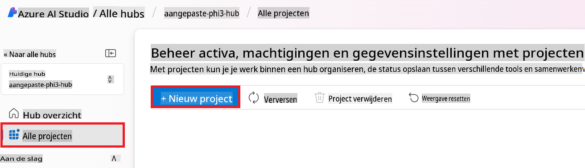

1. Voer een **Project name** in. Dit moet een unieke waarde zijn.

    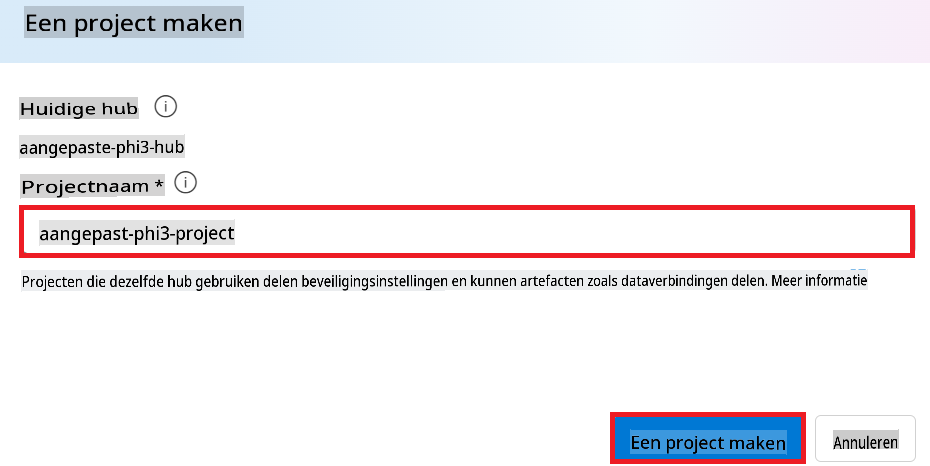

1. Selecteer **Create a project**.

#### Voeg een aangepaste verbinding toe voor het gefinetunede Phi-3 model

Om je aangepaste Phi-3 model te integreren met Prompt Flow, moet je de endpoint en sleutel van het model opslaan in een aangepaste verbinding. Deze setup zorgt voor toegang tot je aangepaste Phi-3 model in Prompt Flow.

#### Stel API-sleutel en endpoint-URI in van het gefinetunede Phi-3 model

1. Bezoek [Azure ML Studio](https://ml.azure.com/home?WT.mc_id=aiml-137032-kinfeylo).

1. Navigeer naar de Azure Machine Learning workspace die je hebt aangemaakt.

1. Selecteer **Endpoints** in de linkerzijbalk.

    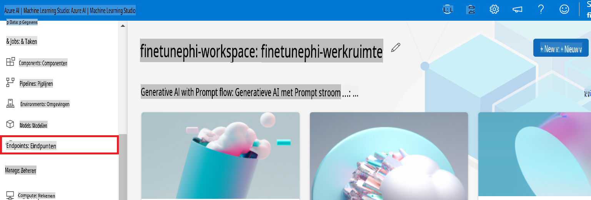

1. Selecteer het endpoint dat je hebt aangemaakt.

    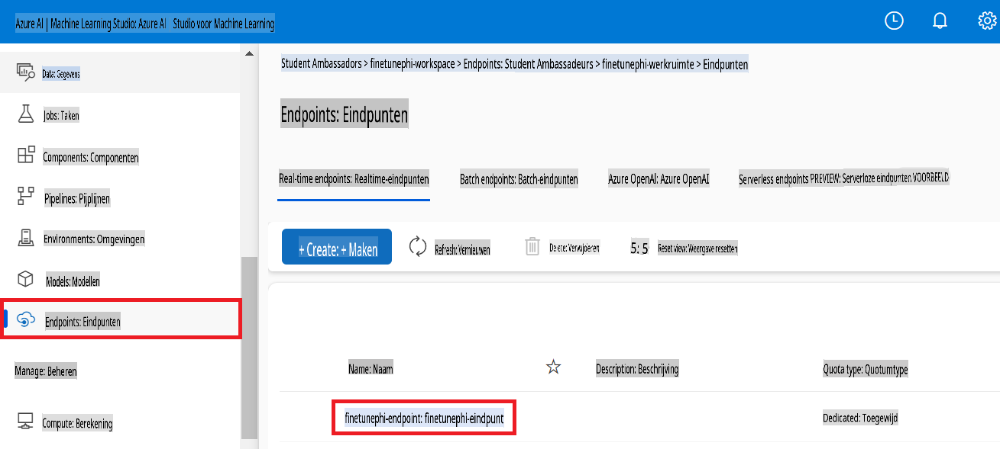

1. Selecteer **Consume** in het navigatiemenu.

1. Kopieer je **REST endpoint** en **Primary key**.
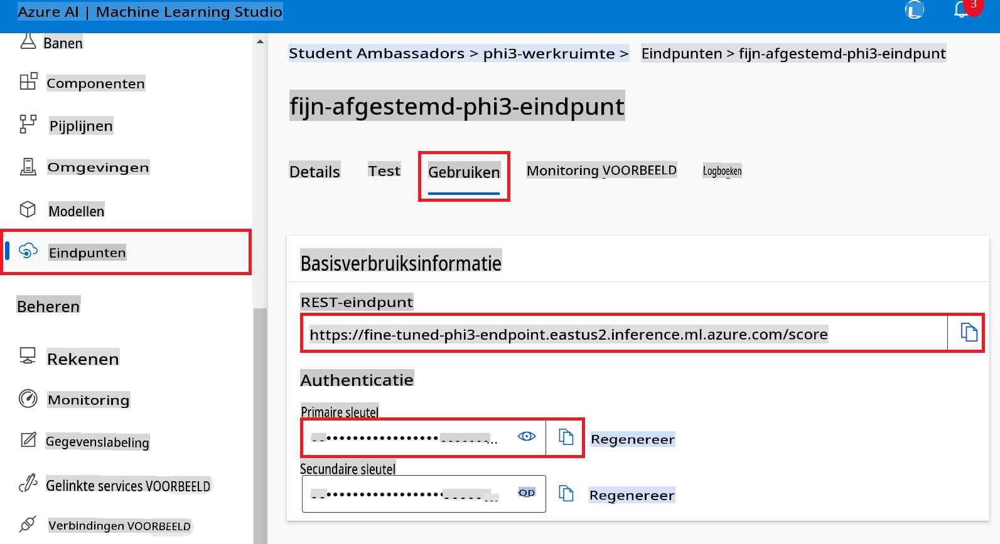

#### Voeg de aangepaste verbinding toe

1. Bezoek [Azure AI Foundry](https://ai.azure.com/?WT.mc_id=aiml-137032-kinfeylo).

1. Navigeer naar het Azure AI Foundry-project dat je hebt aangemaakt.

1. Selecteer in het project dat je hebt aangemaakt **Instellingen** in het linkermenu.

1. Selecteer **+ Nieuwe verbinding**.

    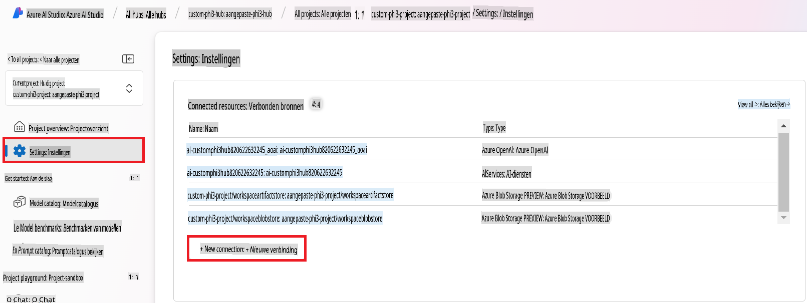

1. Selecteer **Aangepaste sleutels** in het navigatiemenu.

    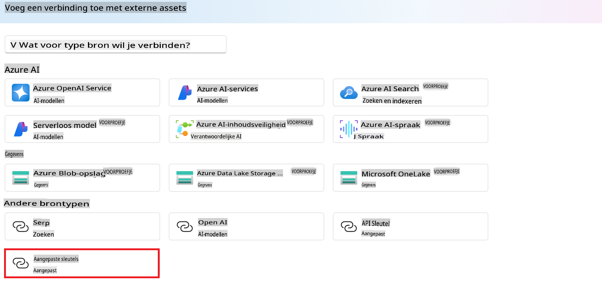

1. Voer de volgende taken uit:

    - Selecteer **+ Sleutel-waardeparen toevoegen**.
    - Voer als sleutelnaam **endpoint** in en plak het eindpunt dat je hebt gekopieerd uit Azure ML Studio in het waardeveld.
    - Selecteer opnieuw **+ Sleutel-waardeparen toevoegen**.
    - Voer als sleutelnaam **key** in en plak de sleutel die je hebt gekopieerd uit Azure ML Studio in het waardeveld.
    - Selecteer na het toevoegen van de sleutels **is secret** om te voorkomen dat de sleutel zichtbaar wordt.

    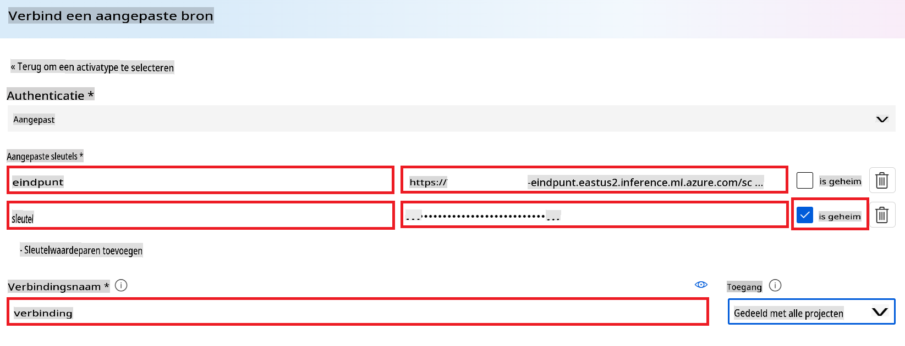

1. Selecteer **Verbinding toevoegen**.

#### Maak een Prompt flow

Je hebt een aangepaste verbinding toegevoegd in Azure AI Foundry. Laten we nu een Prompt flow maken met de volgende stappen. Vervolgens verbind je deze Prompt flow met de aangepaste verbinding, zodat je het fijn-afgestelde model binnen de Prompt flow kunt gebruiken.

1. Navigeer naar het Azure AI Foundry-project dat je hebt aangemaakt.

1. Selecteer **Prompt flow** in het linkermenu.

1. Selecteer **+ Maken** in het navigatiemenu.

    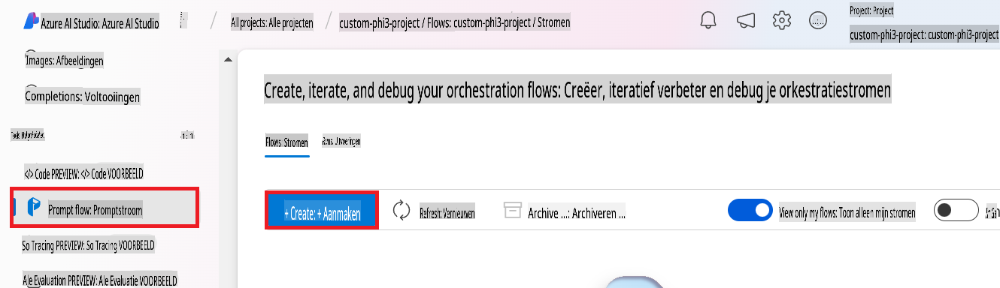

1. Selecteer **Chat flow** in het navigatiemenu.

    

1. Voer een **Mapnaam** in.

    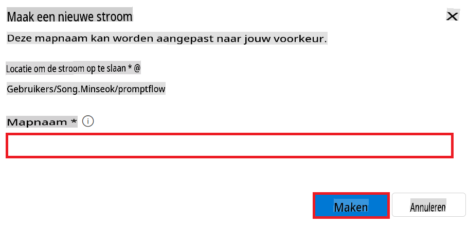

2. Selecteer **Maken**.

#### Stel Prompt flow in om te chatten met je aangepaste Phi-3-model

Je moet het fijn-afgestelde Phi-3-model integreren in een Prompt flow. De bestaande Prompt flow is echter niet ontworpen voor dit doel. Daarom moet je de Prompt flow opnieuw ontwerpen om de integratie van het aangepaste model mogelijk te maken.

1. Voer in de Prompt flow de volgende taken uit om de bestaande flow opnieuw op te bouwen:

    - Selecteer **Raw file mode**.
    - Verwijder alle bestaande code in het bestand *flow.dag.yml*.
    - Voeg de volgende code toe aan het bestand *flow.dag.yml*.

        ```yml
        inputs:
          input_data:
            type: string
            default: "Who founded Microsoft?"

        outputs:
          answer:
            type: string
            reference: ${integrate_with_promptflow.output}

        nodes:
        - name: integrate_with_promptflow
          type: python
          source:
            type: code
            path: integrate_with_promptflow.py
          inputs:
            input_data: ${inputs.input_data}
        ```

    - Selecteer **Opslaan**.

    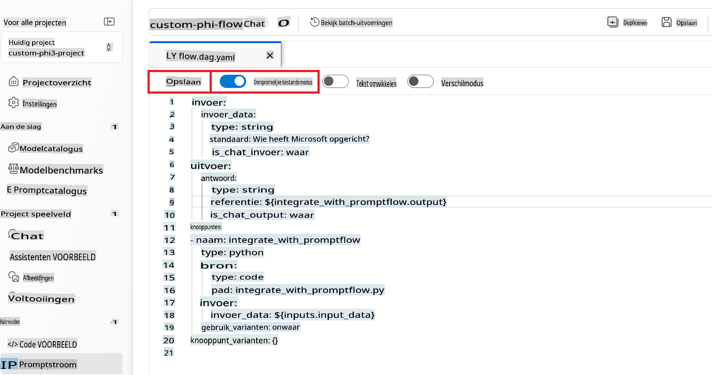

1. Voeg de volgende code toe aan het bestand *integrate_with_promptflow.py* om het aangepaste Phi-3-model in Prompt flow te gebruiken.

    ```python
    import logging
    import requests
    from promptflow import tool
    from promptflow.connections import CustomConnection

    # Logging setup
    logging.basicConfig(
        format="%(asctime)s - %(levelname)s - %(name)s - %(message)s",
        datefmt="%Y-%m-%d %H:%M:%S",
        level=logging.DEBUG
    )
    logger = logging.getLogger(__name__)

    def query_phi3_model(input_data: str, connection: CustomConnection) -> str:
        """
        Send a request to the Phi-3 model endpoint with the given input data using Custom Connection.
        """

        # "connection" is the name of the Custom Connection, "endpoint", "key" are the keys in the Custom Connection
        endpoint_url = connection.endpoint
        api_key = connection.key

        headers = {
            "Content-Type": "application/json",
            "Authorization": f"Bearer {api_key}"
        }
        data = {
            "input_data": {
                "input_string": [
                    {"role": "user", "content": input_data}
                ],
                "parameters": {
                    "temperature": 0.7,
                    "max_new_tokens": 128
                }
            }
        }
        try:
            response = requests.post(endpoint_url, json=data, headers=headers)
            response.raise_for_status()
            
            # Log the full JSON response
            logger.debug(f"Full JSON response: {response.json()}")

            result = response.json()["output"]
            logger.info("Successfully received response from Azure ML Endpoint.")
            return result
        except requests.exceptions.RequestException as e:
            logger.error(f"Error querying Azure ML Endpoint: {e}")
            raise

    @tool
    def my_python_tool(input_data: str, connection: CustomConnection) -> str:
        """
        Tool function to process input data and query the Phi-3 model.
        """
        return query_phi3_model(input_data, connection)

    ```

    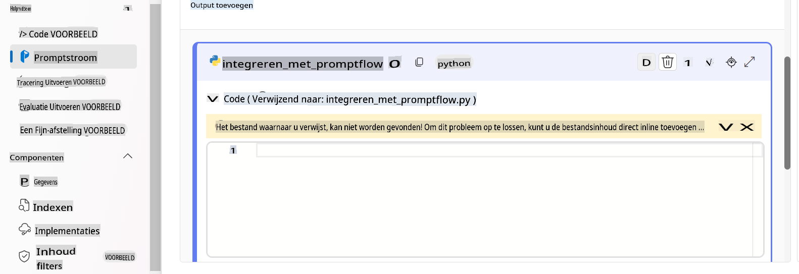

> [!NOTE]
> Voor meer gedetailleerde informatie over het gebruik van Prompt flow in Azure AI Foundry, kun je terecht op [Prompt flow in Azure AI Foundry](https://learn.microsoft.com/azure/ai-studio/how-to/prompt-flow).

1. Selecteer **Chat input**, **Chat output** om chatten met je model in te schakelen.

    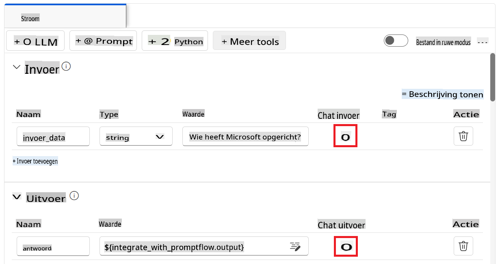

1. Nu ben je klaar om te chatten met je aangepaste Phi-3-model. In de volgende oefening leer je hoe je Prompt flow start en gebruikt om te chatten met je fijn-afgestelde Phi-3-model.

> [!NOTE]
>
> De opnieuw opgebouwde flow zou eruit moeten zien zoals in de onderstaande afbeelding:
>
> 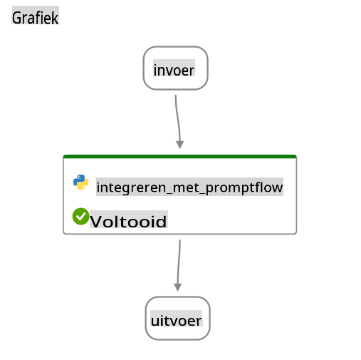
>

### Chatten met je aangepaste Phi-3-model

Nu je je aangepaste Phi-3-model hebt fijn-afgesteld en geïntegreerd met Prompt flow, ben je klaar om ermee te gaan werken. Deze oefening begeleidt je bij het instellen en starten van een chat met je model via Prompt flow. Door deze stappen te volgen, kun je de mogelijkheden van je fijn-afgestelde Phi-3-model volledig benutten voor diverse taken en gesprekken.

- Chat met je aangepaste Phi-3-model via Prompt flow.

#### Start Prompt flow

1. Selecteer **Start compute sessions** om Prompt flow te starten.

    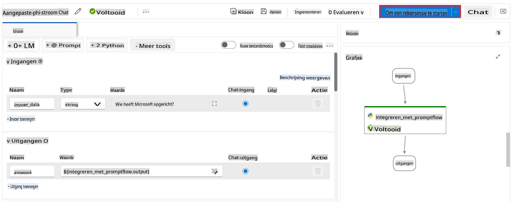

1. Selecteer **Valideer en parse invoer** om parameters te vernieuwen.

    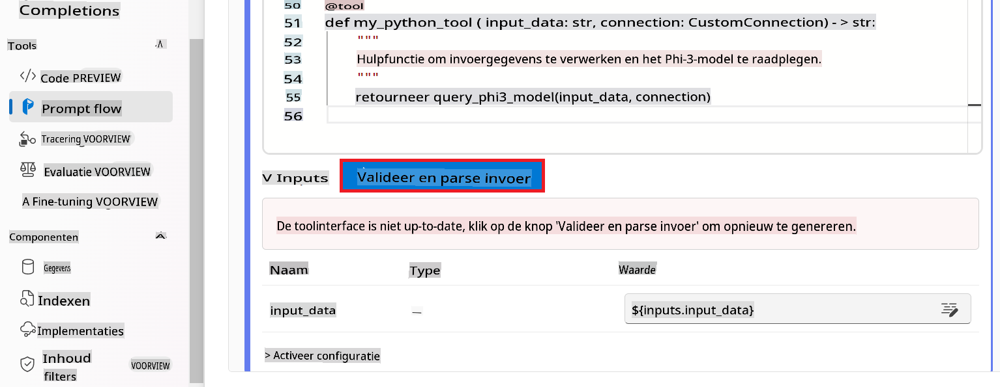

1. Selecteer de **Waarde** van de **verbinding** naar de aangepaste verbinding die je hebt aangemaakt. Bijvoorbeeld *connection*.

    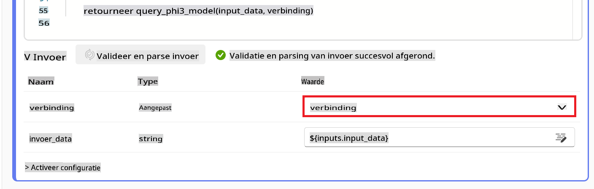

#### Chatten met je aangepaste model

1. Selecteer **Chat**.

    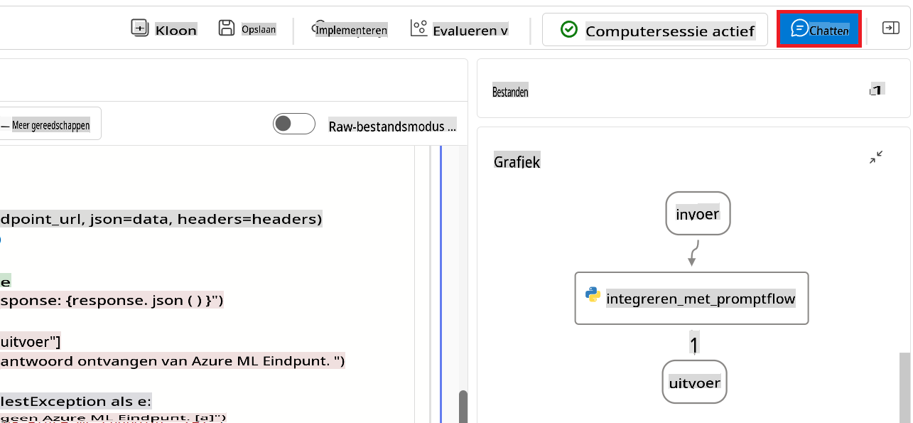

1. Hier is een voorbeeld van de resultaten: Nu kun je chatten met je aangepaste Phi-3-model. Het wordt aanbevolen om vragen te stellen op basis van de gegevens die zijn gebruikt voor het fijn-afstellen.

    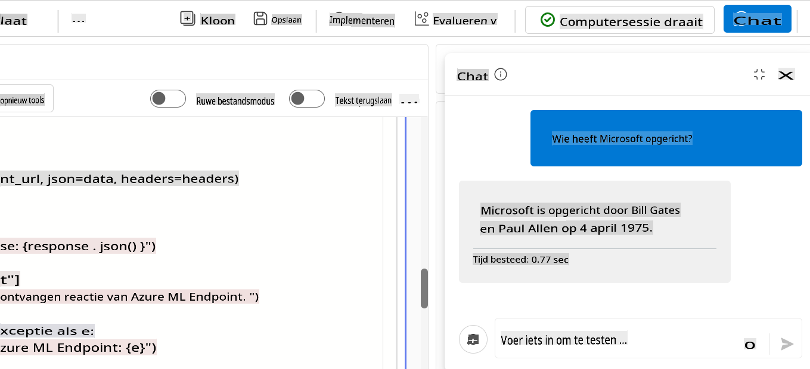

**Disclaimer**:  
Dit document is vertaald met behulp van machine-gebaseerde AI-vertalingsdiensten. Hoewel we ons best doen voor nauwkeurigheid, dient u zich ervan bewust te zijn dat geautomatiseerde vertalingen fouten of onnauwkeurigheden kunnen bevatten. Het originele document in zijn oorspronkelijke taal moet worden beschouwd als de gezaghebbende bron. Voor kritieke informatie wordt professionele menselijke vertaling aanbevolen. Wij zijn niet aansprakelijk voor misverstanden of verkeerde interpretaties die voortvloeien uit het gebruik van deze vertaling.