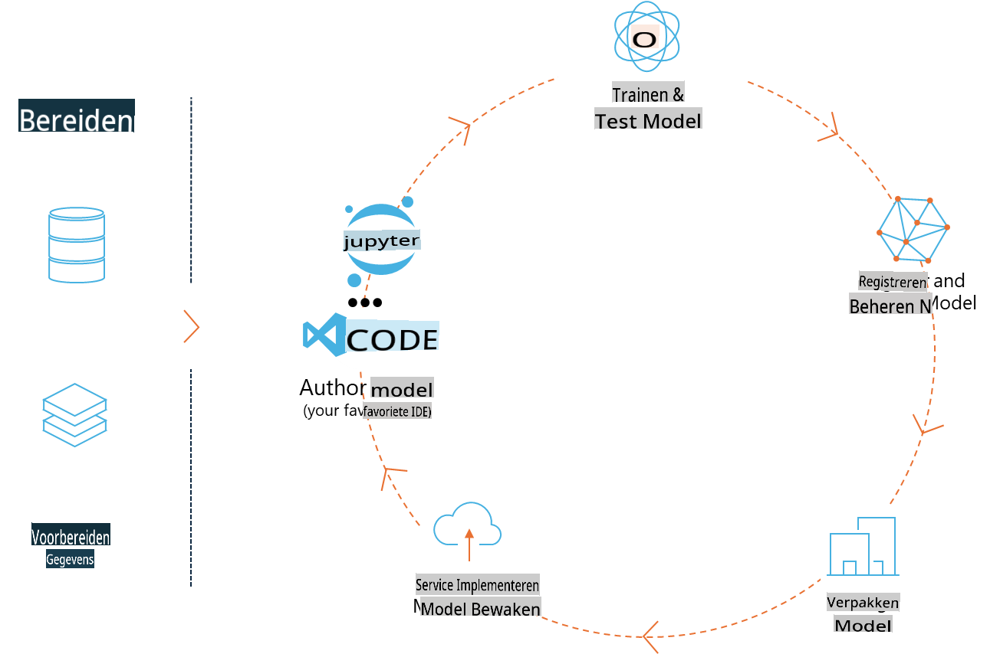
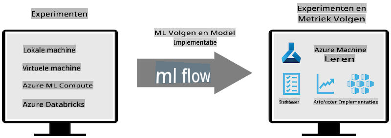
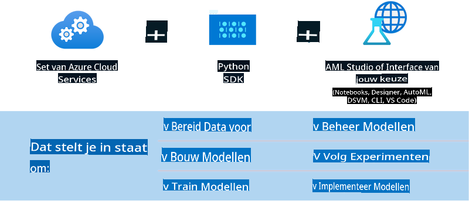

# MLflow

[MLflow](https://mlflow.org/) is een open-source platform ontworpen om de end-to-end levenscyclus van machine learning te beheren.



MLFlow wordt gebruikt om de ML-levenscyclus te beheren, inclusief experimentatie, reproduceerbaarheid, implementatie en een centrale modelregistratie. MLFlow biedt momenteel vier componenten:

- **MLflow Tracking:** Registreer en raadpleeg experimenten, code, dataconfiguraties en resultaten.
- **MLflow Projects:** Verpak data science-code in een formaat dat reproduceerbare runs op elk platform mogelijk maakt.
- **MLflow Models:** Implementeer machine learning-modellen in diverse omgevingen.
- **Model Registry:** Sla modellen op, voorzie ze van aantekeningen en beheer ze in een centrale repository.

Het platform biedt mogelijkheden voor het volgen van experimenten, het verpakken van code in reproduceerbare runs en het delen en implementeren van modellen. MLFlow is geïntegreerd in Databricks en ondersteunt een breed scala aan ML-bibliotheken, waardoor het bibliotheekonafhankelijk is. Het kan worden gebruikt met elke machine learning-bibliotheek en in elke programmeertaal, dankzij een REST API en CLI voor gemak.



Belangrijke functies van MLFlow zijn onder andere:

- **Experiment Tracking:** Registreer en vergelijk parameters en resultaten.
- **Model Management:** Implementeer modellen op diverse platforms voor bediening en inferentie.
- **Model Registry:** Beheer gezamenlijk de levenscyclus van MLFlow-modellen, inclusief versiebeheer en annotaties.
- **Projects:** Verpak ML-code voor delen of productiegebruik.

MLFlow ondersteunt ook de MLOps-cyclus, waaronder het voorbereiden van data, registreren en beheren van modellen, verpakken van modellen voor uitvoering, implementeren van diensten en monitoren van modellen. Het doel is om het proces van prototype naar productie te vereenvoudigen, vooral in cloud- en edge-omgevingen.

## E2E Scenario - Een wrapper bouwen en Phi-3 gebruiken als een MLFlow-model

In dit E2E-voorbeeld laten we twee verschillende benaderingen zien om een wrapper te bouwen rond het Phi-3 small language model (SLM) en deze vervolgens als een MLFlow-model te draaien, lokaal of in de cloud, bijvoorbeeld in een Azure Machine Learning-werkruimte.



| Project | Beschrijving | Locatie |
| ------------ | ----------- | -------- |
| Transformer Pipeline | Transformer Pipeline is de eenvoudigste optie om een wrapper te bouwen als je een HuggingFace-model met MLFlow's experimentele transformers flavour wilt gebruiken. | [**TransformerPipeline.ipynb**](../../../../../../code/06.E2E/E2E_Phi-3-MLflow_TransformerPipeline.ipynb) |
| Custom Python Wrapper | Op het moment van schrijven ondersteunde de transformer pipeline geen MLFlow-wrappergeneratie voor HuggingFace-modellen in ONNX-formaat, zelfs niet met het experimentele optimum Python-pakket. Voor dergelijke gevallen kun je een aangepaste Python-wrapper bouwen voor de MLFlow-modus. | [**CustomPythonWrapper.ipynb**](../../../../../../code/06.E2E/E2E_Phi-3-MLflow_CustomPythonWrapper.ipynb) |

## Project: Transformer Pipeline

1. Je hebt de relevante Python-pakketten van MLFlow en HuggingFace nodig:

    ``` Python
    import mlflow
    import transformers
    ```

2. Vervolgens moet je een transformer pipeline starten door te verwijzen naar het doelmodel Phi-3 in de HuggingFace-registratie. Zoals te zien is in de modelkaart van _Phi-3-mini-4k-instruct_, is de taak ervan van het type "Text Generation":

    ``` Python
    pipeline = transformers.pipeline(
        task = "text-generation",
        model = "microsoft/Phi-3-mini-4k-instruct"
    )
    ```

3. Je kunt nu de transformer pipeline van je Phi-3-model opslaan in MLFlow-formaat en extra details verstrekken, zoals het doelpad voor artefacten, specifieke modelconfiguratie-instellingen en het type inferentie-API:

    ``` Python
    model_info = mlflow.transformers.log_model(
        transformers_model = pipeline,
        artifact_path = "phi3-mlflow-model",
        model_config = model_config,
        task = "llm/v1/chat"
    )
    ```

## Project: Custom Python Wrapper

1. Hier kunnen we gebruik maken van Microsoft's [ONNX Runtime generate() API](https://github.com/microsoft/onnxruntime-genai) voor de inferentie van het ONNX-model en het encoderen/decoderen van tokens. Je moet het _onnxruntime_genai_-pakket kiezen voor je doelcompute, met onderstaand voorbeeld gericht op CPU:

    ``` Python
    import mlflow
    from mlflow.models import infer_signature
    import onnxruntime_genai as og
    ```

2. Onze aangepaste klasse implementeert twee methoden: _load_context()_ om het **ONNX-model** van Phi-3 Mini 4K Instruct, **generatorparameters** en **tokenizer** te initialiseren; en _predict()_ om outputtokens te genereren voor de opgegeven prompt:

    ``` Python
    class Phi3Model(mlflow.pyfunc.PythonModel):
        def load_context(self, context):
            # Retrieving model from the artifacts
            model_path = context.artifacts["phi3-mini-onnx"]
            model_options = {
                 "max_length": 300,
                 "temperature": 0.2,         
            }
        
            # Defining the model
            self.phi3_model = og.Model(model_path)
            self.params = og.GeneratorParams(self.phi3_model)
            self.params.set_search_options(**model_options)
            
            # Defining the tokenizer
            self.tokenizer = og.Tokenizer(self.phi3_model)
    
        def predict(self, context, model_input):
            # Retrieving prompt from the input
            prompt = model_input["prompt"][0]
            self.params.input_ids = self.tokenizer.encode(prompt)
    
            # Generating the model's response
            response = self.phi3_model.generate(self.params)
    
            return self.tokenizer.decode(response[0][len(self.params.input_ids):])
    ```

3. Je kunt nu de functie _mlflow.pyfunc.log_model()_ gebruiken om een aangepaste Python-wrapper (in pickle-formaat) te genereren voor het Phi-3-model, samen met het oorspronkelijke ONNX-model en de benodigde afhankelijkheden:

    ``` Python
    model_info = mlflow.pyfunc.log_model(
        artifact_path = artifact_path,
        python_model = Phi3Model(),
        artifacts = {
            "phi3-mini-onnx": "cpu_and_mobile/cpu-int4-rtn-block-32-acc-level-4",
        },
        input_example = input_example,
        signature = infer_signature(input_example, ["Run"]),
        extra_pip_requirements = ["torch", "onnxruntime_genai", "numpy"],
    )
    ```

## Signaturen van gegenereerde MLFlow-modellen

1. In stap 3 van het Transformer Pipeline-project hierboven hebben we de taak van het MLFlow-model ingesteld op "_llm/v1/chat_". Een dergelijke instructie genereert een API-wrapper voor het model, compatibel met OpenAI’s Chat API zoals hieronder weergegeven:

    ``` Python
    {inputs: 
      ['messages': Array({content: string (required), name: string (optional), role: string (required)}) (required), 'temperature': double (optional), 'max_tokens': long (optional), 'stop': Array(string) (optional), 'n': long (optional), 'stream': boolean (optional)],
    outputs: 
      ['id': string (required), 'object': string (required), 'created': long (required), 'model': string (required), 'choices': Array({finish_reason: string (required), index: long (required), message: {content: string (required), name: string (optional), role: string (required)} (required)}) (required), 'usage': {completion_tokens: long (required), prompt_tokens: long (required), total_tokens: long (required)} (required)],
    params: 
      None}
    ```

2. Als resultaat kun je je prompt indienen in het volgende formaat:

    ``` Python
    messages = [{"role": "user", "content": "What is the capital of Spain?"}]
    ```

3. Gebruik vervolgens een OpenAI API-compatibele post-processing, bijvoorbeeld _response[0][‘choices’][0][‘message’][‘content’]_, om je output te formatteren naar iets als dit:

    ``` JSON
    Question: What is the capital of Spain?
    
    Answer: The capital of Spain is Madrid. It is the largest city in Spain and serves as the political, economic, and cultural center of the country. Madrid is located in the center of the Iberian Peninsula and is known for its rich history, art, and architecture, including the Royal Palace, the Prado Museum, and the Plaza Mayor.
    
    Usage: {'prompt_tokens': 11, 'completion_tokens': 73, 'total_tokens': 84}
    ```

4. In stap 3 van het Custom Python Wrapper-project hierboven laten we het MLFlow-pakket de handtekening van het model genereren op basis van een gegeven invoervoorbeeld. De handtekening van onze MLFlow-wrapper ziet er als volgt uit:

    ``` Python
    {inputs: 
      ['prompt': string (required)],
    outputs: 
      [string (required)],
    params: 
      None}
    ```

5. Onze prompt moet daarom een "prompt"-sleutel in de dictionary bevatten, zoals dit:

    ``` Python
    {"prompt": "<|system|>You are a stand-up comedian.<|end|><|user|>Tell me a joke about atom<|end|><|assistant|>",}
    ```

6. De uitvoer van het model wordt dan geleverd in stringformaat:

    ``` JSON
    Alright, here's a little atom-related joke for you!
    
    Why don't electrons ever play hide and seek with protons?
    
    Because good luck finding them when they're always "sharing" their electrons!
    
    Remember, this is all in good fun, and we're just having a little atomic-level humor!
    ```

**Disclaimer**:  
Dit document is vertaald met behulp van machine-gebaseerde AI-vertalingsdiensten. Hoewel we streven naar nauwkeurigheid, dient u zich ervan bewust te zijn dat geautomatiseerde vertalingen fouten of onnauwkeurigheden kunnen bevatten. Het originele document in de oorspronkelijke taal moet worden beschouwd als de gezaghebbende bron. Voor cruciale informatie wordt professionele menselijke vertaling aanbevolen. Wij zijn niet aansprakelijk voor misverstanden of verkeerde interpretaties die voortvloeien uit het gebruik van deze vertaling.