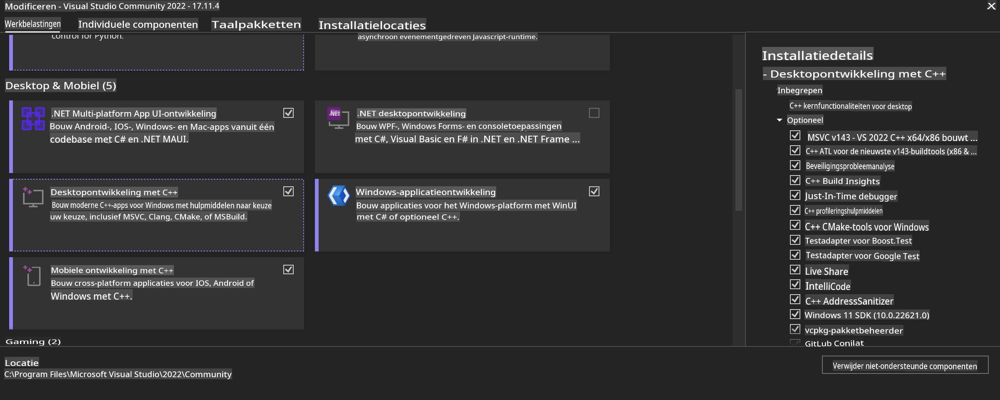
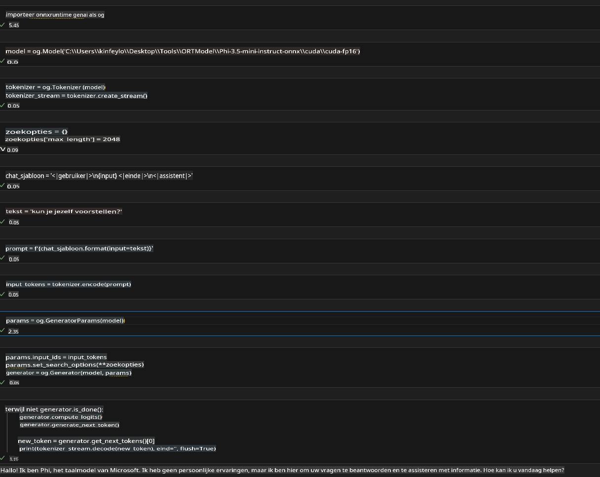
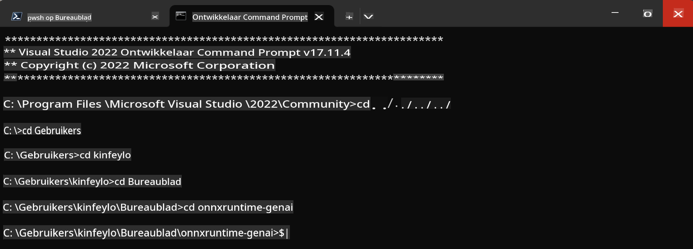

# **Handleiding voor OnnxRuntime GenAI Windows GPU**

Deze handleiding biedt stappen voor het instellen en gebruiken van de ONNX Runtime (ORT) met GPU's op Windows. Het is bedoeld om je te helpen GPU-versnelling te benutten voor je modellen, waardoor de prestaties en efficiëntie worden verbeterd.

Het document bevat richtlijnen over:

- Omgevingsinstelling: Instructies voor het installeren van de benodigde afhankelijkheden zoals CUDA, cuDNN en ONNX Runtime.
- Configuratie: Hoe je de omgeving en ONNX Runtime configureert om GPU-resources effectief te gebruiken.
- Optimalisatietips: Advies over het verfijnen van je GPU-instellingen voor optimale prestaties.

### **1. Python 3.10.x / 3.11.8**

   ***Opmerking*** We raden aan [miniforge](https://github.com/conda-forge/miniforge/releases/latest/download/Miniforge3-Windows-x86_64.exe) te gebruiken als je Python-omgeving.

   ```bash

   conda create -n pydev python==3.11.8

   conda activate pydev

   ```

   ***Herinnering*** Als je al een Python ONNX-bibliotheek hebt geïnstalleerd, verwijder deze dan.

### **2. Installeer CMake met winget**

   ```bash

   winget install -e --id Kitware.CMake

   ```

### **3. Installeer Visual Studio 2022 - Desktop Development met C++**

   ***Opmerking*** Als je niet wilt compileren, kun je deze stap overslaan.



### **4. Installeer NVIDIA Driver**

1. **NVIDIA GPU Driver**  [https://www.nvidia.com/en-us/drivers/](https://www.nvidia.com/en-us/drivers/)

2. **NVIDIA CUDA 12.4** [https://developer.nvidia.com/cuda-12-4-0-download-archive](https://developer.nvidia.com/cuda-12-4-0-download-archive)

3. **NVIDIA CUDNN 9.4**  [https://developer.nvidia.com/cudnn-downloads](https://developer.nvidia.com/cudnn-downloads)

***Herinnering*** Gebruik de standaardinstellingen tijdens de installatie.

### **5. Stel NVIDIA-omgeving in**

Kopieer NVIDIA CUDNN 9.4 lib, bin, include naar NVIDIA CUDA 12.4 lib, bin, include.

- Kopieer de bestanden uit *'C:\Program Files\NVIDIA\CUDNN\v9.4\bin\12.6'* naar *'C:\Program Files\NVIDIA GPU Computing Toolkit\CUDA\v12.4\bin'*.

- Kopieer de bestanden uit *'C:\Program Files\NVIDIA\CUDNN\v9.4\include\12.6'* naar *'C:\Program Files\NVIDIA GPU Computing Toolkit\CUDA\v12.4\include'*.

- Kopieer de bestanden uit *'C:\Program Files\NVIDIA\CUDNN\v9.4\lib\12.6'* naar *'C:\Program Files\NVIDIA GPU Computing Toolkit\CUDA\v12.4\lib\x64'*.

### **6. Download Phi-3.5-mini-instruct-onnx**

   ```bash

   winget install -e --id Git.Git

   winget install -e --id GitHub.GitLFS

   git lfs install

   git clone https://huggingface.co/microsoft/Phi-3.5-mini-instruct-onnx

   ```

### **7. Voer InferencePhi35Instruct.ipynb uit**

   Open [Notebook](../../../../../../code/09.UpdateSamples/Aug/ortgpu-phi35-instruct.ipynb) en voer het uit.



### **8. Compileer ORT GenAI GPU**

   ***Opmerking*** 
   
   1. Verwijder eerst alle ONNX-, ONNXRuntime- en ONNXRuntime-GenAI-bibliotheken.

   ```bash

   pip list 
   
   ```

   Verwijder vervolgens alle ONNXRuntime-bibliotheken, bijvoorbeeld:

   ```bash

   pip uninstall onnxruntime

   pip uninstall onnxruntime-genai

   pip uninstall onnxruntume-genai-cuda
   
   ```

   2. Controleer de ondersteuning voor Visual Studio-extensies.

   Controleer of *C:\Program Files\NVIDIA GPU Computing Toolkit\CUDA\v12.4\extras\visual_studio_integration* aanwezig is. 

   Als dit niet het geval is, controleer andere CUDA-toolkit-driverfolders en kopieer de map *visual_studio_integration* en de inhoud ervan naar *C:\Program Files\NVIDIA GPU Computing Toolkit\CUDA\v12.4\extras\visual_studio_integration*.

   - Als je niet wilt compileren, kun je deze stap overslaan.

   ```bash

   git clone https://github.com/microsoft/onnxruntime-genai

   ```

   - Download [https://github.com/microsoft/onnxruntime/releases/download/v1.19.2/onnxruntime-win-x64-gpu-1.19.2.zip](https://github.com/microsoft/onnxruntime/releases/download/v1.19.2/onnxruntime-win-x64-gpu-1.19.2.zip).

   - Pak het bestand *onnxruntime-win-x64-gpu-1.19.2.zip* uit, hernoem het naar **ort**, en kopieer de map *ort* naar *onnxruntime-genai*.

   - Gebruik Windows Terminal, ga naar de Developer Command Prompt voor VS 2022 en navigeer naar *onnxruntime-genai*.



   - Compileer het met je Python-omgeving.

   ```bash

   cd onnxruntime-genai

   python build.py --use_cuda  --cuda_home "C:\Program Files\NVIDIA GPU Computing Toolkit\CUDA\v12.4" --config Release
 

   cd build/Windows/Release/Wheel

   pip install .whl

   ```

**Disclaimer**:  
Dit document is vertaald met behulp van AI-gebaseerde vertaaldiensten. Hoewel we ons best doen voor nauwkeurigheid, moet u zich ervan bewust zijn dat geautomatiseerde vertalingen fouten of onnauwkeurigheden kunnen bevatten. Het oorspronkelijke document in de oorspronkelijke taal moet worden beschouwd als de gezaghebbende bron. Voor cruciale informatie wordt professionele menselijke vertaling aanbevolen. Wij zijn niet aansprakelijk voor misverstanden of verkeerde interpretaties die voortvloeien uit het gebruik van deze vertaling.