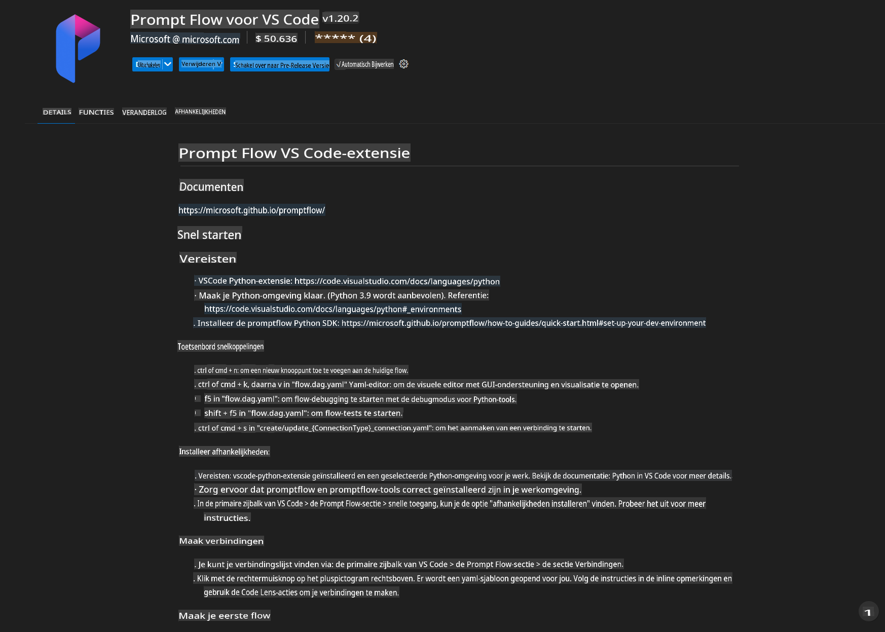
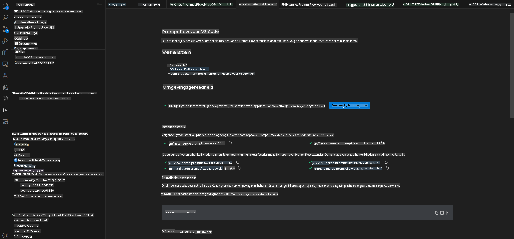
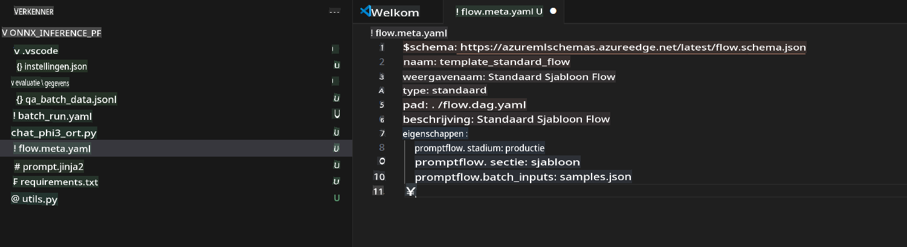
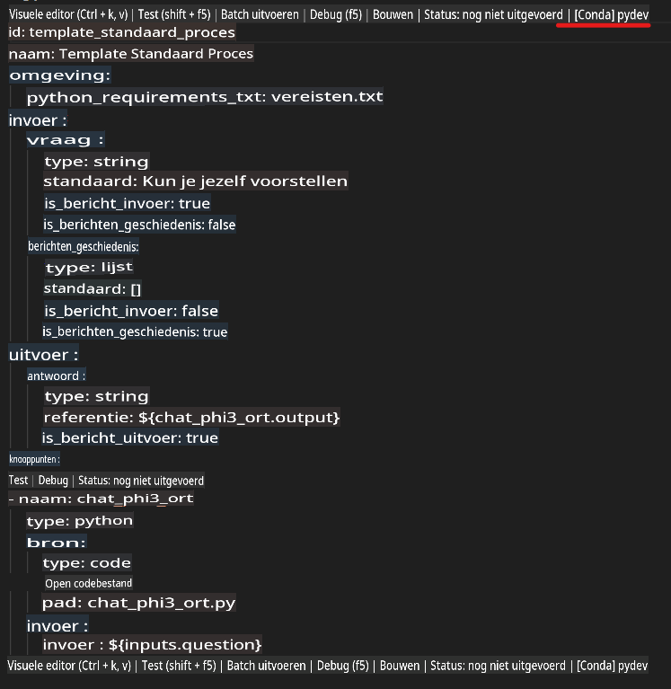
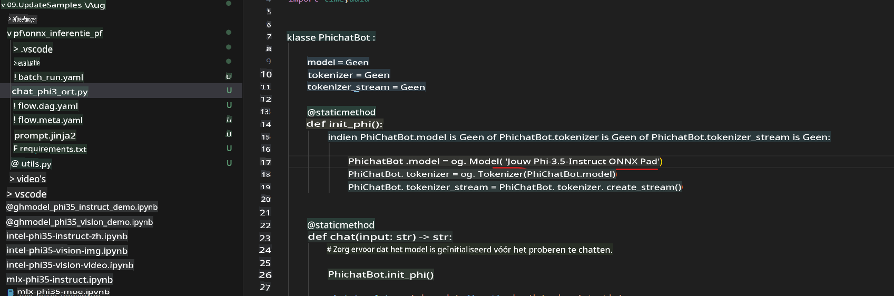
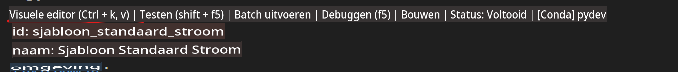
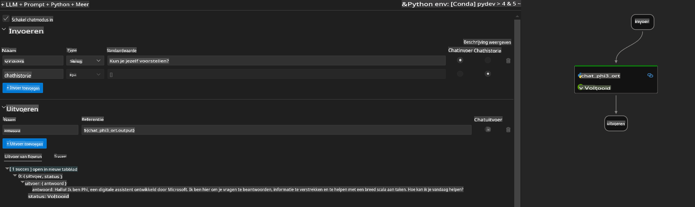
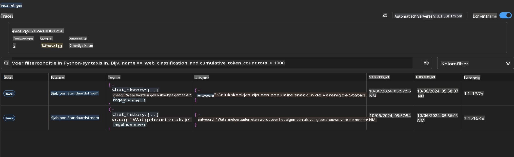

# Windows GPU gebruiken om een Prompt Flow-oplossing te creëren met Phi-3.5-Instruct ONNX

Dit document is een voorbeeld van hoe je PromptFlow kunt gebruiken met ONNX (Open Neural Network Exchange) voor het ontwikkelen van AI-toepassingen gebaseerd op Phi-3-modellen.

PromptFlow is een reeks ontwikkeltools die ontworpen zijn om de volledige ontwikkelcyclus van LLM-gebaseerde (Large Language Model) AI-toepassingen te stroomlijnen, van idee en prototyping tot testen en evaluatie.

Door PromptFlow te integreren met ONNX kunnen ontwikkelaars:

- **Modelprestaties optimaliseren**: Gebruik ONNX voor efficiënte modelinference en implementatie.  
- **Ontwikkeling vereenvoudigen**: Gebruik PromptFlow om workflows te beheren en repetitieve taken te automatiseren.  
- **Samenwerking verbeteren**: Bied een uniforme ontwikkelomgeving om de samenwerking tussen teamleden te vergemakkelijken.

**Prompt flow** is een reeks ontwikkeltools die ontworpen zijn om de volledige ontwikkelcyclus van LLM-gebaseerde AI-toepassingen te stroomlijnen, van idee, prototyping, testen, evaluatie tot implementatie en monitoring in productie. Het maakt prompt engineering veel eenvoudiger en stelt je in staat om LLM-apps van productiekwaliteit te bouwen.

Prompt flow kan verbinding maken met OpenAI, Azure OpenAI Service en aanpasbare modellen (Huggingface, lokale LLM/SLM). We hopen Phi-3.5's gequantiseerde ONNX-model te implementeren in lokale toepassingen. Prompt flow kan ons helpen onze bedrijfsvoering beter te plannen en lokale oplossingen te voltooien op basis van Phi-3.5. In dit voorbeeld combineren we de ONNX Runtime GenAI Library om de Prompt Flow-oplossing te realiseren op basis van Windows GPU.

## **Installatie**

### **ONNX Runtime GenAI voor Windows GPU**

Lees deze handleiding om ONNX Runtime GenAI voor Windows GPU in te stellen [klik hier](./ORTWindowGPUGuideline.md)

### **Prompt flow instellen in VSCode**

1. Installeer de Prompt flow VS Code-extensie



2. Nadat je de Prompt flow VS Code-extensie hebt geïnstalleerd, klik je op de extensie en kies je **Installation dependencies**. Volg deze handleiding om de Prompt flow SDK in je omgeving te installeren.



3. Download [Voorbeeldcode](../../../../../../code/09.UpdateSamples/Aug/pf/onnx_inference_pf) en open dit voorbeeld met VS Code.



4. Open **flow.dag.yaml** om je Python-omgeving te selecteren.



   Open **chat_phi3_ort.py** om de locatie van je Phi-3.5-Instruct ONNX-model te wijzigen.



5. Voer je Prompt Flow uit om te testen.

Open **flow.dag.yaml** en klik op de visuele editor.



Klik hierop en voer het uit om te testen.



1. Je kunt een batch uitvoeren in de terminal om meer resultaten te bekijken.

```bash

pf run create --file batch_run.yaml --stream --name 'Your eval qa name'    

```

Je kunt de resultaten bekijken in je standaardbrowser.



**Disclaimer (Vrijwaring)**:  
Dit document is vertaald met behulp van machine-gebaseerde AI-vertalingsdiensten. Hoewel we ons best doen voor nauwkeurigheid, dient u zich ervan bewust te zijn dat geautomatiseerde vertalingen fouten of onnauwkeurigheden kunnen bevatten. Het originele document in zijn oorspronkelijke taal moet worden beschouwd als de gezaghebbende bron. Voor kritieke informatie wordt professionele menselijke vertaling aanbevolen. Wij zijn niet aansprakelijk voor misverstanden of verkeerde interpretaties die voortvloeien uit het gebruik van deze vertaling.