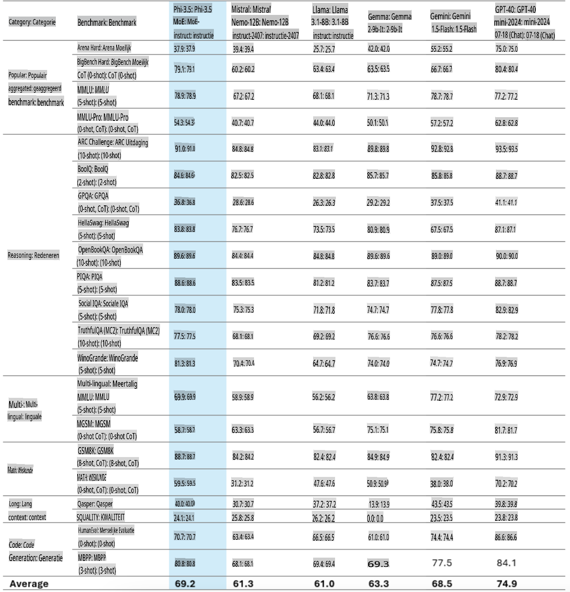
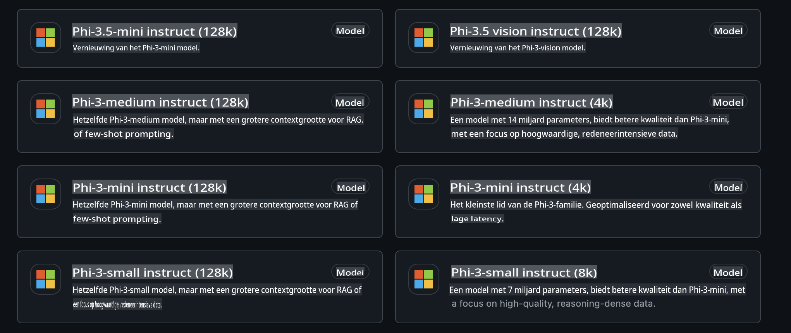
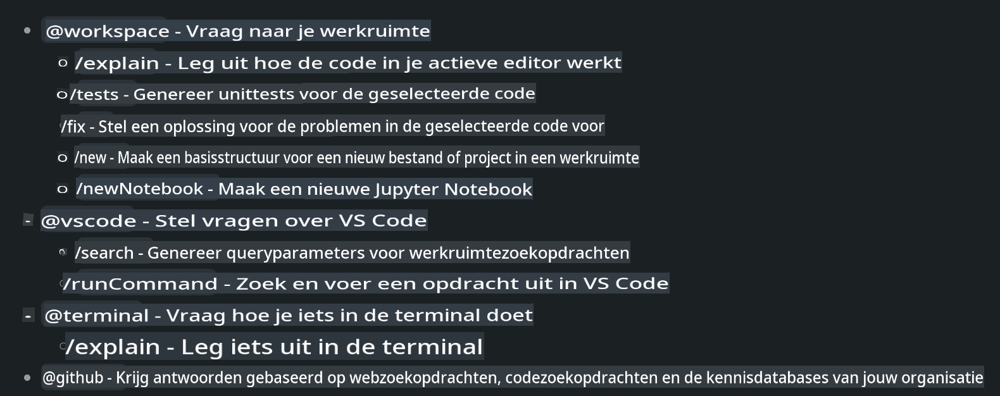
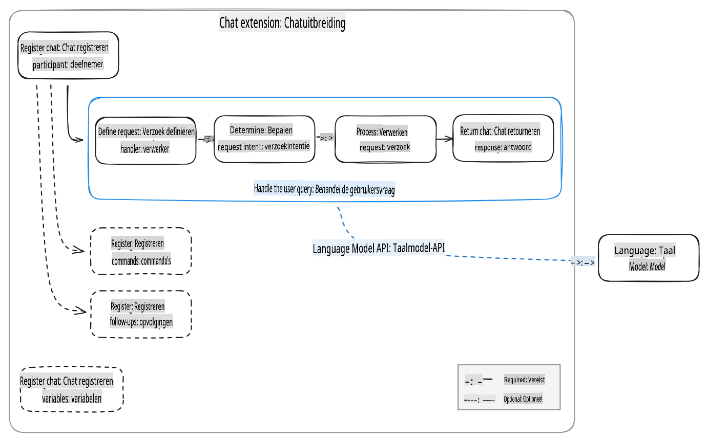
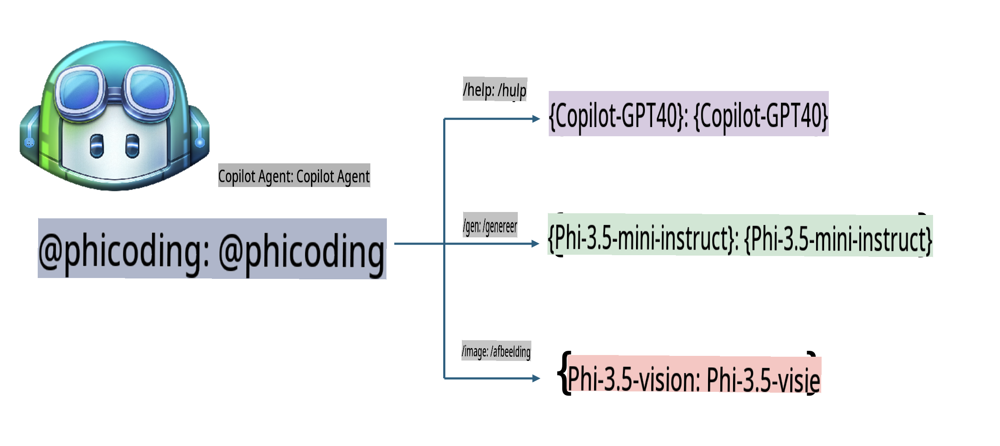
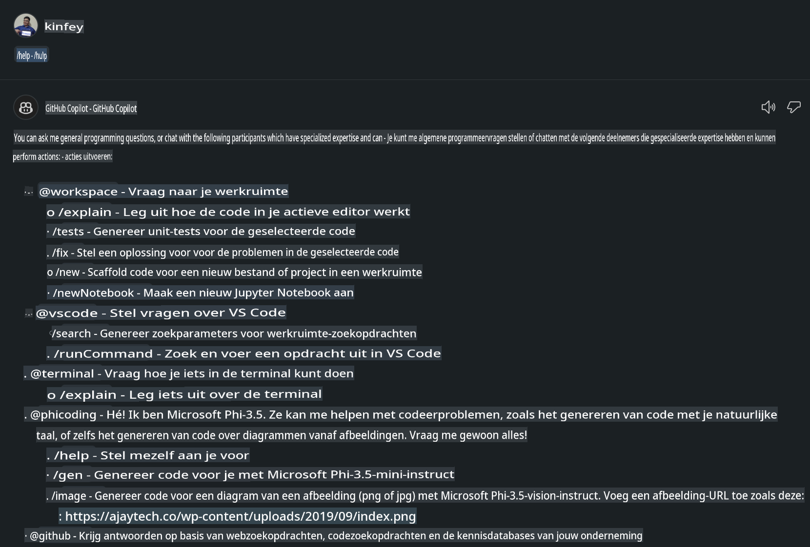
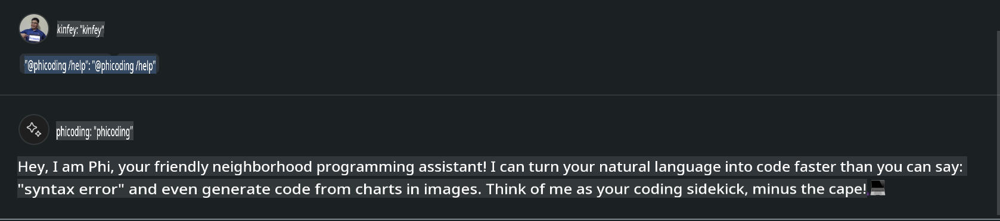
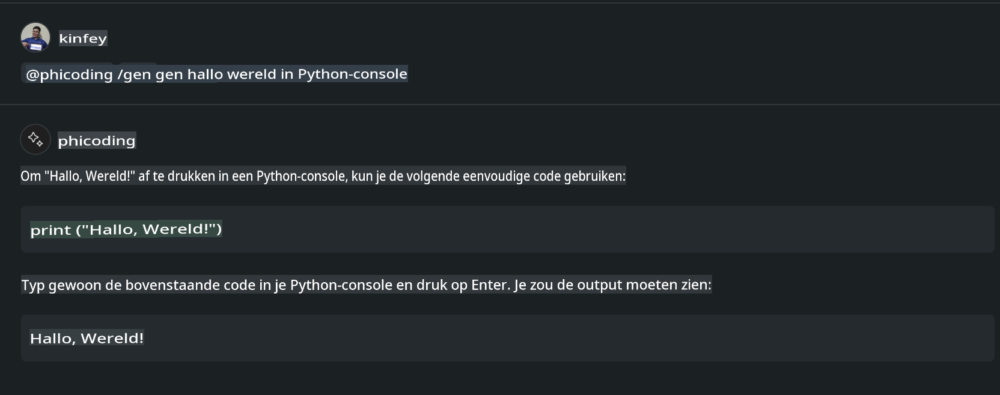
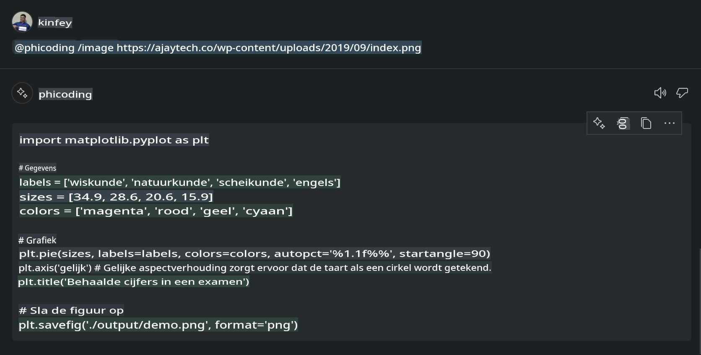

# **Maak je eigen Visual Studio Code Chat Copilot Agent met Phi-3.5 van GitHub Models**

Gebruik je Visual Studio Code Copilot? Vooral in Chat kun je verschillende agents inzetten om het creëren, schrijven en onderhouden van projecten in Visual Studio Code te verbeteren. Visual Studio Code biedt een API waarmee bedrijven en individuen verschillende agents kunnen ontwikkelen die zijn afgestemd op hun bedrijfsactiviteiten, om zo hun mogelijkheden in diverse specifieke domeinen uit te breiden. In dit artikel richten we ons op **Phi-3.5-mini-instruct (128k)** en **Phi-3.5-vision-instruct (128k)** van GitHub Models om je eigen Visual Studio Code Agent te maken.

## **Over Phi-3.5 op GitHub Models**

We weten dat Phi-3/3.5-mini-instruct in de Phi-3/3.5-familie sterke mogelijkheden heeft op het gebied van codebegrip en -generatie, en voordelen biedt ten opzichte van Gemma-2-9b en Mistral-Nemo-12B-instruct-2407.



De nieuwste GitHub Models bieden al toegang tot de Phi-3.5-mini-instruct (128k) en Phi-3.5-vision-instruct (128k) modellen. Ontwikkelaars kunnen hier toegang toe krijgen via de OpenAI SDK, Azure AI Inference SDK en REST API.



***Opmerking:*** Het wordt aanbevolen om hier de Azure AI Inference SDK te gebruiken, omdat dit beter kan schakelen met de Azure Model Catalog in een productieomgeving.

Hieronder staan de resultaten van **Phi-3.5-mini-instruct (128k)** en **Phi-3.5-vision-instruct (128k)** in een codegeneratiescenario na koppeling met GitHub Models. Deze resultaten dienen ook als voorbereiding op de onderstaande voorbeelden.

**Demo: GitHub Models Phi-3.5-mini-instruct (128k) genereert code vanuit een Prompt** ([klik op deze link](../../../../../../code/09.UpdateSamples/Aug/ghmodel_phi35_instruct_demo.ipynb))

**Demo: GitHub Models Phi-3.5-vision-instruct (128k) genereert code vanuit een afbeelding** ([klik op deze link](../../../../../../code/09.UpdateSamples/Aug/ghmodel_phi35_vision_demo.ipynb))

## **Over GitHub Copilot Chat Agent**

GitHub Copilot Chat Agent kan verschillende taken uitvoeren in verschillende projectscenario's op basis van de code. Het systeem heeft vier agents: workspace, github, terminal, vscode.



Door de naam van de agent met ‘@’ toe te voegen, kun je snel het bijbehorende werk uitvoeren. Voor bedrijven geldt dat als je eigen bedrijfsgerelateerde inhoud toevoegt, zoals eisen, codering, testspecificaties en release, je krachtigere bedrijfsgerichte functies kunt realiseren op basis van GitHub Copilot.

Visual Studio Code Chat Agent heeft nu officieel zijn API uitgebracht, waarmee bedrijven of bedrijfsontwikkelaars agents kunnen ontwikkelen die aansluiten bij verschillende software-ecosystemen. Gebaseerd op de ontwikkelmethode van Visual Studio Code Extension Development kun je eenvoudig toegang krijgen tot de interface van de Visual Studio Code Chat Agent API. We kunnen ontwikkelen volgens dit proces.



Het ontwikkelscenario ondersteunt toegang tot API's van derde partij modellen (zoals GitHub Models, Azure Model Catalog en zelfgebouwde services gebaseerd op open source modellen) en kan ook gebruikmaken van de gpt-35-turbo, gpt-4 en gpt-4o modellen die door GitHub Copilot worden aangeboden.

## **Voeg een Agent @phicoding toe gebaseerd op Phi-3.5**

We proberen de programmeermogelijkheden van Phi-3.5 te integreren om code te schrijven, code uit afbeeldingen te genereren en andere taken uit te voeren. Een Agent bouwen rond Phi-3.5 - @PHI, bevat de volgende functies:

1. Genereer een zelfintroductie gebaseerd op GPT-4o aangeboden door GitHub Copilot via het **@phicoding /help**-commando.

2. Genereer code voor verschillende programmeertalen op basis van **Phi-3.5-mini-instruct (128k)** via het **@phicoding /gen**-commando.

3. Genereer code en voltooi afbeeldingen op basis van **Phi-3.5-vision-instruct (128k)** via het **@phicoding /image**-commando.



## **Gerelateerde stappen**

1. Installeer Visual Studio Code Extension-ondersteuning met npm.

```bash

npm install --global yo generator-code 

```

2. Maak een Visual Studio Code Extension-plugin (gebruik de Typescript ontwikkelmodus, genaamd phiext).

```bash

yo code 

```

3. Open het aangemaakte project en wijzig package.json. Hier staan de gerelateerde instructies en configuraties, evenals de configuratie van GitHub Models. Let op: je moet hier je GitHub Models-token toevoegen.

```json

{
  "name": "phiext",
  "displayName": "phiext",
  "description": "",
  "version": "0.0.1",
  "engines": {
    "vscode": "^1.93.0"
  },
  "categories": [
    "AI",
    "Chat"
  ],
  "activationEvents": [],
  "enabledApiProposals": [
      "chatVariableResolver"
  ],
  "main": "./dist/extension.js",
  "contributes": {
    "chatParticipants": [
        {
            "id": "chat.phicoding",
            "name": "phicoding",
            "description": "Hey! I am Microsoft Phi-3.5, She can help me with coding problems, such as generation code with your natural language, or even generation code about chart from images. Just ask me anything!",
            "isSticky": true,
            "commands": [
                {
                    "name": "help",
                    "description": "Introduce myself to you"
                },
                {
                    "name": "gen",
                    "description": "Generate code for you with Microsoft Phi-3.5-mini-instruct"
                },
                {
                    "name": "image",
                    "description": "Generate code for chart from image(png or jpg) with Microsoft Phi-3.5-vision-instruct, please add image url like this : https://ajaytech.co/wp-content/uploads/2019/09/index.png"
                }
            ]
        }
    ],
    "commands": [
        {
            "command": "phicoding.namesInEditor",
            "title": "Use Microsoft Phi 3.5 in Editor"
        }
    ],
    "configuration": {
      "type": "object",
      "title": "githubmodels",
      "properties": {
        "githubmodels.endpoint": {
          "type": "string",
          "default": "https://models.inference.ai.azure.com",
          "description": "Your GitHub Models Endpoint",
          "order": 0
        },
        "githubmodels.api_key": {
          "type": "string",
          "default": "Your GitHub Models Token",
          "description": "Your GitHub Models Token",
          "order": 1
        },
        "githubmodels.phi35instruct": {
          "type": "string",
          "default": "Phi-3.5-mini-instruct",
          "description": "Your Phi-35-Instruct Model",
          "order": 2
        },
        "githubmodels.phi35vision": {
          "type": "string",
          "default": "Phi-3.5-vision-instruct",
          "description": "Your Phi-35-Vision Model",
          "order": 3
        }
      }
    }
  },
  "scripts": {
    "vscode:prepublish": "npm run package",
    "compile": "webpack",
    "watch": "webpack --watch",
    "package": "webpack --mode production --devtool hidden-source-map",
    "compile-tests": "tsc -p . --outDir out",
    "watch-tests": "tsc -p . -w --outDir out",
    "pretest": "npm run compile-tests && npm run compile && npm run lint",
    "lint": "eslint src",
    "test": "vscode-test"
  },
  "devDependencies": {
    "@types/vscode": "^1.93.0",
    "@types/mocha": "^10.0.7",
    "@types/node": "20.x",
    "@typescript-eslint/eslint-plugin": "^8.3.0",
    "@typescript-eslint/parser": "^8.3.0",
    "eslint": "^9.9.1",
    "typescript": "^5.5.4",
    "ts-loader": "^9.5.1",
    "webpack": "^5.94.0",
    "webpack-cli": "^5.1.4",
    "@vscode/test-cli": "^0.0.10",
    "@vscode/test-electron": "^2.4.1"
  },
  "dependencies": {
    "@types/node-fetch": "^2.6.11",
    "node-fetch": "^3.3.2",
    "@azure-rest/ai-inference": "latest",
    "@azure/core-auth": "latest",
    "@azure/core-sse": "latest"
  }
}


```

4. Wijzig src/extension.ts.

```typescript

// The module 'vscode' contains the VS Code extensibility API
// Import the module and reference it with the alias vscode in your code below
import * as vscode from 'vscode';
import ModelClient from "@azure-rest/ai-inference";
import { AzureKeyCredential } from "@azure/core-auth";


interface IPhiChatResult extends vscode.ChatResult {
    metadata: {
        command: string;
    };
}


const MODEL_SELECTOR: vscode.LanguageModelChatSelector = { vendor: 'copilot', family: 'gpt-4o' };

function isValidImageUrl(url: string): boolean {
    const regex = /^(https?:\/\/.*\.(?:png|jpg))$/i;
    return regex.test(url);
}
  

// This method is called when your extension is activated
// Your extension is activated the very first time the command is executed
export function activate(context: vscode.ExtensionContext) {

    const codinghandler: vscode.ChatRequestHandler = async (request: vscode.ChatRequest, context: vscode.ChatContext, stream: vscode.ChatResponseStream, token: vscode.CancellationToken): Promise<IPhiChatResult> => {


        const config : any = vscode.workspace.getConfiguration('githubmodels');
        const endPoint: string = config.get('endpoint');
        const apiKey: string = config.get('api_key');
        const phi35instruct: string = config.get('phi35instruct');
        const phi35vision: string = config.get('phi35vision');
        
        if (request.command === 'help') {

            const content = "Welcome to Coding assistant with Microsoft Phi-3.5"; 
            stream.progress(content);


            try {
                const [model] = await vscode.lm.selectChatModels(MODEL_SELECTOR);
                if (model) {
                    const messages = [
                        vscode.LanguageModelChatMessage.User("Please help me express this content in a humorous way: I am a programming assistant who can help you convert natural language into code and generate code based on the charts in the images. output format like this : Hey I am Phi ......")
                    ];
                    const chatResponse = await model.sendRequest(messages, {}, token);
                    for await (const fragment of chatResponse.text) {
                        stream.markdown(fragment);
                    }
                }
            } catch(err) {
                console.log(err);
            }


            return { metadata: { command: 'help' } };

        }

        
        if (request.command === 'gen') {

            const content = "Welcome to use phi-3.5 to generate code";

            stream.progress(content);

            const client = new ModelClient(endPoint, new AzureKeyCredential(apiKey));

            const response = await client.path("/chat/completions").post({
              body: {
                messages: [
                  { role:"system", content: "You are a coding assistant.Help answer all code generation questions." },
                  { role:"user", content: request.prompt }
                ],
                model: phi35instruct,
                temperature: 0.4,
                max_tokens: 1000,
                top_p: 1.
              }
            });

            stream.markdown(response.body.choices[0].message.content);

            return { metadata: { command: 'gen' } };

        }


        
        if (request.command === 'image') {


            const content = "Welcome to use phi-3.5 to generate code from image(png or jpg),image url like this:https://ajaytech.co/wp-content/uploads/2019/09/index.png";

            stream.progress(content);

            if (!isValidImageUrl(request.prompt)) {
                stream.markdown('Please provide a valid image URL');
                return { metadata: { command: 'image' } };
            }
            else
            {

                const client = new ModelClient(endPoint, new AzureKeyCredential(apiKey));
    
                const response = await client.path("/chat/completions").post({
                    body: {
                      messages: [
                        { role: "system", content: "You are a helpful assistant that describes images in details." },
                        { role: "user", content: [
                            { type: "text", text: "Please generate code according to the chart in the picture according to the following requirements\n1. Keep all information in the chart, including data and text\n2. Do not generate additional information that is not included in the chart\n3. Please extract data from the picture, do not generate it from csv\n4. Please save the regenerated chart as a chart and save it to ./output/demo.png"},
                            { type: "image_url", image_url: {url: request.prompt}
                            }
                          ]
                        }
                      ],
                      model: phi35vision,
                      temperature: 0.4,
                      max_tokens: 2048,
                      top_p: 1.
                    }
                  });
    
                
                stream.markdown(response.body.choices[0].message.content);
    
                return { metadata: { command: 'image' } };
            }


        }


        return { metadata: { command: '' } };
    };


    const phi_ext = vscode.chat.createChatParticipant("chat.phicoding", codinghandler);

    phi_ext.iconPath = new vscode.ThemeIcon('sparkle');


    phi_ext.followupProvider = {
        provideFollowups(result: IPhiChatResult, context: vscode.ChatContext, token: vscode.CancellationToken) {
            return [{
                prompt: 'Let us coding with Phi-3.5 😋😋😋😋',
                label: vscode.l10n.t('Enjoy coding with Phi-3.5'),
                command: 'help'
            } satisfies vscode.ChatFollowup];
        }
    };

    context.subscriptions.push(phi_ext);
}

// This method is called when your extension is deactivated
export function deactivate() {}


```

6. Uitvoeren.

***/help***



***@phicoding /help***



***@phicoding /gen***



***@phicoding /image***



Je kunt voorbeeldcode downloaden: [klik](../../../../../../code/09.UpdateSamples/Aug/vscode)

## **Bronnen**

1. Meld je aan bij GitHub Models [https://gh.io/models](https://gh.io/models)

2. Leer Visual Studio Code Extension Development [https://code.visualstudio.com/api/get-started/your-first-extension](https://code.visualstudio.com/api/get-started/your-first-extension)

3. Leer meer over Visual Studio Code Copilot Chat API [https://code.visualstudio.com/api/extension-guides/chat](https://code.visualstudio.com/api/extension-guides/chat)

**Disclaimer**:  
Dit document is vertaald met behulp van AI-gebaseerde automatische vertaaldiensten. Hoewel we streven naar nauwkeurigheid, dient u zich ervan bewust te zijn dat geautomatiseerde vertalingen fouten of onnauwkeurigheden kunnen bevatten. Het originele document in zijn oorspronkelijke taal moet worden beschouwd als de gezaghebbende bron. Voor cruciale informatie wordt professionele menselijke vertaling aanbevolen. Wij zijn niet aansprakelijk voor misverstanden of verkeerde interpretaties die voortvloeien uit het gebruik van deze vertaling.