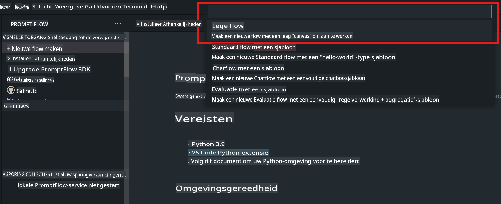
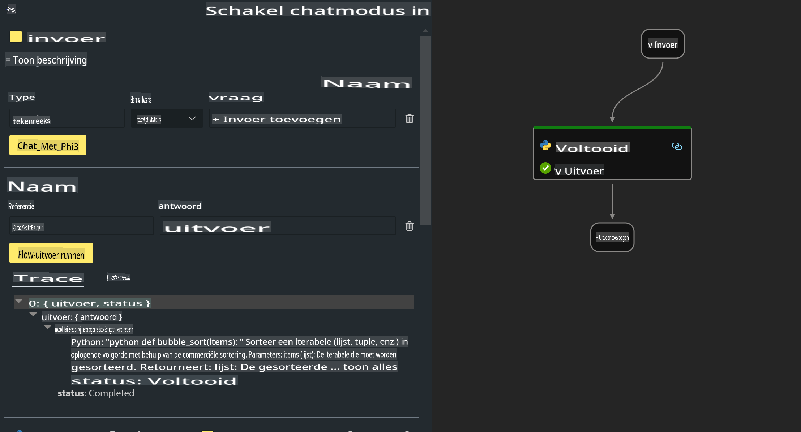

# **Lab 2 - Prompt flow uitvoeren met Phi-3-mini in AIPC**

## **Wat is Prompt flow**

Prompt flow is een suite van ontwikkeltools die ontworpen is om de volledige ontwikkelcyclus van AI-toepassingen gebaseerd op LLM's te stroomlijnen, van idee, prototyping, testen, evaluatie tot productie-implementatie en monitoring. Het maakt prompt engineering veel eenvoudiger en stelt je in staat om LLM-applicaties van productiekwaliteit te bouwen.

Met prompt flow kun je:

- Flows creëren die LLM's, prompts, Python-code en andere tools samenvoegen in een uitvoerbare workflow.

- Je flows debuggen en itereren, vooral de interactie met LLM's, op een eenvoudige manier.

- Je flows evalueren en kwaliteits- en prestatie-indicatoren berekenen met grotere datasets.

- Testen en evalueren integreren in je CI/CD-systeem om de kwaliteit van je flow te waarborgen.

- Je flows implementeren op het platform van jouw keuze of eenvoudig integreren in de codebasis van je app.

- (Optioneel maar sterk aanbevolen) Samenwerken met je team door gebruik te maken van de cloudversie van Prompt flow in Azure AI.

## **Wat is AIPC**

Een AI PC heeft een CPU, een GPU en een NPU, elk met specifieke AI-versnellingsmogelijkheden. Een NPU, of neural processing unit, is een gespecialiseerde accelerator die AI- en machine learning-taken direct op je pc uitvoert in plaats van gegevens naar de cloud te sturen voor verwerking. Hoewel de GPU en CPU ook deze taken kunnen uitvoeren, is de NPU vooral geschikt voor AI-berekeningen met een laag energieverbruik. De AI PC vertegenwoordigt een fundamentele verschuiving in hoe onze computers werken. Het is geen oplossing voor een probleem dat eerder niet bestond, maar eerder een enorme verbetering voor alledaags pc-gebruik.

Hoe werkt het? In vergelijking met generatieve AI en de enorme grote taalmodellen (LLM's) die zijn getraind op een enorme hoeveelheid openbare gegevens, is de AI die op je pc plaatsvindt veel toegankelijker op vrijwel elk niveau. Het concept is makkelijker te begrijpen, en omdat het is getraind op jouw gegevens, zonder dat toegang tot de cloud nodig is, zijn de voordelen direct aantrekkelijker voor een breder publiek.

Op de korte termijn omvat de wereld van de AI PC persoonlijke assistenten en kleinere AI-modellen die direct op je pc draaien, gebruikmakend van jouw gegevens om persoonlijke, private en meer veilige AI-verbeteringen te bieden voor dingen die je al dagelijks doet – zoals het maken van notulen, het organiseren van een fantasy football league, het automatiseren van verbeteringen voor foto- en videobewerking, of het samenstellen van de perfecte route voor een familiereünie op basis van ieders aankomst- en vertrektijden.

## **Generatiecodeflows bouwen op AIPC**

***Let op***: Als je de installatie van de omgeving nog niet hebt voltooid, bezoek dan [Lab 0 - Installaties](./01.Installations.md)

1. Open de Prompt flow Extension in Visual Studio Code en maak een leeg flowproject aan.



2. Voeg Invoer- en Uitvoerparameters toe en voeg Python-code toe als nieuwe flow.



Je kunt deze structuur (flow.dag.yaml) gebruiken om je flow te construeren.

```yaml

inputs:
  question:
    type: string
    default: how to write Bubble Algorithm
outputs:
  answer:
    type: string
    reference: ${Chat_With_Phi3.output}
nodes:
- name: Chat_With_Phi3
  type: python
  source:
    type: code
    path: Chat_With_Phi3.py
  inputs:
    question: ${inputs.question}


```

3. Voeg code toe in ***Chat_With_Phi3.py***.

```python


from promptflow.core import tool

# import torch
from transformers import AutoTokenizer, pipeline,TextStreamer
import intel_npu_acceleration_library as npu_lib

import warnings

import asyncio
import platform

class Phi3CodeAgent:
    
    model = None
    tokenizer = None
    text_streamer = None
    
    model_id = "microsoft/Phi-3-mini-4k-instruct"

    @staticmethod
    def init_phi3():
        
        if Phi3CodeAgent.model is None or Phi3CodeAgent.tokenizer is None or Phi3CodeAgent.text_streamer is None:
            Phi3CodeAgent.model = npu_lib.NPUModelForCausalLM.from_pretrained(
                                    Phi3CodeAgent.model_id,
                                    torch_dtype="auto",
                                    dtype=npu_lib.int4,
                                    trust_remote_code=True
                                )
            Phi3CodeAgent.tokenizer = AutoTokenizer.from_pretrained(Phi3CodeAgent.model_id)
            Phi3CodeAgent.text_streamer = TextStreamer(Phi3CodeAgent.tokenizer, skip_prompt=True)

    

    @staticmethod
    def chat_with_phi3(prompt):
        
        Phi3CodeAgent.init_phi3()

        messages = "<|system|>You are a AI Python coding assistant. Please help me to generate code in Python.The answer only genertated Python code, but any comments and instructions do not need to be generated<|end|><|user|>" + prompt +"<|end|><|assistant|>"


        generation_args = {
            "max_new_tokens": 1024,
            "return_full_text": False,
            "temperature": 0.3,
            "do_sample": False,
            "streamer": Phi3CodeAgent.text_streamer,
        }

        pipe = pipeline(
            "text-generation",
            model=Phi3CodeAgent.model,
            tokenizer=Phi3CodeAgent.tokenizer,
            # **generation_args
        )

        result = ''

        with warnings.catch_warnings():
            warnings.simplefilter("ignore")
            response = pipe(messages, **generation_args)
            result =response[0]['generated_text']
            return result


@tool
def my_python_tool(question: str) -> str:
    if platform.system() == 'Windows':
        asyncio.set_event_loop_policy(asyncio.WindowsSelectorEventLoopPolicy())
    return Phi3CodeAgent.chat_with_phi3(question)


```

4. Je kunt de flow testen via Debug of Run om te controleren of de generatiecode correct werkt.


5. Voer de flow uit als een ontwikkelings-API in de terminal.

```

pf flow serve --source ./ --port 8080 --host localhost   

```

Je kunt dit testen in Postman / Thunder Client.

### **Opmerking**

1. De eerste keer uitvoeren duurt lang. Het wordt aanbevolen om het phi-3-model te downloaden via de Hugging Face CLI.

2. Gezien de beperkte rekenkracht van de Intel NPU, wordt aanbevolen om Phi-3-mini-4k-instruct te gebruiken.

3. We gebruiken Intel NPU-versnelling om INT4-conversie te kwantiseren, maar als je de service opnieuw uitvoert, moet je de cache en de nc_workshop-mappen verwijderen.

## **Bronnen**

1. Leer Promptflow [https://microsoft.github.io/promptflow/](https://microsoft.github.io/promptflow/)

2. Leer Intel NPU Acceleratie [https://github.com/intel/intel-npu-acceleration-library](https://github.com/intel/intel-npu-acceleration-library)

3. Voorbeeldcode downloaden [Lokale NPU Agent Voorbeeldcode](../../../../../../../../../code/07.Lab/01/AIPC)

**Disclaimer**:  
Dit document is vertaald met behulp van machine-gebaseerde AI-vertalingsdiensten. Hoewel we streven naar nauwkeurigheid, dient u zich ervan bewust te zijn dat geautomatiseerde vertalingen fouten of onnauwkeurigheden kunnen bevatten. Het originele document in de oorspronkelijke taal moet worden beschouwd als de gezaghebbende bron. Voor kritieke informatie wordt professionele menselijke vertaling aanbevolen. Wij zijn niet aansprakelijk voor misverstanden of verkeerde interpretaties die voortvloeien uit het gebruik van deze vertaling.