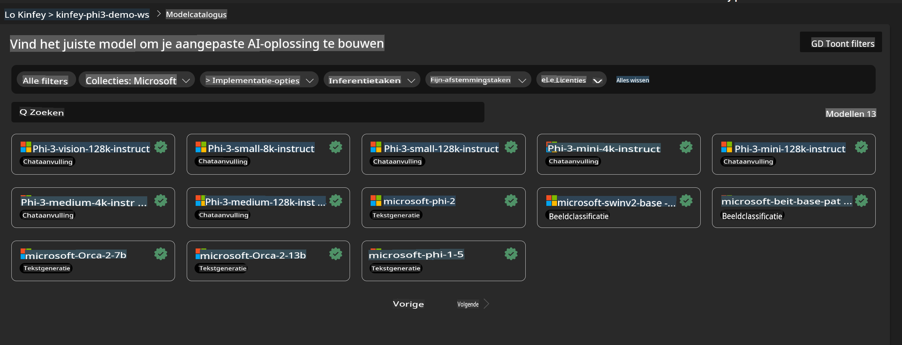
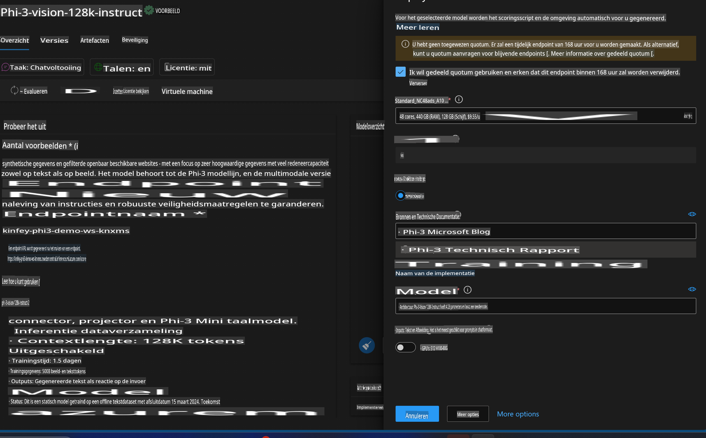
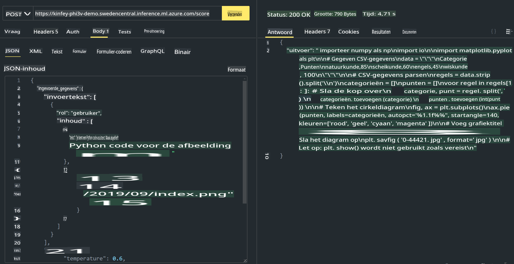

# **Lab 3 - Phi-3-Vision implementeren op Azure Machine Learning Service**

We gebruiken een NPU om de productie-implementatie van lokale code te voltooien, en vervolgens willen we de mogelijkheid introduceren om PHI-3-VISION te gebruiken om van afbeeldingen code te genereren.

In deze introductie kunnen we snel een Model As Service Phi-3 Vision-service opzetten in Azure Machine Learning Service.

***Opmerking***: Phi-3 Vision vereist rekenkracht om sneller content te genereren. We hebben cloudrekenkracht nodig om dit te realiseren.


### **1. Maak een Azure Machine Learning Service**

We moeten een Azure Machine Learning Service aanmaken in de Azure Portal. Als je wilt leren hoe dit moet, bezoek dan deze link [https://learn.microsoft.com/azure/machine-learning/quickstart-create-resources?view=azureml-api-2](https://learn.microsoft.com/azure/machine-learning/quickstart-create-resources?view=azureml-api-2)


### **2. Kies Phi-3 Vision in Azure Machine Learning Service**




### **3. Implementeer Phi-3-Vision in Azure**





### **4. Test de Endpoint in Postman**





***Opmerking***

1. De over te dragen parameters moeten Authorization, azureml-model-deployment en Content-Type bevatten. Je moet de implementatie-informatie controleren om deze te verkrijgen.

2. Om parameters over te dragen, moet Phi-3-Vision een afbeeldingslink overdragen. Raadpleeg de GPT-4-Vision-methode voor het overdragen van parameters, zoals:

```json

{
  "input_data":{
    "input_string":[
      {
        "role":"user",
        "content":[ 
          {
            "type": "text",
            "text": "You are a Python coding assistant.Please create Python code for image "
          },
          {
              "type": "image_url",
              "image_url": {
                "url": "https://ajaytech.co/wp-content/uploads/2019/09/index.png"
              }
          }
        ]
      }
    ],
    "parameters":{
          "temperature": 0.6,
          "top_p": 0.9,
          "do_sample": false,
          "max_new_tokens": 2048
    }
  }
}

```

3. Gebruik de **/score**-route met de Post-methode.

**Gefeliciteerd**! Je hebt de snelle implementatie van PHI-3-VISION voltooid en geprobeerd hoe je afbeeldingen kunt gebruiken om code te genereren. Vervolgens kunnen we toepassingen bouwen in combinatie met NPU's en de cloud.

**Disclaimer (Vrijwaring)**:  
Dit document is vertaald met behulp van machine-gebaseerde AI-vertalingsdiensten. Hoewel we ons inspannen voor nauwkeurigheid, dient u zich ervan bewust te zijn dat geautomatiseerde vertalingen fouten of onnauwkeurigheden kunnen bevatten. Het originele document in de oorspronkelijke taal moet worden beschouwd als de gezaghebbende bron. Voor cruciale informatie wordt professionele menselijke vertaling aanbevolen. Wij zijn niet aansprakelijk voor misverstanden of verkeerde interpretaties die voortvloeien uit het gebruik van deze vertaling.