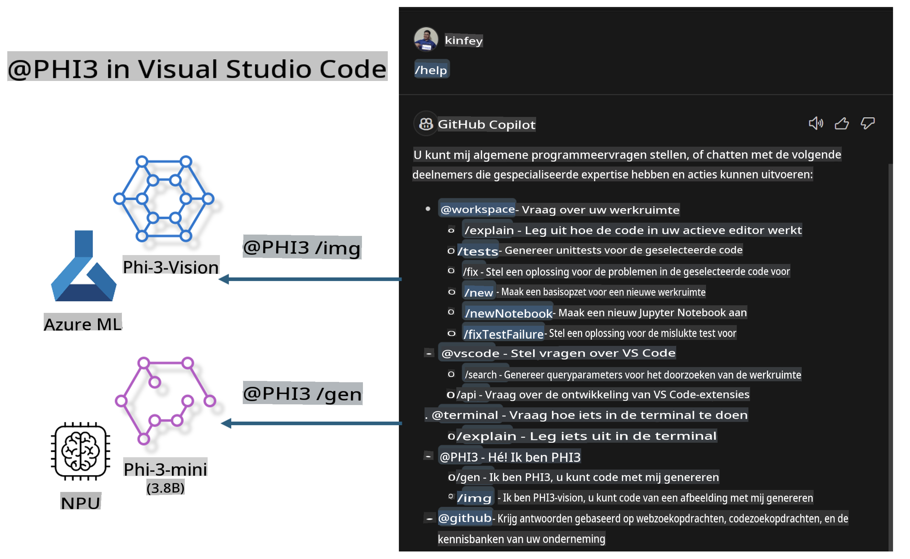

# **Bouw je eigen Visual Studio Code GitHub Copilot Chat met Microsoft Phi-3 Family**

Heb je de workspace-agent in GitHub Copilot Chat al gebruikt? Wil je een code-agent bouwen voor je eigen team? Deze praktische workshop combineert het open-source model om een zakelijke code-agent op ondernemingsniveau te creëren.

## **Basis**

### **Waarom kiezen voor Microsoft Phi-3**

Phi-3 is een serie modellen, waaronder phi-3-mini, phi-3-small en phi-3-medium, gebaseerd op verschillende trainingsparameters voor tekstgeneratie, dialoogvoltooiing en codegeneratie. Er is ook phi-3-vision, gebaseerd op Vision. Het is geschikt voor bedrijven of verschillende teams om offline generatieve AI-oplossingen te maken.

Aanbevolen om deze link te lezen: [https://github.com/microsoft/PhiCookBook/blob/main/md/01.Introduction/01/01.PhiFamily.md](https://github.com/microsoft/PhiCookBook/blob/main/md/01.Introduction/01/01.PhiFamily.md)

### **Microsoft GitHub Copilot Chat**

De GitHub Copilot Chat-extensie biedt een chatinterface waarmee je direct in VS Code met GitHub Copilot kunt communiceren en antwoorden kunt ontvangen op programmeervragen, zonder dat je documentatie hoeft te raadplegen of online forums hoeft te doorzoeken.

Copilot Chat kan syntaxiskleuring, inspringing en andere opmaak gebruiken om de gegenereerde antwoorden duidelijker te maken. Afhankelijk van de vraag van de gebruiker kan het resultaat links bevatten naar context die Copilot heeft gebruikt, zoals broncodebestanden of documentatie, of knoppen om toegang te krijgen tot VS Code-functionaliteiten.

- Copilot Chat integreert in je ontwikkelproces en biedt ondersteuning waar je het nodig hebt:

- Start een inline chatgesprek rechtstreeks vanuit de editor of terminal voor hulp tijdens het coderen.

- Gebruik de Chat-weergave om altijd een AI-assistent aan je zijde te hebben.

- Start Quick Chat om snel een vraag te stellen en weer verder te gaan met waar je mee bezig was.

Je kunt GitHub Copilot Chat in verschillende scenario's gebruiken, zoals:

- Beantwoorden van programmeervragen over hoe je een probleem het beste kunt oplossen.

- Uitleggen van code van anderen en verbeteringen voorstellen.

- Voorstellen van codefixes.

- Genereren van unittests.

- Genereren van codedocumentatie.

Aanbevolen om deze link te lezen: [https://code.visualstudio.com/docs/copilot/copilot-chat](https://code.visualstudio.com/docs/copilot/copilot-chat?WT.mc_id=aiml-137032-kinfeylo)

###  **Microsoft GitHub Copilot Chat @workspace**

Met **@workspace** in Copilot Chat kun je vragen stellen over je hele codebase. Afhankelijk van de vraag haalt Copilot intelligent relevante bestanden en symbolen op, die het vervolgens als links en codevoorbeelden in zijn antwoord gebruikt.

Om je vraag te beantwoorden, zoekt **@workspace** door dezelfde bronnen die een ontwikkelaar zou gebruiken bij het navigeren door een codebase in VS Code:

- Alle bestanden in de workspace, behalve bestanden die worden genegeerd door een .gitignore-bestand.

- Mappenstructuur met geneste mappen en bestandsnamen.

- GitHub's codezoekindex, als de workspace een GitHub-repository is en geïndexeerd door codezoekfunctie.

- Symbolen en definities in de workspace.

- Huidig geselecteerde tekst of zichtbare tekst in de actieve editor.

Opmerking: .gitignore wordt genegeerd als je een bestand hebt geopend of tekst hebt geselecteerd in een genegeerd bestand.

Aanbevolen om deze link te lezen: [[https://code.visualstudio.com/docs/copilot/copilot-chat](https://code.visualstudio.com/docs/copilot/workspace-context?WT.mc_id=aiml-137032-kinfeylo)]

## **Meer over deze workshop**

GitHub Copilot heeft de programmeerefficiëntie van bedrijven enorm verbeterd, en elk bedrijf wil de functies van GitHub Copilot aanpassen aan hun behoeften. Veel bedrijven hebben vergelijkbare extensies aangepast op basis van hun eigen bedrijfsbehoeften en open-source modellen. Voor bedrijven zijn aangepaste extensies gemakkelijker te beheren, maar dit kan de gebruikerservaring beïnvloeden. GitHub Copilot is immers krachtiger in het omgaan met algemene scenario's en professionaliteit. Als de ervaring consistent kan blijven, is het beter om de extensie van het bedrijf aan te passen. GitHub Copilot Chat biedt relevante API's voor bedrijven om de Chat-ervaring uit te breiden. Een consistente ervaring behouden en aangepaste functies hebben, zorgt voor een betere gebruikerservaring.

Deze workshop maakt voornamelijk gebruik van het Phi-3 model, gecombineerd met de lokale NPU en Azure hybride oplossing, om een aangepaste Agent te bouwen in GitHub Copilot Chat ***@PHI3***. Deze agent helpt ontwikkelaars met codegeneratie ***(@PHI3 /gen)*** en het genereren van code op basis van afbeeldingen ***(@PHI3 /img)***.

### ***Opmerking:*** 

Deze workshop is momenteel geïmplementeerd op de AIPC van Intel CPU en Apple Silicon. We blijven werken aan een versie voor de Qualcomm NPU.

## **Workshop**

| Naam | Beschrijving | AIPC | Apple |
| ------------ | ----------- | -------- |-------- |
| Lab0 - Installaties(✅) | Configureer en installeer de benodigde omgevingen en tools | [Ga](./HOL/AIPC/01.Installations.md) |[Ga](./HOL/Apple/01.Installations.md) |
| Lab1 - Prompt flow uitvoeren met Phi-3-mini (✅) | Gebruik AIPC / Apple Silicon en een lokale NPU om code te genereren met Phi-3-mini | [Ga](./HOL/AIPC/02.PromptflowWithNPU.md) |  [Ga](./HOL/Apple/02.PromptflowWithMLX.md) |
| Lab2 - Phi-3-vision implementeren op Azure Machine Learning Service(✅) | Genereer code door Phi-3-vision te implementeren via de Model Catalog van Azure Machine Learning Service | [Ga](./HOL/AIPC/03.DeployPhi3VisionOnAzure.md) |[Ga](./HOL/Apple/03.DeployPhi3VisionOnAzure.md) |
| Lab3 - Een @phi-3 agent maken in GitHub Copilot Chat(✅)  | Maak een aangepaste Phi-3 agent in GitHub Copilot Chat om codegeneratie, grafiekgeneratie, RAG, enz. uit te voeren | [Ga](./HOL/AIPC/04.CreatePhi3AgentInVSCode.md) | [Ga](./HOL/Apple/04.CreatePhi3AgentInVSCode.md) |
| Voorbeeldcode (✅)  | Download voorbeeldcode | [Ga](../../../../../../../code/07.Lab/01/AIPC) | [Ga](../../../../../../../code/07.Lab/01/Apple) |

## **Bronnen**

1. Phi-3 Cookbook [https://github.com/microsoft/Phi-3CookBook](https://github.com/microsoft/Phi-3CookBook)

2. Meer leren over GitHub Copilot [https://learn.microsoft.com/training/paths/copilot/](https://learn.microsoft.com/training/paths/copilot/?WT.mc_id=aiml-137032-kinfeylo)

3. Meer leren over GitHub Copilot Chat [https://learn.microsoft.com/training/paths/accelerate-app-development-using-github-copilot/](https://learn.microsoft.com/training/paths/accelerate-app-development-using-github-copilot/?WT.mc_id=aiml-137032-kinfeylo)

4. Meer leren over de GitHub Copilot Chat API [https://code.visualstudio.com/api/extension-guides/chat](https://code.visualstudio.com/api/extension-guides/chat?WT.mc_id=aiml-137032-kinfeylo)

5. Meer leren over Azure AI Foundry [https://learn.microsoft.com/training/paths/create-custom-copilots-ai-studio/](https://learn.microsoft.com/training/paths/create-custom-copilots-ai-studio/?WT.mc_id=aiml-137032-kinfeylo)

6. Meer leren over de Model Catalog van Azure AI Foundry [https://learn.microsoft.com/azure/ai-studio/how-to/model-catalog-overview](https://learn.microsoft.com/azure/ai-studio/how-to/model-catalog-overview)

**Disclaimer**:  
Dit document is vertaald met behulp van machinegebaseerde AI-vertalingsdiensten. Hoewel we ons best doen voor nauwkeurigheid, dient u zich ervan bewust te zijn dat geautomatiseerde vertalingen fouten of onnauwkeurigheden kunnen bevatten. Het oorspronkelijke document in de oorspronkelijke taal moet worden beschouwd als de gezaghebbende bron. Voor kritieke informatie wordt professionele menselijke vertaling aanbevolen. Wij zijn niet aansprakelijk voor misverstanden of verkeerde interpretaties die voortvloeien uit het gebruik van deze vertaling.