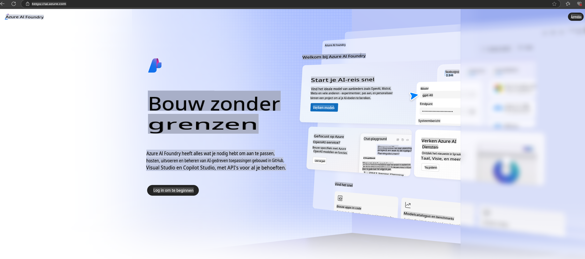

# **Phi-3 gebruiken in Azure AI Foundry**

Met de ontwikkeling van Generatieve AI hopen we een uniform platform te gebruiken om verschillende LLM's en SLM's te beheren, bedrijfsdata-integratie, fine-tuning/RAG-operaties en de evaluatie van verschillende bedrijfsactiviteiten na integratie van LLM's en SLM's, enz., zodat generatieve AI beter kan worden toegepast in slimme toepassingen. [Azure AI Foundry](https://ai.azure.com) is een platform voor generatieve AI op bedrijfsniveau.

Met Azure AI Foundry kun je reacties van large language models (LLM) evalueren en promptapplicatiecomponenten orkestreren met prompt flow voor betere prestaties. Het platform maakt schaalbaarheid mogelijk om proof of concepts eenvoudig om te zetten in volwaardige productie. Doorlopende monitoring en verfijning ondersteunen langdurig succes.

We kunnen het Phi-3-model snel implementeren in Azure AI Foundry via eenvoudige stappen en vervolgens Azure AI Foundry gebruiken om Phi-3 gerelateerde Playground/Chat, fine-tuning, evaluatie en andere gerelateerde werkzaamheden uit te voeren.

## **1. Voorbereiding**

Als je de [Azure Developer CLI](https://learn.microsoft.com/azure/developer/azure-developer-cli/overview?WT.mc_id=aiml-138114-kinfeylo) al op je computer hebt geïnstalleerd, is het gebruik van deze template net zo eenvoudig als het uitvoeren van dit commando in een nieuwe map.

## Handmatige Aanmaak

Het maken van een Microsoft Azure AI Foundry-project en -hub is een geweldige manier om je AI-werk te organiseren en beheren. Hier is een stapsgewijze handleiding om je op weg te helpen:

### Een project aanmaken in Azure AI Foundry

1. **Ga naar Azure AI Foundry**: Log in op het Azure AI Foundry-portaal.
2. **Maak een project aan**:
   - Als je al in een project zit, selecteer "Azure AI Foundry" linksboven op de pagina om naar de startpagina te gaan.
   - Selecteer "+ Project aanmaken".
   - Voer een naam in voor het project.
   - Als je al een hub hebt, wordt deze standaard geselecteerd. Als je toegang hebt tot meer dan één hub, kun je een andere kiezen uit de dropdown. Wil je een nieuwe hub maken, selecteer dan "Nieuwe hub maken" en geef een naam op.
   - Selecteer "Aanmaken".

### Een hub aanmaken in Azure AI Foundry

1. **Ga naar Azure AI Foundry**: Log in met je Azure-account.
2. **Maak een hub aan**:
   - Selecteer het Beheercentrum in het menu aan de linkerkant.
   - Selecteer "Alle resources", klik vervolgens op het pijltje naast "+ Nieuw project" en selecteer "+ Nieuwe hub".
   - Voer in het dialoogvenster "Nieuwe hub maken" een naam in voor je hub (bijv. contoso-hub) en pas de andere velden aan zoals gewenst.
   - Selecteer "Volgende", controleer de informatie en selecteer vervolgens "Aanmaken".

Voor meer gedetailleerde instructies kun je de officiële [Microsoft-documentatie](https://learn.microsoft.com/azure/ai-studio/how-to/create-projects) raadplegen.

Na succesvolle aanmaak kun je toegang krijgen tot de studio die je hebt gemaakt via [ai.azure.com](https://ai.azure.com/).

Er kunnen meerdere projecten op één AI Foundry zijn. Maak een project aan in AI Foundry om je voor te bereiden.

Maak gebruik van Azure AI Foundry [QuickStarts](https://learn.microsoft.com/azure/ai-studio/quickstarts/get-started-code).

## **2. Een Phi-model implementeren in Azure AI Foundry**

Klik op de optie Verkennen van het project om naar de Modelcatalogus te gaan en selecteer Phi-3.

Selecteer Phi-3-mini-4k-instruct.

Klik op 'Implementeren' om het Phi-3-mini-4k-instruct-model te implementeren.

> [!NOTE]
>
> Je kunt de rekenkracht kiezen bij het implementeren.

## **3. Playground Chat Phi in Azure AI Foundry**

Ga naar de implementatiepagina, selecteer Playground en chat met Phi-3 in Azure AI Foundry.

## **4. Het model implementeren vanuit Azure AI Foundry**

Om een model te implementeren vanuit de Azure Modelcatalogus, kun je de volgende stappen volgen:

- Log in op Azure AI Foundry.
- Kies het model dat je wilt implementeren uit de Azure AI Foundry modelcatalogus.
- Op de Detailpagina van het model selecteer je Implementeren en vervolgens Serverless API met Azure AI Content Safety.
- Selecteer het project waarin je je modellen wilt implementeren. Om gebruik te maken van de Serverless API-optie, moet je workspace zich in de regio East US 2 of Sweden Central bevinden. Je kunt de naam van de implementatie aanpassen.
- In de implementatiewizard selecteer je de Prijzen en voorwaarden om meer te leren over de prijzen en gebruiksvoorwaarden.
- Selecteer Implementeren. Wacht tot de implementatie gereed is en je wordt doorgestuurd naar de Implementatiepagina.
- Selecteer Openen in playground om te beginnen met interactie met het model.
- Je kunt altijd terugkeren naar de Implementatiepagina, de implementatie selecteren en de Doel-URL en de Geheime Sleutel noteren, die je kunt gebruiken om de implementatie aan te roepen en resultaten te genereren.
- Je kunt altijd de details van de endpoint, URL en toegangssleutels vinden door naar het tabblad Bouwen te navigeren en Implementaties te selecteren in de sectie Componenten.

> [!NOTE]
> Houd er rekening mee dat je account de Azure AI Developer-rolmachtigingen op de Resource Group moet hebben om deze stappen uit te voeren.

## **5. Het Phi API gebruiken in Azure AI Foundry**

Je kunt toegang krijgen tot https://{Jouw projectnaam}.region.inference.ml.azure.com/swagger.json via een GET-verzoek in Postman en dit combineren met de Sleutel om meer te leren over de beschikbare interfaces.

Je kunt de vereiste parameters en de responsparameters heel eenvoudig verkrijgen.

**Disclaimer**:  
Dit document is vertaald met behulp van machine-gebaseerde AI-vertalingsdiensten. Hoewel we streven naar nauwkeurigheid, dient u zich ervan bewust te zijn dat geautomatiseerde vertalingen fouten of onnauwkeurigheden kunnen bevatten. Het originele document in de oorspronkelijke taal moet worden beschouwd als de gezaghebbende bron. Voor cruciale informatie wordt professionele menselijke vertaling aanbevolen. Wij zijn niet aansprakelijk voor misverstanden of verkeerde interpretaties die voortvloeien uit het gebruik van deze vertaling.