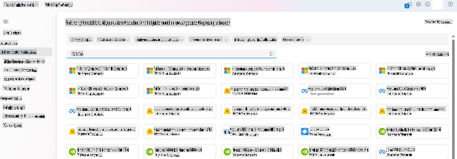
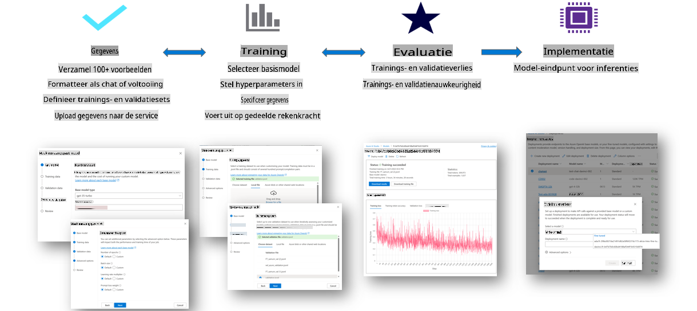
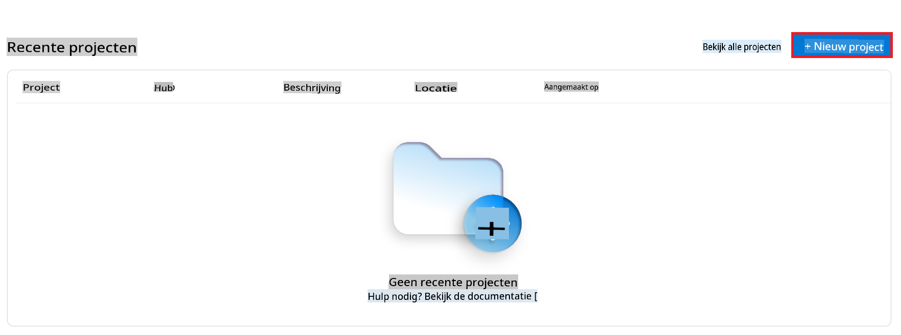
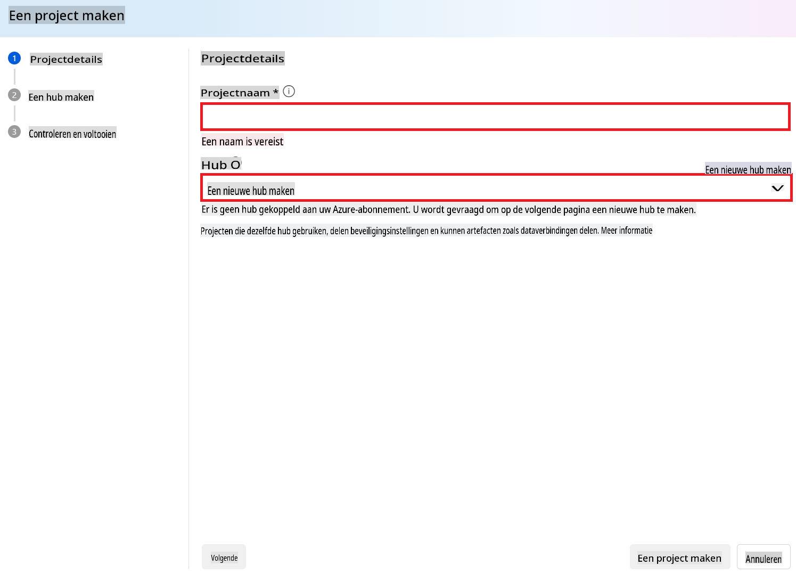
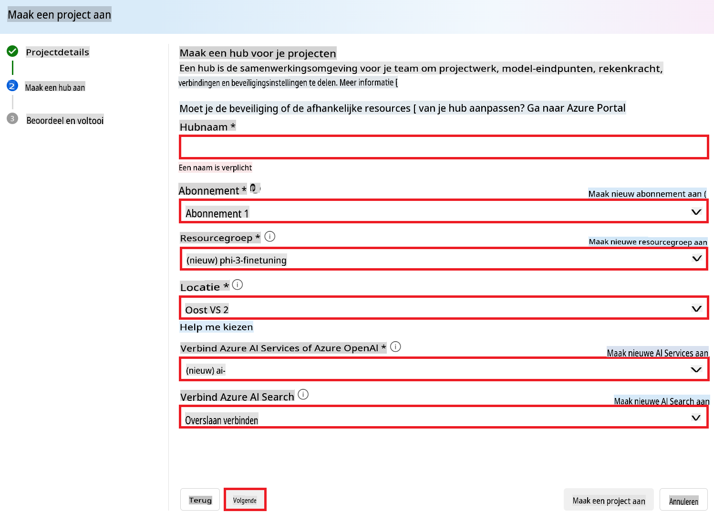
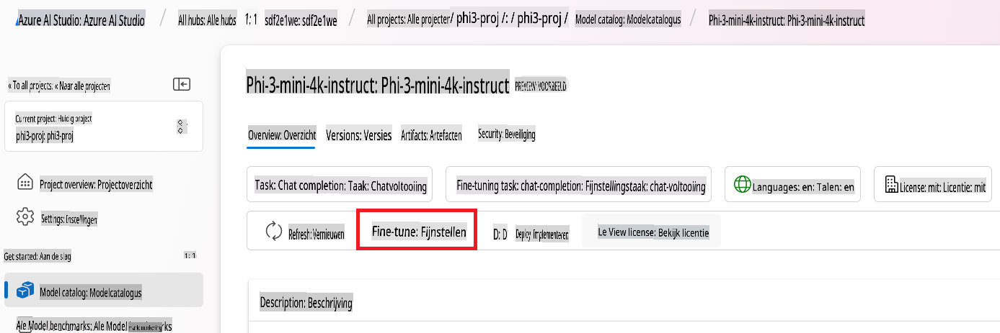
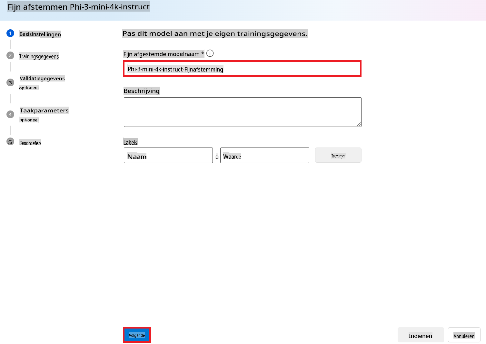
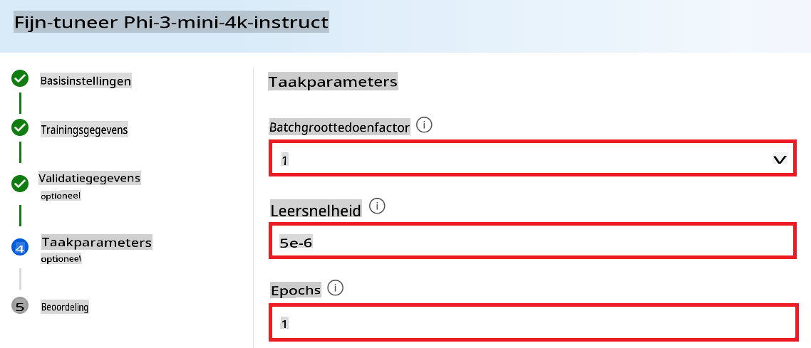
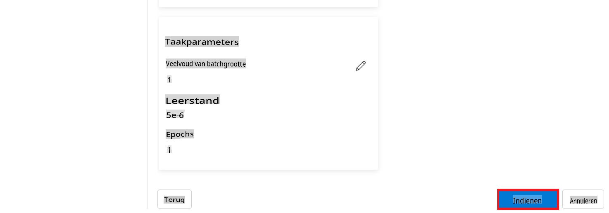
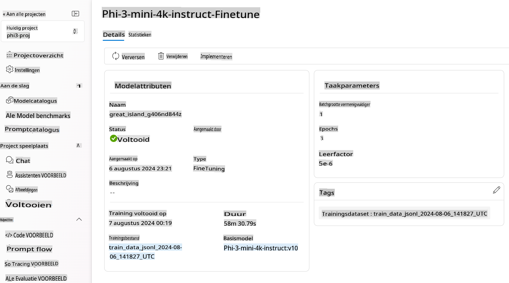

# Fine-tuning Phi-3 met Azure AI Foundry

Laten we ontdekken hoe je Microsoft’s Phi-3 Mini-taalmodel kunt fine-tunen met Azure AI Foundry. Fine-tuning stelt je in staat om Phi-3 Mini aan te passen aan specifieke taken, waardoor het nog krachtiger en contextbewuster wordt.

## Overwegingen

- **Mogelijkheden:** Welke modellen kunnen worden gefinetuned? Wat kan het basismodel na fine-tuning doen?
- **Kosten:** Wat is het prijsmodel voor fine-tuning?
- **Aanpasbaarheid:** Hoeveel kan ik het basismodel aanpassen – en op welke manieren?
- **Gemak:** Hoe verloopt het fine-tuning proces – moet ik zelf code schrijven? Moet ik mijn eigen infrastructuur meenemen?
- **Veiligheid:** Gefinetunede modellen kunnen veiligheidsrisico’s hebben – zijn er maatregelen om onbedoelde schade te voorkomen?



## Voorbereiding op fine-tuning

### Vereisten

> [!NOTE]
> Voor Phi-3-familiemodellen is de pay-as-you-go fine-tune optie alleen beschikbaar bij hubs die zijn aangemaakt in de regio **East US 2**.

- Een Azure-abonnement. Als je nog geen Azure-abonnement hebt, maak dan een [betaald Azure-account](https://azure.microsoft.com/pricing/purchase-options/pay-as-you-go) aan om te beginnen.

- Een [AI Foundry-project](https://ai.azure.com?WT.mc_id=aiml-138114-kinfeylo).
- Azure role-based access controls (Azure RBAC) worden gebruikt om toegang te verlenen tot operaties in Azure AI Foundry. Om de stappen in dit artikel uit te voeren, moet je gebruikersaccount de rol __Azure AI Developer__ toegewezen krijgen op de resourcegroep.

### Registratie van abonnementprovider

Controleer of het abonnement is geregistreerd bij de `Microsoft.Network` resourceprovider.

1. Meld je aan bij het [Azure-portaal](https://portal.azure.com).
1. Selecteer **Abonnementen** in het linker menu.
1. Kies het abonnement dat je wilt gebruiken.
1. Selecteer **AI-projectinstellingen** > **Resourceproviders** in het linker menu.
1. Controleer of **Microsoft.Network** in de lijst met resourceproviders staat. Voeg het anders toe.

### Gegevensvoorbereiding

Bereid je trainings- en validatiegegevens voor om je model te finetunen. Je trainings- en validatiegegevenssets bestaan uit invoer- en uitvoervoorbeelden van hoe je wilt dat het model presteert.

Zorg ervoor dat al je trainingsvoorbeelden voldoen aan het verwachte formaat voor inferentie. Om modellen effectief te finetunen, is een gebalanceerde en diverse dataset essentieel.

Dit houdt in dat je een balans in de gegevens behoudt, verschillende scenario’s opneemt en de trainingsgegevens periodiek verfijnt om te voldoen aan realistische verwachtingen. Dit leidt uiteindelijk tot nauwkeurigere en gebalanceerde modelreacties.

Verschillende modeltypes vereisen een ander formaat van trainingsgegevens.

### Chat Completion

De trainings- en validatiegegevens die je gebruikt **moeten** worden geformatteerd als een JSON Lines (JSONL)-document. Voor `Phi-3-mini-128k-instruct` moet de fine-tuning dataset worden geformatteerd in het conversatieformaat dat wordt gebruikt door de Chat completions API.

### Voorbeeld bestandsformaat

```json
    {"messages": [{"role": "system", "content": "You are an Xbox customer support agent whose primary goal is to help users with issues they are experiencing with their Xbox devices. You are friendly and concise. You only provide factual answers to queries, and do not provide answers that are not related to Xbox."}, {"role": "user", "content": "Is Xbox better than PlayStation?"}, {"role": "assistant", "content": "I apologize, but I cannot provide personal opinions. My primary job is to assist you with any issues related to your Xbox device. Do you have any Xbox-related issues that need addressing?"}]}
    {"messages": [{"role": "system", "content": "You are an Xbox customer support agent whose primary goal is to help users with issues they are experiencing with their Xbox devices. You are friendly and concise. You only provide factual answers to queries, and do not provide answers that are not related to Xbox."}, {"role": "user", "content": "Can I play PC games on my Xbox?"}, {"role": "assistant", "content": "While Xbox consoles don't natively support PC games, they can play an array of Xbox games, many of which are also available on PC. Can I assist you with finding games compatible with your Xbox device?"}]}
    {"messages": [{"role": "system", "content": "You are an Xbox customer support agent whose primary goal is to help users with issues they are experiencing with their Xbox devices. You are friendly and concise. You only provide factual answers to queries, and do not provide answers that are not related to Xbox."}, {"role": "user", "content": "I'm having trouble connecting my Xbox to the Wi-Fi."}, {"role": "assistant", "content": "No worries, let's go through the network settings on your Xbox. Can you please tell me what happens when you try to connect it to the Wi-Fi?"}]}
```

Het ondersteunde bestandstype is JSON Lines. Bestanden worden geüpload naar de standaard datastore en beschikbaar gemaakt in je project.

## Fine-tuning Phi-3 met Azure AI Foundry

Azure AI Foundry stelt je in staat om grote taalmodellen aan te passen aan je eigen datasets via een proces dat bekend staat als fine-tuning. Fine-tuning biedt aanzienlijke voordelen door maatwerk en optimalisatie voor specifieke taken en toepassingen mogelijk te maken. Dit resulteert in betere prestaties, kostenefficiëntie, lagere latentie en specifiekere output.



### Een nieuw project aanmaken

1. Meld je aan bij [Azure AI Foundry](https://ai.azure.com).

1. Selecteer **+Nieuw project** om een nieuw project aan te maken in Azure AI Foundry.

    

1. Voer de volgende taken uit:

    - **Hubnaam** van het project. Dit moet een unieke waarde zijn.
    - Selecteer de **Hub** die je wilt gebruiken (maak indien nodig een nieuwe aan).

    

1. Voer de volgende taken uit om een nieuwe hub aan te maken:

    - Voer de **Hubnaam** in. Dit moet een unieke waarde zijn.
    - Selecteer je Azure **Abonnement**.
    - Selecteer de **Resourcegroep** die je wilt gebruiken (maak indien nodig een nieuwe aan).
    - Kies de **Locatie** die je wilt gebruiken.
    - Selecteer de **Connect Azure AI Services** die je wilt gebruiken (maak indien nodig een nieuwe aan).
    - Selecteer **Connect Azure AI Search** om **Overslaan** te kiezen.

    

1. Selecteer **Volgende**.
1. Selecteer **Project aanmaken**.

### Gegevensvoorbereiding

Voordat je gaat fine-tunen, verzamel of creëer een dataset die relevant is voor je taak, zoals chatinstructies, vraag-antwoordparen of andere relevante tekstgegevens. Reinig en verwerk deze gegevens door ruis te verwijderen, ontbrekende waarden aan te pakken en de tekst te tokeniseren.

### Phi-3 modellen fine-tunen in Azure AI Foundry

> [!NOTE]
> Fine-tuning van Phi-3 modellen wordt momenteel ondersteund in projecten die zich bevinden in East US 2.

1. Selecteer **Modelcatalogus** in het linker menu.

1. Typ *phi-3* in de **zoekbalk** en selecteer het phi-3 model dat je wilt gebruiken.

    

1. Selecteer **Fine-tune**.

    

1. Voer de **Naam van het gefinetunede model** in.

    

1. Selecteer **Volgende**.

1. Voer de volgende taken uit:

    - Selecteer **Taaktype** als **Chat completion**.
    - Selecteer de **Trainingsgegevens** die je wilt gebruiken. Je kunt deze uploaden via Azure AI Foundry’s gegevens of vanuit je lokale omgeving.

    

1. Selecteer **Volgende**.

1. Upload de **Validatiegegevens** die je wilt gebruiken, of kies **Automatische splitsing van trainingsgegevens**.

    

1. Selecteer **Volgende**.

1. Voer de volgende taken uit:

    - Kies de **Batch size multiplier** die je wilt gebruiken.
    - Kies de **Learning rate** die je wilt gebruiken.
    - Kies het aantal **Epochs** dat je wilt gebruiken.

    

1. Selecteer **Indienen** om het fine-tuning proces te starten.

    

1. Zodra je model is gefinetuned, wordt de status weergegeven als **Voltooid**, zoals in de onderstaande afbeelding. Nu kun je het model implementeren en gebruiken in je eigen toepassing, in de playground of in prompt flow. Voor meer informatie, zie [Hoe de Phi-3 familie van kleine taalmodellen te implementeren met Azure AI Foundry](https://learn.microsoft.com/azure/ai-studio/how-to/deploy-models-phi-3?tabs=phi-3-5&pivots=programming-language-python).

    

> [!NOTE]
> Voor meer gedetailleerde informatie over het fine-tunen van Phi-3, bezoek [Fine-tune Phi-3 modellen in Azure AI Foundry](https://learn.microsoft.com/azure/ai-studio/how-to/fine-tune-phi-3?tabs=phi-3-mini).

## Opruimen van je gefinetunede modellen

Je kunt een gefinetuned model verwijderen uit de lijst met fine-tuning modellen in [Azure AI Foundry](https://ai.azure.com) of vanaf de modeldetails pagina. Selecteer het gefinetunede model dat je wilt verwijderen van de Fine-tuning pagina en klik vervolgens op de Verwijder-knop om het model te verwijderen.

> [!NOTE]
> Je kunt geen aangepast model verwijderen als er een bestaande implementatie is. Je moet eerst de modelimplementatie verwijderen voordat je het aangepaste model kunt verwijderen.

## Kosten en quota

### Kosten- en quotumoverwegingen voor Phi-3 modellen gefinetuned als een dienst

Phi-modellen die als dienst worden gefinetuned, worden aangeboden door Microsoft en geïntegreerd met Azure AI Foundry. Je kunt de prijzen vinden bij het [implementeren](https://learn.microsoft.com/azure/ai-studio/how-to/deploy-models-phi-3?tabs=phi-3-5&pivots=programming-language-python) of fine-tunen van de modellen onder het tabblad Prijzen en voorwaarden in de implementatiewizard.

## Inhoudsfiltering

Modellen die als dienst worden geïmplementeerd met pay-as-you-go, worden beschermd door Azure AI Content Safety. Bij implementatie naar real-time endpoints kun je ervoor kiezen om deze functionaliteit uit te schakelen. Met Azure AI content safety ingeschakeld, doorlopen zowel de prompt als de completion een reeks classificatiemodellen die zijn ontworpen om schadelijke inhoud te detecteren en te voorkomen. Het inhoudsfiltersysteem detecteert en onderneemt actie op specifieke categorieën van mogelijk schadelijke inhoud in zowel invoerprompts als uitvoercompletions. Meer informatie over [Azure AI Content Safety](https://learn.microsoft.com/azure/ai-studio/concepts/content-filtering).

**Fine-Tuning Configuratie**

Hyperparameters: Definieer hyperparameters zoals learning rate, batchgrootte en aantal trainingsepochs.

**Loss Function**

Kies een geschikte loss function voor je taak (bijv. cross-entropy).

**Optimizer**

Selecteer een optimizer (bijv. Adam) voor gradiëntupdates tijdens training.

**Fine-Tuning Proces**

- Laad Pre-Trained Model: Laad de Phi-3 Mini-checkpoint.
- Voeg Aangepaste Lagen Toe: Voeg taakspecifieke lagen toe (bijv. een classificatiekop voor chatinstructies).

**Train het Model**
Fine-tune het model met je voorbereide dataset. Houd de voortgang van de training in de gaten en pas hyperparameters aan indien nodig.

**Evaluatie en Validatie**

Validatieset: Splits je gegevens in trainings- en validatiesets.

**Evalueer Prestaties**

Gebruik metrics zoals nauwkeurigheid, F1-score of perplexiteit om de modelprestaties te beoordelen.

## Opslaan van het Gefinetunede Model

**Checkpoint**
Sla de gefinetunede modelcheckpoint op voor toekomstig gebruik.

## Implementatie

- Implementeer als een Webservice: Implementeer je gefinetunede model als een webservice in Azure AI Foundry.
- Test de Endpoint: Stuur testqueries naar de geïmplementeerde endpoint om de functionaliteit te verifiëren.

## Itereren en Verbeteren

Itereer: Als de prestaties niet bevredigend zijn, herhaal het proces door hyperparameters aan te passen, meer gegevens toe te voegen of langer te trainen.

## Monitoren en Verfijnen

Blijf het gedrag van het model monitoren en verfijn waar nodig.

## Aanpassen en Uitbreiden

Aangepaste Taken: Phi-3 Mini kan worden gefinetuned voor verschillende taken buiten chatinstructies. Verken andere gebruiksscenario’s!
Experimenteer: Probeer verschillende architecturen, laagcombinaties en technieken om de prestaties te verbeteren.

> [!NOTE]
> Fine-tuning is een iteratief proces. Experimenteer, leer en pas je model aan om de beste resultaten te behalen voor je specifieke taak!

**Disclaimer**:  
Dit document is vertaald met behulp van machinegebaseerde AI-vertalingsdiensten. Hoewel we streven naar nauwkeurigheid, dient u zich ervan bewust te zijn dat geautomatiseerde vertalingen fouten of onnauwkeurigheden kunnen bevatten. Het originele document in de oorspronkelijke taal moet worden beschouwd als de gezaghebbende bron. Voor cruciale informatie wordt professionele menselijke vertaling aanbevolen. Wij zijn niet aansprakelijk voor misverstanden of verkeerde interpretaties die voortvloeien uit het gebruik van deze vertaling.