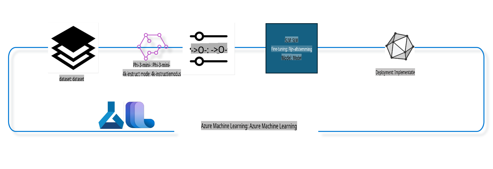

## Hoe gebruik je chat-completion-componenten uit de Azure ML-systeemregister om een model te fine-tunen

In dit voorbeeld gaan we het Phi-3-mini-4k-instruct model fine-tunen om een gesprek tussen 2 personen te voltooien met behulp van de ultrachat_200k dataset.



Het voorbeeld laat zien hoe je fine-tuning uitvoert met de Azure ML SDK en Python, en vervolgens het getunede model inzet op een online eindpunt voor realtime inferentie.

### Trainingsdata

We gebruiken de ultrachat_200k dataset. Dit is een sterk gefilterde versie van de UltraChat dataset en werd gebruikt om Zephyr-7B-β te trainen, een geavanceerd 7B chatmodel.

### Model

We gebruiken het Phi-3-mini-4k-instruct model om te laten zien hoe een gebruiker een model kan fine-tunen voor chat-completion-taken. Als je deze notebook vanaf een specifieke modelkaart hebt geopend, vervang dan de modelnaam door de specifieke naam.

### Taken

- Kies een model om te fine-tunen.
- Kies en verken trainingsdata.
- Configureer de fine-tuning-taak.
- Voer de fine-tuning-taak uit.
- Beoordeel trainings- en evaluatiemetrics.
- Registreer het gefinetunede model.
- Zet het gefinetunede model in voor realtime inferentie.
- Ruim bronnen op.

## 1. Stel de vereisten in

- Installeer afhankelijkheden.
- Maak verbinding met AzureML Workspace. Lees meer over het instellen van SDK-authenticatie. Vervang <WORKSPACE_NAME>, <RESOURCE_GROUP> en <SUBSCRIPTION_ID> hieronder.
- Maak verbinding met het AzureML-systeemregister.
- Stel een optionele experimentnaam in.
- Controleer of maak een compute aan.

> [!NOTE]
> Vereisten: een enkele GPU-node kan meerdere GPU-kaarten hebben. Bijvoorbeeld, in één node van Standard_NC24rs_v3 zijn er 4 NVIDIA V100 GPU's, terwijl er in Standard_NC12s_v3 2 NVIDIA V100 GPU's zijn. Raadpleeg de documentatie voor deze informatie. Het aantal GPU-kaarten per node wordt ingesteld in de parameter gpus_per_node hieronder. Door deze waarde correct in te stellen, wordt ervoor gezorgd dat alle GPU's in de node worden benut. De aanbevolen GPU-compute-SKU's zijn hier en hier te vinden.

### Python-bibliotheken

Installeer afhankelijkheden door de onderstaande cel uit te voeren. Deze stap is niet optioneel als je in een nieuwe omgeving werkt.

```bash
pip install azure-ai-ml
pip install azure-identity
pip install datasets==2.9.0
pip install mlflow
pip install azureml-mlflow
```

### Interactie met Azure ML

1. Dit Python-script wordt gebruikt om te communiceren met de Azure Machine Learning (Azure ML)-service. Hier is een overzicht van wat het doet:

    - Het importeert de benodigde modules uit de azure.ai.ml, azure.identity en azure.ai.ml.entities pakketten. Het importeert ook de time-module.

    - Het probeert te authenticeren met DefaultAzureCredential(), wat een vereenvoudigde authenticatie-ervaring biedt om snel applicaties te ontwikkelen die in de Azure-cloud draaien. Als dit mislukt, schakelt het over naar InteractiveBrowserCredential(), dat een interactieve inlogprompt biedt.

    - Vervolgens probeert het een MLClient-instantie te maken met behulp van de from_config-methode, die de configuratie leest uit het standaardconfiguratiebestand (config.json). Als dit mislukt, maakt het een MLClient-instantie door handmatig de subscription_id, resource_group_name en workspace_name op te geven.

    - Het maakt een andere MLClient-instantie, dit keer voor het Azure ML-register genaamd "azureml". Dit register is waar modellen, fine-tuning pipelines en omgevingen worden opgeslagen.

    - Het stelt de experiment_name in op "chat_completion_Phi-3-mini-4k-instruct".

    - Het genereert een unieke timestamp door de huidige tijd (in seconden sinds de epoch, als een drijvend kommagetal) om te zetten naar een geheel getal en vervolgens naar een string. Deze timestamp kan worden gebruikt voor het maken van unieke namen en versies.

    ```python
    # Import necessary modules from Azure ML and Azure Identity
    from azure.ai.ml import MLClient
    from azure.identity import (
        DefaultAzureCredential,
        InteractiveBrowserCredential,
    )
    from azure.ai.ml.entities import AmlCompute
    import time  # Import time module
    
    # Try to authenticate using DefaultAzureCredential
    try:
        credential = DefaultAzureCredential()
        credential.get_token("https://management.azure.com/.default")
    except Exception as ex:  # If DefaultAzureCredential fails, use InteractiveBrowserCredential
        credential = InteractiveBrowserCredential()
    
    # Try to create an MLClient instance using the default config file
    try:
        workspace_ml_client = MLClient.from_config(credential=credential)
    except:  # If that fails, create an MLClient instance by manually providing the details
        workspace_ml_client = MLClient(
            credential,
            subscription_id="<SUBSCRIPTION_ID>",
            resource_group_name="<RESOURCE_GROUP>",
            workspace_name="<WORKSPACE_NAME>",
        )
    
    # Create another MLClient instance for the Azure ML registry named "azureml"
    # This registry is where models, fine-tuning pipelines, and environments are stored
    registry_ml_client = MLClient(credential, registry_name="azureml")
    
    # Set the experiment name
    experiment_name = "chat_completion_Phi-3-mini-4k-instruct"
    
    # Generate a unique timestamp that can be used for names and versions that need to be unique
    timestamp = str(int(time.time()))
    ```

## 2. Kies een foundation-model om te fine-tunen

1. Phi-3-mini-4k-instruct is een lichtgewicht open model met 3,8 miljard parameters, gebaseerd op datasets die zijn gebruikt voor Phi-2. Het model behoort tot de Phi-3-modelfamilie en de Mini-versie is er in twee varianten: 4K en 128K, wat de contextlengte (in tokens) is die het kan ondersteunen. We moeten het model fine-tunen voor ons specifieke doel. Je kunt deze modellen bekijken in de Model Catalog in AzureML Studio door te filteren op de chat-completion-taak. In dit voorbeeld gebruiken we het Phi-3-mini-4k-instruct model. Als je deze notebook voor een ander model hebt geopend, vervang dan de modelnaam en versie dienovereenkomstig.

    > [!NOTE]
    > de model-id-eigenschap van het model. Dit wordt doorgegeven als invoer voor de fine-tuning-taak. Dit is ook beschikbaar als het Asset ID-veld op de modeldetails-pagina in de AzureML Studio Model Catalog.

2. Dit Python-script communiceert met de Azure Machine Learning (Azure ML)-service. Hier is een overzicht van wat het doet:

    - Het stelt de model_name in op "Phi-3-mini-4k-instruct".

    - Het gebruikt de get-methode van de models-eigenschap van het registry_ml_client-object om de laatste versie van het model met de opgegeven naam uit het Azure ML-register op te halen. De get-methode wordt aangeroepen met twee argumenten: de naam van het model en een label dat aangeeft dat de laatste versie van het model moet worden opgehaald.

    - Het print een bericht naar de console waarin de naam, versie en id van het model worden aangegeven dat zal worden gebruikt voor fine-tuning. De format-methode van de string wordt gebruikt om de naam, versie en id van het model in het bericht in te voegen. De naam, versie en id van het model worden benaderd als eigenschappen van het foundation_model-object.

    ```python
    # Set the model name
    model_name = "Phi-3-mini-4k-instruct"
    
    # Get the latest version of the model from the Azure ML registry
    foundation_model = registry_ml_client.models.get(model_name, label="latest")
    
    # Print the model name, version, and id
    # This information is useful for tracking and debugging
    print(
        "\n\nUsing model name: {0}, version: {1}, id: {2} for fine tuning".format(
            foundation_model.name, foundation_model.version, foundation_model.id
        )
    )
    ```

## 3. Maak een compute om te gebruiken met de taak

De fine-tune-taak werkt ALLEEN met GPU-compute. De grootte van de compute hangt af van hoe groot het model is en in de meeste gevallen is het lastig om de juiste compute te identificeren voor de taak. In deze cel begeleiden we de gebruiker bij het selecteren van de juiste compute.

> [!NOTE]
> De hieronder vermelde computes werken met de meest geoptimaliseerde configuratie. Eventuele wijzigingen in de configuratie kunnen leiden tot een Cuda Out Of Memory-fout. Probeer in dergelijke gevallen de compute te upgraden naar een grotere grootte.

> [!NOTE]
> Zorg er bij het selecteren van de compute_cluster_size hieronder voor dat de compute beschikbaar is in je resourcegroep. Als een bepaalde compute niet beschikbaar is, kun je een verzoek indienen om toegang te krijgen tot de compute-resources.

### Model controleren op ondersteuning voor fine-tuning

1. Dit Python-script communiceert met een Azure Machine Learning (Azure ML)-model. Hier is een overzicht van wat het doet:

    - Het importeert de ast-module, die functies biedt om bomen van de abstracte syntaxisgrammatica van Python te verwerken.

    - Het controleert of het foundation_model-object (dat een model in Azure ML vertegenwoordigt) een tag heeft genaamd finetune_compute_allow_list. Tags in Azure ML zijn sleutel-waardeparen die je kunt maken en gebruiken om modellen te filteren en sorteren.

    - Als de finetune_compute_allow_list-tag aanwezig is, gebruikt het de ast.literal_eval-functie om de waarde van de tag (een string) veilig om te zetten naar een Python-lijst. Deze lijst wordt vervolgens toegewezen aan de computes_allow_list-variabele. Vervolgens print het een bericht dat aangeeft dat een compute moet worden gemaakt uit de lijst.

    - Als de finetune_compute_allow_list-tag niet aanwezig is, stelt het computes_allow_list in op None en print een bericht dat aangeeft dat de finetune_compute_allow_list-tag geen deel uitmaakt van de tags van het model.

    - Samengevat controleert dit script op een specifieke tag in de metadata van het model, zet het de waarde van de tag om naar een lijst als deze bestaat, en geeft het feedback aan de gebruiker dienovereenkomstig.

    ```python
    # Import the ast module, which provides functions to process trees of the Python abstract syntax grammar
    import ast
    
    # Check if the 'finetune_compute_allow_list' tag is present in the model's tags
    if "finetune_compute_allow_list" in foundation_model.tags:
        # If the tag is present, use ast.literal_eval to safely parse the tag's value (a string) into a Python list
        computes_allow_list = ast.literal_eval(
            foundation_model.tags["finetune_compute_allow_list"]
        )  # convert string to python list
        # Print a message indicating that a compute should be created from the list
        print(f"Please create a compute from the above list - {computes_allow_list}")
    else:
        # If the tag is not present, set computes_allow_list to None
        computes_allow_list = None
        # Print a message indicating that the 'finetune_compute_allow_list' tag is not part of the model's tags
        print("`finetune_compute_allow_list` is not part of model tags")
    ```

### Compute-instantie controleren

1. Dit Python-script communiceert met de Azure Machine Learning (Azure ML)-service en voert verschillende controles uit op een compute-instantie. Hier is een overzicht van wat het doet:

    - Het probeert de compute-instantie met de naam die is opgeslagen in compute_cluster op te halen uit de Azure ML-werkruimte. Als de provisioning-status van de compute-instantie "failed" is, genereert het een ValueError.

    - Het controleert of computes_allow_list niet None is. Als dit niet het geval is, zet het alle computegroottes in de lijst om naar kleine letters en controleert het of de grootte van de huidige compute-instantie in de lijst staat. Als dit niet het geval is, genereert het een ValueError.

    - Als computes_allow_list None is, controleert het of de grootte van de compute-instantie in een lijst met niet-ondersteunde GPU VM-groottes staat. Als dit het geval is, genereert het een ValueError.

    - Het haalt een lijst op van alle beschikbare computegroottes in de werkruimte. Vervolgens doorloopt het deze lijst en voor elke computegrootte controleert het of de naam overeenkomt met de grootte van de huidige compute-instantie. Als dit het geval is, haalt het het aantal GPU's voor die computegrootte op en stelt gpu_count_found in op True.

    - Als gpu_count_found True is, print het het aantal GPU's in de compute-instantie. Als gpu_count_found False is, genereert het een ValueError.

    - Samengevat voert dit script verschillende controles uit op een compute-instantie in een Azure ML-werkruimte, waaronder het controleren van de provisioning-status, de grootte tegen een toestemmingslijst of een afwijzingslijst, en het aantal GPU's dat het heeft.

    ```python
    # Print the exception message
    print(e)
    # Raise a ValueError if the compute size is not available in the workspace
    raise ValueError(
        f"WARNING! Compute size {compute_cluster_size} not available in workspace"
    )
    
    # Retrieve the compute instance from the Azure ML workspace
    compute = workspace_ml_client.compute.get(compute_cluster)
    # Check if the provisioning state of the compute instance is "failed"
    if compute.provisioning_state.lower() == "failed":
        # Raise a ValueError if the provisioning state is "failed"
        raise ValueError(
            f"Provisioning failed, Compute '{compute_cluster}' is in failed state. "
            f"please try creating a different compute"
        )
    
    # Check if computes_allow_list is not None
    if computes_allow_list is not None:
        # Convert all compute sizes in computes_allow_list to lowercase
        computes_allow_list_lower_case = [x.lower() for x in computes_allow_list]
        # Check if the size of the compute instance is in computes_allow_list_lower_case
        if compute.size.lower() not in computes_allow_list_lower_case:
            # Raise a ValueError if the size of the compute instance is not in computes_allow_list_lower_case
            raise ValueError(
                f"VM size {compute.size} is not in the allow-listed computes for finetuning"
            )
    else:
        # Define a list of unsupported GPU VM sizes
        unsupported_gpu_vm_list = [
            "standard_nc6",
            "standard_nc12",
            "standard_nc24",
            "standard_nc24r",
        ]
        # Check if the size of the compute instance is in unsupported_gpu_vm_list
        if compute.size.lower() in unsupported_gpu_vm_list:
            # Raise a ValueError if the size of the compute instance is in unsupported_gpu_vm_list
            raise ValueError(
                f"VM size {compute.size} is currently not supported for finetuning"
            )
    
    # Initialize a flag to check if the number of GPUs in the compute instance has been found
    gpu_count_found = False
    # Retrieve a list of all available compute sizes in the workspace
    workspace_compute_sku_list = workspace_ml_client.compute.list_sizes()
    available_sku_sizes = []
    # Iterate over the list of available compute sizes
    for compute_sku in workspace_compute_sku_list:
        available_sku_sizes.append(compute_sku.name)
        # Check if the name of the compute size matches the size of the compute instance
        if compute_sku.name.lower() == compute.size.lower():
            # If it does, retrieve the number of GPUs for that compute size and set gpu_count_found to True
            gpus_per_node = compute_sku.gpus
            gpu_count_found = True
    # If gpu_count_found is True, print the number of GPUs in the compute instance
    if gpu_count_found:
        print(f"Number of GPU's in compute {compute.size}: {gpus_per_node}")
    else:
        # If gpu_count_found is False, raise a ValueError
        raise ValueError(
            f"Number of GPU's in compute {compute.size} not found. Available skus are: {available_sku_sizes}."
            f"This should not happen. Please check the selected compute cluster: {compute_cluster} and try again."
        )
    ```

## 4. Kies de dataset voor het fine-tunen van het model

1. We gebruiken de ultrachat_200k dataset. De dataset heeft vier splits, geschikt voor Supervised fine-tuning (sft) en Generation ranking (gen). Het aantal voorbeelden per split wordt als volgt weergegeven:

    ```bash
    train_sft test_sft  train_gen  test_gen
    207865  23110  256032  28304
    ```

1. De volgende paar cellen laten basisgegevensvoorbereiding zien voor fine-tuning:

### Visualiseer enkele datarijen

We willen dat dit voorbeeld snel draait, dus we slaan train_sft- en test_sft-bestanden op met 5% van de al bijgesneden rijen. Dit betekent dat het gefinetunede model een lagere nauwkeurigheid zal hebben en daarom niet in de praktijk gebruikt moet worden. Het download-dataset.py-script wordt gebruikt om de ultrachat_200k dataset te downloaden en om te zetten naar een formaat dat door de fine-tune-pijplijncomponent kan worden gebruikt. Omdat de dataset groot is, gebruiken we hier slechts een deel van de dataset.

1. Door het onderstaande script uit te voeren, wordt slechts 5% van de data gedownload. Dit kan worden verhoogd door de dataset_split_pc-parameter aan te passen naar het gewenste percentage.

    > [!NOTE]
    > Sommige taalmodellen hebben verschillende taalcodes, en daarom moeten de kolomnamen in de dataset dit weerspiegelen.

1. Hier is een voorbeeld van hoe de data eruit zou moeten zien:
De chat-completion dataset wordt opgeslagen in parquet-formaat, waarbij elke invoer het volgende schema gebruikt:

    - Dit is een JSON (JavaScript Object Notation)-document, een populair formaat voor gegevensuitwisseling. Het is geen uitvoerbare code, maar een manier om gegevens op te slaan en te transporteren. Hier is een overzicht van de structuur:

    - "prompt": Deze sleutel bevat een stringwaarde die een taak of vraag vertegenwoordigt die aan een AI-assistent wordt gesteld.

    - "messages": Deze sleutel bevat een array van objecten. Elk object vertegenwoordigt een bericht in een gesprek tussen een gebruiker en een AI-assistent. Elk berichtobject heeft twee sleutels:

    - "content": Deze sleutel bevat een stringwaarde die de inhoud van het bericht vertegenwoordigt.
    - "role": Deze sleutel bevat een stringwaarde die de rol van de entiteit aangeeft die het bericht heeft verzonden. Dit kan "user" of "assistant" zijn.
    - "prompt_id": Deze sleutel bevat een stringwaarde die een unieke identificatie voor de prompt vertegenwoordigt.

1. In dit specifieke JSON-document wordt een gesprek weergegeven waarin een gebruiker een AI-assistent vraagt om een protagonist te creëren voor een dystopisch verhaal. De assistent reageert, en de gebruiker vraagt vervolgens om meer details. De assistent stemt ermee in om meer details te geven. Het hele gesprek is gekoppeld aan een specifieke prompt-id.

    ```python
    {
        // The task or question posed to an AI assistant
        "prompt": "Create a fully-developed protagonist who is challenged to survive within a dystopian society under the rule of a tyrant. ...",
        
        // An array of objects, each representing a message in a conversation between a user and an AI assistant
        "messages":[
            {
                // The content of the user's message
                "content": "Create a fully-developed protagonist who is challenged to survive within a dystopian society under the rule of a tyrant. ...",
                // The role of the entity that sent the message
                "role": "user"
            },
            {
                // The content of the assistant's message
                "content": "Name: Ava\n\n Ava was just 16 years old when the world as she knew it came crashing down. The government had collapsed, leaving behind a chaotic and lawless society. ...",
                // The role of the entity that sent the message
                "role": "assistant"
            },
            {
                // The content of the user's message
                "content": "Wow, Ava's story is so intense and inspiring! Can you provide me with more details.  ...",
                // The role of the entity that sent the message
                "role": "user"
            }, 
            {
                // The content of the assistant's message
                "content": "Certainly! ....",
                // The role of the entity that sent the message
                "role": "assistant"
            }
        ],
        
        // A unique identifier for the prompt
        "prompt_id": "d938b65dfe31f05f80eb8572964c6673eddbd68eff3db6bd234d7f1e3b86c2af"
    }
    ```

### Data downloaden

1. Dit Python-script wordt gebruikt om een dataset te downloaden met behulp van een hulpscript genaamd download-dataset.py. Hier is een overzicht van wat het doet:

    - Het importeert de os-module, die een draagbare manier biedt om besturingssysteemafhankelijke functionaliteit te gebruiken.

    - Het gebruikt de os.system-functie om het download-dataset.py-script uit te voeren in de shell met specifieke commandoregelargumenten. De argumenten specificeren de dataset die moet worden gedownload (HuggingFaceH4/ultrachat_200k), de directory waarin deze moet worden gedownload (ultrachat_200k_dataset), en het percentage van de dataset dat moet worden gesplitst (5). De os.system-functie retourneert de exit-status van het commando dat het heeft uitgevoerd; deze status wordt opgeslagen in de exit_status-variabele.

    - Het controleert of exit_status niet 0 is. In Unix-achtige besturingssystemen geeft een exit-status van 0 meestal aan dat een commando is geslaagd, terwijl elk ander nummer een fout aangeeft. Als exit_status niet 0 is, genereert het een Exception met een bericht dat er een fout is opgetreden bij het downloaden van de dataset.

    - Samengevat voert dit script een commando uit om een dataset te downloaden met behulp van een hulpscript, en genereert het een uitzondering als het commando mislukt.

    ```python
    # Import the os module, which provides a way of using operating system dependent functionality
    import os
    
    # Use the os.system function to run the download-dataset.py script in the shell with specific command-line arguments
    # The arguments specify the dataset to download (HuggingFaceH4/ultrachat_200k), the directory to download it to (ultrachat_200k_dataset), and the percentage of the dataset to split (5)
    # The os.system function returns the exit status of the command it executed; this status is stored in the exit_status variable
    exit_status = os.system(
        "python ./download-dataset.py --dataset HuggingFaceH4/ultrachat_200k --download_dir ultrachat_200k_dataset --dataset_split_pc 5"
    )
    
    # Check if exit_status is not 0
    # In Unix-like operating systems, an exit status of 0 usually indicates that a command has succeeded, while any other number indicates an error
    # If exit_status is not 0, raise an Exception with a message indicating that there was an error downloading the dataset
    if exit_status != 0:
        raise Exception("Error downloading dataset")
    ```

### Data laden in een DataFrame

1. Dit Python-script laadt een JSON Lines-bestand in een pandas DataFrame en toont de eerste 5 rijen. Hier is een overzicht van wat het doet:

    - Het importeert de pandas-bibliotheek, een krachtige bibliotheek voor gegevensmanipulatie en -analyse.

    - Het stelt de maximale kolombreedte in voor de weergave-opties van pandas op 0. Dit betekent dat de volledige tekst van elke kolom wordt weergegeven zonder afkapping wanneer het DataFrame wordt afgedrukt.

    - Het gebruikt de pd.read_json-functie om het train_sft.jsonl-bestand uit de ultrachat_200k_dataset-directory te laden in een DataFrame. Het argument lines=True geeft aan dat het bestand in JSON Lines-formaat is, waarbij elke regel een afzonderlijk JSON-object is.

    - Het gebruikt de head-methode om de eerste 5 rijen van het DataFrame weer te geven. Als het DataFrame minder dan 5 rijen heeft, worden alle rijen weergegeven.

    - Samengevat laadt dit script een JSON Lines-bestand in een DataFrame en toont het de eerste 5 rijen met volledige kolomtekst.

    ```python
    # Import the pandas library, which is a powerful data manipulation and analysis library
    import pandas as pd
    
    # Set the maximum column width for pandas' display options to 0
    # This means that the full text of each column will be displayed without truncation when the DataFrame is printed
    pd.set_option("display.max_colwidth", 0)
    
    # Use the pd.read_json function to load the train_sft.jsonl file from the ultrachat_200k_dataset directory into a DataFrame
    # The lines=True argument indicates that the file is in JSON Lines format, where each line is a separate JSON object
    df = pd.read_json("./ultrachat_200k_dataset/train_sft.jsonl", lines=True)
    
    # Use the head method to display the first 5 rows of the DataFrame
    # If the DataFrame has less than 5 rows, it will display all of them
    df.head()
    ```

## 5. Dien de fine-tuning-taak in met het model en de data als invoer

Maak de taak die gebruikmaakt van de chat-completion-pijplijncomponent. Lees meer over alle ondersteunde parameters voor fine-tuning.

### Definieer fine-tuning parameters

1. Fine-tuning parameters kunnen worden gegroepeerd in 2 categorieën: trainingsparameters en optimalisatieparameters.

1. Trainingsparameters definiëren de trainingsaspecten, zoals:

    - De optimizer, scheduler om te gebruiken.
    - De metriek om de fine-tuning te optimaliseren.
    - Het aantal trainingsstappen en de batchgrootte, enzovoort.
    - Optimalisatieparameters helpen bij het optimaliseren van het GPU-geheugen en het effectief gebruiken van de compute-resources.

1. Hieronder staan enkele parameters die tot deze categorie behoren. De optimalisatieparameters verschillen per model en zijn verpakt met het model om deze variaties te verwerken.

    - Schakel deepspeed en LoRA in.
    - Schakel mixed precision training in.
    - Schakel multi-node training in.

> [!NOTE]
> Supervised fine-tuning kan leiden tot verlies van afstemming of catastrofale vergetenheid. We raden aan om dit probleem te controleren en een afstemmingsfase uit te voeren nadat je fine-tuning hebt uitgevoerd.

### Fine-tuning Parameters

1. Dit Python-script stelt parameters in voor het fine-tunen van een machine learning-model. Hier is een overzicht van wat het doet:

    - Het stelt standaard trainingsparameters in, zoals het aantal trainingsepochs, batchgroottes voor training en evaluatie, leersnelheid en type leersnelheidsscheduler.

    - Het stelt standaard optimalisatieparameters in, zoals of Layer-wise Relevance Propagation (LoRa) en DeepSpeed worden toegepast, en het DeepSpeed-stadium.

    - Het combineert de trainings- en optimalisatieparameters in één woordenboek genaamd finetune_parameters.

    - Het controleert of het foundation_model model-specifieke standaardparameters heeft. Als dat zo is, print het een waarschuwingsbericht en werkt het het finetune_parameters-woordenboek bij met deze model-specifieke standaardwaarden. De ast.literal_eval-functie wordt gebruikt om de model-specifieke standaardwaarden van een string om te zetten in een Python-woordenboek.

    - Het print de uiteindelijke set fine-tuning parameters die worden gebruikt voor de run.

    - Samengevat stelt dit script de parameters in voor het fine-tunen van een machine learning-model en toont het deze, met de mogelijkheid om de standaardparameters te overschrijven met model-specifieke.

    ```python
    # Set up default training parameters such as the number of training epochs, batch sizes for training and evaluation, learning rate, and learning rate scheduler type
    training_parameters = dict(
        num_train_epochs=3,
        per_device_train_batch_size=1,
        per_device_eval_batch_size=1,
        learning_rate=5e-6,
        lr_scheduler_type="cosine",
    )
    
    # Set up default optimization parameters such as whether to apply Layer-wise Relevance Propagation (LoRa) and DeepSpeed, and the DeepSpeed stage
    optimization_parameters = dict(
        apply_lora="true",
        apply_deepspeed="true",
        deepspeed_stage=2,
    )
    
    # Combine the training and optimization parameters into a single dictionary called finetune_parameters
    finetune_parameters = {**training_parameters, **optimization_parameters}
    
    # Check if the foundation_model has any model-specific default parameters
    # If it does, print a warning message and update the finetune_parameters dictionary with these model-specific defaults
    # The ast.literal_eval function is used to convert the model-specific defaults from a string to a Python dictionary
    if "model_specific_defaults" in foundation_model.tags:
        print("Warning! Model specific defaults exist. The defaults could be overridden.")
        finetune_parameters.update(
            ast.literal_eval(  # convert string to python dict
                foundation_model.tags["model_specific_defaults"]
            )
        )
    
    # Print the final set of fine-tuning parameters that will be used for the run
    print(
        f"The following finetune parameters are going to be set for the run: {finetune_parameters}"
    )
    ```

### Trainingspijplijn

1. Dit Python-script definieert een functie om een weergavenaam te genereren voor een machine learning-trainingspijplijn en roept deze functie vervolgens aan om de weergavenaam te genereren en te printen. Hier is een overzicht van wat het doet:

    - De functie get_pipeline_display_name wordt gedefinieerd. Deze functie genereert een weergavenaam op basis van verschillende parameters met betrekking tot de trainingspijplijn.

    - Binnen de functie berekent het de totale batchgrootte door de per-apparaat batchgrootte, het aantal stappen voor graduele accumulatie, het aantal
trainingspipeline gebaseerd op verschillende parameters, en vervolgens het tonen van deze weergavenaam. ```python
    # Define a function to generate a display name for the training pipeline
    def get_pipeline_display_name():
        # Calculate the total batch size by multiplying the per-device batch size, the number of gradient accumulation steps, the number of GPUs per node, and the number of nodes used for fine-tuning
        batch_size = (
            int(finetune_parameters.get("per_device_train_batch_size", 1))
            * int(finetune_parameters.get("gradient_accumulation_steps", 1))
            * int(gpus_per_node)
            * int(finetune_parameters.get("num_nodes_finetune", 1))
        )
        # Retrieve the learning rate scheduler type
        scheduler = finetune_parameters.get("lr_scheduler_type", "linear")
        # Retrieve whether DeepSpeed is applied
        deepspeed = finetune_parameters.get("apply_deepspeed", "false")
        # Retrieve the DeepSpeed stage
        ds_stage = finetune_parameters.get("deepspeed_stage", "2")
        # If DeepSpeed is applied, include "ds" followed by the DeepSpeed stage in the display name; if not, include "nods"
        if deepspeed == "true":
            ds_string = f"ds{ds_stage}"
        else:
            ds_string = "nods"
        # Retrieve whether Layer-wise Relevance Propagation (LoRa) is applied
        lora = finetune_parameters.get("apply_lora", "false")
        # If LoRa is applied, include "lora" in the display name; if not, include "nolora"
        if lora == "true":
            lora_string = "lora"
        else:
            lora_string = "nolora"
        # Retrieve the limit on the number of model checkpoints to keep
        save_limit = finetune_parameters.get("save_total_limit", -1)
        # Retrieve the maximum sequence length
        seq_len = finetune_parameters.get("max_seq_length", -1)
        # Construct the display name by concatenating all these parameters, separated by hyphens
        return (
            model_name
            + "-"
            + "ultrachat"
            + "-"
            + f"bs{batch_size}"
            + "-"
            + f"{scheduler}"
            + "-"
            + ds_string
            + "-"
            + lora_string
            + f"-save_limit{save_limit}"
            + f"-seqlen{seq_len}"
        )
    
    # Call the function to generate the display name
    pipeline_display_name = get_pipeline_display_name()
    # Print the display name
    print(f"Display name used for the run: {pipeline_display_name}")
    ```

### Configureren van de Pipeline

Dit Python-script definieert en configureert een machine learning-pipeline met behulp van de Azure Machine Learning SDK. Hier is een overzicht van wat het doet:

1. Het importeert de benodigde modules van de Azure AI ML SDK.  
2. Het haalt een pipelinecomponent genaamd "chat_completion_pipeline" op uit het register.  
3. Het definieert een pipelinejob met behulp van de `@pipeline` decorator and the function `create_pipeline`. The name of the pipeline is set to `pipeline_display_name`.

1. Inside the `create_pipeline` function, it initializes the fetched pipeline component with various parameters, including the model path, compute clusters for different stages, dataset splits for training and testing, the number of GPUs to use for fine-tuning, and other fine-tuning parameters.

1. It maps the output of the fine-tuning job to the output of the pipeline job. This is done so that the fine-tuned model can be easily registered, which is required to deploy the model to an online or batch endpoint.

1. It creates an instance of the pipeline by calling the `create_pipeline` function.

1. It sets the `force_rerun` setting of the pipeline to `True`, meaning that cached results from previous jobs will not be used.

1. It sets the `continue_on_step_failure` setting of the pipeline to `False`, wat betekent dat de pipeline stopt als een stap mislukt.  
4. Samengevat: dit script definieert en configureert een machine learning-pipeline voor een chat completion-taak met behulp van de Azure Machine Learning SDK.  

```python
    # Import necessary modules from the Azure AI ML SDK
    from azure.ai.ml.dsl import pipeline
    from azure.ai.ml import Input
    
    # Fetch the pipeline component named "chat_completion_pipeline" from the registry
    pipeline_component_func = registry_ml_client.components.get(
        name="chat_completion_pipeline", label="latest"
    )
    
    # Define the pipeline job using the @pipeline decorator and the function create_pipeline
    # The name of the pipeline is set to pipeline_display_name
    @pipeline(name=pipeline_display_name)
    def create_pipeline():
        # Initialize the fetched pipeline component with various parameters
        # These include the model path, compute clusters for different stages, dataset splits for training and testing, the number of GPUs to use for fine-tuning, and other fine-tuning parameters
        chat_completion_pipeline = pipeline_component_func(
            mlflow_model_path=foundation_model.id,
            compute_model_import=compute_cluster,
            compute_preprocess=compute_cluster,
            compute_finetune=compute_cluster,
            compute_model_evaluation=compute_cluster,
            # Map the dataset splits to parameters
            train_file_path=Input(
                type="uri_file", path="./ultrachat_200k_dataset/train_sft.jsonl"
            ),
            test_file_path=Input(
                type="uri_file", path="./ultrachat_200k_dataset/test_sft.jsonl"
            ),
            # Training settings
            number_of_gpu_to_use_finetuning=gpus_per_node,  # Set to the number of GPUs available in the compute
            **finetune_parameters
        )
        return {
            # Map the output of the fine tuning job to the output of pipeline job
            # This is done so that we can easily register the fine tuned model
            # Registering the model is required to deploy the model to an online or batch endpoint
            "trained_model": chat_completion_pipeline.outputs.mlflow_model_folder
        }
    
    # Create an instance of the pipeline by calling the create_pipeline function
    pipeline_object = create_pipeline()
    
    # Don't use cached results from previous jobs
    pipeline_object.settings.force_rerun = True
    
    # Set continue on step failure to False
    # This means that the pipeline will stop if any step fails
    pipeline_object.settings.continue_on_step_failure = False
    ```

### De job indienen

1. Dit Python-script dient een machine learning-pipelinejob in bij een Azure Machine Learning-werkruimte en wacht vervolgens tot de job voltooid is. Hier is een overzicht van wat het doet:  
   - Het roept de methode create_or_update van het jobs-object in de workspace_ml_client aan om de pipelinejob in te dienen. De pipeline die moet worden uitgevoerd, wordt gespecificeerd door pipeline_object, en het experiment waaronder de job wordt uitgevoerd, wordt gespecificeerd door experiment_name.  
   - Vervolgens roept het de methode stream van het jobs-object in de workspace_ml_client aan om te wachten tot de pipelinejob voltooid is. De job waarvoor wordt gewacht, wordt gespecificeerd door het name-attribuut van het pipeline_job-object.  
   - Samengevat: dit script dient een machine learning-pipelinejob in bij een Azure Machine Learning-werkruimte en wacht vervolgens tot de job voltooid is.  

```python
    # Submit the pipeline job to the Azure Machine Learning workspace
    # The pipeline to be run is specified by pipeline_object
    # The experiment under which the job is run is specified by experiment_name
    pipeline_job = workspace_ml_client.jobs.create_or_update(
        pipeline_object, experiment_name=experiment_name
    )
    
    # Wait for the pipeline job to complete
    # The job to wait for is specified by the name attribute of the pipeline_job object
    workspace_ml_client.jobs.stream(pipeline_job.name)
    ```

## 6. Registreer het fijn afgestelde model in de werkruimte

We registreren het model vanuit de output van de fine-tuning-job. Dit legt een verband tussen het fijn afgestelde model en de fine-tuning-job. De fine-tuning-job legt op zijn beurt een verband met het basismodel, de data en de trainingscode.

### Registreren van het ML-model

1. Dit Python-script registreert een machine learning-model dat is getraind in een Azure Machine Learning-pipeline. Hier is een overzicht van wat het doet:  
   - Het importeert de benodigde modules van de Azure AI ML SDK.  
   - Het controleert of de trained_model-output beschikbaar is vanuit de pipelinejob door de get-methode van het jobs-object in de workspace_ml_client aan te roepen en toegang te krijgen tot het outputs-attribuut.  
   - Het construeert een pad naar het getrainde model door een string te formatteren met de naam van de pipelinejob en de naam van de output ("trained_model").  
   - Het definieert een naam voor het fijn afgestelde model door "-ultrachat-200k" toe te voegen aan de oorspronkelijke modelnaam en eventuele schuine strepen te vervangen door streepjes.  
   - Het bereidt zich voor om het model te registreren door een Model-object te maken met verschillende parameters, waaronder het pad naar het model, het type model (MLflow-model), de naam en versie van het model, en een beschrijving van het model.  
   - Het registreert het model door de methode create_or_update van het models-object in de workspace_ml_client aan te roepen met het Model-object als argument.  
   - Het print het geregistreerde model.  
   - Samengevat: dit script registreert een machine learning-model dat is getraind in een Azure Machine Learning-pipeline.  

```python
    # Import necessary modules from the Azure AI ML SDK
    from azure.ai.ml.entities import Model
    from azure.ai.ml.constants import AssetTypes
    
    # Check if the `trained_model` output is available from the pipeline job
    print("pipeline job outputs: ", workspace_ml_client.jobs.get(pipeline_job.name).outputs)
    
    # Construct a path to the trained model by formatting a string with the name of the pipeline job and the name of the output ("trained_model")
    model_path_from_job = "azureml://jobs/{0}/outputs/{1}".format(
        pipeline_job.name, "trained_model"
    )
    
    # Define a name for the fine-tuned model by appending "-ultrachat-200k" to the original model name and replacing any slashes with hyphens
    finetuned_model_name = model_name + "-ultrachat-200k"
    finetuned_model_name = finetuned_model_name.replace("/", "-")
    
    print("path to register model: ", model_path_from_job)
    
    # Prepare to register the model by creating a Model object with various parameters
    # These include the path to the model, the type of the model (MLflow model), the name and version of the model, and a description of the model
    prepare_to_register_model = Model(
        path=model_path_from_job,
        type=AssetTypes.MLFLOW_MODEL,
        name=finetuned_model_name,
        version=timestamp,  # Use timestamp as version to avoid version conflict
        description=model_name + " fine tuned model for ultrachat 200k chat-completion",
    )
    
    print("prepare to register model: \n", prepare_to_register_model)
    
    # Register the model by calling the create_or_update method of the models object in the workspace_ml_client with the Model object as the argument
    registered_model = workspace_ml_client.models.create_or_update(
        prepare_to_register_model
    )
    
    # Print the registered model
    print("registered model: \n", registered_model)
    ```

## 7. Het fijn afgestelde model implementeren op een online endpoint

Online endpoints bieden een duurzame REST API die kan worden geïntegreerd met applicaties die het model nodig hebben.

### Endpoint beheren

1. Dit Python-script maakt een beheerd online endpoint in Azure Machine Learning voor een geregistreerd model. Hier is een overzicht van wat het doet:  
   - Het importeert de benodigde modules van de Azure AI ML SDK.  
   - Het definieert een unieke naam voor het online endpoint door een timestamp toe te voegen aan de string "ultrachat-completion-".  
   - Het bereidt zich voor om het online endpoint te maken door een ManagedOnlineEndpoint-object te maken met verschillende parameters, waaronder de naam van het endpoint, een beschrijving van het endpoint, en de authenticatiemodus ("key").  
   - Het maakt het online endpoint door de methode begin_create_or_update van de workspace_ml_client aan te roepen met het ManagedOnlineEndpoint-object als argument. Het wacht vervolgens tot de creatie-operatie is voltooid door de wait-methode aan te roepen.  
   - Samengevat: dit script maakt een beheerd online endpoint in Azure Machine Learning voor een geregistreerd model.  

```python
    # Import necessary modules from the Azure AI ML SDK
    from azure.ai.ml.entities import (
        ManagedOnlineEndpoint,
        ManagedOnlineDeployment,
        ProbeSettings,
        OnlineRequestSettings,
    )
    
    # Define a unique name for the online endpoint by appending a timestamp to the string "ultrachat-completion-"
    online_endpoint_name = "ultrachat-completion-" + timestamp
    
    # Prepare to create the online endpoint by creating a ManagedOnlineEndpoint object with various parameters
    # These include the name of the endpoint, a description of the endpoint, and the authentication mode ("key")
    endpoint = ManagedOnlineEndpoint(
        name=online_endpoint_name,
        description="Online endpoint for "
        + registered_model.name
        + ", fine tuned model for ultrachat-200k-chat-completion",
        auth_mode="key",
    )
    
    # Create the online endpoint by calling the begin_create_or_update method of the workspace_ml_client with the ManagedOnlineEndpoint object as the argument
    # Then wait for the creation operation to complete by calling the wait method
    workspace_ml_client.begin_create_or_update(endpoint).wait()
    ```

> [!NOTE]  
> Hier vind je de lijst met ondersteunde SKU's voor implementatie - [Managed online endpoints SKU-lijst](https://learn.microsoft.com/azure/machine-learning/reference-managed-online-endpoints-vm-sku-list)

### ML-model implementeren

1. Dit Python-script implementeert een geregistreerd machine learning-model op een beheerd online endpoint in Azure Machine Learning. Hier is een overzicht van wat het doet:  
   - Het importeert de ast-module, die functies biedt om bomen van de abstracte syntaxisgrammatica van Python te verwerken.  
   - Het stelt het instantie-type voor de implementatie in op "Standard_NC6s_v3".  
   - Het controleert of de tag inference_compute_allow_list aanwezig is in het basismodel. Als dat zo is, converteert het de tagwaarde van een string naar een Python-lijst en wijst het toe aan inference_computes_allow_list. Zo niet, dan stelt het inference_computes_allow_list in op None.  
   - Het controleert of het opgegeven instantie-type in de toegestane lijst staat. Zo niet, dan print het een bericht waarin de gebruiker wordt gevraagd een instantie-type te selecteren uit de toegestane lijst.  
   - Het bereidt zich voor om de implementatie te maken door een ManagedOnlineDeployment-object te maken met verschillende parameters, waaronder de naam van de implementatie, de naam van het endpoint, de ID van het model, het instantie-type en aantal, de instellingen voor de liveness-probe en de verzoekinstellingen.  
   - Het maakt de implementatie door de methode begin_create_or_update van de workspace_ml_client aan te roepen met het ManagedOnlineDeployment-object als argument. Het wacht vervolgens tot de creatie-operatie is voltooid door de wait-methode aan te roepen.  
   - Het stelt het verkeer van het endpoint in om 100% van het verkeer naar de "demo"-implementatie te leiden.  
   - Het werkt het endpoint bij door de methode begin_create_or_update van de workspace_ml_client aan te roepen met het endpoint-object als argument. Het wacht vervolgens tot de update-operatie is voltooid door de result-methode aan te roepen.  
   - Samengevat: dit script implementeert een geregistreerd machine learning-model op een beheerd online endpoint in Azure Machine Learning.  

```python
    # Import the ast module, which provides functions to process trees of the Python abstract syntax grammar
    import ast
    
    # Set the instance type for the deployment
    instance_type = "Standard_NC6s_v3"
    
    # Check if the `inference_compute_allow_list` tag is present in the foundation model
    if "inference_compute_allow_list" in foundation_model.tags:
        # If it is, convert the tag value from a string to a Python list and assign it to `inference_computes_allow_list`
        inference_computes_allow_list = ast.literal_eval(
            foundation_model.tags["inference_compute_allow_list"]
        )
        print(f"Please create a compute from the above list - {computes_allow_list}")
    else:
        # If it's not, set `inference_computes_allow_list` to `None`
        inference_computes_allow_list = None
        print("`inference_compute_allow_list` is not part of model tags")
    
    # Check if the specified instance type is in the allow list
    if (
        inference_computes_allow_list is not None
        and instance_type not in inference_computes_allow_list
    ):
        print(
            f"`instance_type` is not in the allow listed compute. Please select a value from {inference_computes_allow_list}"
        )
    
    # Prepare to create the deployment by creating a `ManagedOnlineDeployment` object with various parameters
    demo_deployment = ManagedOnlineDeployment(
        name="demo",
        endpoint_name=online_endpoint_name,
        model=registered_model.id,
        instance_type=instance_type,
        instance_count=1,
        liveness_probe=ProbeSettings(initial_delay=600),
        request_settings=OnlineRequestSettings(request_timeout_ms=90000),
    )
    
    # Create the deployment by calling the `begin_create_or_update` method of the `workspace_ml_client` with the `ManagedOnlineDeployment` object as the argument
    # Then wait for the creation operation to complete by calling the `wait` method
    workspace_ml_client.online_deployments.begin_create_or_update(demo_deployment).wait()
    
    # Set the traffic of the endpoint to direct 100% of the traffic to the "demo" deployment
    endpoint.traffic = {"demo": 100}
    
    # Update the endpoint by calling the `begin_create_or_update` method of the `workspace_ml_client` with the `endpoint` object as the argument
    # Then wait for the update operation to complete by calling the `result` method
    workspace_ml_client.begin_create_or_update(endpoint).result()
    ```

## 8. Test het endpoint met voorbeeldgegevens

We halen enkele voorbeeldgegevens op uit de testdataset en sturen deze naar het online endpoint voor inferentie. Vervolgens tonen we de voorspelde labels naast de grondwaarheidslabels.

### Resultaten lezen

1. Dit Python-script leest een JSON Lines-bestand in een pandas DataFrame, neemt een willekeurige steekproef en reset de index. Hier is een overzicht van wat het doet:  
   - Het leest het bestand ./ultrachat_200k_dataset/test_gen.jsonl in een pandas DataFrame. De read_json-functie wordt gebruikt met het argument lines=True omdat het bestand in JSON Lines-formaat is, waarbij elke regel een afzonderlijk JSON-object is.  
   - Het neemt een willekeurige steekproef van 1 regel uit het DataFrame. De sample-functie wordt gebruikt met het argument n=1 om het aantal willekeurige regels te specificeren dat moet worden geselecteerd.  
   - Het reset de index van het DataFrame. De reset_index-functie wordt gebruikt met het argument drop=True om de oorspronkelijke index te verwijderen en te vervangen door een nieuwe index met standaard gehele waarden.  
   - Het toont de eerste 2 regels van het DataFrame met behulp van de head-functie met het argument 2. Aangezien het DataFrame na de steekproef slechts één regel bevat, wordt alleen die regel weergegeven.  
   - Samengevat: dit script leest een JSON Lines-bestand in een pandas DataFrame, neemt een willekeurige steekproef van 1 regel, reset de index en toont de eerste regel.  

```python
    # Import pandas library
    import pandas as pd
    
    # Read the JSON Lines file './ultrachat_200k_dataset/test_gen.jsonl' into a pandas DataFrame
    # The 'lines=True' argument indicates that the file is in JSON Lines format, where each line is a separate JSON object
    test_df = pd.read_json("./ultrachat_200k_dataset/test_gen.jsonl", lines=True)
    
    # Take a random sample of 1 row from the DataFrame
    # The 'n=1' argument specifies the number of random rows to select
    test_df = test_df.sample(n=1)
    
    # Reset the index of the DataFrame
    # The 'drop=True' argument indicates that the original index should be dropped and replaced with a new index of default integer values
    # The 'inplace=True' argument indicates that the DataFrame should be modified in place (without creating a new object)
    test_df.reset_index(drop=True, inplace=True)
    
    # Display the first 2 rows of the DataFrame
    # However, since the DataFrame only contains one row after the sampling, this will only display that one row
    test_df.head(2)
    ```

### JSON-object maken

1. Dit Python-script maakt een JSON-object met specifieke parameters en slaat het op in een bestand. Hier is een overzicht van wat het doet:  
   - Het importeert de json-module, die functies biedt om met JSON-gegevens te werken.  
   - Het maakt een dictionary parameters met sleutels en waarden die parameters voor een machine learning-model vertegenwoordigen. De sleutels zijn "temperature", "top_p", "do_sample" en "max_new_tokens", en hun bijbehorende waarden zijn respectievelijk 0.6, 0.9, True en 200.  
   - Het maakt een andere dictionary test_json met twee sleutels: "input_data" en "params". De waarde van "input_data" is een andere dictionary met de sleutels "input_string" en "parameters". De waarde van "input_string" is een lijst met het eerste bericht uit het test_df DataFrame. De waarde van "parameters" is de eerder gemaakte parameters-dictionary. De waarde van "params" is een lege dictionary.  
   - Het opent een bestand genaamd sample_score.json.  

```python
    # Import the json module, which provides functions to work with JSON data
    import json
    
    # Create a dictionary `parameters` with keys and values that represent parameters for a machine learning model
    # The keys are "temperature", "top_p", "do_sample", and "max_new_tokens", and their corresponding values are 0.6, 0.9, True, and 200 respectively
    parameters = {
        "temperature": 0.6,
        "top_p": 0.9,
        "do_sample": True,
        "max_new_tokens": 200,
    }
    
    # Create another dictionary `test_json` with two keys: "input_data" and "params"
    # The value of "input_data" is another dictionary with keys "input_string" and "parameters"
    # The value of "input_string" is a list containing the first message from the `test_df` DataFrame
    # The value of "parameters" is the `parameters` dictionary created earlier
    # The value of "params" is an empty dictionary
    test_json = {
        "input_data": {
            "input_string": [test_df["messages"][0]],
            "parameters": parameters,
        },
        "params": {},
    }
    
    # Open a file named `sample_score.json` in the `./ultrachat_200k_dataset` directory in write mode
    with open("./ultrachat_200k_dataset/sample_score.json", "w") as f:
        # Write the `test_json` dictionary to the file in JSON format using the `json.dump` function
        json.dump(test_json, f)
    ```

### Endpoint aanroepen

1. Dit Python-script roept een online endpoint aan in Azure Machine Learning om een JSON-bestand te scoren. Hier is een overzicht van wat het doet:  
   - Het roept de invoke-methode aan van de online_endpoints-eigenschap van het workspace_ml_client-object. Deze methode wordt gebruikt om een verzoek naar een online endpoint te sturen en een reactie te krijgen.  
   - Het specificeert de naam van het endpoint en de implementatie met de endpoint_name- en deployment_name-argumenten. In dit geval is de endpointnaam opgeslagen in de variabele online_endpoint_name en is de implementatienaam "demo".  
   - Het specificeert het pad naar het JSON-bestand dat moet worden gescoord met het request_file-argument. In dit geval is het bestand ./ultrachat_200k_dataset/sample_score.json.  
   - Het slaat de reactie van het endpoint op in de variabele response.  
   - Het print de ruwe reactie.  
   - Samengevat: dit script roept een online endpoint aan in Azure Machine Learning om een JSON-bestand te scoren en print de reactie.  

```python
    # Invoke the online endpoint in Azure Machine Learning to score the `sample_score.json` file
    # The `invoke` method of the `online_endpoints` property of the `workspace_ml_client` object is used to send a request to an online endpoint and get a response
    # The `endpoint_name` argument specifies the name of the endpoint, which is stored in the `online_endpoint_name` variable
    # The `deployment_name` argument specifies the name of the deployment, which is "demo"
    # The `request_file` argument specifies the path to the JSON file to be scored, which is `./ultrachat_200k_dataset/sample_score.json`
    response = workspace_ml_client.online_endpoints.invoke(
        endpoint_name=online_endpoint_name,
        deployment_name="demo",
        request_file="./ultrachat_200k_dataset/sample_score.json",
    )
    
    # Print the raw response from the endpoint
    print("raw response: \n", response, "\n")
    ```

## 9. Verwijder het online endpoint

1. Vergeet niet het online endpoint te verwijderen, anders blijft de kostenmeter lopen voor de compute die door het endpoint wordt gebruikt. Deze regel Python-code verwijdert een online endpoint in Azure Machine Learning. Hier is een overzicht van wat het doet:  
   - Het roept de begin_delete-methode aan van de online_endpoints-eigenschap van het workspace_ml_client-object. Deze methode wordt gebruikt om te beginnen met het verwijderen van een online endpoint.  
   - Het specificeert de naam van het te verwijderen endpoint met het name-argument. In dit geval is de endpointnaam opgeslagen in de variabele online_endpoint_name.  
   - Het roept de wait-methode aan om te wachten tot de verwijderingsoperatie is voltooid. Dit is een blokkerende operatie, wat betekent dat het script niet doorgaat totdat de verwijdering is voltooid.  
   - Samengevat: deze regel code start het verwijderen van een online endpoint in Azure Machine Learning en wacht tot de operatie is voltooid.  

```python
    # Delete the online endpoint in Azure Machine Learning
    # The `begin_delete` method of the `online_endpoints` property of the `workspace_ml_client` object is used to start the deletion of an online endpoint
    # The `name` argument specifies the name of the endpoint to be deleted, which is stored in the `online_endpoint_name` variable
    # The `wait` method is called to wait for the deletion operation to complete. This is a blocking operation, meaning that it will prevent the script from continuing until the deletion is finished
    workspace_ml_client.online_endpoints.begin_delete(name=online_endpoint_name).wait()
    ```

**Disclaimer (Vrijwaring):**  
Dit document is vertaald met behulp van machinegebaseerde AI-vertalingsdiensten. Hoewel we streven naar nauwkeurigheid, dient u zich ervan bewust te zijn dat geautomatiseerde vertalingen fouten of onnauwkeurigheden kunnen bevatten. Het originele document in de oorspronkelijke taal moet worden beschouwd als de gezaghebbende bron. Voor kritieke informatie wordt professionele menselijke vertaling aanbevolen. Wij zijn niet aansprakelijk voor misverstanden of verkeerde interpretaties die voortvloeien uit het gebruik van deze vertaling.