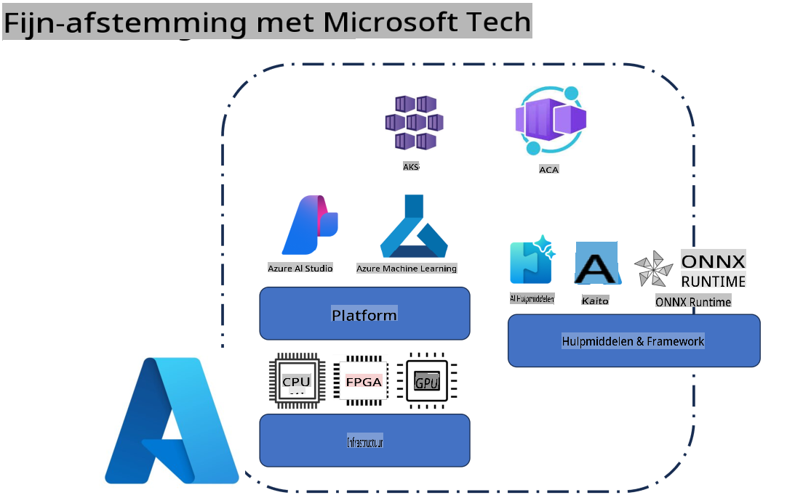
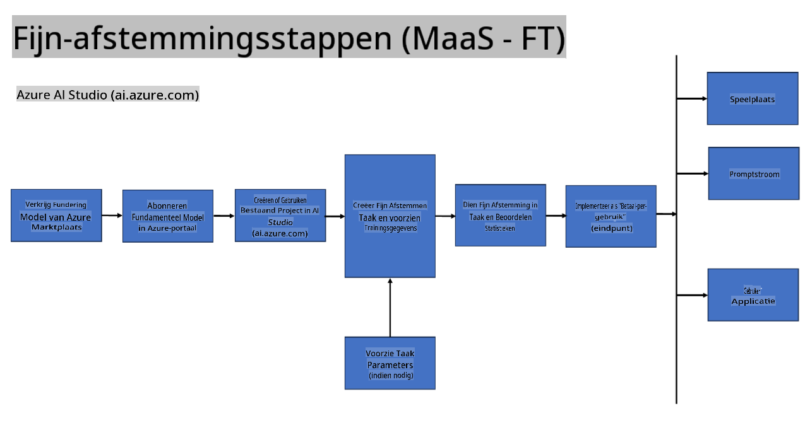
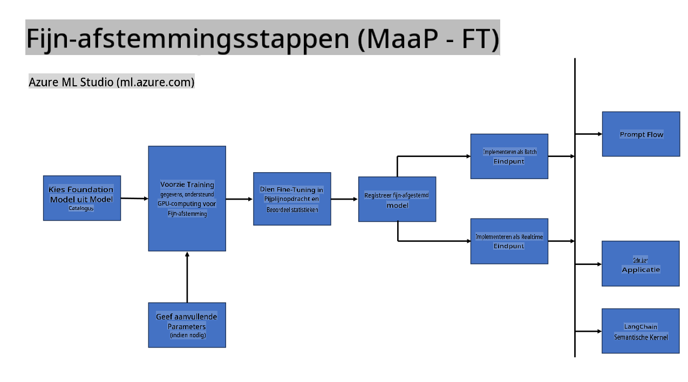
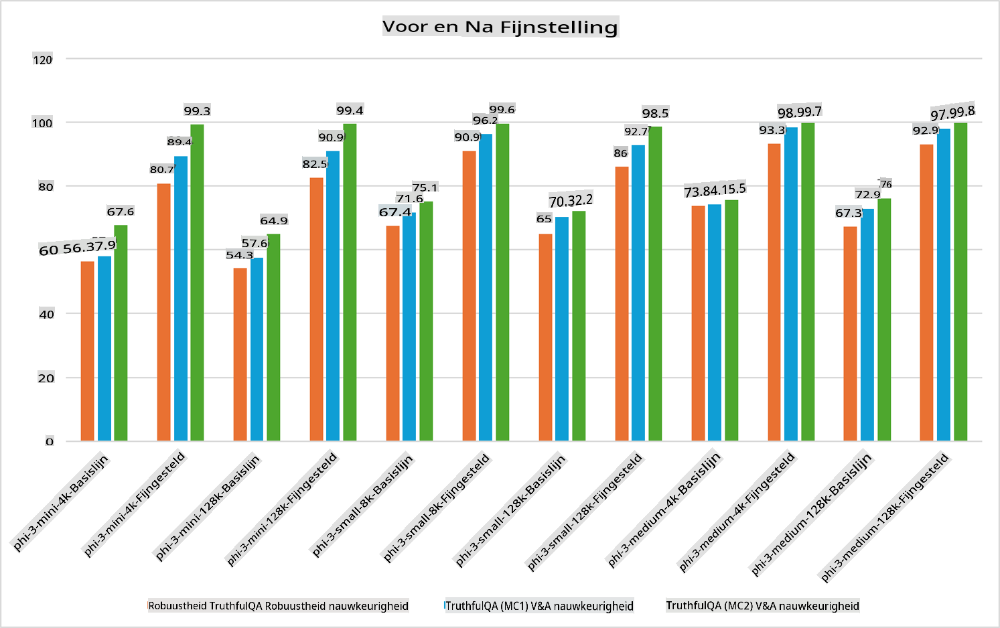

## Fine Tuning Scenario's

**Platform** Dit omvat verschillende technologieën zoals Azure AI Foundry, Azure Machine Learning, AI Tools, Kaito en ONNX Runtime.

**Infrastructuur** Dit omvat de CPU en FPGA, die essentieel zijn voor het fine-tuningproces. Laat me de iconen voor elk van deze technologieën laten zien.

**Tools & Framework** Dit omvat ONNX Runtime en ONNX Runtime. Laat me de iconen voor elk van deze technologieën laten zien.  
[Voeg iconen in voor ONNX Runtime en ONNX Runtime]

Het fine-tuningproces met Microsoft-technologieën omvat verschillende componenten en tools. Door deze technologieën te begrijpen en te gebruiken, kunnen we onze applicaties effectief fine-tunen en betere oplossingen creëren.

## Model als Service

Fine-tune het model met gehoste fine-tuning, zonder dat je zelf compute hoeft te creëren of te beheren.

Serverloze fine-tuning is beschikbaar voor Phi-3-mini- en Phi-3-medium-modellen, waardoor ontwikkelaars snel en eenvoudig de modellen kunnen aanpassen voor cloud- en edge-scenario's zonder zelf compute te regelen. We hebben ook aangekondigd dat Phi-3-small nu beschikbaar is via onze Models-as-a-Service-aanbieding, zodat ontwikkelaars snel en eenvoudig aan de slag kunnen met AI-ontwikkeling zonder de onderliggende infrastructuur te hoeven beheren.

## Model als Platform

Gebruikers beheren hun eigen compute om hun modellen te fine-tunen.

[Fine Tuning Voorbeeld](https://github.com/Azure/azureml-examples/blob/main/sdk/python/foundation-models/system/finetune/chat-completion/chat-completion.ipynb)

## Fine Tuning Scenario's

| | | | | | | |
|-|-|-|-|-|-|-|
|Scenario|LoRA|QLoRA|PEFT|DeepSpeed|ZeRO|DORA|
|Het aanpassen van voorgetrainde LLM's aan specifieke taken of domeinen|Ja|Ja|Ja|Ja|Ja|Ja|
|Fine-tuning voor NLP-taken zoals tekstclassificatie, named entity recognition en machinevertaling|Ja|Ja|Ja|Ja|Ja|Ja|
|Fine-tuning voor QA-taken|Ja|Ja|Ja|Ja|Ja|Ja|
|Fine-tuning voor het genereren van mensachtige reacties in chatbots|Ja|Ja|Ja|Ja|Ja|Ja|
|Fine-tuning voor het genereren van muziek, kunst of andere vormen van creativiteit|Ja|Ja|Ja|Ja|Ja|Ja|
|Vermindering van computationele en financiële kosten|Ja|Ja|Nee|Ja|Ja|Nee|
|Vermindering van geheugengebruik|Nee|Ja|Nee|Ja|Ja|Ja|
|Gebruik van minder parameters voor efficiënte fine-tuning|Nee|Ja|Ja|Nee|Nee|Ja|
|Geheugen-efficiënte vorm van data-parallelisme die toegang geeft tot het totale GPU-geheugen van alle beschikbare GPU-apparaten|Nee|Nee|Nee|Ja|Ja|Ja|

## Fine Tuning Prestatievoorbeelden

**Disclaimer (Vrijwaring)**:  
Dit document is vertaald met behulp van machine-gebaseerde AI-vertalingsdiensten. Hoewel we ons best doen om nauwkeurigheid te waarborgen, dient u zich ervan bewust te zijn dat geautomatiseerde vertalingen fouten of onnauwkeurigheden kunnen bevatten. Het originele document in zijn oorspronkelijke taal moet worden beschouwd als de gezaghebbende bron. Voor kritieke informatie wordt professionele menselijke vertaling aanbevolen. Wij zijn niet aansprakelijk voor misverstanden of verkeerde interpretaties die voortvloeien uit het gebruik van deze vertaling.