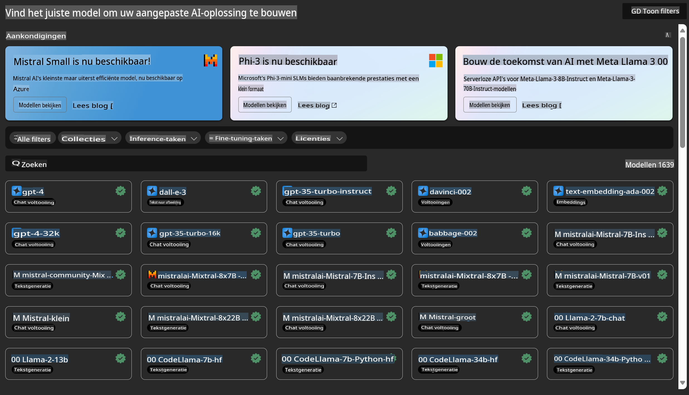

# **Azure Machine Learning Service Introduceren**

[Azure Machine Learning](https://ml.azure.com?WT.mc_id=aiml-138114-kinfeylo) is een cloudservice die het machine learning (ML)-projectlevenscyclus versnelt en beheert.

ML-professionals, datawetenschappers en ingenieurs kunnen het in hun dagelijkse workflows gebruiken om:

- Modellen te trainen en te implementeren.
- Machine learning operations (MLOps) te beheren.
- Je kunt een model maken in Azure Machine Learning of een model gebruiken dat is gebouwd op een open-sourceplatform zoals PyTorch, TensorFlow of scikit-learn.
- MLOps-tools helpen je modellen te monitoren, opnieuw te trainen en opnieuw te implementeren.

## Voor wie is Azure Machine Learning bedoeld?

**Datawetenschappers en ML-ingenieurs**

Zij kunnen tools gebruiken om hun dagelijkse workflows te versnellen en te automatiseren.
Azure ML biedt functies voor eerlijkheid, uitlegbaarheid, tracking en controleerbaarheid.

**Applicatieontwikkelaars**

Zij kunnen modellen naadloos integreren in applicaties of diensten.

**Platformontwikkelaars**

Zij hebben toegang tot een robuuste set tools ondersteund door duurzame Azure Resource Manager API's.
Met deze tools kunnen ze geavanceerde ML-tools bouwen.

**Bedrijven**

Door te werken in de Microsoft Azure-cloud profiteren bedrijven van vertrouwde beveiliging en op rollen gebaseerde toegangscontrole.
Ze kunnen projecten opzetten om toegang tot beschermde gegevens en specifieke operaties te beheren.

## Productiviteit voor iedereen in het team

ML-projecten vereisen vaak een team met verschillende vaardigheden om te bouwen en te onderhouden.

Azure ML biedt tools waarmee je:
- Samen kunt werken met je team via gedeelde notebooks, computerbronnen, serverloze compute, data en omgevingen.
- Modellen kunt ontwikkelen met eerlijkheid, uitlegbaarheid, tracking en controleerbaarheid om te voldoen aan lineage- en auditcompliancevereisten.
- ML-modellen snel en eenvoudig op schaal kunt implementeren, beheren en besturen met MLOps.
- Machine learning-workloads overal kunt uitvoeren met ingebouwde governance, beveiliging en compliance.

## Platformtools voor brede compatibiliteit

Iedereen in een ML-team kan zijn of haar favoriete tools gebruiken om het werk gedaan te krijgen.
Of je nu snelle experimenten uitvoert, hyperparameter tuning doet, pipelines bouwt of inferenties beheert, je kunt gebruik maken van vertrouwde interfaces zoals:
- Azure Machine Learning Studio
- Python SDK (v2)
- Azure CLI (v2)
- Azure Resource Manager REST API's

Terwijl je modellen verfijnt en samenwerkt tijdens de ontwikkelcyclus, kun je binnen de Azure Machine Learning studio-UI assets, bronnen en metriek delen en vinden.

## **LLM/SLM in Azure ML**

Azure ML heeft veel functies toegevoegd die verband houden met LLM/SLM en combineert LLMOps en SLMOps om een bedrijfsbrede generatieve kunstmatige intelligentie-technologieplatform te creëren.

### **Modelcatalogus**

Bedrijfsgebruikers kunnen verschillende modellen implementeren op basis van verschillende zakelijke scenario's via de Modelcatalogus en diensten aanbieden als Model as a Service, zodat bedrijfsontwikkelaars of gebruikers er toegang toe hebben.

De Modelcatalogus in Azure Machine Learning studio is het centrale punt om een breed scala aan modellen te ontdekken en te gebruiken waarmee je Generatieve AI-toepassingen kunt bouwen. De modelcatalogus bevat honderden modellen van modelleveranciers zoals Azure OpenAI-service, Mistral, Meta, Cohere, Nvidia, Hugging Face, inclusief modellen die door Microsoft zijn getraind. Modellen van andere leveranciers dan Microsoft zijn Niet-Microsoft-producten, zoals gedefinieerd in de productvoorwaarden van Microsoft, en vallen onder de voorwaarden die bij het model worden geleverd.

### **Job Pipeline**

De kern van een machine learning-pipeline is het opsplitsen van een volledige machine learning-taak in een workflow met meerdere stappen. Elke stap is een beheersbaar onderdeel dat afzonderlijk kan worden ontwikkeld, geoptimaliseerd, geconfigureerd en geautomatiseerd. Stappen zijn verbonden via goed gedefinieerde interfaces. De Azure Machine Learning-pipelineservice organiseert automatisch alle afhankelijkheden tussen pipeline-stappen.

Bij het fine-tunen van SLM/LLM kunnen we onze gegevens, trainings- en generatieprocessen beheren via Pipeline.

### **Prompt flow**

Voordelen van het gebruik van Azure Machine Learning prompt flow  
Azure Machine Learning prompt flow biedt een reeks voordelen die gebruikers helpen bij de overgang van idee naar experiment en uiteindelijk naar productieklare LLM-gebaseerde toepassingen:

**Wendbaarheid in prompt engineering**

- Interactieve ontwikkelervaring: Azure Machine Learning prompt flow biedt een visuele weergave van de structuur van de flow, waardoor gebruikers hun projecten gemakkelijk kunnen begrijpen en navigeren. Het biedt ook een notebook-achtige codeerervaring voor efficiënte flowontwikkeling en debugging.
- Varianten voor prompt tuning: Gebruikers kunnen meerdere promptvarianten maken en vergelijken, wat een iteratief verfijningsproces mogelijk maakt.
- Evaluatie: Ingebouwde evaluatieflows stellen gebruikers in staat de kwaliteit en effectiviteit van hun prompts en flows te beoordelen.
- Uitgebreide middelen: Azure Machine Learning prompt flow bevat een bibliotheek met ingebouwde tools, voorbeelden en sjablonen die dienen als startpunt voor ontwikkeling, creativiteit inspireren en het proces versnellen.

**Bedrijfsbereidheid voor LLM-gebaseerde toepassingen**

- Samenwerking: Azure Machine Learning prompt flow ondersteunt samenwerking binnen teams, waardoor meerdere gebruikers samen kunnen werken aan prompt engineering-projecten, kennis kunnen delen en versiebeheer kunnen behouden.
- Alles-in-één platform: Azure Machine Learning prompt flow stroomlijnt het hele prompt engineering-proces, van ontwikkeling en evaluatie tot implementatie en monitoring. Gebruikers kunnen hun flows moeiteloos implementeren als Azure Machine Learning-eindpunten en hun prestaties in realtime monitoren, wat zorgt voor optimale werking en continue verbetering.
- Azure Machine Learning Enterprise Readiness-oplossingen: Prompt flow maakt gebruik van de robuuste bedrijfsoplossingen van Azure Machine Learning, waardoor een veilige, schaalbare en betrouwbare basis wordt geboden voor de ontwikkeling, experimenten en implementatie van flows.

Met Azure Machine Learning prompt flow kunnen gebruikers hun wendbaarheid in prompt engineering volledig benutten, effectief samenwerken en gebruik maken van oplossingen van bedrijfsniveau voor succesvolle ontwikkeling en implementatie van LLM-gebaseerde toepassingen.

Door de rekenkracht, gegevens en verschillende componenten van Azure ML te combineren, kunnen bedrijfsontwikkelaars eenvoudig hun eigen kunstmatige intelligentie-toepassingen bouwen.

**Disclaimer (Vrijwaring)**:  
Dit document is vertaald met behulp van machine-gebaseerde AI-vertalingsdiensten. Hoewel we streven naar nauwkeurigheid, dient u zich ervan bewust te zijn dat geautomatiseerde vertalingen fouten of onnauwkeurigheden kunnen bevatten. Het originele document in de oorspronkelijke taal moet worden beschouwd als de gezaghebbende bron. Voor kritieke informatie wordt professionele menselijke vertaling aanbevolen. Wij zijn niet aansprakelijk voor misverstanden of verkeerde interpretaties die voortvloeien uit het gebruik van deze vertaling.