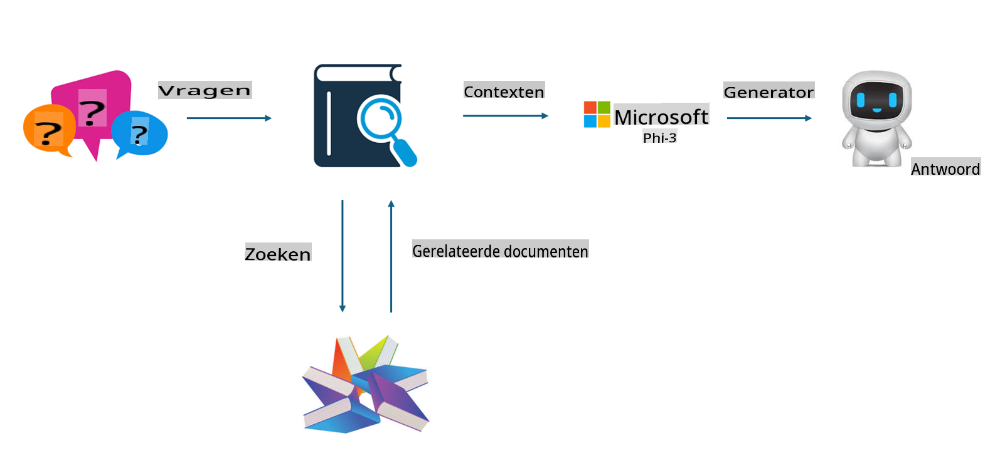
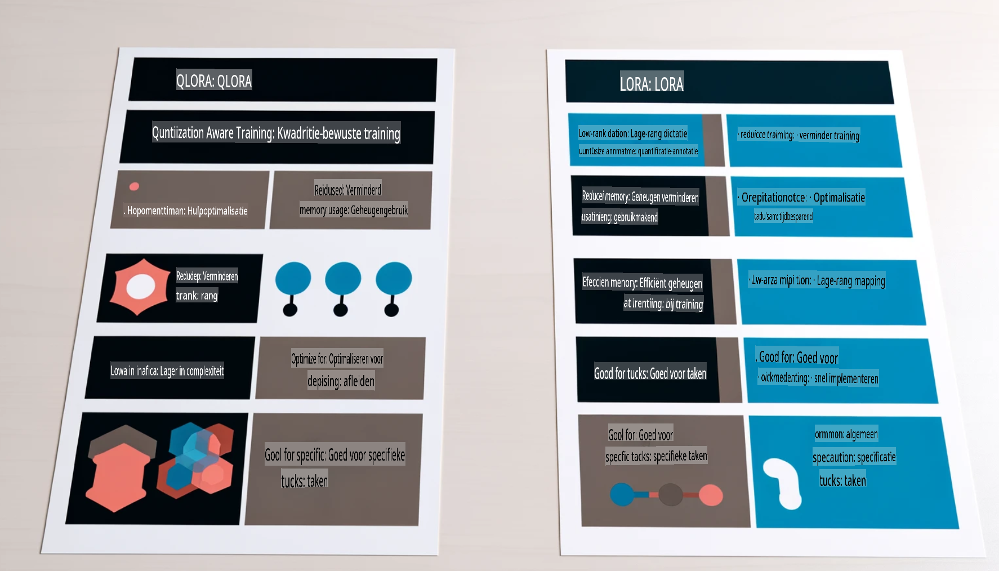

# **Laat Phi-3 een industrie-expert worden**

Om het Phi-3 model in een industrie toe te passen, moet je bedrijfsgegevens uit de industrie toevoegen aan het Phi-3 model. We hebben twee verschillende opties: de eerste is RAG (Retrieval Augmented Generation) en de tweede is Fine-Tuning.

## **RAG vs Fine-Tuning**

### **Retrieval Augmented Generation**

RAG is data-ophaling + tekstgeneratie. De gestructureerde en ongestructureerde gegevens van de onderneming worden opgeslagen in de vectordatabank. Bij het zoeken naar relevante inhoud wordt de relevante samenvatting en inhoud gevonden om een context te vormen, en wordt de tekstaanvullingscapaciteit van LLM/SLM gecombineerd om inhoud te genereren.

### **Fine-tuning**

Fine-tuning is gebaseerd op de verbetering van een bepaald model. Het is niet nodig om bij het modelalgoritme te beginnen, maar er moeten continu gegevens worden verzameld. Als je preciezere terminologie en taalgebruik in industriële toepassingen wilt, is fine-tuning de betere keuze. Maar als je gegevens vaak veranderen, kan fine-tuning ingewikkeld worden.

### **Hoe te kiezen**

1. Als ons antwoord externe gegevens nodig heeft, is RAG de beste keuze.

2. Als je stabiele en nauwkeurige industriële kennis wilt leveren, is fine-tuning een goede keuze. RAG richt zich op het ophalen van relevante inhoud, maar kan soms de gespecialiseerde nuances missen.

3. Fine-tuning vereist een dataset van hoge kwaliteit, en als het slechts om een klein bereik van gegevens gaat, zal het niet veel verschil maken. RAG is flexibeler.

4. Fine-tuning is een black box, een soort metafysica, en het is moeilijk om het interne mechanisme te begrijpen. Maar RAG maakt het gemakkelijker om de bron van de gegevens te achterhalen, waardoor hallucinaties of inhoudsfouten effectiever kunnen worden aangepast en betere transparantie wordt geboden.

### **Scenario's**

1. Verticale industrieën die specifieke professionele terminologie en uitdrukkingen vereisen, ***Fine-tuning*** is de beste keuze.

2. V&A-systemen, waarbij verschillende kennispunten worden gecombineerd, ***RAG*** is de beste keuze.

3. De combinatie van geautomatiseerde bedrijfsstromen ***RAG + Fine-tuning*** is de beste keuze.

## **Hoe gebruik je RAG**

Een vectordatabank is een verzameling gegevens die in wiskundige vorm zijn opgeslagen. Vectordatabanken maken het eenvoudiger voor machine learning-modellen om eerdere invoer te onthouden, waardoor machine learning kan worden gebruikt voor toepassingen zoals zoeken, aanbevelingen en tekstgeneratie. Gegevens kunnen worden geïdentificeerd op basis van vergelijkingsstatistieken in plaats van exacte overeenkomsten, waardoor computermodellen de context van de gegevens beter kunnen begrijpen.

De vectordatabank is de sleutel tot het realiseren van RAG. We kunnen gegevens omzetten in vectoropslag via vectormodellen zoals text-embedding-3, jina-ai-embedding, enz.

Lees meer over het maken van een RAG-toepassing [https://github.com/microsoft/Phi-3CookBook](https://github.com/microsoft/Phi-3CookBook?WT.mc_id=aiml-138114-kinfeylo)

## **Hoe gebruik je Fine-tuning**

De vaak gebruikte algoritmen in Fine-tuning zijn Lora en QLora. Hoe kies je?  
- [Lees meer met dit voorbeeldnotebook](../../../../code/04.Finetuning/Phi_3_Inference_Finetuning.ipynb)  
- [Voorbeeld van Python FineTuning Script](../../../../code/04.Finetuning/FineTrainingScript.py)

### **Lora en QLora**

LoRA (Low-Rank Adaptation) en QLoRA (Quantized Low-Rank Adaptation) zijn beide technieken die worden gebruikt om grote taalmodellen (LLMs) te fine-tunen met behulp van Parameter Efficient Fine Tuning (PEFT). PEFT-technieken zijn ontworpen om modellen efficiënter te trainen dan traditionele methoden.  
LoRA is een op zichzelf staande fine-tuningtechniek die het geheugengebruik vermindert door een low-rank benadering toe te passen op de gewichtsupdate-matrix. Het biedt snelle trainingstijden en behoudt prestaties die dicht bij traditionele fine-tuningmethoden liggen.  

QLoRA is een uitgebreide versie van LoRA die kwantiseringstechnieken gebruikt om het geheugengebruik verder te verminderen. QLoRA kwantiseert de precisie van de gewichtsparameters in het voorgetrainde LLM naar 4-bits precisie, wat efficiënter is in geheugengebruik dan LoRA. Echter, de training van QLoRA is ongeveer 30% langzamer dan die van LoRA vanwege de extra stappen voor kwantisering en dekwantisering.  

QLoRA gebruikt LoRA als hulpmiddel om de fouten te corrigeren die tijdens de kwantisering zijn geïntroduceerd. QLoRA maakt het mogelijk om enorme modellen met miljarden parameters te fine-tunen op relatief kleine, breed beschikbare GPU's. Bijvoorbeeld, QLoRA kan een model met 70 miljard parameters fine-tunen dat normaal 36 GPU's nodig heeft, met slechts 2.

**Disclaimer (Vrijwaring)**:  
Dit document is vertaald met behulp van AI-gebaseerde vertaaldiensten. Hoewel we streven naar nauwkeurigheid, dient u zich ervan bewust te zijn dat geautomatiseerde vertalingen fouten of onnauwkeurigheden kunnen bevatten. Het originele document in de oorspronkelijke taal moet worden beschouwd als de gezaghebbende bron. Voor cruciale informatie wordt professionele menselijke vertaling aanbevolen. Wij zijn niet aansprakelijk voor misverstanden of verkeerde interpretaties die voortvloeien uit het gebruik van deze vertaling.