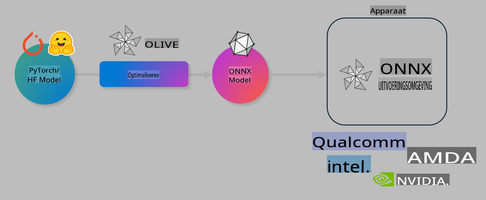

# Lab. Optimaliseer AI-modellen voor on-device inference

## Introductie 

> [!IMPORTANT]
> Deze lab vereist een **Nvidia A10 of A100 GPU** met bijbehorende drivers en geïnstalleerde CUDA-toolkit (versie 12+).

> [!NOTE]
> Dit is een **35 minuten durende** lab die je hands-on kennis geeft over de kernconcepten van het optimaliseren van modellen voor on-device inference met behulp van OLIVE.

## Leerdoelen

Aan het einde van deze lab kun je met OLIVE:

- Een AI-model kwantiseren met de AWQ-kwantisatiemethode.
- Een AI-model finetunen voor een specifieke taak.
- LoRA-adapters (gefinetunet model) genereren voor efficiënte on-device inference op de ONNX Runtime.

### Wat is Olive

Olive (*O*NNX *live*) is een toolkit voor modeloptimalisatie met een bijbehorende CLI die je in staat stelt om modellen te leveren voor de ONNX runtime +++https://onnxruntime.ai+++ met hoge kwaliteit en prestaties.



De invoer voor Olive is meestal een PyTorch- of Hugging Face-model en de uitvoer is een geoptimaliseerd ONNX-model dat wordt uitgevoerd op een apparaat (doelplatform) met de ONNX-runtime. Olive optimaliseert het model voor de AI-versneller (NPU, GPU, CPU) van het doelplatform, geleverd door een hardwareleverancier zoals Qualcomm, AMD, Nvidia of Intel.

Olive voert een *workflow* uit, een geordende reeks afzonderlijke modeloptimalisatietaken genaamd *passes*. Voorbeelden van passes zijn: modelcompressie, grafiekcaptatie, kwantisatie, grafiekoptimalisatie. Elke pass heeft een set parameters die kunnen worden afgestemd om de beste metrics te bereiken, zoals nauwkeurigheid en latentie, die worden geëvalueerd door de respectieve evaluator. Olive gebruikt een zoekstrategie met een algoritme om elke pass afzonderlijk of een set passes samen automatisch af te stemmen.

#### Voordelen van Olive

- **Minder frustratie en tijd** door handmatige trial-and-error experimenten met verschillende technieken voor grafiekoptimalisatie, compressie en kwantisatie te vermijden. Definieer je kwaliteits- en prestatie-eisen en laat Olive automatisch het beste model voor je vinden.
- **Meer dan 40 ingebouwde modeloptimalisatiecomponenten** met geavanceerde technieken in kwantisatie, compressie, grafiekoptimalisatie en finetuning.
- **Gebruiksvriendelijke CLI** voor veelvoorkomende modeloptimalisatietaken. Bijvoorbeeld: olive quantize, olive auto-opt, olive finetune.
- Ingebouwde modelverpakking en -implementatie.
- Ondersteuning voor het genereren van modellen voor **Multi LoRA serving**.
- Workflows opstellen met YAML/JSON om modeloptimalisatie- en implementatietaken te orkestreren.
- Integratie met **Hugging Face** en **Azure AI**.
- Ingebouwd **cachingsysteem** om **kosten te besparen**.

## Lab Instructies
> [!NOTE]
> Zorg ervoor dat je je Azure AI Hub en Project hebt ingericht en je A100-compute hebt ingesteld zoals beschreven in Lab 1.

### Stap 0: Verbinden met je Azure AI Compute

Je maakt verbinding met de Azure AI compute met de remote-functionaliteit in **VS Code.**

1. Open je **VS Code** desktopapplicatie:
1. Open de **command palette** met **Shift+Ctrl+P**.
1. Zoek in de command palette naar **AzureML - remote: Connect to compute instance in New Window**.
1. Volg de instructies op het scherm om verbinding te maken met de Compute. Dit omvat het selecteren van je Azure-abonnement, resourcegroep, project en computenaam die je hebt ingesteld in Lab 1.
1. Zodra je verbonden bent met je Azure ML Compute-node, wordt dit weergegeven in de **linkeronderhoek van Visual Code** `><Azure ML: Compute Name`.

### Stap 1: Clone deze repo

In VS Code kun je een nieuwe terminal openen met **Ctrl+J** en deze repo clonen:

In de terminal zou je de prompt moeten zien

```
azureuser@computername:~/cloudfiles/code$ 
```
Clone de oplossing 

```bash
cd ~/localfiles
git clone https://github.com/microsoft/phi-3cookbook.git
```

### Stap 2: Open map in VS Code

Om VS Code in de relevante map te openen, voer je het volgende commando uit in de terminal. Dit opent een nieuw venster:

```bash
code phi-3cookbook/code/04.Finetuning/Olive-lab
```

Je kunt de map ook openen door **Bestand** > **Map openen** te selecteren. 

### Stap 3: Afhankelijkheden

Open een terminalvenster in VS Code op je Azure AI Compute Instance (tip: **Ctrl+J**) en voer de volgende commando's uit om de afhankelijkheden te installeren:

```bash
conda create -n olive-ai python=3.11 -y
conda activate olive-ai
pip install -r requirements.txt
az extension remove -n azure-cli-ml
az extension add -n ml
```

> [!NOTE]
> Het installeren van alle afhankelijkheden duurt ongeveer 5 minuten.

In deze lab download en upload je modellen naar de Azure AI Model Catalog. Om toegang te krijgen tot de modelcatalogus, moet je inloggen bij Azure met:

```bash
az login
```

> [!NOTE]
> Tijdens het inloggen word je gevraagd je abonnement te selecteren. Zorg ervoor dat je het abonnement kiest dat voor deze lab is verstrekt.

### Stap 4: Voer Olive-commando's uit 

Open een terminalvenster in VS Code op je Azure AI Compute Instance (tip: **Ctrl+J**) en zorg ervoor dat de `olive-ai` conda-omgeving is geactiveerd:

```bash
conda activate olive-ai
```

Voer vervolgens de volgende Olive-commando's uit in de command line.

1. **Inspecteer de data:** In dit voorbeeld ga je het Phi-3.5-Mini-model finetunen zodat het gespecialiseerd is in het beantwoorden van reisinformatievragen. De onderstaande code toont de eerste paar records van de dataset, die in JSON-lines-formaat zijn:
   
    ```bash
    head data/data_sample_travel.jsonl
    ```
1. **Model kwantiseren:** Voordat je het model traint, kwantiseer je het eerst met het volgende commando dat gebruikmaakt van een techniek genaamd Active Aware Quantization (AWQ) +++https://arxiv.org/abs/2306.00978+++. AWQ kwantiseert de gewichten van een model door rekening te houden met de activaties die tijdens inference worden geproduceerd. Dit betekent dat het kwantisatieproces rekening houdt met de werkelijke dataverdeling in de activaties, wat leidt tot een betere behoud van de modelnauwkeurigheid in vergelijking met traditionele gewichts-kwantisatiemethoden.
    
    ```bash
    olive quantize \
       --model_name_or_path microsoft/Phi-3.5-mini-instruct \
       --trust_remote_code \
       --algorithm awq \
       --output_path models/phi/awq \
       --log_level 1
    ```
    
    Het duurt **ongeveer 8 minuten** om de AWQ-kwantisatie te voltooien, wat de modelgrootte **vermindert van ~7,5GB naar ~2,5GB**.
   
   In deze lab laten we zien hoe je modellen invoert van Hugging Face (bijvoorbeeld: `microsoft/Phi-3.5-mini-instruct`). However, Olive also allows you to input models from the Azure AI catalog by updating the `model_name_or_path` argument to an Azure AI asset ID (for example:  `azureml://registries/azureml/models/Phi-3.5-mini-instruct/versions/4`). 

1. **Train the model:** Next, the `olive finetune`-commando finetunet het gekwantiseerde model. Het model kwantiseren *voor* het finetunen in plaats van erna geeft betere nauwkeurigheid omdat het finetune-proces enig verlies door de kwantisatie herstelt.
    
    ```bash
    olive finetune \
        --method lora \
        --model_name_or_path models/phi/awq \
        --data_files "data/data_sample_travel.jsonl" \
        --data_name "json" \
        --text_template "<|user|>\n{prompt}<|end|>\n<|assistant|>\n{response}<|end|>" \
        --max_steps 100 \
        --output_path ./models/phi/ft \
        --log_level 1
    ```
    
    Het finetunen (met 100 stappen) duurt **ongeveer 6 minuten**.

1. **Optimaliseren:** Met het getrainde model optimaliseer je het nu met Olive's `auto-opt` command, which will capture the ONNX graph and automatically perform a number of optimizations to improve the model performance for CPU by compressing the model and doing fusions. It should be noted, that you can also optimize for other devices such as NPU or GPU by just updating the `--device` and `--provider`-argumenten - maar voor de doeleinden van deze lab gebruiken we CPU.

    ```bash
    olive auto-opt \
       --model_name_or_path models/phi/ft/model \
       --adapter_path models/phi/ft/adapter \
       --device cpu \
       --provider CPUExecutionProvider \
       --use_ort_genai \
       --output_path models/phi/onnx-ao \
       --log_level 1
    ```
    
    Het optimaliseren duurt **ongeveer 5 minuten**.

### Stap 5: Model-inferentie snel testen

Om het model te testen, maak je een Python-bestand aan in je map met de naam **app.py** en kopieer en plak je de volgende code:

```python
import onnxruntime_genai as og
import numpy as np

print("loading model and adapters...", end="", flush=True)
model = og.Model("models/phi/onnx-ao/model")
adapters = og.Adapters(model)
adapters.load("models/phi/onnx-ao/model/adapter_weights.onnx_adapter", "travel")
print("DONE!")

tokenizer = og.Tokenizer(model)
tokenizer_stream = tokenizer.create_stream()

params = og.GeneratorParams(model)
params.set_search_options(max_length=100, past_present_share_buffer=False)
user_input = "what is the best thing to see in chicago"
params.input_ids = tokenizer.encode(f"<|user|>\n{user_input}<|end|>\n<|assistant|>\n")

generator = og.Generator(model, params)

generator.set_active_adapter(adapters, "travel")

print(f"{user_input}")

while not generator.is_done():
    generator.compute_logits()
    generator.generate_next_token()

    new_token = generator.get_next_tokens()[0]
    print(tokenizer_stream.decode(new_token), end='', flush=True)

print("\n")
```

Voer de code uit met:

```bash
python app.py
```

### Stap 6: Upload model naar Azure AI

Het uploaden van het model naar een Azure AI-modelrepository maakt het model deelbaar met andere leden van je ontwikkelteam en biedt ook versiebeheer van het model. Om het model te uploaden, voer je het volgende commando uit:

> [!NOTE]
> Werk de `{}` placeholders with the name of your resource group and Azure AI Project Name. 

To find your resource group `"resourceGroup"` en Azure AI Projectnaam bij en voer het volgende commando uit:

```
az ml workspace show
```

Of door naar +++ai.azure.com+++ te gaan en **management center** **project** **overzicht** te selecteren.

Werk de `{}` placeholders bij met de naam van je resourcegroep en Azure AI Projectnaam.

```bash
az ml model create \
    --name ft-for-travel \
    --version 1 \
    --path ./models/phi/onnx-ao \
    --resource-group {RESOURCE_GROUP_NAME} \
    --workspace-name {PROJECT_NAME}
```
Je kunt vervolgens je geüploade model bekijken en implementeren via https://ml.azure.com/model/list

**Disclaimer**:  
Dit document is vertaald met behulp van AI-gestuurde machinale vertaaldiensten. Hoewel we ons best doen voor nauwkeurigheid, dient u zich ervan bewust te zijn dat geautomatiseerde vertalingen fouten of onnauwkeurigheden kunnen bevatten. Het originele document in zijn oorspronkelijke taal moet worden beschouwd als de gezaghebbende bron. Voor cruciale informatie wordt professionele menselijke vertaling aanbevolen. Wij zijn niet aansprakelijk voor misverstanden of verkeerde interpretaties die voortvloeien uit het gebruik van deze vertaling.