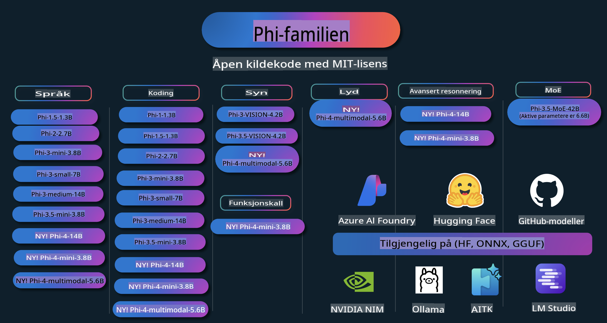

# Phi Kokebok: Praktiske Eksempler med Microsofts Phi-Modeller

Phi er en serie av open source AI-modeller utviklet av Microsoft.

Phi er for tiden den kraftigste og mest kostnadseffektive lille språkmodellen (SLM), med svært gode resultater innen flerspråklighet, resonnement, tekst-/chat-generering, koding, bilder, lyd og andre scenarier.

Du kan distribuere Phi til skyen eller til kant-enheter, og enkelt bygge generative AI-applikasjoner med begrenset regnekraft.

Følg disse trinnene for å komme i gang med disse ressursene:
1. **Forgrein Repositoriet**: Klikk 
2. **Klon Repositoriet**:   `git clone https://github.com/microsoft/PhiCookBook.git`
3. [**Bli med i Microsoft AI Discord-fellesskapet og møt eksperter og andre utviklere**](https://discord.com/invite/ByRwuEEgH4?WT.mc_id=aiml-137032-kinfeylo)

## Innholdsfortegnelse

- Introduksjon
  - [Velkommen til Phi-familien](./md/01.Introduction/01/01.PhiFamily.md)
  - [Sette opp ditt miljø](./md/01.Introduction/01/01.EnvironmentSetup.md)
  - [Forstå nøkkelteknologier](./md/01.Introduction/01/01.Understandingtech.md)
  - [AI-sikkerhet for Phi-modeller](./md/01.Introduction/01/01.AISafety.md)
  - [Phi-maskinvarestøtte](./md/01.Introduction/01/01.Hardwaresupport.md)
  - [Phi-modeller og tilgjengelighet på tvers av plattformer](./md/01.Introduction/01/01.Edgeandcloud.md)
  - [Bruke Guidance-ai og Phi](./md/01.Introduction/01/01.Guidance.md)
  - [GitHub Marketplace Modeller](https://github.com/marketplace/models)
  - [Azure AI Modellkatalog](https://ai.azure.com)

- Kjøre Phi i forskjellige miljøer
    - [Hugging Face](./md/01.Introduction/02/01.HF.md)
    - [GitHub Modeller](./md/01.Introduction/02/02.GitHubModel.md)
    - [Azure AI Foundry Modellkatalog](./md/01.Introduction/02/03.AzureAIFoundry.md)
    - [Ollama](./md/01.Introduction/02/04.Ollama.md)
    - [AI Toolkit VSCode (AITK)](./md/01.Introduction/02/05.AITK.md)
    - [NVIDIA NIM](./md/01.Introduction/02/06.NVIDIA.md)

- Kjøre Phi-familien
    - [Kjøre Phi på iOS](./md/01.Introduction/03/iOS_Inference.md)
    - [Kjøre Phi på Android](./md/01.Introduction/03/Android_Inference.md)
- [Inference Phi i Jetson](./md/01.Introduction/03/Jetson_Inference.md)  
    - [Inference Phi i AI PC](./md/01.Introduction/03/AIPC_Inference.md)  
    - [Inference Phi med Apple MLX Framework](./md/01.Introduction/03/MLX_Inference.md)  
    - [Inference Phi på lokal server](./md/01.Introduction/03/Local_Server_Inference.md)  
    - [Inference Phi på fjernserver ved bruk av AI Toolkit](./md/01.Introduction/03/Remote_Interence.md)  
    - [Inference Phi med Rust](./md/01.Introduction/03/Rust_Inference.md)  
    - [Inference Phi--Vision lokalt](./md/01.Introduction/03/Vision_Inference.md)  
    - [Inference Phi med Kaito AKS, Azure Containers (offisiell støtte)](./md/01.Introduction/03/Kaito_Inference.md)  

- [Kvantifisere Phi-familien](./md/01.Introduction/04/QuantifyingPhi.md)  
    - [Kvantifisere Phi-3.5 / 4 ved bruk av llama.cpp](./md/01.Introduction/04/UsingLlamacppQuantifyingPhi.md)  
    - [Kvantifisere Phi-3.5 / 4 ved bruk av generative AI-utvidelser for onnxruntime](./md/01.Introduction/04/UsingORTGenAIQuantifyingPhi.md)  
    - [Kvantifisere Phi-3.5 / 4 ved bruk av Intel OpenVINO](./md/01.Introduction/04/UsingIntelOpenVINOQuantifyingPhi.md)  
    - [Kvantifisere Phi-3.5 / 4 ved bruk av Apple MLX Framework](./md/01.Introduction/04/UsingAppleMLXQuantifyingPhi.md)  

- Evaluere Phi  
    - [Ansvarlig AI](./md/01.Introduction/05/ResponsibleAI.md)  
    - [Azure AI Foundry for evaluering](./md/01.Introduction/05/AIFoundry.md)  
    - [Bruk av Promptflow til evaluering](./md/01.Introduction/05/Promptflow.md)  

- RAG med Azure AI Search  
    - [Hvordan bruke Phi-4-mini og Phi-4-multimodal (RAG) med Azure AI Search](https://github.com/microsoft/PhiCookBook/blob/main/code/06.E2E/E2E_Phi-4-RAG-Azure-AI-Search.ipynb)  

- Eksempler på Phi-applikasjonsutvikling  
  - Tekst- og chatteapplikasjoner  
    - Phi-4-eksempler 🆕  
      - [📓] [Chat med Phi-4-mini ONNX-modell](./md/02.Application/01.TextAndChat/Phi4/ChatWithPhi4ONNX/README.md)  
      - [Chat med Phi-4 lokal ONNX-modell .NET](../../md/04.HOL/dotnet/src/LabsPhi4-Chat-01OnnxRuntime)  
      - [Chat .NET konsollapplikasjon med Phi-4 ONNX ved bruk av Semantic Kernel](../../md/04.HOL/dotnet/src/LabsPhi4-Chat-02SK)  
    - Phi-3 / 3.5-eksempler  
      - [Lokal chatbot i nettleseren ved bruk av Phi3, ONNX Runtime Web og WebGPU](https://github.com/microsoft/onnxruntime-inference-examples/tree/main/js/chat)  
      - [OpenVino Chat](./md/02.Application/01.TextAndChat/Phi3/E2E_OpenVino_Chat.md)  
      - [Multi-modell - Interaktiv Phi-3-mini og OpenAI Whisper](./md/02.Application/01.TextAndChat/Phi3/E2E_Phi-3-mini_with_whisper.md)  
      - [MLFlow - Lage en wrapper og bruke Phi-3 med MLFlow](./md//02.Application/01.TextAndChat/Phi3/E2E_Phi-3-MLflow.md)  
      - [Modelloptimalisering - Hvordan optimalisere Phi-3-min-modellen for ONNX Runtime Web med Olive](https://github.com/microsoft/Olive/tree/main/examples/phi3)  
      - [WinUI3-app med Phi-3 mini-4k-instruct-onnx](https://github.com/microsoft/Phi3-Chat-WinUI3-Sample/)  
      - [WinUI3 Multi Model AI-drevet notatapp eksempel](https://github.com/microsoft/ai-powered-notes-winui3-sample)  
      - [Finjustere og integrere tilpassede Phi-3-modeller med Promptflow](./md/02.Application/01.TextAndChat/Phi3/E2E_Phi-3-FineTuning_PromptFlow_Integration.md)  
      - [Finjustere og integrere tilpassede Phi-3-modeller med Promptflow i Azure AI Foundry](./md/02.Application/01.TextAndChat/Phi3/E2E_Phi-3-FineTuning_PromptFlow_Integration_AIFoundry.md)  
      - [Evaluere den finjusterte Phi-3 / Phi-3.5-modellen i Azure AI Foundry med fokus på Microsofts prinsipper for ansvarlig AI](./md/02.Application/01.TextAndChat/Phi3/E2E_Phi-3-Evaluation_AIFoundry.md)  
- [📓] [Phi-3.5-mini-instruct språkpredictor eksempel (Kinesisk/Engelsk)](../../md/02.Application/01.TextAndChat/Phi3/phi3-instruct-demo.ipynb)
      - [Phi-3.5-Instruct WebGPU RAG Chatbot](./md/02.Application/01.TextAndChat/Phi3/WebGPUWithPhi35Readme.md)
      - [Bruke Windows GPU til å lage en Prompt flow-løsning med Phi-3.5-Instruct ONNX](./md/02.Application/01.TextAndChat/Phi3/UsingPromptFlowWithONNX.md)
      - [Bruke Microsoft Phi-3.5 tflite til å lage en Android-app](./md/02.Application/01.TextAndChat/Phi3/UsingPhi35TFLiteCreateAndroidApp.md)
      - [Q&A .NET-eksempel med lokal ONNX Phi-3-modell ved bruk av Microsoft.ML.OnnxRuntime](../../md/04.HOL/dotnet/src/LabsPhi301)
      - [Konsollbasert chat .NET-app med Semantic Kernel og Phi-3](../../md/04.HOL/dotnet/src/LabsPhi302)

  - Azure AI Inference SDK Kodebaserte Eksempler 
    - Phi-4 Eksempler 🆕
      - [📓] [Generer prosjektkode ved hjelp av Phi-4-multimodal](./md/02.Application/02.Code/Phi4/GenProjectCode/README.md)
    - Phi-3 / 3.5 Eksempler
      - [Lag din egen Visual Studio Code GitHub Copilot Chat med Microsoft Phi-3 Family](./md/02.Application/02.Code/Phi3/VSCodeExt/README.md)
      - [Lag din egen Visual Studio Code Chat Copilot Agent med Phi-3.5 ved hjelp av GitHub-modeller](/md/02.Application/02.Code/Phi3/CreateVSCodeChatAgentWithGitHubModels.md)

  - Avanserte Resonneringseksempler
    - Phi-4 Eksempler 🆕
      - [📓] [Phi-4-mini Resonneringseksempler](./md/02.Application/03.AdvancedReasoning/Phi4/AdvancedResoningPhi4mini/README.md)
  
  - Demoer
      - [Phi-4-mini demoer hostet på Hugging Face Spaces](https://huggingface.co/spaces/microsoft/phi-4-mini?WT.mc_id=aiml-137032-kinfeylo)
      - [Phi-4-multimodal demoer hostet på Hugging Face Spaces](https://huggingface.co/spaces/microsoft/phi-4-multimodal?WT.mc_id=aiml-137032-kinfeylo)
  - Visjonseksempler
    - Phi-4 Eksempler 🆕
      - [📓] [Bruk Phi-4-multimodal til å lese bilder og generere kode](./md/02.Application/04.Vision/Phi4/CreateFrontend/README.md) 
    - Phi-3 / 3.5 Eksempler
      - [📓][Phi-3-vision-Bildetekst til tekst](../../md/02.Application/04.Vision/Phi3/E2E_Phi-3-vision-image-text-to-text-online-endpoint.ipynb)
      - [Phi-3-vision-ONNX](https://onnxruntime.ai/docs/genai/tutorials/phi3-v.html)
      - [📓][Phi-3-vision CLIP Embedding](../../md/02.Application/04.Vision/Phi3/E2E_Phi-3-vision-image-text-to-text-online-endpoint.ipynb)
      - [DEMO: Phi-3 Resirkulering](https://github.com/jennifermarsman/PhiRecycling/)
      - [Phi-3-vision - Visuell språkassistent - med Phi3-Vision og OpenVINO](https://docs.openvino.ai/nightly/notebooks/phi-3-vision-with-output.html)
      - [Phi-3 Vision Nvidia NIM](./md/02.Application/04.Vision/Phi3/E2E_Nvidia_NIM_Vision.md)
      - [Phi-3 Vision OpenVino](./md/02.Application/04.Vision/Phi3/E2E_OpenVino_Phi3Vision.md)
      - [📓][Phi-3.5 Vision flerbilder eller flerramme-eksempel](../../md/02.Application/04.Vision/Phi3/phi3-vision-demo.ipynb)
      - [Phi-3 Vision Lokal ONNX-modell ved bruk av Microsoft.ML.OnnxRuntime .NET](../../md/04.HOL/dotnet/src/LabsPhi303)
      - [Menydrevet Phi-3 Vision Lokal ONNX-modell ved bruk av Microsoft.ML.OnnxRuntime .NET](../../md/04.HOL/dotnet/src/LabsPhi304)

  - Lyd Eksempler
    - Phi-4 Eksempler 🆕
      - [📓] [Ekstrahere lydtranskripsjoner ved hjelp av Phi-4-multimodal](./md/02.Application/05.Audio/Phi4/Transciption/README.md)
      - [📓] [Phi-4-multimodal Lyd Eksempel](../../md/02.Application/05.Audio/Phi4/Siri/demo.ipynb)
      - [📓] [Phi-4-multimodal Taleoversettelse Eksempel](../../md/02.Application/05.Audio/Phi4/Translate/demo.ipynb)
      - [.NET konsollapplikasjon ved bruk av Phi-4-multimodal Lyd for å analysere en lydfil og generere transkripsjon](../../md/04.HOL/dotnet/src/LabsPhi4-MultiModal-02Audio)

  - MOE Eksempler
    - Phi-3 / 3.5 Eksempler
      - [📓] [Phi-3.5 Mixture of Experts Models (MoEs) Sosiale Medier Eksempel](../../md/02.Application/06.MoE/Phi3/phi3_moe_demo.ipynb)
      - [📓] [Bygge en Retrieval-Augmented Generation (RAG) Pipeline med NVIDIA NIM Phi-3 MOE, Azure AI Search, og LlamaIndex](../../md/02.Application/06.MoE/Phi3/azure-ai-search-nvidia-rag.ipynb)
  - Funksjonskall Eksempler
    - Phi-4 Eksempler 🆕
      -  [📓] [Bruke Funksjonskall med Phi-4-mini](./md/02.Application/07.FunctionCalling/Phi4/FunctionCallingBasic/README.md)
  - Multimodal Mikse Eksempler
    - Phi-4 Eksempler 🆕
- [📓] [Bruke Phi-4-multimodal som teknologijournalist](../../md/02.Application/08.Multimodel/Phi4/TechJournalist/phi_4_mm_audio_text_publish_news.ipynb)  
  - [.NET konsollapplikasjon som bruker Phi-4-multimodal til å analysere bilder](../../md/04.HOL/dotnet/src/LabsPhi4-MultiModal-01Images)

- Finjustering av Phi-eksempler  
  - [Scenarier for finjustering](./md/03.FineTuning/FineTuning_Scenarios.md)  
  - [Finjustering vs RAG](./md/03.FineTuning/FineTuning_vs_RAG.md)  
  - [Finjustering: La Phi-3 bli en bransjeekspert](./md/03.FineTuning/LetPhi3gotoIndustriy.md)  
  - [Finjustering av Phi-3 med AI Toolkit for VS Code](./md/03.FineTuning/Finetuning_VSCodeaitoolkit.md)  
  - [Finjustering av Phi-3 med Azure Machine Learning Service](./md/03.FineTuning/Introduce_AzureML.md)  
  - [Finjustering av Phi-3 med Lora](./md/03.FineTuning/FineTuning_Lora.md)  
  - [Finjustering av Phi-3 med QLora](./md/03.FineTuning/FineTuning_Qlora.md)  
  - [Finjustering av Phi-3 med Azure AI Foundry](./md/03.FineTuning/FineTuning_AIFoundry.md)  
  - [Finjustering av Phi-3 med Azure ML CLI/SDK](./md/03.FineTuning/FineTuning_MLSDK.md)  
  - [Finjustering med Microsoft Olive](./md/03.FineTuning/FineTuning_MicrosoftOlive.md)  
  - [Finjustering med Microsoft Olive Hands-On Lab](./md/03.FineTuning/olive-lab/readme.md)  
  - [Finjustering av Phi-3-vision med Weights and Bias](./md/03.FineTuning/FineTuning_Phi-3-visionWandB.md)  
  - [Finjustering av Phi-3 med Apple MLX Framework](./md/03.FineTuning/FineTuning_MLX.md)  
  - [Finjustering av Phi-3-vision (offisiell støtte)](./md/03.FineTuning/FineTuning_Vision.md)  
  - [Finjustering av Phi-3 med Kaito AKS, Azure Containers (offisiell støtte)](./md/03.FineTuning/FineTuning_Kaito.md)  
  - [Finjustering av Phi-3 og 3.5 Vision](https://github.com/2U1/Phi3-Vision-Finetune)

- Praktisk workshop  
  - [Utforske banebrytende modeller: LLMs, SLMs, lokal utvikling og mer](https://github.com/microsoft/aitour-exploring-cutting-edge-models)  
  - [Frigjøre NLP-potensial: Finjustering med Microsoft Olive](https://github.com/azure/Ignite_FineTuning_workshop)

- Akademiske forskningsartikler og publikasjoner  
  - [Textbooks Are All You Need II: phi-1.5 teknisk rapport](https://arxiv.org/abs/2309.05463)  
  - [Phi-3 teknisk rapport: En svært kapabel språkmodell lokalt på mobilen din](https://arxiv.org/abs/2404.14219)  
  - [Phi-4 teknisk rapport](https://arxiv.org/abs/2412.08905)  
  - [Optimalisering av små språkmodeller for funksjonskalling i kjøretøy](https://arxiv.org/abs/2501.02342)  
  - [(WhyPHI) Finjustering av PHI-3 for flervalgsspørsmål: Metodikk, resultater og utfordringer](https://arxiv.org/abs/2501.01588)

## Bruke Phi-modeller

### Phi på Azure AI Foundry  

Du kan lære hvordan du bruker Microsoft Phi og hvordan du bygger ende-til-ende-løsninger på ulike maskinvareenheter. For å oppleve Phi selv, start med å teste modellene og tilpasse Phi til dine scenarioer ved å bruke [Azure AI Foundry Azure AI Model Catalog](https://aka.ms/phi3-azure-ai). Du kan lære mer i "Kom i gang med [Azure AI Foundry](/md/02.QuickStart/AzureAIFoundry_QuickStart.md)".

**Playground**  
Hver modell har en dedikert testarena for å prøve modellen: [Azure AI Playground](https://aka.ms/try-phi3).

### Phi på GitHub-modeller  

Du kan lære hvordan du bruker Microsoft Phi og hvordan du bygger ende-til-ende-løsninger på ulike maskinvareenheter. For å oppleve Phi selv, start med å teste modellen og tilpasse Phi til dine scenarioer ved å bruke [GitHub Model Catalog](https://github.com/marketplace/models?WT.mc_id=aiml-137032-kinfeylo). Du kan lære mer i "Kom i gang med [GitHub Model Catalog](/md/02.QuickStart/GitHubModel_QuickStart.md)".

**Playground**
Hver modell har en dedikert [lekeplass for å teste modellen](/md/02.QuickStart/GitHubModel_QuickStart.md).

### Phi på Hugging Face

Du finner også modellen på [Hugging Face](https://huggingface.co/microsoft)

**Lekeplass**  
[Hugging Chat-lekeplass](https://huggingface.co/chat/models/microsoft/Phi-3-mini-4k-instruct)

## Ansvarlig AI 

Microsoft er forpliktet til å hjelpe kundene våre med å bruke våre AI-produkter på en ansvarlig måte, dele våre erfaringer og bygge tillitsbaserte partnerskap gjennom verktøy som Transparency Notes og Impact Assessments. Mange av disse ressursene finner du på [https://aka.ms/RAI](https://aka.ms/RAI).  
Microsofts tilnærming til ansvarlig AI er forankret i våre AI-prinsipper om rettferdighet, pålitelighet og sikkerhet, personvern og sikkerhet, inkludering, åpenhet og ansvarlighet.

Storskala modeller for naturlig språk, bilder og tale – som de som brukes i dette eksempelet – kan potensielt oppføre seg på måter som er urettferdige, upålitelige eller støtende, og dermed forårsake skade. Vennligst les [Azure OpenAI-tjenestens Transparency note](https://learn.microsoft.com/legal/cognitive-services/openai/transparency-note?tabs=text) for å bli informert om risikoer og begrensninger.

Den anbefalte tilnærmingen for å redusere disse risikoene er å inkludere et sikkerhetssystem i arkitekturen din som kan oppdage og forhindre skadelig oppførsel. [Azure AI Content Safety](https://learn.microsoft.com/azure/ai-services/content-safety/overview) gir et uavhengig beskyttelseslag som kan oppdage skadelig bruker- eller AI-generert innhold i applikasjoner og tjenester. Azure AI Content Safety inkluderer tekst- og bilde-API-er som lar deg oppdage skadelig materiale. I Azure AI Foundry gir Content Safety-tjenesten deg muligheten til å se, utforske og prøve ut eksempelkode for å oppdage skadelig innhold på tvers av ulike modaliteter. Følgende [hurtigstart-dokumentasjon](https://learn.microsoft.com/azure/ai-services/content-safety/quickstart-text?tabs=visual-studio%2Clinux&pivots=programming-language-rest) veileder deg gjennom hvordan du kan sende forespørsler til tjenesten.

En annen ting å ta hensyn til er den generelle ytelsen til applikasjonen. Med multimodale og multi-modell applikasjoner, definerer vi ytelse som at systemet oppfyller forventningene til deg og brukerne dine, inkludert å unngå å generere skadelige resultater. Det er viktig å vurdere ytelsen til hele applikasjonen din ved hjelp av [Performance and Quality og Risk and Safety evaluators](https://learn.microsoft.com/azure/ai-studio/concepts/evaluation-metrics-built-in). Du har også muligheten til å lage og evaluere med [egendefinerte evaluators](https://learn.microsoft.com/azure/ai-studio/how-to/develop/evaluate-sdk#custom-evaluators).

Du kan evaluere AI-applikasjonen din i utviklingsmiljøet ved hjelp av [Azure AI Evaluation SDK](https://microsoft.github.io/promptflow/index.html). Med enten et testdatasett eller et mål blir generasjonene fra din generative AI-applikasjon målt kvantitativt ved hjelp av innebygde evaluators eller egendefinerte evaluators etter eget valg. For å komme i gang med azure ai evaluation sdk for å evaluere systemet ditt, kan du følge [hurtigstart-guiden](https://learn.microsoft.com/azure/ai-studio/how-to/develop/flow-evaluate-sdk). Når du har gjennomført en evalueringskjøring, kan du [visualisere resultatene i Azure AI Foundry](https://learn.microsoft.com/azure/ai-studio/how-to/evaluate-flow-results). 

## Varemerker

Dette prosjektet kan inneholde varemerker eller logoer for prosjekter, produkter eller tjenester. Autorisert bruk av Microsoft-varemerker eller logoer er underlagt og må følge [Microsofts retningslinjer for varemerker og merkevarer](https://www.microsoft.com/legal/intellectualproperty/trademarks/usage/general).  
Bruk av Microsoft-varemerker eller logoer i modifiserte versjoner av dette prosjektet må ikke skape forvirring eller antyde sponsing fra Microsoft. All bruk av tredjeparts varemerker eller logoer er underlagt disse tredjepartenes retningslinjer.

**Ansvarsfraskrivelse**:  
Dette dokumentet er oversatt ved hjelp av maskinbaserte AI-oversettingstjenester. Selv om vi bestreber oss på nøyaktighet, vennligst vær oppmerksom på at automatiserte oversettelser kan inneholde feil eller unøyaktigheter. Det originale dokumentet på dets opprinnelige språk bør betraktes som den autoritative kilden. For kritisk informasjon anbefales profesjonell menneskelig oversettelse. Vi er ikke ansvarlige for misforståelser eller feiltolkninger som oppstår ved bruk av denne oversettelsen.