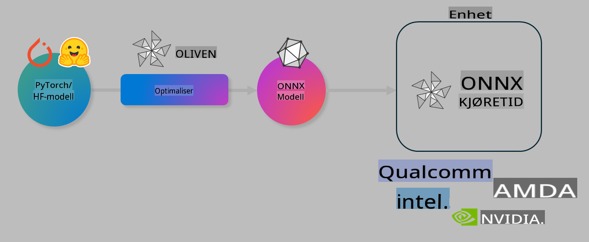

# Lab. Optimaliser AI-modeller for lokal kjøring

## Introduksjon 

> [!IMPORTANT]
> Dette laboratoriet krever en **Nvidia A10 eller A100 GPU** med tilhørende drivere og CUDA toolkit (versjon 12+) installert.

> [!NOTE]
> Dette er et **35-minutters** laboratorium som gir deg en praktisk introduksjon til kjerneprinsippene for optimalisering av modeller for lokal kjøring ved hjelp av OLIVE.

## Læringsmål

Ved slutten av dette laboratoriet vil du kunne bruke OLIVE til å:

- Kvantisere en AI-modell ved hjelp av AWQ-kvantiseringsmetoden.
- Finjustere en AI-modell for en spesifikk oppgave.
- Generere LoRA-adaptere (finjustert modell) for effektiv lokal kjøring på ONNX Runtime.

### Hva er Olive

Olive (*O*NNX *live*) er et verktøy for modelloptimalisering med tilhørende CLI som gjør det mulig å levere modeller for ONNX Runtime +++https://onnxruntime.ai+++ med høy kvalitet og ytelse.



Input til Olive er vanligvis en PyTorch- eller Hugging Face-modell, og output er en optimalisert ONNX-modell som kjøres på en enhet (utplasseringsmål) med ONNX Runtime. Olive optimaliserer modellen for utplasseringsmålets AI-akselerator (NPU, GPU, CPU) levert av en maskinvareleverandør som Qualcomm, AMD, Nvidia eller Intel.

Olive utfører en *arbeidsflyt*, som er en ordnet sekvens av individuelle modelloptimaliseringsoppgaver kalt *passes* - eksempler på passes inkluderer: modellkompresjon, grafopptak, kvantisering, grafoptimalisering. Hver pass har et sett med parametere som kan justeres for å oppnå de beste målene, for eksempel nøyaktighet og forsinkelse, som evalueres av den respektive evaluator. Olive bruker en søkestrategi som benytter en søkealgoritme for å automatisk finjustere hver pass enkeltvis eller flere passes sammen.

#### Fordeler med Olive

- **Reduser frustrasjon og tid** brukt på manuelle forsøk-og-feil-eksperimenter med ulike teknikker for grafoptimalisering, kompresjon og kvantisering. Definer dine kvalitets- og ytelseskrav, og la Olive automatisk finne den beste modellen for deg.
- **40+ innebygde komponenter for modelloptimalisering** som dekker banebrytende teknikker innen kvantisering, kompresjon, grafoptimalisering og finjustering.
- **Enkel CLI** for vanlige modelloptimaliseringsoppgaver. For eksempel: olive quantize, olive auto-opt, olive finetune.
- Innebygd modellpakking og utplassering.
- Støtter generering av modeller for **Multi LoRA-tjenester**.
- Konstruer arbeidsflyter ved hjelp av YAML/JSON for å orkestrere modelloptimaliserings- og utplasseringsoppgaver.
- **Hugging Face** og **Azure AI**-integrasjon.
- Innebygd **cache-mekanisme** for å **spare kostnader**.

## Lab-instruksjoner
> [!NOTE]
> Sørg for at du har klargjort din Azure AI Hub og prosjekt samt konfigurert din A100 beregningsnode i henhold til Lab 1.

### Steg 0: Koble til din Azure AI Compute

Du vil koble til Azure AI Compute ved å bruke fjernfunksjonen i **VS Code.** 

1. Åpne din **VS Code** desktop-applikasjon:
1. Åpne **kommandopaletten** ved å bruke **Shift+Ctrl+P**
1. Søk etter **AzureML - remote: Connect to compute instance in New Window** i kommandopaletten.
1. Følg instruksjonene på skjermen for å koble til Compute. Dette innebærer å velge ditt Azure-abonnement, ressursgruppe, prosjekt og Compute-navn som du satte opp i Lab 1.
1. Når du er koblet til din Azure ML Compute-node, vil dette vises nederst til venstre i Visual Code `><Azure ML: Compute Name`

### Steg 1: Klon dette repoet

I VS Code kan du åpne en ny terminal med **Ctrl+J** og klone dette repoet:

I terminalen skal du se prompten

```
azureuser@computername:~/cloudfiles/code$ 
```
Klon løsningen 

```bash
cd ~/localfiles
git clone https://github.com/microsoft/phi-3cookbook.git
```

### Steg 2: Åpne mappen i VS Code

For å åpne VS Code i riktig mappe, kjør følgende kommando i terminalen, som vil åpne et nytt vindu:

```bash
code phi-3cookbook/code/04.Finetuning/Olive-lab
```

Alternativt kan du åpne mappen ved å velge **File** > **Open Folder**. 

### Steg 3: Avhengigheter

Åpne et terminalvindu i VS Code på din Azure AI Compute-instans (tips: **Ctrl+J**) og kjør følgende kommandoer for å installere avhengighetene:

```bash
conda create -n olive-ai python=3.11 -y
conda activate olive-ai
pip install -r requirements.txt
az extension remove -n azure-cli-ml
az extension add -n ml
```

> [!NOTE]
> Det vil ta ~5 minutter å installere alle avhengighetene.

I dette laboratoriet vil du laste ned og laste opp modeller til Azure AI Model-katalogen. For å få tilgang til modellkatalogen, må du logge inn på Azure ved å bruke:

```bash
az login
```

> [!NOTE]
> Under innlogging vil du bli bedt om å velge ditt abonnement. Sørg for å sette abonnementet til det som er gitt for dette laboratoriet.

### Steg 4: Kjør Olive-kommandoer 

Åpne et terminalvindu i VS Code på din Azure AI Compute-instans (tips: **Ctrl+J**) og sørg for at `olive-ai` conda-miljøet er aktivert:

```bash
conda activate olive-ai
```

Deretter kjør følgende Olive-kommandoer i kommandolinjen.

1. **Inspiser dataene:** I dette eksempelet skal du finjustere Phi-3.5-Mini-modellen slik at den spesialiserer seg på å svare på reiserelaterte spørsmål. Koden nedenfor viser de første postene i datasettet, som er i JSON-linjer-format:
   
    ```bash
    head data/data_sample_travel.jsonl
    ```
1. **Kvantisere modellen:** Før du trener modellen, kvantiserer du den med følgende kommando som bruker en teknikk kalt Active Aware Quantization (AWQ) +++https://arxiv.org/abs/2306.00978+++. AWQ kvantiserer vektene i en modell ved å ta hensyn til aktiveringene som produseres under inferens. Dette betyr at kvantiseringsprosessen tar hensyn til den faktiske datadistribusjonen i aktiveringene, noe som fører til bedre bevaring av modellens nøyaktighet sammenlignet med tradisjonelle vektkvantiseringsmetoder.
    
    ```bash
    olive quantize \
       --model_name_or_path microsoft/Phi-3.5-mini-instruct \
       --trust_remote_code \
       --algorithm awq \
       --output_path models/phi/awq \
       --log_level 1
    ```
    
    Det tar **~8 minutter** å fullføre AWQ-kvantiseringen, som vil **redusere modellstørrelsen fra ~7,5 GB til ~2,5 GB**.
   
   I dette laboratoriet viser vi hvordan du kan bruke modeller fra Hugging Face (for eksempel: `microsoft/Phi-3.5-mini-instruct`). However, Olive also allows you to input models from the Azure AI catalog by updating the `model_name_or_path` argument to an Azure AI asset ID (for example:  `azureml://registries/azureml/models/Phi-3.5-mini-instruct/versions/4`). 

1. **Train the model:** Next, the `olive finetune`-kommandoen finjusterer den kvantiserte modellen. Å kvantisere modellen *før* finjustering i stedet for etterpå gir bedre nøyaktighet, ettersom finjusteringsprosessen gjenoppretter noe av tapet fra kvantiseringen.
    
    ```bash
    olive finetune \
        --method lora \
        --model_name_or_path models/phi/awq \
        --data_files "data/data_sample_travel.jsonl" \
        --data_name "json" \
        --text_template "<|user|>\n{prompt}<|end|>\n<|assistant|>\n{response}<|end|>" \
        --max_steps 100 \
        --output_path ./models/phi/ft \
        --log_level 1
    ```
    
    Det tar **~6 minutter** å fullføre finjusteringen (med 100 steg).

1. **Optimaliser:** Når modellen er trent, kan du optimalisere modellen ved hjelp av Olives `auto-opt` command, which will capture the ONNX graph and automatically perform a number of optimizations to improve the model performance for CPU by compressing the model and doing fusions. It should be noted, that you can also optimize for other devices such as NPU or GPU by just updating the `--device` and `--provider`-argumenter - men for dette laboratoriet vil vi bruke CPU.

    ```bash
    olive auto-opt \
       --model_name_or_path models/phi/ft/model \
       --adapter_path models/phi/ft/adapter \
       --device cpu \
       --provider CPUExecutionProvider \
       --use_ort_genai \
       --output_path models/phi/onnx-ao \
       --log_level 1
    ```
    
    Det tar **~5 minutter** å fullføre optimaliseringen.

### Steg 5: Rask test av modell-inferens

For å teste inferens av modellen, opprett en Python-fil i mappen din kalt **app.py** og kopier inn følgende kode:

```python
import onnxruntime_genai as og
import numpy as np

print("loading model and adapters...", end="", flush=True)
model = og.Model("models/phi/onnx-ao/model")
adapters = og.Adapters(model)
adapters.load("models/phi/onnx-ao/model/adapter_weights.onnx_adapter", "travel")
print("DONE!")

tokenizer = og.Tokenizer(model)
tokenizer_stream = tokenizer.create_stream()

params = og.GeneratorParams(model)
params.set_search_options(max_length=100, past_present_share_buffer=False)
user_input = "what is the best thing to see in chicago"
params.input_ids = tokenizer.encode(f"<|user|>\n{user_input}<|end|>\n<|assistant|>\n")

generator = og.Generator(model, params)

generator.set_active_adapter(adapters, "travel")

print(f"{user_input}")

while not generator.is_done():
    generator.compute_logits()
    generator.generate_next_token()

    new_token = generator.get_next_tokens()[0]
    print(tokenizer_stream.decode(new_token), end='', flush=True)

print("\n")
```

Kjør koden ved å bruke:

```bash
python app.py
```

### Steg 6: Last opp modellen til Azure AI

Ved å laste opp modellen til et Azure AI-modellarkiv, kan du dele modellen med andre medlemmer av utviklingsteamet ditt og håndtere versjonskontroll av modellen. For å laste opp modellen, kjør følgende kommando:

> [!NOTE]
> Oppdater `{}` placeholders with the name of your resource group and Azure AI Project Name. 

To find your resource group `"resourceGroup"og Azure AI Project-navnet, kjør følgende kommando 

```
az ml workspace show
```

Eller ved å gå til +++ai.azure.com+++ og velge **management center** **project** **overview**

Oppdater `{}`-plassholderne med navnet på ressursgruppen og Azure AI-prosjektnavnet ditt.

```bash
az ml model create \
    --name ft-for-travel \
    --version 1 \
    --path ./models/phi/onnx-ao \
    --resource-group {RESOURCE_GROUP_NAME} \
    --workspace-name {PROJECT_NAME}
```
Du kan deretter se den opplastede modellen din og distribuere modellen din på https://ml.azure.com/model/list

**Ansvarsfraskrivelse**:  
Dette dokumentet er oversatt ved hjelp av maskinbaserte AI-oversettingstjenester. Selv om vi bestreber oss på nøyaktighet, vær oppmerksom på at automatiske oversettelser kan inneholde feil eller unøyaktigheter. Det originale dokumentet på dets opprinnelige språk bør anses som den autoritative kilden. For kritisk informasjon anbefales profesjonell menneskelig oversettelse. Vi er ikke ansvarlige for misforståelser eller feiltolkninger som oppstår ved bruk av denne oversettelsen.