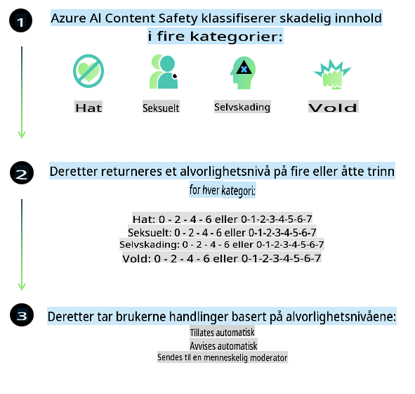

# AI-sikkerhet for Phi-modeller
Phi-familien av modeller er utviklet i samsvar med [Microsoft Responsible AI Standard](https://query.prod.cms.rt.microsoft.com/cms/api/am/binary/RE5cmFl), som er et sett med krav på tvers av selskapet basert på følgende seks prinsipper: ansvarlighet, åpenhet, rettferdighet, pålitelighet og sikkerhet, personvern og sikkerhet, og inkludering. Disse prinsippene utgjør [Microsofts prinsipper for ansvarlig AI](https://www.microsoft.com/ai/responsible-ai). 

Som med tidligere Phi-modeller ble en flerfasettert sikkerhetsevaluering og sikkerhetstrening etter modellutvikling benyttet, med ytterligere tiltak for å håndtere de flerspråklige egenskapene i denne utgivelsen. Vår tilnærming til sikkerhetstrening og evaluering, inkludert testing på tvers av flere språk og risikokategorier, er beskrevet i [Phi Safety Post-Training Paper](https://arxiv.org/abs/2407.13833). Selv om Phi-modellene drar nytte av denne tilnærmingen, bør utviklere anvende beste praksis for ansvarlig AI, inkludert kartlegging, måling og håndtering av risiko knyttet til deres spesifikke bruksområde og kulturelle og språklige kontekst.

## Beste praksis

Som andre modeller kan Phi-familien av modeller potensielt oppføre seg på måter som er urettferdige, upålitelige eller støtende.

Noen av begrensningene i SLM og LLM som du bør være oppmerksom på inkluderer:

- **Tjenestekvalitet:** Phi-modellene er hovedsakelig trent på engelsk tekst. Andre språk enn engelsk vil oppleve dårligere ytelse. Engelske dialekter med mindre representasjon i treningsdataene kan oppleve dårligere ytelse enn standard amerikansk engelsk.
- **Representasjonsskader og forsterkning av stereotypier:** Modellene kan over- eller underrepresentere grupper av mennesker, utelate representasjon av enkelte grupper eller forsterke nedsettende eller negative stereotypier. Til tross for sikkerhetstrening etter modellutvikling kan disse begrensningene fortsatt være til stede på grunn av ulik representasjon av ulike grupper eller forekomsten av eksempler på negative stereotypier i treningsdataene som reflekterer mønstre og skjevheter i samfunnet.
- **Upassende eller støtende innhold:** Modellene kan generere andre typer upassende eller støtende innhold, noe som kan gjøre dem uegnet for bruk i sensitive kontekster uten ytterligere tiltak som er spesifikke for bruksområdet.
- **Informasjonskvalitet:** Språkmodeller kan generere meningsløst innhold eller fabrikkere innhold som kan virke troverdig, men som er unøyaktig eller utdatert.
- **Begrenset omfang for kode:** Mesteparten av treningsdataene for Phi-3 er basert på Python og bruker vanlige pakker som "typing, math, random, collections, datetime, itertools". Hvis modellen genererer Python-skript som bruker andre pakker eller skript på andre språk, anbefaler vi sterkt at brukere manuelt verifiserer all API-bruk.

Utviklere bør anvende beste praksis for ansvarlig AI og er ansvarlige for å sikre at et spesifikt bruksområde overholder relevante lover og forskrifter (f.eks. personvern, handel osv.).

## Betraktninger rundt ansvarlig AI

Som andre språkmodeller kan Phi-seriens modeller potensielt oppføre seg på måter som er urettferdige, upålitelige eller støtende. Noen av begrensningene du bør være oppmerksom på inkluderer:

**Tjenestekvalitet:** Phi-modellene er hovedsakelig trent på engelsk tekst. Andre språk enn engelsk vil oppleve dårligere ytelse. Engelske dialekter med mindre representasjon i treningsdataene kan oppleve dårligere ytelse enn standard amerikansk engelsk.

**Representasjonsskader og forsterkning av stereotypier:** Modellene kan over- eller underrepresentere grupper av mennesker, utelate representasjon av enkelte grupper eller forsterke nedsettende eller negative stereotypier. Til tross for sikkerhetstrening etter modellutvikling kan disse begrensningene fortsatt være til stede på grunn av ulik representasjon av ulike grupper eller forekomsten av eksempler på negative stereotypier i treningsdataene som reflekterer mønstre og skjevheter i samfunnet.

**Upassende eller støtende innhold:** Modellene kan generere andre typer upassende eller støtende innhold, noe som kan gjøre dem uegnet for bruk i sensitive kontekster uten ytterligere tiltak som er spesifikke for bruksområdet.
**Informasjonskvalitet:** Språkmodeller kan generere meningsløst innhold eller fabrikkere innhold som kan virke troverdig, men som er unøyaktig eller utdatert.

**Begrenset omfang for kode:** Mesteparten av treningsdataene for Phi-3 er basert på Python og bruker vanlige pakker som "typing, math, random, collections, datetime, itertools". Hvis modellen genererer Python-skript som bruker andre pakker eller skript på andre språk, anbefaler vi sterkt at brukere manuelt verifiserer all API-bruk.

Utviklere bør anvende beste praksis for ansvarlig AI og er ansvarlige for å sikre at et spesifikt bruksområde overholder relevante lover og forskrifter (f.eks. personvern, handel osv.). Viktige områder å vurdere inkluderer:

**Fordeling:** Modellene kan være uegnet for scenarier som kan ha betydelig innvirkning på juridisk status eller fordeling av ressurser eller livsmuligheter (f.eks. bolig, ansettelse, kreditt osv.) uten ytterligere vurderinger og avbiaseringsteknikker.

**Høyrisiko-scenarier:** Utviklere bør vurdere modellens egnethet i høyrisiko-scenarier der urettferdige, upålitelige eller støtende resultater kan være svært kostbare eller føre til skade. Dette inkluderer rådgivning i sensitive eller ekspertområder der nøyaktighet og pålitelighet er avgjørende (f.eks. juridisk eller medisinsk rådgivning). Ytterligere sikkerhetstiltak bør implementeres på applikasjonsnivå i henhold til distribusjonskonteksten.

**Feilinformasjon:** Modellene kan produsere unøyaktig informasjon. Utviklere bør følge beste praksis for åpenhet og informere sluttbrukere om at de interagerer med et AI-system. På applikasjonsnivå kan utviklere bygge tilbakemeldingsmekanismer og arbeidsflyter for å forankre svar i bruksområdespesifikk, kontekstuell informasjon, en teknikk kjent som Retrieval Augmented Generation (RAG).

**Generering av skadelig innhold:** Utviklere bør vurdere resultatene i lys av konteksten og bruke tilgjengelige sikkerhetsklassifiserere eller tilpassede løsninger som passer for deres bruksområde.

**Misbruk:** Andre former for misbruk som svindel, spam eller produksjon av skadelig programvare kan være mulig, og utviklere bør sikre at deres applikasjoner ikke bryter gjeldende lover og forskrifter.

### Finjustering og AI-innholdssikkerhet

Etter finjustering av en modell anbefaler vi sterkt å benytte [Azure AI Content Safety](https://learn.microsoft.com/azure/ai-services/content-safety/overview) for å overvåke innhold generert av modellene, identifisere og blokkere potensielle risikoer, trusler og kvalitetsproblemer.

[Azure AI Content Safety](https://learn.microsoft.com/azure/ai-services/content-safety/overview) støtter både tekst- og bildeinnhold. Det kan distribueres i skyen, frakoblede containere og på edge/innebygde enheter.

## Oversikt over Azure AI Content Safety

Azure AI Content Safety er ikke en universalløsning; den kan tilpasses for å samsvare med virksomheters spesifikke retningslinjer. I tillegg gjør dens flerspråklige modeller det mulig å forstå flere språk samtidig.

- **Azure AI Content Safety**
- **Microsoft Developer**
- **5 videoer**

Azure AI Content Safety-tjenesten oppdager skadelig bruker- og AI-generert innhold i applikasjoner og tjenester. Den inkluderer tekst- og bilde-API-er som gjør det mulig å oppdage skadelig eller upassende materiale.

[AI Content Safety Playlist](https://www.youtube.com/playlist?list=PLlrxD0HtieHjaQ9bJjyp1T7FeCbmVcPkQ)

**Ansvarsfraskrivelse**:  
Dette dokumentet er oversatt ved bruk av maskinbaserte AI-oversettingstjenester. Selv om vi bestreber oss på nøyaktighet, vær oppmerksom på at automatiserte oversettelser kan inneholde feil eller unøyaktigheter. Det originale dokumentet på dets opprinnelige språk bør anses som den autoritative kilden. For kritisk informasjon anbefales profesjonell menneskelig oversettelse. Vi er ikke ansvarlige for eventuelle misforståelser eller feiltolkninger som oppstår ved bruk av denne oversettelsen.