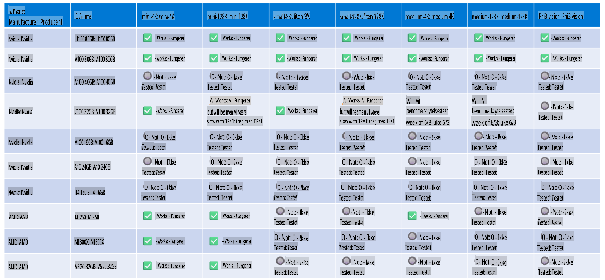

# Phi-maskinvarestøtte

Microsoft Phi er optimalisert for ONNX Runtime og støtter Windows DirectML. Det fungerer godt på ulike maskinvaretyper, inkludert GPU-er, CPU-er og til og med mobile enheter.

## Maskinvareenheter
Spesifikt støttes følgende maskinvare:

- GPU SKU: RTX 4090 (DirectML)
- GPU SKU: 1 A100 80GB (CUDA)
- CPU SKU: Standard F64s v2 (64 vCPU-er, 128 GiB minne)

## Mobile SKU

- Android - Samsung Galaxy S21
- Apple iPhone 14 eller nyere med A16/A17-prosessor

## Phi-maskinvarespesifikasjon

- Minimumskrav til konfigurasjon:
- Windows: DirectX 12-kompatibel GPU og minst 4 GB kombinert RAM

CUDA: NVIDIA GPU med Compute Capability >= 7.02



## Kjøre onnxruntime på flere GPU-er

De tilgjengelige Phi ONNX-modellene støtter for øyeblikket kun 1 GPU. Det er mulig å støtte flere GPU-er for Phi-modeller, men ORT med 2 GPU-er garanterer ikke høyere gjennomstrømning sammenlignet med 2 separate ORT-installasjoner. Se [ONNX Runtime](https://onnxruntime.ai/) for de nyeste oppdateringene.

På [Build 2024 annonserte GenAI ONNX-teamet](https://youtu.be/WLW4SE8M9i8?si=EtG04UwDvcjunyfC) at de hadde aktivert multi-instans i stedet for multi-GPU for Phi-modeller.

Foreløpig lar dette deg kjøre én onnxruntime- eller onnxruntime-genai-instans ved hjelp av CUDA_VISIBLE_DEVICES-miljøvariabelen som vist her.

```Python
CUDA_VISIBLE_DEVICES=0 python infer.py
CUDA_VISIBLE_DEVICES=1 python infer.py
```

Utforsk gjerne Phi videre i [Azure AI Foundry](https://ai.azure.com)

**Ansvarsfraskrivelse**:  
Dette dokumentet er oversatt ved hjelp av maskinbaserte AI-oversettelsestjenester. Selv om vi bestreber oss på nøyaktighet, vær oppmerksom på at automatiserte oversettelser kan inneholde feil eller unøyaktigheter. Det originale dokumentet på dets opprinnelige språk bør betraktes som den autoritative kilden. For kritisk informasjon anbefales profesjonell menneskelig oversettelse. Vi er ikke ansvarlige for eventuelle misforståelser eller feiltolkninger som oppstår ved bruk av denne oversettelsen.