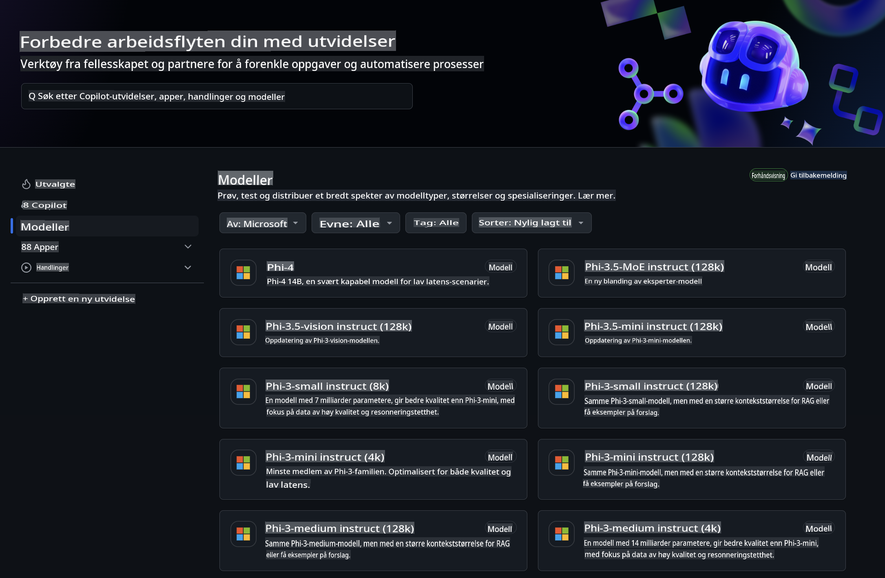
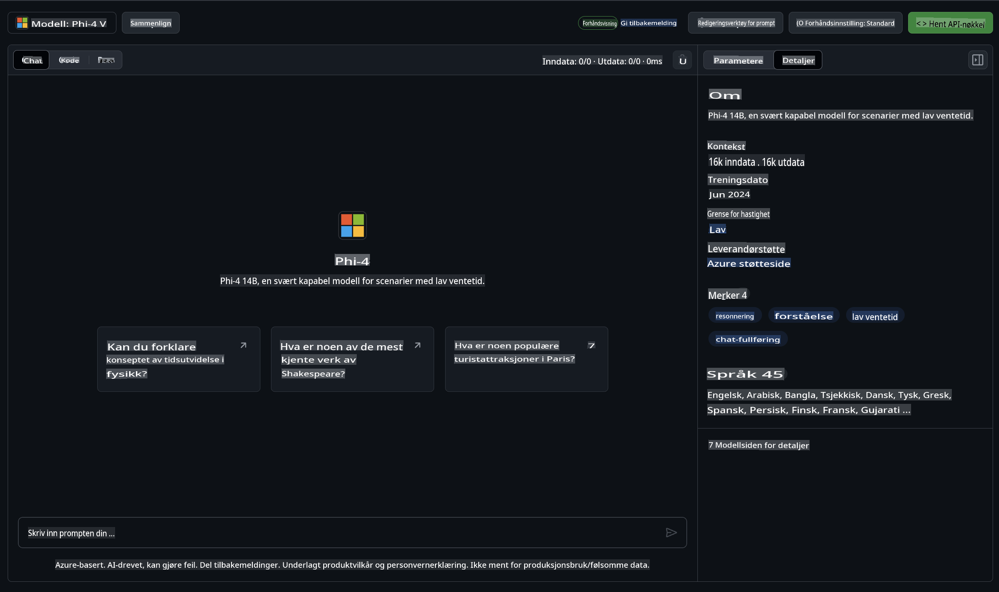
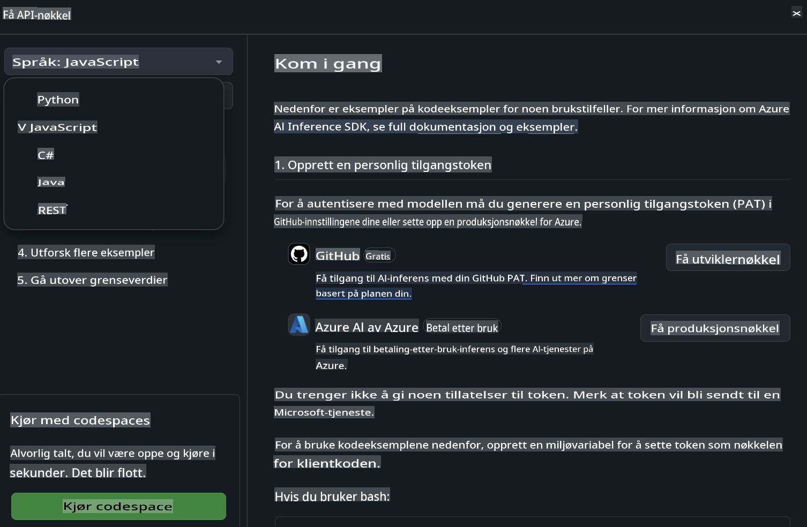
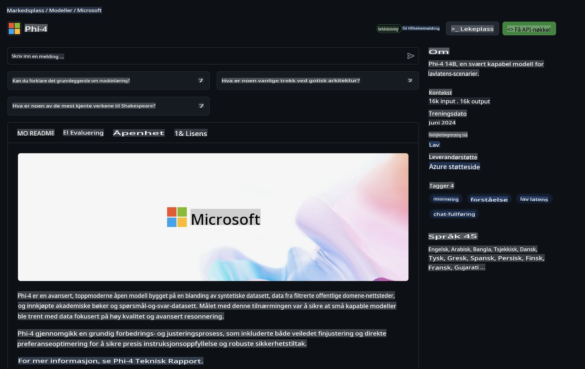

## Phi-familien i GitHub-modeller

Velkommen til [GitHub-modeller](https://github.com/marketplace/models)! Vi har alt klart for deg til å utforske AI-modeller som er vert på Azure AI.



For mer informasjon om modellene som er tilgjengelige på GitHub-modeller, sjekk ut [GitHub Model Marketplace](https://github.com/marketplace/models).

## Tilgjengelige modeller

Hver modell har en dedikert playground og eksempelkode.



### Phi-familien i GitHub Model Catalog

- [Phi-4](https://github.com/marketplace/models/azureml/Phi-4)

- [Phi-3.5-MoE instruct (128k)](https://github.com/marketplace/models/azureml/Phi-3-5-MoE-instruct)

- [Phi-3.5-vision instruct (128k)](https://github.com/marketplace/models/azureml/Phi-3-5-vision-instruct)

- [Phi-3.5-mini instruct (128k)](https://github.com/marketplace/models/azureml/Phi-3-5-mini-instruct)

- [Phi-3-Medium-128k-Instruct](https://github.com/marketplace/models/azureml/Phi-3-medium-128k-instruct)

- [Phi-3-medium-4k-instruct](https://github.com/marketplace/models/azureml/Phi-3-medium-4k-instruct)

- [Phi-3-mini-128k-instruct](https://github.com/marketplace/models/azureml/Phi-3-mini-128k-instruct)

- [Phi-3-mini-4k-instruct](https://github.com/marketplace/models/azureml/Phi-3-mini-4k-instruct)

- [Phi-3-small-128k-instruct](https://github.com/marketplace/models/azureml/Phi-3-small-128k-instruct)

- [Phi-3-small-8k-instruct](https://github.com/marketplace/models/azureml/Phi-3-small-8k-instruct)

## Kom i gang

Det finnes noen grunnleggende eksempler som er klare til å kjøres. Du finner dem i samples-katalogen. Hvis du vil hoppe rett til favorittspråket ditt, kan du finne eksemplene på følgende språk:

- Python
- JavaScript
- C#
- Java
- cURL

Det finnes også et dedikert Codespaces-miljø for å kjøre eksempler og modeller.



## Eksempelkode

Nedenfor finner du eksempelutdrag for noen brukstilfeller. For mer informasjon om Azure AI Inference SDK, se full dokumentasjon og eksempler.

## Oppsett

1. Opprett en personlig tilgangsnøkkel  
Du trenger ikke å gi noen spesifikke tillatelser til nøkkelen. Merk at nøkkelen vil bli sendt til en Microsoft-tjeneste.

For å bruke kodeeksemplene nedenfor, opprett en miljøvariabel for å sette nøkkelen som klientkoden bruker.

Hvis du bruker bash:  
```
export GITHUB_TOKEN="<your-github-token-goes-here>"
```  
Hvis du bruker PowerShell:  

```
$Env:GITHUB_TOKEN="<your-github-token-goes-here>"
```  

Hvis du bruker Windows-kommandoprompt:  

```
set GITHUB_TOKEN=<your-github-token-goes-here>
```  

## Python-eksempel

### Installer avhengigheter  
Installer Azure AI Inference SDK med pip (Krever: Python >=3.8):  

```
pip install azure-ai-inference
```  

### Kjør et grunnleggende kodeeksempel  

Dette eksempelet viser en grunnleggende forespørsel til chat completion API. Det bruker GitHub AI-modellens inference-endepunkt og din GitHub-token. Forespørselen er synkron.  

```python
import os
from azure.ai.inference import ChatCompletionsClient
from azure.ai.inference.models import SystemMessage, UserMessage
from azure.core.credentials import AzureKeyCredential

endpoint = "https://models.inference.ai.azure.com"
model_name = "Phi-4"
token = os.environ["GITHUB_TOKEN"]

client = ChatCompletionsClient(
    endpoint=endpoint,
    credential=AzureKeyCredential(token),
)

response = client.complete(
    messages=[
        UserMessage(content="I have $20,000 in my savings account, where I receive a 4% profit per year and payments twice a year. Can you please tell me how long it will take for me to become a millionaire? Also, can you please explain the math step by step as if you were explaining it to an uneducated person?"),
    ],
    temperature=0.4,
    top_p=1.0,
    max_tokens=2048,
    model=model_name
)

print(response.choices[0].message.content)
```  

### Kjør en samtale med flere omganger  

Dette eksempelet viser en samtale med flere omganger med chat completion API. Når du bruker modellen til en chat-applikasjon, må du administrere historikken for samtalen og sende de siste meldingene til modellen.  

```
import os
from azure.ai.inference import ChatCompletionsClient
from azure.ai.inference.models import AssistantMessage, SystemMessage, UserMessage
from azure.core.credentials import AzureKeyCredential

token = os.environ["GITHUB_TOKEN"]
endpoint = "https://models.inference.ai.azure.com"
# Replace Model_Name
model_name = "Phi-4"

client = ChatCompletionsClient(
    endpoint=endpoint,
    credential=AzureKeyCredential(token),
)

messages = [
    SystemMessage(content="You are a helpful assistant."),
    UserMessage(content="What is the capital of France?"),
    AssistantMessage(content="The capital of France is Paris."),
    UserMessage(content="What about Spain?"),
]

response = client.complete(messages=messages, model=model_name)

print(response.choices[0].message.content)
```  

### Strømme utdata  

For en bedre brukeropplevelse kan du strømme responsen fra modellen slik at den første tokenen vises tidlig og du unngår å vente på lange svar.  

```
import os
from azure.ai.inference import ChatCompletionsClient
from azure.ai.inference.models import SystemMessage, UserMessage
from azure.core.credentials import AzureKeyCredential

token = os.environ["GITHUB_TOKEN"]
endpoint = "https://models.inference.ai.azure.com"
# Replace Model_Name
model_name = "Phi-4"

client = ChatCompletionsClient(
    endpoint=endpoint,
    credential=AzureKeyCredential(token),
)

response = client.complete(
    stream=True,
    messages=[
        SystemMessage(content="You are a helpful assistant."),
        UserMessage(content="Give me 5 good reasons why I should exercise every day."),
    ],
    model=model_name,
)

for update in response:
    if update.choices:
        print(update.choices[0].delta.content or "", end="")

client.close()
```  

## GRATIS bruk og begrensninger for GitHub-modeller  



[Begrensningene for playground og gratis API-bruk](https://docs.github.com/en/github-models/prototyping-with-ai-models#rate-limits) er ment for å hjelpe deg med å eksperimentere med modeller og prototype AI-applikasjonen din. For bruk utover disse begrensningene, og for å skalere applikasjonen din, må du skaffe ressurser fra en Azure-konto og autentisere derfra i stedet for med din GitHub personlige tilgangsnøkkel. Du trenger ikke å endre noe annet i koden din. Bruk denne lenken for å lære hvordan du kan gå utover gratisnivået i Azure AI.

### Avsløringer  

Husk at når du interagerer med en modell, eksperimenterer du med AI, så feil i innholdet kan forekomme.  

Funksjonen er underlagt ulike begrensninger (inkludert forespørsler per minutt, forespørsler per dag, tokens per forespørsel og samtidige forespørsler) og er ikke designet for produksjonsbruk.  

GitHub-modeller bruker Azure AI Content Safety. Disse filtrene kan ikke deaktiveres som en del av GitHub Models-opplevelsen. Hvis du velger å bruke modeller gjennom en betalt tjeneste, kan du konfigurere innholdsfiltrene dine slik at de oppfyller dine krav.  

Denne tjenesten er underlagt GitHubs vilkår for forhåndsutgivelse.  

**Ansvarsfraskrivelse**:  
Dette dokumentet er oversatt ved hjelp av maskinbaserte AI-oversettelsestjenester. Selv om vi tilstreber nøyaktighet, vær oppmerksom på at automatiserte oversettelser kan inneholde feil eller unøyaktigheter. Det originale dokumentet på sitt opprinnelige språk bør betraktes som den autoritative kilden. For kritisk informasjon anbefales profesjonell menneskelig oversettelse. Vi er ikke ansvarlige for misforståelser eller feiltolkninger som oppstår ved bruk av denne oversettelsen.