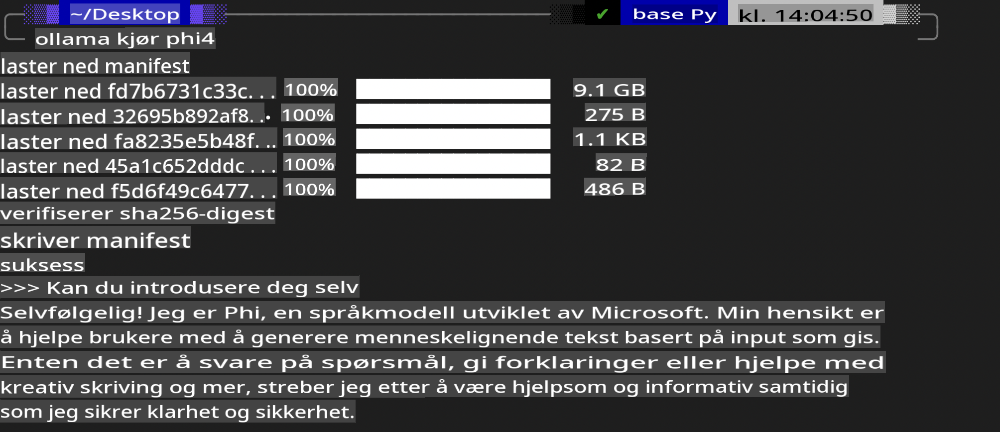
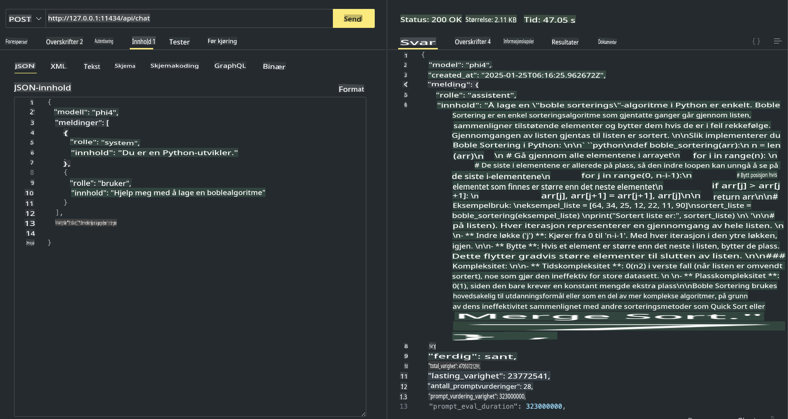

## Phi-familien i Ollama

[Ollama](https://ollama.com) gjør det enklere for flere å direkte ta i bruk åpne LLM- eller SLM-modeller gjennom enkle skript, og lar deg også bygge API-er for å støtte lokale Copilot-applikasjoner.

## **1. Installering**

Ollama fungerer på Windows, macOS og Linux. Du kan installere Ollama via denne lenken ([https://ollama.com/download](https://ollama.com/download)). Etter vellykket installasjon kan du bruke Ollama-skriptet direkte i terminalen for å kjøre Phi-3. Du finner alle [tilgjengelige biblioteker i Ollama](https://ollama.com/library). Hvis du åpner dette repositoriet i en Codespace, vil Ollama allerede være installert.

```bash

ollama run phi4

```

> [!NOTE]
> Modellen vil lastes ned første gang du kjører den. Du kan også spesifisere den nedlastede Phi-4-modellen direkte. Vi bruker WSL som eksempel for å kjøre kommandoen. Når modellen er lastet ned, kan du begynne å bruke terminalen for interaksjon.



## **2. Kalle Phi-4 API fra Ollama**

Hvis du ønsker å bruke Phi-4 API-et generert av Ollama, kan du starte Ollama-serveren med følgende kommando i terminalen.

```bash

ollama serve

```

> [!NOTE]
> Hvis du bruker macOS eller Linux, kan det hende du får følgende feil **"Error: listen tcp 127.0.0.1:11434: bind: address already in use"** når du kjører kommandoen. Denne feilen oppstår vanligvis fordi serveren allerede kjører. Du kan enten ignorere feilen eller stoppe og starte Ollama på nytt:

**macOS**

```bash

brew services restart ollama

```

**Linux**

```bash

sudo systemctl stop ollama

```

Ollama støtter to API-er: generate og chat. Du kan velge modellens API basert på dine behov ved å sende forespørsler til den lokale tjenesten som kjører på port 11434.

**Chat**

```bash

curl http://127.0.0.1:11434/api/chat -d '{
  "model": "phi3",
  "messages": [
    {
      "role": "system",
      "content": "Your are a python developer."
    },
    {
      "role": "user",
      "content": "Help me generate a bubble algorithm"
    }
  ],
  "stream": false
  
}'

This is the result in Postman



## Additional Resources

Check the list of available models in Ollama in [their library](https://ollama.com/library).

Pull your model from the Ollama server using this command

```bash
ollama pull phi4
```

Run the model using this command

```bash
ollama run phi4
```

***Note:*** Visit this link [https://github.com/ollama/ollama/blob/main/docs/api.md](https://github.com/ollama/ollama/blob/main/docs/api.md) to learn more

## Calling Ollama from Python

You can use `requests` or `urllib3` to make requests to the local server endpoints used above. However, a popular way to use Ollama in Python is via the [openai](https://pypi.org/project/openai/) SDK, since Ollama provides OpenAI-compatible server endpoints as well.

Here is an example for phi3-mini:

```python
import openai

client = openai.OpenAI(
    base_url="http://localhost:11434/v1",
    api_key="nokeyneeded",
)

response = client.chat.completions.create(
    model="phi4",
    temperature=0.7,
    n=1,
    messages=[
        {"role": "system", "content": "Du er en hjelpsom assistent."},
        {"role": "user", "content": "Skriv et haiku om en sulten katt"},
    ],
)

print("Svar:")
print(response.choices[0].message.content)
```

## Calling Ollama from JavaScript 

```javascript
// Eksempel på oppsummering av en fil med Phi-4
script({
    model: "ollama:phi4",
    title: "Oppsummer med Phi-4",
    system: ["system"],
})

// Eksempel på oppsummering
const file = def("FILE", env.files)
$`Oppsummer ${file} i ett avsnitt.`
```

## Calling Ollama from C#

Create a new C# Console application and add the following NuGet package:

```bash
dotnet add package Microsoft.SemanticKernel --version 1.34.0
```

Then replace this code in the `Program.cs` file

```csharp
using Microsoft.SemanticKernel;
using Microsoft.SemanticKernel.ChatCompletion;

// legg til chat completion-tjeneste ved bruk av Ollama-serverens lokale endepunkt
#pragma warning disable SKEXP0001, SKEXP0003, SKEXP0010, SKEXP0011, SKEXP0050, SKEXP0052
builder.AddOpenAIChatCompletion(
    modelId: "phi4",
    endpoint: new Uri("http://localhost:11434/"),
    apiKey: "non required");

// send en enkel prompt til chat-tjenesten
string prompt = "Fortell en vits om kattunger";
var response = await kernel.InvokePromptAsync(prompt);
Console.WriteLine(response.GetValue<string>());
```

Run the app with the command:

```bash
dotnet run

**Ansvarsfraskrivelse**:  
Dette dokumentet er oversatt ved hjelp av maskinbaserte AI-oversettelsestjenester. Selv om vi bestreber oss på nøyaktighet, vær oppmerksom på at automatiserte oversettelser kan inneholde feil eller unøyaktigheter. Det originale dokumentet på sitt opprinnelige språk bør anses som den autoritative kilden. For kritisk informasjon anbefales profesjonell menneskelig oversettelse. Vi er ikke ansvarlige for misforståelser eller feiltolkninger som oppstår ved bruk av denne oversettelsen.