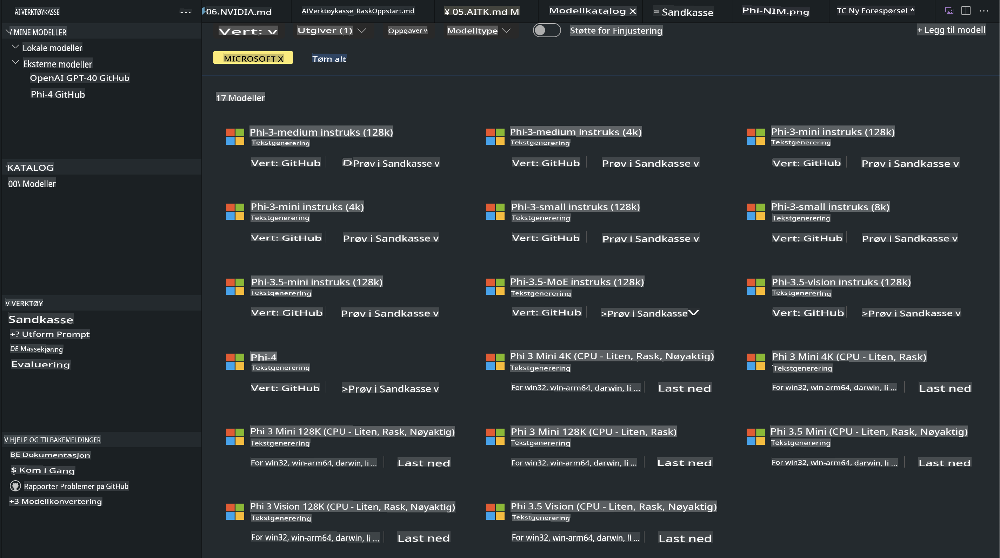
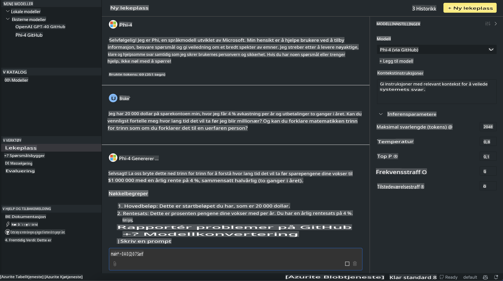

# Phi-familien i AITK

[AI Toolkit for VS Code](https://marketplace.visualstudio.com/items?itemName=ms-windows-ai-studio.windows-ai-studio) forenkler utviklingen av generative AI-applikasjoner ved å samle de nyeste AI-verktøyene og modellene fra Azure AI Foundry Catalog og andre kataloger som Hugging Face. Du kan bla gjennom AI-modellkatalogen drevet av GitHub Models og Azure AI Foundry Model Catalogs, laste dem ned lokalt eller eksternt, finjustere, teste og bruke dem i applikasjonen din.

AI Toolkit Preview kjører lokalt. Lokal inferens eller finjustering avhenger av modellen du velger, og du kan trenge en GPU som NVIDIA CUDA GPU. Du kan også kjøre GitHub Models direkte med AITK.

## Kom i gang

[Lær mer om hvordan du installerer Windows Subsystem for Linux](https://learn.microsoft.com/windows/wsl/install?WT.mc_id=aiml-137032-kinfeylo)

og [hvordan du endrer standard distribusjon](https://learn.microsoft.com/windows/wsl/install#change-the-default-linux-distribution-installed).

[AI Toolkit GitHub Repo](https://github.com/microsoft/vscode-ai-toolkit/)

- Windows, Linux, macOS

- For å finjustere både på Windows og Linux trenger du en Nvidia GPU. I tillegg krever **Windows** subsystem for Linux med Ubuntu-distribusjon 18.4 eller nyere. [Lær mer om hvordan du installerer Windows Subsystem for Linux](https://learn.microsoft.com/windows/wsl/install) og [hvordan du endrer standard distribusjon](https://learn.microsoft.com/windows/wsl/install#change-the-default-linux-distribution-installed).

### Installer AI Toolkit

AI Toolkit leveres som en [Visual Studio Code Extension](https://code.visualstudio.com/docs/setup/additional-components#_vs-code-extensions), så du må installere [VS Code](https://code.visualstudio.com/docs/setup/windows?WT.mc_id=aiml-137032-kinfeylo) først og laste ned AI Toolkit fra [VS Marketplace](https://marketplace.visualstudio.com/items?itemName=ms-windows-ai-studio.windows-ai-studio).  
[AI Toolkit er tilgjengelig i Visual Studio Marketplace](https://marketplace.visualstudio.com/items?itemName=ms-windows-ai-studio.windows-ai-studio) og kan installeres som enhver annen VS Code-utvidelse.

Hvis du ikke er kjent med hvordan man installerer VS Code-utvidelser, følg disse trinnene:

### Logg inn

1. Velg **Extensions** i Aktivitetsfeltet i VS Code  
2. Skriv "AI Toolkit" i søkefeltet for utvidelser  
3. Velg "AI Toolkit for Visual Studio Code"  
4. Velg **Install**

Nå er du klar til å bruke utvidelsen!

Du vil bli bedt om å logge inn på GitHub, så klikk "Tillat" for å fortsette. Du blir omdirigert til GitHubs innloggingsside.

Logg inn og følg prosessens trinn. Etter vellykket fullføring blir du omdirigert tilbake til VS Code.

Når utvidelsen er installert, vil du se AI Toolkit-ikonet i Aktivitetsfeltet.

La oss utforske de tilgjengelige funksjonene!

### Tilgjengelige funksjoner

Hovedsidepanelet i AI Toolkit er organisert i  

- **Models**
- **Resources**
- **Playground**  
- **Fine-tuning**
- **Evaluation**

Disse er tilgjengelige i seksjonen Resources. For å komme i gang, velg **Model Catalog**.

### Last ned en modell fra katalogen

Når du starter AI Toolkit fra VS Code-sidepanelet, kan du velge mellom følgende alternativer:



- Finn en støttet modell fra **Model Catalog** og last den ned lokalt  
- Test modellens inferens i **Model Playground**  
- Finjuster modellen lokalt eller eksternt i **Model Fine-tuning**  
- Distribuer finjusterte modeller til skyen via kommandopalletten for AI Toolkit  
- Evaluer modeller  

> [!NOTE]
>
> **GPU vs CPU**
>
> Du vil legge merke til at modellkortene viser modellstørrelse, plattform og akseleratortype (CPU, GPU). For optimal ytelse på **Windows-enheter som har minst én GPU**, velg modellversjoner som kun støtter Windows.
>
> Dette sikrer at du har en modell optimalisert for DirectML-akseleratoren.
>
> Modellnavnene er i formatet
>
> - `{model_name}-{accelerator}-{quantization}-{format}`.
>
> For å sjekke om du har en GPU på din Windows-enhet, åpne **Task Manager** og velg deretter fanen **Performance**. Hvis du har GPU-er, vil de være oppført under navn som "GPU 0" eller "GPU 1".

### Kjør modellen i playground

Når alle parametere er satt, klikk på **Generate Project**.

Når modellen din er lastet ned, velg **Load in Playground** på modellkortet i katalogen:

- Start nedlasting av modellen  
- Installer alle nødvendige forutsetninger og avhengigheter  
- Opprett en VS Code-arbeidsplass  



### Bruk REST API i applikasjonen din

AI Toolkit kommer med en lokal REST API-webserver **på port 5272** som bruker [OpenAI chat completions format](https://platform.openai.com/docs/api-reference/chat/create).

Dette gjør det mulig å teste applikasjonen din lokalt uten å være avhengig av en skybasert AI-modelltjeneste. For eksempel viser følgende JSON-fil hvordan du konfigurerer forespørselens kropp:

```json
{
    "model": "Phi-4",
    "messages": [
        {
            "role": "user",
            "content": "what is the golden ratio?"
        }
    ],
    "temperature": 0.7,
    "top_p": 1,
    "top_k": 10,
    "max_tokens": 100,
    "stream": true
}
```

Du kan teste REST API ved å bruke (for eksempel) [Postman](https://www.postman.com/) eller verktøyet CURL (Client URL):

```bash
curl -vX POST http://127.0.0.1:5272/v1/chat/completions -H 'Content-Type: application/json' -d @body.json
```

### Bruke OpenAI-klientbiblioteket for Python

```python
from openai import OpenAI

client = OpenAI(
    base_url="http://127.0.0.1:5272/v1/", 
    api_key="x" # required for the API but not used
)

chat_completion = client.chat.completions.create(
    messages=[
        {
            "role": "user",
            "content": "what is the golden ratio?",
        }
    ],
    model="Phi-4",
)

print(chat_completion.choices[0].message.content)
```

### Bruke Azure OpenAI-klientbiblioteket for .NET

Legg til [Azure OpenAI-klientbiblioteket for .NET](https://www.nuget.org/packages/Azure.AI.OpenAI/) i prosjektet ditt ved hjelp av NuGet:

```bash
dotnet add {project_name} package Azure.AI.OpenAI --version 1.0.0-beta.17
```

Legg til en C#-fil kalt **OverridePolicy.cs** i prosjektet ditt og lim inn følgende kode:

```csharp
// OverridePolicy.cs
using Azure.Core.Pipeline;
using Azure.Core;

internal partial class OverrideRequestUriPolicy(Uri overrideUri)
    : HttpPipelineSynchronousPolicy
{
    private readonly Uri _overrideUri = overrideUri;

    public override void OnSendingRequest(HttpMessage message)
    {
        message.Request.Uri.Reset(_overrideUri);
    }
}
```

Deretter limer du inn følgende kode i **Program.cs**-filen din:

```csharp
// Program.cs
using Azure.AI.OpenAI;

Uri localhostUri = new("http://localhost:5272/v1/chat/completions");

OpenAIClientOptions clientOptions = new();
clientOptions.AddPolicy(
    new OverrideRequestUriPolicy(localhostUri),
    Azure.Core.HttpPipelinePosition.BeforeTransport);
OpenAIClient client = new(openAIApiKey: "unused", clientOptions);

ChatCompletionsOptions options = new()
{
    DeploymentName = "Phi-4",
    Messages =
    {
        new ChatRequestSystemMessage("You are a helpful assistant. Be brief and succinct."),
        new ChatRequestUserMessage("What is the golden ratio?"),
    }
};

StreamingResponse<StreamingChatCompletionsUpdate> streamingChatResponse
    = await client.GetChatCompletionsStreamingAsync(options);

await foreach (StreamingChatCompletionsUpdate chatChunk in streamingChatResponse)
{
    Console.Write(chatChunk.ContentUpdate);
}
```

## Finjustering med AI Toolkit

- Kom i gang med modelloppdagelse og playground.  
- Modellfinjustering og inferens ved bruk av lokale ressurser.  
- Fjernfinjustering og inferens ved bruk av Azure-ressurser.  

[Finjustering med AI Toolkit](../../03.FineTuning/Finetuning_VSCodeaitoolkit.md)

## AI Toolkit Q&A-ressurser

Vennligst se vår [Q&A-side](https://github.com/microsoft/vscode-ai-toolkit/blob/main/archive/QA.md) for de vanligste problemene og løsningene.

**Ansvarsfraskrivelse**:  
Dette dokumentet er oversatt ved hjelp av maskinbaserte AI-oversettelsestjenester. Selv om vi streber etter nøyaktighet, vær oppmerksom på at automatiserte oversettelser kan inneholde feil eller unøyaktigheter. Det originale dokumentet på dets opprinnelige språk bør anses som den autoritative kilden. For kritisk informasjon anbefales profesjonell menneskelig oversettelse. Vi er ikke ansvarlige for eventuelle misforståelser eller feiltolkninger som oppstår ved bruk av denne oversettelsen.