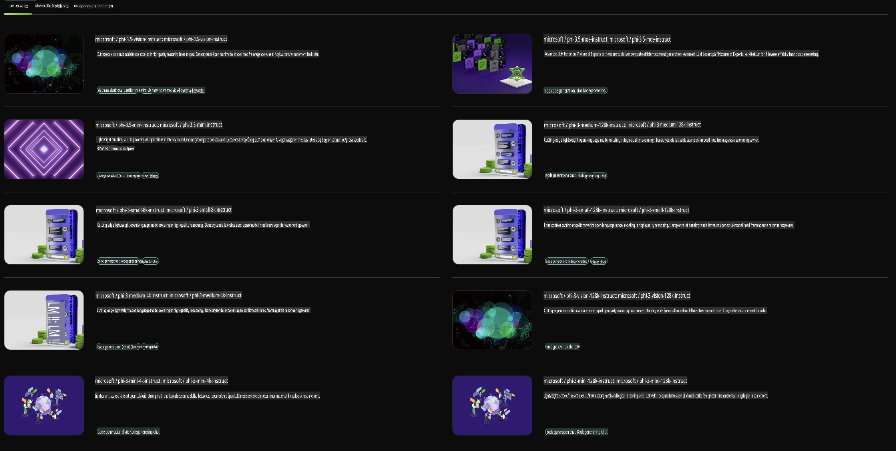

## Phi-familien i NVIDIA NIM

NVIDIA NIM er et sett med brukervennlige mikrotjenester designet for å akselerere utrullingen av generative AI-modeller på tvers av skyen, datasentre og arbeidsstasjoner. NIM-ene er kategorisert etter modellslekter og per modellbasis. For eksempel gir NVIDIA NIM for store språkmodeller (LLMs) kraften fra avanserte LLM-er til bedriftsapplikasjoner, og tilbyr enestående evner for naturlig språkbehandling og forståelse.

NIM gjør det enkelt for IT- og DevOps-team å selvhoste store språkmodeller (LLMs) i sine egne administrerte miljøer, samtidig som utviklere får tilgang til industristandard API-er. Disse API-ene gjør det mulig å bygge kraftige copiloter, chatboter og AI-assistenter som kan transformere virksomheten deres. Ved å dra nytte av NVIDIAs banebrytende GPU-akselerasjon og skalerbare utrulling, tilbyr NIM den raskeste veien til inferens med enestående ytelse.

Du kan bruke NVIDIA NIM til å kjøre inferens på Phi-familie-modeller.



### **Eksempler - Phi-3-Vision i NVIDIA NIM**

Se for deg at du har et bilde (`demo.png`) og ønsker å generere Python-kode som behandler dette bildet og lagrer en ny versjon av det (`phi-3-vision.jpg`).

Koden ovenfor automatiserer denne prosessen ved å:

1. Sette opp miljøet og nødvendige konfigurasjoner.
2. Lage en prompt som instruerer modellen til å generere den nødvendige Python-koden.
3. Sende prompten til modellen og samle inn den genererte koden.
4. Ekstrahere og kjøre den genererte koden.
5. Vise originalbildet og det bearbeidede bildet.

Denne tilnærmingen utnytter kraften i AI til å automatisere bildebehandlingsoppgaver, noe som gjør det enklere og raskere å nå målene dine.

[Eksempelløsning for kode](../../../../../code/06.E2E/E2E_Nvidia_NIM_Phi3_Vision.ipynb)

La oss gå gjennom hva hele koden gjør, trinn for trinn:

1. **Installer nødvendige pakker**:
    ```python
    !pip install langchain_nvidia_ai_endpoints -U
    ```
    Denne kommandoen installerer pakken `langchain_nvidia_ai_endpoints` og sikrer at den er oppdatert til siste versjon.

2. **Importer nødvendige moduler**:
    ```python
    from langchain_nvidia_ai_endpoints import ChatNVIDIA
    import getpass
    import os
    import base64
    ```
    Disse importene henter inn nødvendige moduler for å samhandle med NVIDIA AI-endepunktene, håndtere passord på en sikker måte, samhandle med operativsystemet og kode/dekode data i base64-format.

3. **Sett opp API-nøkkel**:
    ```python
    if not os.getenv("NVIDIA_API_KEY"):
        os.environ["NVIDIA_API_KEY"] = getpass.getpass("Enter your NVIDIA API key: ")
    ```
    Denne koden sjekker om miljøvariabelen `NVIDIA_API_KEY` er satt. Hvis ikke, ber den brukeren om å angi API-nøkkelen sin på en sikker måte.

4. **Definer modell og bildevei**:
    ```python
    model = 'microsoft/phi-3-vision-128k-instruct'
    chat = ChatNVIDIA(model=model)
    img_path = './imgs/demo.png'
    ```
    Dette setter modellen som skal brukes, oppretter en instans av `ChatNVIDIA` med den spesifiserte modellen, og definerer filstien til bildet.

5. **Lag tekstprompt**:
    ```python
    text = "Please create Python code for image, and use plt to save the new picture under imgs/ and name it phi-3-vision.jpg."
    ```
    Dette definerer en tekstprompt som instruerer modellen til å generere Python-kode for å behandle et bilde.

6. **Krypter bildet i base64**:
    ```python
    with open(img_path, "rb") as f:
        image_b64 = base64.b64encode(f.read()).decode()
    image = f''
    ```
    Denne koden leser bildefilen, krypterer den i base64 og lager en HTML-bildetag med de krypterte dataene.

7. **Kombiner tekst og bilde i prompten**:
    ```python
    prompt = f"{text} {image}"
    ```
    Dette kombinerer tekstprompten og HTML-bildetaget til en enkelt streng.

8. **Generer kode med ChatNVIDIA**:
    ```python
    code = ""
    for chunk in chat.stream(prompt):
        print(chunk.content, end="")
        code += chunk.content
    ```
    Denne koden sender prompten til `ChatNVIDIA` model and collects the generated code in chunks, printing and appending each chunk to the `code`-strengen.

9. **Ekstraher Python-kode fra generert innhold**:
    ```python
    begin = code.index('```python') + 9
    code = code[begin:]
    end = code.index('```')
    code = code[:end]
    ```
    Dette ekstraherer selve Python-koden fra det genererte innholdet ved å fjerne markdown-formatet.

10. **Kjør den genererte koden**:
    ```python
    import subprocess
    result = subprocess.run(["python", "-c", code], capture_output=True)
    ```
    Denne kjører den ekstraherte Python-koden som en underprosess og fanger opp utdataene.

11. **Vis bilder**:
    ```python
    from IPython.display import Image, display
    display(Image(filename='./imgs/phi-3-vision.jpg'))
    display(Image(filename='./imgs/demo.png'))
    ```
    Disse linjene viser bildene ved hjelp av `IPython.display`-modulen.

**Ansvarsfraskrivelse**:  
Dette dokumentet er oversatt ved hjelp av maskinbaserte AI-oversettelsestjenester. Selv om vi bestreber oss på nøyaktighet, vær oppmerksom på at automatiserte oversettelser kan inneholde feil eller unøyaktigheter. Det originale dokumentet på dets opprinnelige språk bør anses som den autoritative kilden. For kritisk informasjon anbefales profesjonell menneskelig oversettelse. Vi er ikke ansvarlige for misforståelser eller feiltolkninger som oppstår ved bruk av denne oversettelsen.