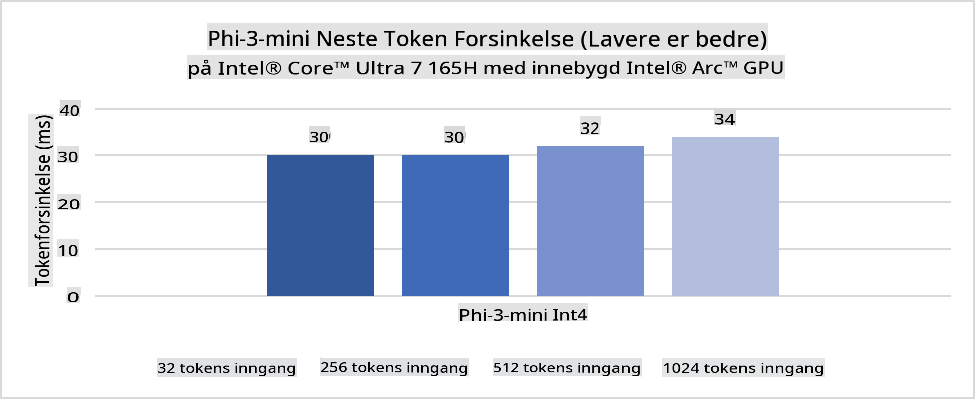
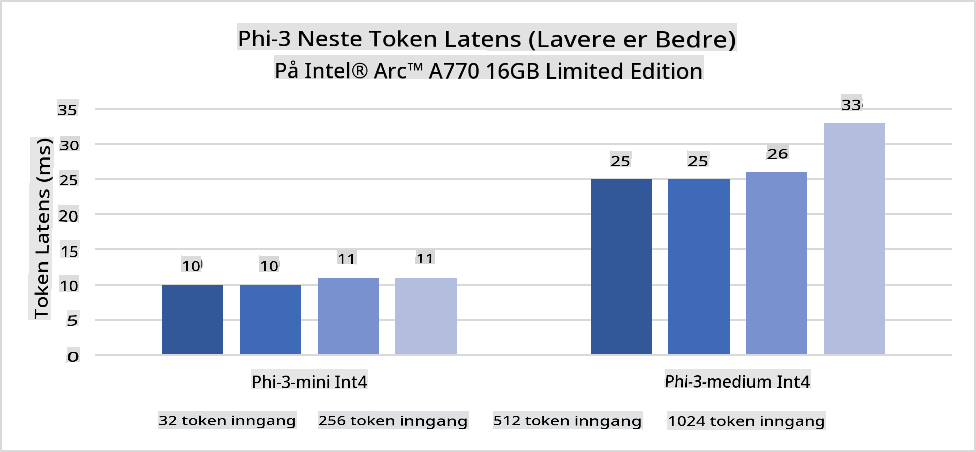
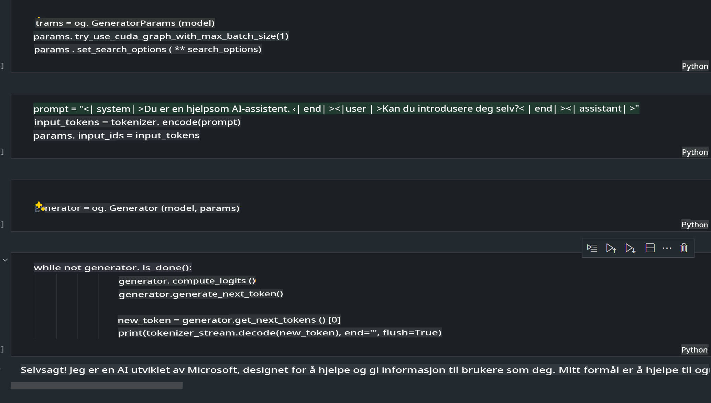
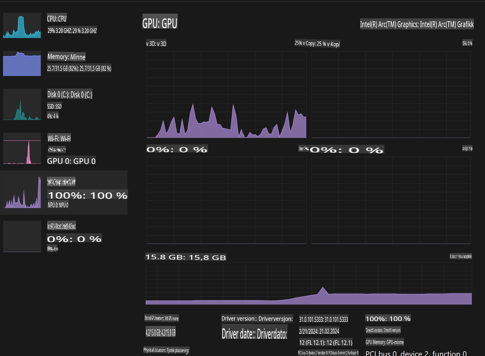

# **Inference Phi-3 i AI-PC**

Med utviklingen av generativ AI og forbedringen av maskinvarekapasiteten til kant-enheter, kan stadig flere generative AI-modeller nå integreres i brukernes Bring Your Own Device (BYOD)-enheter. AI-PC-er er blant disse modellene. Fra og med 2024 har Intel, AMD og Qualcomm samarbeidet med PC-produsenter for å introdusere AI-PC-er som muliggjør distribusjon av lokaliserte generative AI-modeller gjennom maskinvaremodifikasjoner. I denne diskusjonen vil vi fokusere på Intel AI-PC-er og utforske hvordan man kan distribuere Phi-3 på en Intel AI-PC.

### Hva er en NPU

En NPU (Neural Processing Unit) er en dedikert prosessor eller behandlingsenhet på en større SoC som er spesifikt designet for å akselerere operasjoner i nevrale nettverk og AI-oppgaver. I motsetning til generelle CPU-er og GPU-er, er NPU-er optimalisert for datadrevet parallellbehandling, noe som gjør dem svært effektive til å behandle store mengder multimedia-data som videoer og bilder, samt behandle data for nevrale nettverk. De er spesielt dyktige til å håndtere AI-relaterte oppgaver, som talegjenkjenning, bakgrunnsblurring i videosamtaler og redigeringsprosesser for bilder eller videoer som objektgjenkjenning.

## NPU vs GPU

Selv om mange AI- og maskinlæringsoppgaver kjøres på GPU-er, er det en viktig forskjell mellom GPU-er og NPU-er.  
GPU-er er kjent for sine evner innen parallellbehandling, men ikke alle GPU-er er like effektive utover grafikkbehandling. NPU-er, derimot, er spesialbygd for komplekse beregninger som kreves i nevrale nettverksoperasjoner, noe som gjør dem svært effektive for AI-oppgaver.

Oppsummert er NPU-er de matematiske ekspertene som turbo-lader AI-beregninger, og de spiller en nøkkelrolle i den fremvoksende AI-PC-æraen!

***Dette eksempelet er basert på Intels nyeste Intel Core Ultra-prosessor***

## **1. Bruk NPU for å kjøre Phi-3-modellen**

Intel® NPU-enheten er en AI-inferensakselerator integrert med Intels klient-CPU-er, fra og med Intel® Core™ Ultra-generasjonen av CPU-er (tidligere kjent som Meteor Lake). Den muliggjør energieffektiv utførelse av oppgaver i kunstige nevrale nettverk.





**Intel NPU Acceleration Library**

Intel NPU Acceleration Library [https://github.com/intel/intel-npu-acceleration-library](https://github.com/intel/intel-npu-acceleration-library) er et Python-bibliotek designet for å øke effektiviteten til applikasjonene dine ved å utnytte kraften til Intel Neural Processing Unit (NPU) for å utføre høyhastighetsberegninger på kompatibel maskinvare.

Eksempel på Phi-3-mini på en AI-PC drevet av Intel® Core™ Ultra-prosessorer.


Installer Python-biblioteket med pip

```bash

   pip install intel-npu-acceleration-library

```

***Merk*** Prosjektet er fortsatt under utvikling, men referansemodellen er allerede svært komplett.

### **Kjøre Phi-3 med Intel NPU Acceleration Library**

Ved å bruke Intel NPU-akselerasjon påvirker ikke dette biblioteket den tradisjonelle kodingsprosessen. Du trenger bare å bruke dette biblioteket for å kvantisere den opprinnelige Phi-3-modellen, som FP16, INT8, INT4, for eksempel 

```python
from transformers import AutoTokenizer, pipeline,TextStreamer
from intel_npu_acceleration_library import NPUModelForCausalLM, int4
from intel_npu_acceleration_library.compiler import CompilerConfig
import warnings

model_id = "microsoft/Phi-3-mini-4k-instruct"

compiler_conf = CompilerConfig(dtype=int4)
model = NPUModelForCausalLM.from_pretrained(
    model_id, use_cache=True, config=compiler_conf, attn_implementation="sdpa"
).eval()

tokenizer = AutoTokenizer.from_pretrained(model_id)

text_streamer = TextStreamer(tokenizer, skip_prompt=True)
```

Når kvantiseringen er vellykket, fortsetter du utførelsen for å kalle opp NPU-en for å kjøre Phi-3-modellen.

```python
generation_args = {
   "max_new_tokens": 1024,
   "return_full_text": False,
   "temperature": 0.3,
   "do_sample": False,
   "streamer": text_streamer,
}

pipe = pipeline(
   "text-generation",
   model=model,
   tokenizer=tokenizer,
)

query = "<|system|>You are a helpful AI assistant.<|end|><|user|>Can you introduce yourself?<|end|><|assistant|>"

with warnings.catch_warnings():
    warnings.simplefilter("ignore")
    pipe(query, **generation_args)
```

Når du kjører koden, kan vi se NPU-ens status via Oppgavebehandling.


***Eksempler*** : [AIPC_NPU_DEMO.ipynb](../../../../../code/03.Inference/AIPC/AIPC_NPU_DEMO.ipynb)

## **2. Bruk DirectML + ONNX Runtime for å kjøre Phi-3-modellen**

### **Hva er DirectML**

[DirectML](https://github.com/microsoft/DirectML) er et høyytelses, maskinvareakselerert DirectX 12-bibliotek for maskinlæring. DirectML gir GPU-akselerasjon for vanlige maskinlæringsoppgaver på tvers av et bredt spekter av støttet maskinvare og drivere, inkludert alle DirectX 12-kompatible GPU-er fra leverandører som AMD, Intel, NVIDIA og Qualcomm.

Når det brukes alene, er DirectML API et lavnivå DirectX 12-bibliotek og egner seg for høyytelses, lav-latens applikasjoner som rammeverk, spill og andre sanntidsapplikasjoner. Den sømløse interoperabiliteten til DirectML med Direct3D 12, samt dets lave overhead og konsistens på tvers av maskinvare, gjør DirectML ideelt for å akselerere maskinlæring når både høy ytelse og pålitelighet på tvers av maskinvare er kritisk.

***Merk*** : Den nyeste DirectML støtter allerede NPU(https://devblogs.microsoft.com/directx/introducing-neural-processor-unit-npu-support-in-directml-developer-preview/)

### DirectML og CUDA når det gjelder funksjonalitet og ytelse:

**DirectML** er et maskinlæringsbibliotek utviklet av Microsoft. Det er designet for å akselerere maskinlæringsoppgaver på Windows-enheter, inkludert stasjonære, bærbare og kant-enheter.
- DX12-basert: DirectML er bygget på DirectX 12 (DX12), som gir bred maskinvarestøtte på tvers av GPU-er, inkludert både NVIDIA og AMD.
- Bredere støtte: Siden det utnytter DX12, kan DirectML fungere med hvilken som helst GPU som støtter DX12, til og med integrerte GPU-er.
- Bildebehandling: DirectML behandler bilder og andre data ved hjelp av nevrale nettverk, noe som gjør det egnet for oppgaver som bildegjenkjenning, objektgjenkjenning og mer.
- Enkel oppsett: Oppsettet av DirectML er enkelt og krever ikke spesifikke SDK-er eller biblioteker fra GPU-produsenter.
- Ytelse: I noen tilfeller presterer DirectML godt og kan være raskere enn CUDA, spesielt for visse arbeidsbelastninger.
- Begrensninger: Det finnes imidlertid tilfeller der DirectML kan være tregere, særlig for float16 og store batchstørrelser.

**CUDA** er NVIDIAs plattform for parallell databehandling og programmeringsmodell. Den lar utviklere utnytte kraften i NVIDIA GPU-er for generell databehandling, inkludert maskinlæring og vitenskapelige simuleringer.
- NVIDIA-spesifikk: CUDA er tett integrert med NVIDIA GPU-er og er spesifikt designet for dem.
- Svært optimalisert: Det gir utmerket ytelse for GPU-akselererte oppgaver, spesielt når du bruker NVIDIA GPU-er.
- Bredt brukt: Mange maskinlæringsrammeverk og biblioteker (som TensorFlow og PyTorch) har støtte for CUDA.
- Tilpasning: Utviklere kan finjustere CUDA-innstillinger for spesifikke oppgaver, noe som kan gi optimal ytelse.
- Begrensninger: CUDA er avhengig av NVIDIA-maskinvare, noe som kan være en begrensning hvis du ønsker bredere kompatibilitet på tvers av forskjellige GPU-er.

### Valg mellom DirectML og CUDA

Valget mellom DirectML og CUDA avhenger av din spesifikke brukstilfelle, maskinvaretilgjengelighet og preferanser.  
Hvis du ser etter bredere kompatibilitet og enkel oppsett, kan DirectML være et godt valg. Men hvis du har NVIDIA GPU-er og trenger svært optimalisert ytelse, er CUDA fortsatt et sterkt alternativ. Oppsummert har både DirectML og CUDA sine styrker og svakheter, så vurder dine krav og tilgjengelig maskinvare når du tar en beslutning.

### **Generativ AI med ONNX Runtime**

I AI-æraen er portabiliteten til AI-modeller svært viktig. ONNX Runtime kan enkelt distribuere trente modeller til forskjellige enheter. Utviklere trenger ikke å fokusere på inferensrammeverket, men kan bruke et enhetlig API for å fullføre modellinferens. I generativ AI-æraen har ONNX Runtime også utført kodeoptimalisering (https://onnxruntime.ai/docs/genai/). Gjennom den optimaliserte ONNX Runtime kan den kvantiserte generative AI-modellen kjøres på ulike terminaler. I generativ AI med ONNX Runtime kan du kjøre AI-modell-API-er via Python, C#, C / C++. Selvfølgelig kan distribusjon på iPhone dra nytte av C++ sitt Generative AI med ONNX Runtime API.

[Eksempelkode](https://github.com/Azure-Samples/Phi-3MiniSamples/tree/main/onnx)

***Kompilere generativ AI med ONNX Runtime-bibliotek***

```bash

winget install --id=Kitware.CMake  -e

git clone https://github.com/microsoft/onnxruntime.git

cd .\onnxruntime\

./build.bat --build_shared_lib --skip_tests --parallel --use_dml --config Release

cd ../

git clone https://github.com/microsoft/onnxruntime-genai.git

cd .\onnxruntime-genai\

mkdir ort

cd ort

mkdir include

mkdir lib

copy ..\onnxruntime\include\onnxruntime\core\providers\dml\dml_provider_factory.h ort\include

copy ..\onnxruntime\include\onnxruntime\core\session\onnxruntime_c_api.h ort\include

copy ..\onnxruntime\build\Windows\Release\Release\*.dll ort\lib

copy ..\onnxruntime\build\Windows\Release\Release\onnxruntime.lib ort\lib

python build.py --use_dml


```

**Installer bibliotek**

```bash

pip install .\onnxruntime_genai_directml-0.3.0.dev0-cp310-cp310-win_amd64.whl

```

Dette er kjørerresultatet



***Eksempler*** : [AIPC_DirectML_DEMO.ipynb](../../../../../code/03.Inference/AIPC/AIPC_DirectML_DEMO.ipynb)

## **3. Bruk Intel OpenVino for å kjøre Phi-3-modellen**

### **Hva er OpenVINO**

[OpenVINO](https://github.com/openvinotoolkit/openvino) er et åpen kildekode-verktøysett for optimalisering og distribusjon av dype læringsmodeller. Det gir forbedret ytelse for visjon-, lyd- og språklige modeller fra populære rammeverk som TensorFlow, PyTorch og flere. Kom i gang med OpenVINO. OpenVINO kan også brukes i kombinasjon med CPU og GPU for å kjøre Phi-3-modellen.

***Merk***: Foreløpig støtter ikke OpenVINO NPU.

### **Installer OpenVINO-biblioteket**

```bash

 pip install git+https://github.com/huggingface/optimum-intel.git

 pip install git+https://github.com/openvinotoolkit/nncf.git

 pip install openvino-nightly

```

### **Kjøre Phi-3 med OpenVINO**

Som med NPU fullfører OpenVINO kjøringen av generative AI-modeller ved å kjøre kvantiserte modeller. Vi må først kvantisere Phi-3-modellen og fullføre modellkvantiseringen på kommandolinjen gjennom optimum-cli.

**INT4**

```bash

optimum-cli export openvino --model "microsoft/Phi-3-mini-4k-instruct" --task text-generation-with-past --weight-format int4 --group-size 128 --ratio 0.6  --sym  --trust-remote-code ./openvinomodel/phi3/int4

```

**FP16**

```bash

optimum-cli export openvino --model "microsoft/Phi-3-mini-4k-instruct" --task text-generation-with-past --weight-format fp16 --trust-remote-code ./openvinomodel/phi3/fp16

```

Den konverterte modellen ser slik ut:


Last inn modellbaner (model_dir), relaterte konfigurasjoner (ov_config = {"PERFORMANCE_HINT": "LATENCY", "NUM_STREAMS": "1", "CACHE_DIR": ""}), og maskinvareakselererte enheter (GPU.0) gjennom OVModelForCausalLM.

```python

ov_model = OVModelForCausalLM.from_pretrained(
     model_dir,
     device='GPU.0',
     ov_config=ov_config,
     config=AutoConfig.from_pretrained(model_dir, trust_remote_code=True),
     trust_remote_code=True,
)

```

Når du kjører koden, kan vi se GPU-ens status via Oppgavebehandling.



***Eksempler*** : [AIPC_OpenVino_Demo.ipynb](../../../../../code/03.Inference/AIPC/AIPC_OpenVino_Demo.ipynb)

### ***Merk*** : De tre metodene ovenfor har hver sine fordeler, men det anbefales å bruke NPU-akselerasjon for AI-PC-inferens.

**Ansvarsfraskrivelse**:  
Dette dokumentet er oversatt ved hjelp av maskinbaserte AI-oversettelsestjenester. Selv om vi tilstreber nøyaktighet, vennligst vær oppmerksom på at automatiserte oversettelser kan inneholde feil eller unøyaktigheter. Det originale dokumentet på dets opprinnelige språk bør betraktes som den autoritative kilden. For kritisk informasjon anbefales profesjonell menneskelig oversettelse. Vi er ikke ansvarlige for misforståelser eller feiltolkninger som oppstår ved bruk av denne oversettelsen.